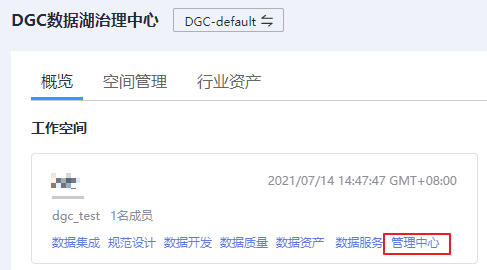
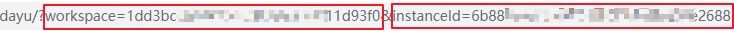

# DGC实例ID和工作空间ID

## 获取DGC实例ID和工作空间ID

DGC的实例ID和工作空间ID可以从DGC控制台的URI链接中获取。

1.  在DGC控制台首页，选择对应工作空间，并点击任一模块，如“管理中心”。

    **图 1**  选择管理中心  
    

2.  进入管理中心页面后，从浏览器地址栏中获取“instanceId”和“workspace”对应的值，即为DGC的实例ID和工作空间ID。

    如[图2](#zh-cn_topic_0000001150701582_fig394214118237)所示，实例ID为**6b88…2688**，工作空间ID为**1dd3bc…d93f0**。

    **图 2**  获取实例ID和工作空间ID  
    

