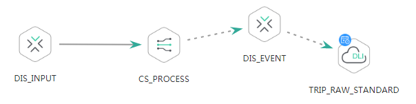

# 创建作业<a name="dgc_02_0084"></a>

## 功能介绍<a name="zh-cn_topic_0181281297_section1738101810182"></a>

此接口可以创建一个新作业，作业由一个或多个相互依赖的节点构成，支持Hive SQL、CDM Job等节点。DLF有两类型作业：批处理作业和实时作业。

## URI<a name="zh-cn_topic_0181281297_section7934966101819"></a>

-   URI格式

    POST /v1/\{project\_id\}/jobs


-   参数说明

    **表 1**  URI参数说明

    <a name="zh-cn_topic_0181281297_zh-cn_topic_0093082049_table46023801181358"></a>
    <table><thead align="left"><tr id="zh-cn_topic_0181281297_zh-cn_topic_0093082049_row26974916181358"><th class="cellrowborder" valign="top" width="19.919999999999998%" id="mcps1.2.5.1.1"><p id="zh-cn_topic_0181281297_zh-cn_topic_0093082049_p37484572181358"><a name="zh-cn_topic_0181281297_zh-cn_topic_0093082049_p37484572181358"></a><a name="zh-cn_topic_0181281297_zh-cn_topic_0093082049_p37484572181358"></a>参数名</p>
    </th>
    <th class="cellrowborder" valign="top" width="10.66%" id="mcps1.2.5.1.2"><p id="zh-cn_topic_0181281297_zh-cn_topic_0093082049_p16351468181358"><a name="zh-cn_topic_0181281297_zh-cn_topic_0093082049_p16351468181358"></a><a name="zh-cn_topic_0181281297_zh-cn_topic_0093082049_p16351468181358"></a>是否必选</p>
    </th>
    <th class="cellrowborder" valign="top" width="15.989999999999998%" id="mcps1.2.5.1.3"><p id="zh-cn_topic_0181281297_zh-cn_topic_0093082049_p49400541181358"><a name="zh-cn_topic_0181281297_zh-cn_topic_0093082049_p49400541181358"></a><a name="zh-cn_topic_0181281297_zh-cn_topic_0093082049_p49400541181358"></a>参数类型</p>
    </th>
    <th class="cellrowborder" valign="top" width="53.43%" id="mcps1.2.5.1.4"><p id="zh-cn_topic_0181281297_zh-cn_topic_0093082049_p42020886181358"><a name="zh-cn_topic_0181281297_zh-cn_topic_0093082049_p42020886181358"></a><a name="zh-cn_topic_0181281297_zh-cn_topic_0093082049_p42020886181358"></a>说明</p>
    </th>
    </tr>
    </thead>
    <tbody><tr id="zh-cn_topic_0181281297_zh-cn_topic_0093082049_row48248640181358"><td class="cellrowborder" valign="top" width="19.919999999999998%" headers="mcps1.2.5.1.1 "><p id="zh-cn_topic_0181281297_zh-cn_topic_0093082049_p15825795181358"><a name="zh-cn_topic_0181281297_zh-cn_topic_0093082049_p15825795181358"></a><a name="zh-cn_topic_0181281297_zh-cn_topic_0093082049_p15825795181358"></a>project_id</p>
    </td>
    <td class="cellrowborder" valign="top" width="10.66%" headers="mcps1.2.5.1.2 "><p id="zh-cn_topic_0181281297_zh-cn_topic_0093082049_p6820998181358"><a name="zh-cn_topic_0181281297_zh-cn_topic_0093082049_p6820998181358"></a><a name="zh-cn_topic_0181281297_zh-cn_topic_0093082049_p6820998181358"></a>是</p>
    </td>
    <td class="cellrowborder" valign="top" width="15.989999999999998%" headers="mcps1.2.5.1.3 "><p id="zh-cn_topic_0181281297_zh-cn_topic_0093082049_p15629937181358"><a name="zh-cn_topic_0181281297_zh-cn_topic_0093082049_p15629937181358"></a><a name="zh-cn_topic_0181281297_zh-cn_topic_0093082049_p15629937181358"></a>String</p>
    </td>
    <td class="cellrowborder" valign="top" width="53.43%" headers="mcps1.2.5.1.4 "><p id="zh-cn_topic_0181281297_p8672138175612"><a name="zh-cn_topic_0181281297_p8672138175612"></a><a name="zh-cn_topic_0181281297_p8672138175612"></a>项目编号，获取方法请参见<a href="项目ID和帐号ID.md">项目ID和帐号ID</a>。</p>
    </td>
    </tr>
    </tbody>
    </table>


## 请求消息<a name="zh-cn_topic_0181281297_section10789431145710"></a>

**表 2**  请求Header参数

<a name="zh-cn_topic_0181281297_table25071810112414"></a>
<table><thead align="left"><tr id="zh-cn_topic_0181281297_zh-cn_topic_0181281363_row3746915131710"><th class="cellrowborder" valign="top" width="15.010000000000002%" id="mcps1.2.5.1.1"><p id="zh-cn_topic_0181281297_zh-cn_topic_0181281363_p131491731112013"><a name="zh-cn_topic_0181281297_zh-cn_topic_0181281363_p131491731112013"></a><a name="zh-cn_topic_0181281297_zh-cn_topic_0181281363_p131491731112013"></a>参数名</p>
</th>
<th class="cellrowborder" valign="top" width="16.93%" id="mcps1.2.5.1.2"><p id="zh-cn_topic_0181281297_zh-cn_topic_0181281363_p3149113112204"><a name="zh-cn_topic_0181281297_zh-cn_topic_0181281363_p3149113112204"></a><a name="zh-cn_topic_0181281297_zh-cn_topic_0181281363_p3149113112204"></a>是否必选</p>
</th>
<th class="cellrowborder" valign="top" width="18.73%" id="mcps1.2.5.1.3"><p id="zh-cn_topic_0181281297_zh-cn_topic_0181281363_p13149173119204"><a name="zh-cn_topic_0181281297_zh-cn_topic_0181281363_p13149173119204"></a><a name="zh-cn_topic_0181281297_zh-cn_topic_0181281363_p13149173119204"></a>参数类型</p>
</th>
<th class="cellrowborder" valign="top" width="49.33%" id="mcps1.2.5.1.4"><p id="zh-cn_topic_0181281297_zh-cn_topic_0181281363_p11149331122017"><a name="zh-cn_topic_0181281297_zh-cn_topic_0181281363_p11149331122017"></a><a name="zh-cn_topic_0181281297_zh-cn_topic_0181281363_p11149331122017"></a>说明</p>
</th>
</tr>
</thead>
<tbody><tr id="zh-cn_topic_0181281297_zh-cn_topic_0181281363_row174620159179"><td class="cellrowborder" valign="top" width="15.010000000000002%" headers="mcps1.2.5.1.1 "><p id="zh-cn_topic_0181281297_zh-cn_topic_0181281363_p1150183116205"><a name="zh-cn_topic_0181281297_zh-cn_topic_0181281363_p1150183116205"></a><a name="zh-cn_topic_0181281297_zh-cn_topic_0181281363_p1150183116205"></a>workspace</p>
</td>
<td class="cellrowborder" valign="top" width="16.93%" headers="mcps1.2.5.1.2 "><p id="zh-cn_topic_0181281297_zh-cn_topic_0181281363_p4150531152016"><a name="zh-cn_topic_0181281297_zh-cn_topic_0181281363_p4150531152016"></a><a name="zh-cn_topic_0181281297_zh-cn_topic_0181281363_p4150531152016"></a>否</p>
</td>
<td class="cellrowborder" valign="top" width="18.73%" headers="mcps1.2.5.1.3 "><p id="zh-cn_topic_0181281297_zh-cn_topic_0181281363_p181505317209"><a name="zh-cn_topic_0181281297_zh-cn_topic_0181281363_p181505317209"></a><a name="zh-cn_topic_0181281297_zh-cn_topic_0181281363_p181505317209"></a>String</p>
</td>
<td class="cellrowborder" valign="top" width="49.33%" headers="mcps1.2.5.1.4 "><p id="zh-cn_topic_0181281297_zh-cn_topic_0181281363_p169341251122511"><a name="zh-cn_topic_0181281297_zh-cn_topic_0181281363_p169341251122511"></a><a name="zh-cn_topic_0181281297_zh-cn_topic_0181281363_p169341251122511"></a>工作空间id。</p>
<a name="zh-cn_topic_0181281297_zh-cn_topic_0181281363_ul776685742514"></a><a name="zh-cn_topic_0181281297_zh-cn_topic_0181281363_ul776685742514"></a><ul id="zh-cn_topic_0181281297_zh-cn_topic_0181281363_ul776685742514"><li>如果不设置该参数，默认查询default工作空间下的数据。</li><li>如果需要查询其他工作空间的数据，需要带上该消息头。</li></ul>
</td>
</tr>
</tbody>
</table>

**表 3**  参数说明

<a name="zh-cn_topic_0181281297_table19750184493418"></a>
<table><thead align="left"><tr id="zh-cn_topic_0181281297_row1475134418345"><th class="cellrowborder" valign="top" width="21.63%" id="mcps1.2.5.1.1"><p id="zh-cn_topic_0181281297_p1275244423417"><a name="zh-cn_topic_0181281297_p1275244423417"></a><a name="zh-cn_topic_0181281297_p1275244423417"></a>参数名</p>
</th>
<th class="cellrowborder" valign="top" width="10.33%" id="mcps1.2.5.1.2"><p id="zh-cn_topic_0181281297_p1375504413341"><a name="zh-cn_topic_0181281297_p1375504413341"></a><a name="zh-cn_topic_0181281297_p1375504413341"></a>是否必选</p>
</th>
<th class="cellrowborder" valign="top" width="15.190000000000001%" id="mcps1.2.5.1.3"><p id="zh-cn_topic_0181281297_p675774416349"><a name="zh-cn_topic_0181281297_p675774416349"></a><a name="zh-cn_topic_0181281297_p675774416349"></a>参数类型</p>
</th>
<th class="cellrowborder" valign="top" width="52.849999999999994%" id="mcps1.2.5.1.4"><p id="zh-cn_topic_0181281297_p475920448344"><a name="zh-cn_topic_0181281297_p475920448344"></a><a name="zh-cn_topic_0181281297_p475920448344"></a>说明</p>
</th>
</tr>
</thead>
<tbody><tr id="zh-cn_topic_0181281297_row1760344113410"><td class="cellrowborder" valign="top" width="21.63%" headers="mcps1.2.5.1.1 "><p id="zh-cn_topic_0181281297_p5760124443410"><a name="zh-cn_topic_0181281297_p5760124443410"></a><a name="zh-cn_topic_0181281297_p5760124443410"></a>name</p>
</td>
<td class="cellrowborder" valign="top" width="10.33%" headers="mcps1.2.5.1.2 "><p id="zh-cn_topic_0181281297_p476174473411"><a name="zh-cn_topic_0181281297_p476174473411"></a><a name="zh-cn_topic_0181281297_p476174473411"></a>是</p>
</td>
<td class="cellrowborder" valign="top" width="15.190000000000001%" headers="mcps1.2.5.1.3 "><p id="zh-cn_topic_0181281297_p6763114463415"><a name="zh-cn_topic_0181281297_p6763114463415"></a><a name="zh-cn_topic_0181281297_p6763114463415"></a>String</p>
</td>
<td class="cellrowborder" valign="top" width="52.849999999999994%" headers="mcps1.2.5.1.4 "><p id="zh-cn_topic_0181281297_p1376304411342"><a name="zh-cn_topic_0181281297_p1376304411342"></a><a name="zh-cn_topic_0181281297_p1376304411342"></a>作业名称，只能包含六种字符：英文字母、数字、中文、中划线、下划线和点号，且长度小于等于128个字符。作业名称不能重复。</p>
</td>
</tr>
<tr id="zh-cn_topic_0181281297_row7763244193418"><td class="cellrowborder" valign="top" width="21.63%" headers="mcps1.2.5.1.1 "><p id="zh-cn_topic_0181281297_p1676464463414"><a name="zh-cn_topic_0181281297_p1676464463414"></a><a name="zh-cn_topic_0181281297_p1676464463414"></a>nodes</p>
</td>
<td class="cellrowborder" valign="top" width="10.33%" headers="mcps1.2.5.1.2 "><p id="zh-cn_topic_0181281297_p776544410349"><a name="zh-cn_topic_0181281297_p776544410349"></a><a name="zh-cn_topic_0181281297_p776544410349"></a>是</p>
</td>
<td class="cellrowborder" valign="top" width="15.190000000000001%" headers="mcps1.2.5.1.3 "><p id="zh-cn_topic_0181281297_p7766174423419"><a name="zh-cn_topic_0181281297_p7766174423419"></a><a name="zh-cn_topic_0181281297_p7766174423419"></a>List&lt;Node&gt;</p>
</td>
<td class="cellrowborder" valign="top" width="52.849999999999994%" headers="mcps1.2.5.1.4 "><p id="zh-cn_topic_0181281297_p13940152045215"><a name="zh-cn_topic_0181281297_p13940152045215"></a><a name="zh-cn_topic_0181281297_p13940152045215"></a>节点定义，参考<a href="#zh-cn_topic_0181281297_table7546519115018">表4</a></p>
</td>
</tr>
<tr id="zh-cn_topic_0181281297_row477184415342"><td class="cellrowborder" valign="top" width="21.63%" headers="mcps1.2.5.1.1 "><p id="zh-cn_topic_0181281297_p1777284413346"><a name="zh-cn_topic_0181281297_p1777284413346"></a><a name="zh-cn_topic_0181281297_p1777284413346"></a>schedule</p>
</td>
<td class="cellrowborder" valign="top" width="10.33%" headers="mcps1.2.5.1.2 "><p id="zh-cn_topic_0181281297_p11772184413346"><a name="zh-cn_topic_0181281297_p11772184413346"></a><a name="zh-cn_topic_0181281297_p11772184413346"></a>是</p>
</td>
<td class="cellrowborder" valign="top" width="15.190000000000001%" headers="mcps1.2.5.1.3 "><p id="zh-cn_topic_0181281297_p11773194420340"><a name="zh-cn_topic_0181281297_p11773194420340"></a><a name="zh-cn_topic_0181281297_p11773194420340"></a>Schedule数据结构</p>
</td>
<td class="cellrowborder" valign="top" width="52.849999999999994%" headers="mcps1.2.5.1.4 "><p id="zh-cn_topic_0181281297_p7773124493414"><a name="zh-cn_topic_0181281297_p7773124493414"></a><a name="zh-cn_topic_0181281297_p7773124493414"></a>调度配置，参考<a href="#zh-cn_topic_0181281297_table198249719224">表5</a></p>
</td>
</tr>
<tr id="zh-cn_topic_0181281297_row97741244163419"><td class="cellrowborder" valign="top" width="21.63%" headers="mcps1.2.5.1.1 "><p id="zh-cn_topic_0181281297_p148009149338"><a name="zh-cn_topic_0181281297_p148009149338"></a><a name="zh-cn_topic_0181281297_p148009149338"></a>params</p>
</td>
<td class="cellrowborder" valign="top" width="10.33%" headers="mcps1.2.5.1.2 "><p id="zh-cn_topic_0181281297_p118001814183318"><a name="zh-cn_topic_0181281297_p118001814183318"></a><a name="zh-cn_topic_0181281297_p118001814183318"></a>否</p>
</td>
<td class="cellrowborder" valign="top" width="15.190000000000001%" headers="mcps1.2.5.1.3 "><p id="zh-cn_topic_0181281297_p1280010144333"><a name="zh-cn_topic_0181281297_p1280010144333"></a><a name="zh-cn_topic_0181281297_p1280010144333"></a>List&lt;Param&gt;</p>
</td>
<td class="cellrowborder" valign="top" width="52.849999999999994%" headers="mcps1.2.5.1.4 "><p id="zh-cn_topic_0181281297_p12801114173315"><a name="zh-cn_topic_0181281297_p12801114173315"></a><a name="zh-cn_topic_0181281297_p12801114173315"></a>作业参数定义，参考<a href="#zh-cn_topic_0181281297_table17607038193316">表6</a></p>
</td>
</tr>
<tr id="zh-cn_topic_0181281297_row47771744133413"><td class="cellrowborder" valign="top" width="21.63%" headers="mcps1.2.5.1.1 "><p id="zh-cn_topic_0181281297_p11779144420343"><a name="zh-cn_topic_0181281297_p11779144420343"></a><a name="zh-cn_topic_0181281297_p11779144420343"></a>directory</p>
</td>
<td class="cellrowborder" valign="top" width="10.33%" headers="mcps1.2.5.1.2 "><p id="zh-cn_topic_0181281297_p677910447341"><a name="zh-cn_topic_0181281297_p677910447341"></a><a name="zh-cn_topic_0181281297_p677910447341"></a>否</p>
</td>
<td class="cellrowborder" valign="top" width="15.190000000000001%" headers="mcps1.2.5.1.3 "><p id="zh-cn_topic_0181281297_p6779744113415"><a name="zh-cn_topic_0181281297_p6779744113415"></a><a name="zh-cn_topic_0181281297_p6779744113415"></a>String</p>
</td>
<td class="cellrowborder" valign="top" width="52.849999999999994%" headers="mcps1.2.5.1.4 "><p id="zh-cn_topic_0181281297_p4780114415343"><a name="zh-cn_topic_0181281297_p4780114415343"></a><a name="zh-cn_topic_0181281297_p4780114415343"></a>作业在目录树上的路径，必须是已存在的目录，如/dir/a/，默认在根目录/。</p>
</td>
</tr>
<tr id="zh-cn_topic_0181281297_row1039074261817"><td class="cellrowborder" valign="top" width="21.63%" headers="mcps1.2.5.1.1 "><p id="zh-cn_topic_0181281297_p11391642171817"><a name="zh-cn_topic_0181281297_p11391642171817"></a><a name="zh-cn_topic_0181281297_p11391642171817"></a>jobType</p>
</td>
<td class="cellrowborder" valign="top" width="10.33%" headers="mcps1.2.5.1.2 "><p id="zh-cn_topic_0181281297_p6391342191815"><a name="zh-cn_topic_0181281297_p6391342191815"></a><a name="zh-cn_topic_0181281297_p6391342191815"></a>是</p>
</td>
<td class="cellrowborder" valign="top" width="15.190000000000001%" headers="mcps1.2.5.1.3 "><p id="zh-cn_topic_0181281297_p339154218189"><a name="zh-cn_topic_0181281297_p339154218189"></a><a name="zh-cn_topic_0181281297_p339154218189"></a>String</p>
</td>
<td class="cellrowborder" valign="top" width="52.849999999999994%" headers="mcps1.2.5.1.4 "><p id="zh-cn_topic_0181281297_p23913424185"><a name="zh-cn_topic_0181281297_p23913424185"></a><a name="zh-cn_topic_0181281297_p23913424185"></a>作业类型:</p>
<a name="zh-cn_topic_0181281297_ul146772016151911"></a><a name="zh-cn_topic_0181281297_ul146772016151911"></a><ul id="zh-cn_topic_0181281297_ul146772016151911"><li>REAL_TIME ：实时处理</li><li>BATCH：批处理</li></ul>
</td>
</tr>
<tr id="zh-cn_topic_0181281297_row1161504144517"><td class="cellrowborder" valign="top" width="21.63%" headers="mcps1.2.5.1.1 "><p id="zh-cn_topic_0181281297_p146179410455"><a name="zh-cn_topic_0181281297_p146179410455"></a><a name="zh-cn_topic_0181281297_p146179410455"></a>basicConfig</p>
</td>
<td class="cellrowborder" valign="top" width="10.33%" headers="mcps1.2.5.1.2 "><p id="zh-cn_topic_0181281297_p17617641124514"><a name="zh-cn_topic_0181281297_p17617641124514"></a><a name="zh-cn_topic_0181281297_p17617641124514"></a>否</p>
</td>
<td class="cellrowborder" valign="top" width="15.190000000000001%" headers="mcps1.2.5.1.3 "><p id="zh-cn_topic_0181281297_p661724154511"><a name="zh-cn_topic_0181281297_p661724154511"></a><a name="zh-cn_topic_0181281297_p661724154511"></a>BasicConfig数据结构</p>
</td>
<td class="cellrowborder" valign="top" width="52.849999999999994%" headers="mcps1.2.5.1.4 "><p id="zh-cn_topic_0181281297_p1261744119456"><a name="zh-cn_topic_0181281297_p1261744119456"></a><a name="zh-cn_topic_0181281297_p1261744119456"></a>作业的基本信息，参考<a href="#zh-cn_topic_0181281297_table16144647194817">表27</a></p>
</td>
</tr>
</tbody>
</table>

**表 4**  Node数据结构说明

<a name="zh-cn_topic_0181281297_table7546519115018"></a>
<table><thead align="left"><tr id="zh-cn_topic_0181281297_row14548819165015"><th class="cellrowborder" valign="top" width="21.51%" id="mcps1.2.5.1.1"><p id="zh-cn_topic_0181281297_p25481119155014"><a name="zh-cn_topic_0181281297_p25481119155014"></a><a name="zh-cn_topic_0181281297_p25481119155014"></a>参数名</p>
</th>
<th class="cellrowborder" valign="top" width="10.209999999999999%" id="mcps1.2.5.1.2"><p id="zh-cn_topic_0181281297_p115491919165016"><a name="zh-cn_topic_0181281297_p115491919165016"></a><a name="zh-cn_topic_0181281297_p115491919165016"></a>是否必选</p>
</th>
<th class="cellrowborder" valign="top" width="15.67%" id="mcps1.2.5.1.3"><p id="zh-cn_topic_0181281297_p255041925014"><a name="zh-cn_topic_0181281297_p255041925014"></a><a name="zh-cn_topic_0181281297_p255041925014"></a>参数类型</p>
</th>
<th class="cellrowborder" valign="top" width="52.61%" id="mcps1.2.5.1.4"><p id="zh-cn_topic_0181281297_p255011916509"><a name="zh-cn_topic_0181281297_p255011916509"></a><a name="zh-cn_topic_0181281297_p255011916509"></a>说明</p>
</th>
</tr>
</thead>
<tbody><tr id="zh-cn_topic_0181281297_row18550101910502"><td class="cellrowborder" valign="top" width="21.51%" headers="mcps1.2.5.1.1 "><p id="zh-cn_topic_0181281297_p755151945010"><a name="zh-cn_topic_0181281297_p755151945010"></a><a name="zh-cn_topic_0181281297_p755151945010"></a>name</p>
</td>
<td class="cellrowborder" valign="top" width="10.209999999999999%" headers="mcps1.2.5.1.2 "><p id="zh-cn_topic_0181281297_p115520194507"><a name="zh-cn_topic_0181281297_p115520194507"></a><a name="zh-cn_topic_0181281297_p115520194507"></a>是</p>
</td>
<td class="cellrowborder" valign="top" width="15.67%" headers="mcps1.2.5.1.3 "><p id="zh-cn_topic_0181281297_p17553131935012"><a name="zh-cn_topic_0181281297_p17553131935012"></a><a name="zh-cn_topic_0181281297_p17553131935012"></a>String</p>
</td>
<td class="cellrowborder" valign="top" width="52.61%" headers="mcps1.2.5.1.4 "><p id="zh-cn_topic_0181281297_p15553161913501"><a name="zh-cn_topic_0181281297_p15553161913501"></a><a name="zh-cn_topic_0181281297_p15553161913501"></a>节点名称，只能包含六种字符：英文字母、数字、中文、中划线、下划线和点号，且长度小于等于128个字符。同一个作业中节点名称不能重复。</p>
</td>
</tr>
<tr id="zh-cn_topic_0181281297_row165558194505"><td class="cellrowborder" valign="top" width="21.51%" headers="mcps1.2.5.1.1 "><p id="zh-cn_topic_0181281297_p155615198503"><a name="zh-cn_topic_0181281297_p155615198503"></a><a name="zh-cn_topic_0181281297_p155615198503"></a>type</p>
</td>
<td class="cellrowborder" valign="top" width="10.209999999999999%" headers="mcps1.2.5.1.2 "><p id="zh-cn_topic_0181281297_p18558141995016"><a name="zh-cn_topic_0181281297_p18558141995016"></a><a name="zh-cn_topic_0181281297_p18558141995016"></a>是</p>
</td>
<td class="cellrowborder" valign="top" width="15.67%" headers="mcps1.2.5.1.3 "><p id="zh-cn_topic_0181281297_p85592195509"><a name="zh-cn_topic_0181281297_p85592195509"></a><a name="zh-cn_topic_0181281297_p85592195509"></a>String</p>
</td>
<td class="cellrowborder" valign="top" width="52.61%" headers="mcps1.2.5.1.4 "><p id="zh-cn_topic_0181281297_p1056001918506"><a name="zh-cn_topic_0181281297_p1056001918506"></a><a name="zh-cn_topic_0181281297_p1056001918506"></a>节点类型：</p>
<a name="zh-cn_topic_0181281297_ul124475504160"></a><a name="zh-cn_topic_0181281297_ul124475504160"></a><ul id="zh-cn_topic_0181281297_ul124475504160"><li>HiveSQL： 执行Hive SQL脚本</li><li>SparkSQL： 执行Spark SQL脚本</li><li>DWSSQL：执行DWS SQL脚本</li><li>DLISQL：执行DLI SQL脚本</li><li>Shell ：执行Shell SQL脚本</li><li>CDMJob：执行CDM作业</li><li>DISTransferTask：创建DIS转储任务</li><li>CloudTableManager：CloudTable表管理，创建和删除表。</li><li>OBSManager：OBS路径管理，包括创建和删除路径。</li><li>RESTAPI：REST API请求</li><li>SMN：发送短信或邮件</li><li>MRSSpark：执行MRS服务的Spark作业</li><li>MapReduce：执行MRS服务的MapReduce作业</li><li>DLISpark：执行DLF服务的Spark作业</li><li>RDS SQL：传递SQL语句到RDS中执行。</li></ul>
</td>
</tr>
<tr id="zh-cn_topic_0181281297_row1756341916506"><td class="cellrowborder" valign="top" width="21.51%" headers="mcps1.2.5.1.1 "><p id="zh-cn_topic_0181281297_p18563131975014"><a name="zh-cn_topic_0181281297_p18563131975014"></a><a name="zh-cn_topic_0181281297_p18563131975014"></a>location</p>
</td>
<td class="cellrowborder" valign="top" width="10.209999999999999%" headers="mcps1.2.5.1.2 "><p id="zh-cn_topic_0181281297_p105641619115016"><a name="zh-cn_topic_0181281297_p105641619115016"></a><a name="zh-cn_topic_0181281297_p105641619115016"></a>是</p>
</td>
<td class="cellrowborder" valign="top" width="15.67%" headers="mcps1.2.5.1.3 "><p id="zh-cn_topic_0181281297_p20565121917509"><a name="zh-cn_topic_0181281297_p20565121917509"></a><a name="zh-cn_topic_0181281297_p20565121917509"></a>Location数据结构</p>
</td>
<td class="cellrowborder" valign="top" width="52.61%" headers="mcps1.2.5.1.4 "><p id="zh-cn_topic_0181281297_p456551955011"><a name="zh-cn_topic_0181281297_p456551955011"></a><a name="zh-cn_topic_0181281297_p456551955011"></a>节点在作业画布上的位置，参考<a href="#zh-cn_topic_0181281297_table73508564230">表7</a>。</p>
</td>
</tr>
<tr id="zh-cn_topic_0181281297_row0566121995011"><td class="cellrowborder" valign="top" width="21.51%" headers="mcps1.2.5.1.1 "><p id="zh-cn_topic_0181281297_p65662199501"><a name="zh-cn_topic_0181281297_p65662199501"></a><a name="zh-cn_topic_0181281297_p65662199501"></a>preNodeName</p>
</td>
<td class="cellrowborder" valign="top" width="10.209999999999999%" headers="mcps1.2.5.1.2 "><p id="zh-cn_topic_0181281297_p65674198507"><a name="zh-cn_topic_0181281297_p65674198507"></a><a name="zh-cn_topic_0181281297_p65674198507"></a>否</p>
</td>
<td class="cellrowborder" valign="top" width="15.67%" headers="mcps1.2.5.1.3 "><p id="zh-cn_topic_0181281297_p13567151917507"><a name="zh-cn_topic_0181281297_p13567151917507"></a><a name="zh-cn_topic_0181281297_p13567151917507"></a>List&lt;String&gt;</p>
</td>
<td class="cellrowborder" valign="top" width="52.61%" headers="mcps1.2.5.1.4 "><p id="zh-cn_topic_0181281297_p8568819155013"><a name="zh-cn_topic_0181281297_p8568819155013"></a><a name="zh-cn_topic_0181281297_p8568819155013"></a>本节点依赖的前面的节点名称列表。</p>
</td>
</tr>
<tr id="zh-cn_topic_0181281297_row115081935131213"><td class="cellrowborder" valign="top" width="21.51%" headers="mcps1.2.5.1.1 "><p id="zh-cn_topic_0181281297_p15091835171213"><a name="zh-cn_topic_0181281297_p15091835171213"></a><a name="zh-cn_topic_0181281297_p15091835171213"></a>conditions</p>
</td>
<td class="cellrowborder" valign="top" width="10.209999999999999%" headers="mcps1.2.5.1.2 "><p id="zh-cn_topic_0181281297_p9509035171220"><a name="zh-cn_topic_0181281297_p9509035171220"></a><a name="zh-cn_topic_0181281297_p9509035171220"></a>否</p>
</td>
<td class="cellrowborder" valign="top" width="15.67%" headers="mcps1.2.5.1.3 "><p id="zh-cn_topic_0181281297_p450919351126"><a name="zh-cn_topic_0181281297_p450919351126"></a><a name="zh-cn_topic_0181281297_p450919351126"></a>List&lt;Condition&gt;</p>
</td>
<td class="cellrowborder" valign="top" width="52.61%" headers="mcps1.2.5.1.4 "><p id="zh-cn_topic_0181281297_p125091735171212"><a name="zh-cn_topic_0181281297_p125091735171212"></a><a name="zh-cn_topic_0181281297_p125091735171212"></a>节点执行条件，如果配置此参数，本节点是否执行由condition的字段expression所保存的EL表达式计算结果决定,参考<a href="#zh-cn_topic_0181281297_table205031722162010">表8</a>。</p>
</td>
</tr>
<tr id="zh-cn_topic_0181281297_row12250814152320"><td class="cellrowborder" valign="top" width="21.51%" headers="mcps1.2.5.1.1 "><p id="zh-cn_topic_0181281297_p1136241852320"><a name="zh-cn_topic_0181281297_p1136241852320"></a><a name="zh-cn_topic_0181281297_p1136241852320"></a>properties</p>
</td>
<td class="cellrowborder" valign="top" width="10.209999999999999%" headers="mcps1.2.5.1.2 "><p id="zh-cn_topic_0181281297_p1236318188236"><a name="zh-cn_topic_0181281297_p1236318188236"></a><a name="zh-cn_topic_0181281297_p1236318188236"></a>是</p>
</td>
<td class="cellrowborder" valign="top" width="15.67%" headers="mcps1.2.5.1.3 "><p id="zh-cn_topic_0181281297_p1836416185233"><a name="zh-cn_topic_0181281297_p1836416185233"></a><a name="zh-cn_topic_0181281297_p1836416185233"></a>列表数据结构</p>
</td>
<td class="cellrowborder" valign="top" width="52.61%" headers="mcps1.2.5.1.4 "><p id="zh-cn_topic_0181281297_p18366101882314"><a name="zh-cn_topic_0181281297_p18366101882314"></a><a name="zh-cn_topic_0181281297_p18366101882314"></a>节点属性，每种节点类型有自己的定义，如下：</p>
<a name="zh-cn_topic_0181281297_ul2339201511212"></a><a name="zh-cn_topic_0181281297_ul2339201511212"></a><ul id="zh-cn_topic_0181281297_ul2339201511212"><li>Hive SQL：参考<a href="#zh-cn_topic_0181281297_table14737514253">表13</a>。</li><li>Spark SQL：参考<a href="#zh-cn_topic_0181281297_table995945865013">表14</a>。</li><li>DWS SQL ： 参考<a href="#zh-cn_topic_0181281297_table1844592865117">表15</a>。</li><li>DLI SQL ： 参考<a href="#zh-cn_topic_0181281297_table138307819914">表16</a>。</li><li>Shell ：参考<a href="#zh-cn_topic_0181281297_table16564191412525">表17</a>。</li><li>CDM Job： 参考<a href="#zh-cn_topic_0181281297_table10670192261712">表18</a>。</li><li>DIS TransferTask ：参考<a href="#zh-cn_topic_0181281297_table17510745155">表19</a>。</li><li>CloudTableManager ：参考<a href="#zh-cn_topic_0181281297_table7791124293">表20</a>。</li><li>OBSManager - 参考<a href="#zh-cn_topic_0181281297_table1782016134516">表21</a>。</li><li>RESTAPI ：参考<a href="#zh-cn_topic_0181281297_table151457044312">表22</a>。</li><li>SMN ：参考<a href="#zh-cn_topic_0181281297_table7529228184419">表23</a>。</li><li>MRS Spark： 参考<a href="#zh-cn_topic_0181281297_table10382111314287">表24</a>。</li><li>MapReduce：参考<a href="#zh-cn_topic_0181281297_table8665818509">表25</a>。</li><li>DLI Spark ：参考<a href="#zh-cn_topic_0181281297_table05441421115">表26</a>。</li></ul>
</td>
</tr>
<tr id="zh-cn_topic_0181281297_row1426916303507"><td class="cellrowborder" valign="top" width="21.51%" headers="mcps1.2.5.1.1 "><p id="zh-cn_topic_0181281297_p1426943025011"><a name="zh-cn_topic_0181281297_p1426943025011"></a><a name="zh-cn_topic_0181281297_p1426943025011"></a>pollingInterval</p>
</td>
<td class="cellrowborder" valign="top" width="10.209999999999999%" headers="mcps1.2.5.1.2 "><p id="zh-cn_topic_0181281297_p326916306505"><a name="zh-cn_topic_0181281297_p326916306505"></a><a name="zh-cn_topic_0181281297_p326916306505"></a>否</p>
</td>
<td class="cellrowborder" valign="top" width="15.67%" headers="mcps1.2.5.1.3 "><p id="zh-cn_topic_0181281297_p5269173095014"><a name="zh-cn_topic_0181281297_p5269173095014"></a><a name="zh-cn_topic_0181281297_p5269173095014"></a>Int</p>
</td>
<td class="cellrowborder" valign="top" width="52.61%" headers="mcps1.2.5.1.4 "><p id="zh-cn_topic_0181281297_p18860144145312"><a name="zh-cn_topic_0181281297_p18860144145312"></a><a name="zh-cn_topic_0181281297_p18860144145312"></a>轮询节点执行结果时间间隔。</p>
<p id="zh-cn_topic_0181281297_p2269630185019"><a name="zh-cn_topic_0181281297_p2269630185019"></a><a name="zh-cn_topic_0181281297_p2269630185019"></a>单位 : 秒，取值范围[1, 60]</p>
<p id="zh-cn_topic_0181281297_p610544915319"><a name="zh-cn_topic_0181281297_p610544915319"></a><a name="zh-cn_topic_0181281297_p610544915319"></a>默认值: 10</p>
</td>
</tr>
<tr id="zh-cn_topic_0181281297_row86596571468"><td class="cellrowborder" valign="top" width="21.51%" headers="mcps1.2.5.1.1 "><p id="zh-cn_topic_0181281297_p565920575612"><a name="zh-cn_topic_0181281297_p565920575612"></a><a name="zh-cn_topic_0181281297_p565920575612"></a>maxExecutionTime</p>
</td>
<td class="cellrowborder" valign="top" width="10.209999999999999%" headers="mcps1.2.5.1.2 "><p id="zh-cn_topic_0181281297_p96601157169"><a name="zh-cn_topic_0181281297_p96601157169"></a><a name="zh-cn_topic_0181281297_p96601157169"></a>否</p>
</td>
<td class="cellrowborder" valign="top" width="15.67%" headers="mcps1.2.5.1.3 "><p id="zh-cn_topic_0181281297_p466011571066"><a name="zh-cn_topic_0181281297_p466011571066"></a><a name="zh-cn_topic_0181281297_p466011571066"></a>Int</p>
</td>
<td class="cellrowborder" valign="top" width="52.61%" headers="mcps1.2.5.1.4 "><p id="zh-cn_topic_0181281297_p12660757464"><a name="zh-cn_topic_0181281297_p12660757464"></a><a name="zh-cn_topic_0181281297_p12660757464"></a>节点最大执行时间，如果节点在最大执行时间内还未执行完成，会把节点置为失败状态。</p>
<p id="zh-cn_topic_0181281297_p15995182171013"><a name="zh-cn_topic_0181281297_p15995182171013"></a><a name="zh-cn_topic_0181281297_p15995182171013"></a>单位 : 分钟，取值范围[5, 1440]</p>
<p id="zh-cn_topic_0181281297_p1713795217119"><a name="zh-cn_topic_0181281297_p1713795217119"></a><a name="zh-cn_topic_0181281297_p1713795217119"></a>默认值 : 60</p>
</td>
</tr>
<tr id="zh-cn_topic_0181281297_row19466249103612"><td class="cellrowborder" valign="top" width="21.51%" headers="mcps1.2.5.1.1 "><p id="zh-cn_topic_0181281297_p84661049143614"><a name="zh-cn_topic_0181281297_p84661049143614"></a><a name="zh-cn_topic_0181281297_p84661049143614"></a>retryTimes</p>
</td>
<td class="cellrowborder" valign="top" width="10.209999999999999%" headers="mcps1.2.5.1.2 "><p id="zh-cn_topic_0181281297_p184668491363"><a name="zh-cn_topic_0181281297_p184668491363"></a><a name="zh-cn_topic_0181281297_p184668491363"></a>否</p>
</td>
<td class="cellrowborder" valign="top" width="15.67%" headers="mcps1.2.5.1.3 "><p id="zh-cn_topic_0181281297_p946624983618"><a name="zh-cn_topic_0181281297_p946624983618"></a><a name="zh-cn_topic_0181281297_p946624983618"></a>Int</p>
</td>
<td class="cellrowborder" valign="top" width="52.61%" headers="mcps1.2.5.1.4 "><p id="zh-cn_topic_0181281297_p13466124983612"><a name="zh-cn_topic_0181281297_p13466124983612"></a><a name="zh-cn_topic_0181281297_p13466124983612"></a>节点失败重试次数。取值范围[0, 5]。0代表不重试</p>
<p id="zh-cn_topic_0181281297_p1946124717438"><a name="zh-cn_topic_0181281297_p1946124717438"></a><a name="zh-cn_topic_0181281297_p1946124717438"></a>默认值 : 0</p>
</td>
</tr>
<tr id="zh-cn_topic_0181281297_row198335217441"><td class="cellrowborder" valign="top" width="21.51%" headers="mcps1.2.5.1.1 "><p id="zh-cn_topic_0181281297_p168335220442"><a name="zh-cn_topic_0181281297_p168335220442"></a><a name="zh-cn_topic_0181281297_p168335220442"></a>retryInterval</p>
</td>
<td class="cellrowborder" valign="top" width="10.209999999999999%" headers="mcps1.2.5.1.2 "><p id="zh-cn_topic_0181281297_p11833132104418"><a name="zh-cn_topic_0181281297_p11833132104418"></a><a name="zh-cn_topic_0181281297_p11833132104418"></a>否</p>
</td>
<td class="cellrowborder" valign="top" width="15.67%" headers="mcps1.2.5.1.3 "><p id="zh-cn_topic_0181281297_p483316217447"><a name="zh-cn_topic_0181281297_p483316217447"></a><a name="zh-cn_topic_0181281297_p483316217447"></a>Int</p>
</td>
<td class="cellrowborder" valign="top" width="52.61%" headers="mcps1.2.5.1.4 "><p id="zh-cn_topic_0181281297_p28331429442"><a name="zh-cn_topic_0181281297_p28331429442"></a><a name="zh-cn_topic_0181281297_p28331429442"></a>失败重试时间间隔。取值范围[5, 120]</p>
<p id="zh-cn_topic_0181281297_p13839124384511"><a name="zh-cn_topic_0181281297_p13839124384511"></a><a name="zh-cn_topic_0181281297_p13839124384511"></a>单位 : 秒</p>
<p id="zh-cn_topic_0181281297_p204481014452"><a name="zh-cn_topic_0181281297_p204481014452"></a><a name="zh-cn_topic_0181281297_p204481014452"></a>默认值 : 120</p>
</td>
</tr>
<tr id="zh-cn_topic_0181281297_row8166140141415"><td class="cellrowborder" valign="top" width="21.51%" headers="mcps1.2.5.1.1 "><p id="zh-cn_topic_0181281297_p1721697149"><a name="zh-cn_topic_0181281297_p1721697149"></a><a name="zh-cn_topic_0181281297_p1721697149"></a>failPolicy</p>
</td>
<td class="cellrowborder" valign="top" width="10.209999999999999%" headers="mcps1.2.5.1.2 "><p id="zh-cn_topic_0181281297_p94592147"><a name="zh-cn_topic_0181281297_p94592147"></a><a name="zh-cn_topic_0181281297_p94592147"></a>否</p>
</td>
<td class="cellrowborder" valign="top" width="15.67%" headers="mcps1.2.5.1.3 "><p id="zh-cn_topic_0181281297_p1873912146"><a name="zh-cn_topic_0181281297_p1873912146"></a><a name="zh-cn_topic_0181281297_p1873912146"></a>String</p>
</td>
<td class="cellrowborder" valign="top" width="52.61%" headers="mcps1.2.5.1.4 "><p id="zh-cn_topic_0181281297_p592917143"><a name="zh-cn_topic_0181281297_p592917143"></a><a name="zh-cn_topic_0181281297_p592917143"></a>作业失败策略:</p>
<a name="zh-cn_topic_0181281297_ul15101895149"></a><a name="zh-cn_topic_0181281297_ul15101895149"></a><ul id="zh-cn_topic_0181281297_ul15101895149"><li>EXIT：终止当前作业执行计划</li><li>CONTINUE：继续执行下一个节点</li><li>SUSPEND：挂起当前作业执行计划</li><li>EXIT_CHILD： 终止后续节点执行计划<p id="p64720137505"><a name="p64720137505"></a><a name="p64720137505"></a>默认值是FAIL。</p>
</li></ul>
</td>
</tr>
<tr id="zh-cn_topic_0181281297_row1276113016198"><td class="cellrowborder" valign="top" width="21.51%" headers="mcps1.2.5.1.1 "><p id="zh-cn_topic_0181281297_p197624309190"><a name="zh-cn_topic_0181281297_p197624309190"></a><a name="zh-cn_topic_0181281297_p197624309190"></a>eventTrigger</p>
</td>
<td class="cellrowborder" valign="top" width="10.209999999999999%" headers="mcps1.2.5.1.2 "><p id="zh-cn_topic_0181281297_p576283071918"><a name="zh-cn_topic_0181281297_p576283071918"></a><a name="zh-cn_topic_0181281297_p576283071918"></a>否</p>
</td>
<td class="cellrowborder" valign="top" width="15.67%" headers="mcps1.2.5.1.3 "><p id="zh-cn_topic_0181281297_p376203012193"><a name="zh-cn_topic_0181281297_p376203012193"></a><a name="zh-cn_topic_0181281297_p376203012193"></a>Event数据结构</p>
</td>
<td class="cellrowborder" valign="top" width="52.61%" headers="mcps1.2.5.1.4 "><p id="zh-cn_topic_0181281297_p12253427112212"><a name="zh-cn_topic_0181281297_p12253427112212"></a><a name="zh-cn_topic_0181281297_p12253427112212"></a>节点事件触发配置，参考<a href="#zh-cn_topic_0181281297_table94593714373">表10</a>。</p>
</td>
</tr>
<tr id="zh-cn_topic_0181281297_row19682112110239"><td class="cellrowborder" valign="top" width="21.51%" headers="mcps1.2.5.1.1 "><p id="zh-cn_topic_0181281297_p4682102162318"><a name="zh-cn_topic_0181281297_p4682102162318"></a><a name="zh-cn_topic_0181281297_p4682102162318"></a>cronTrigger</p>
</td>
<td class="cellrowborder" valign="top" width="10.209999999999999%" headers="mcps1.2.5.1.2 "><p id="zh-cn_topic_0181281297_p13682521192315"><a name="zh-cn_topic_0181281297_p13682521192315"></a><a name="zh-cn_topic_0181281297_p13682521192315"></a>否</p>
</td>
<td class="cellrowborder" valign="top" width="15.67%" headers="mcps1.2.5.1.3 "><p id="zh-cn_topic_0181281297_p165618370233"><a name="zh-cn_topic_0181281297_p165618370233"></a><a name="zh-cn_topic_0181281297_p165618370233"></a>Cron数据结构</p>
</td>
<td class="cellrowborder" valign="top" width="52.61%" headers="mcps1.2.5.1.4 "><p id="zh-cn_topic_0181281297_p4682102162319"><a name="zh-cn_topic_0181281297_p4682102162319"></a><a name="zh-cn_topic_0181281297_p4682102162319"></a>节点Cron触发配置，参考<a href="#zh-cn_topic_0181281297_table1273411423211">表9</a>。</p>
</td>
</tr>
</tbody>
</table>

**表 5**  Schedule数据结构说明

<a name="zh-cn_topic_0181281297_table198249719224"></a>
<table><thead align="left"><tr id="zh-cn_topic_0181281297_row208299714222"><th class="cellrowborder" valign="top" width="21.39%" id="mcps1.2.5.1.1"><p id="zh-cn_topic_0181281297_p48301712214"><a name="zh-cn_topic_0181281297_p48301712214"></a><a name="zh-cn_topic_0181281297_p48301712214"></a>参数名</p>
</th>
<th class="cellrowborder" valign="top" width="10.33%" id="mcps1.2.5.1.2"><p id="zh-cn_topic_0181281297_p1783010717225"><a name="zh-cn_topic_0181281297_p1783010717225"></a><a name="zh-cn_topic_0181281297_p1783010717225"></a>是否必选</p>
</th>
<th class="cellrowborder" valign="top" width="15.8%" id="mcps1.2.5.1.3"><p id="zh-cn_topic_0181281297_p14832197102220"><a name="zh-cn_topic_0181281297_p14832197102220"></a><a name="zh-cn_topic_0181281297_p14832197102220"></a>参数类型</p>
</th>
<th class="cellrowborder" valign="top" width="52.480000000000004%" id="mcps1.2.5.1.4"><p id="zh-cn_topic_0181281297_p88341873229"><a name="zh-cn_topic_0181281297_p88341873229"></a><a name="zh-cn_topic_0181281297_p88341873229"></a>说明</p>
</th>
</tr>
</thead>
<tbody><tr id="zh-cn_topic_0181281297_row18351679223"><td class="cellrowborder" valign="top" width="21.39%" headers="mcps1.2.5.1.1 "><p id="zh-cn_topic_0181281297_p18640124910234"><a name="zh-cn_topic_0181281297_p18640124910234"></a><a name="zh-cn_topic_0181281297_p18640124910234"></a>type</p>
</td>
<td class="cellrowborder" valign="top" width="10.33%" headers="mcps1.2.5.1.2 "><p id="zh-cn_topic_0181281297_p15639349152316"><a name="zh-cn_topic_0181281297_p15639349152316"></a><a name="zh-cn_topic_0181281297_p15639349152316"></a>是</p>
</td>
<td class="cellrowborder" valign="top" width="15.8%" headers="mcps1.2.5.1.3 "><p id="zh-cn_topic_0181281297_p1163884910238"><a name="zh-cn_topic_0181281297_p1163884910238"></a><a name="zh-cn_topic_0181281297_p1163884910238"></a>String</p>
</td>
<td class="cellrowborder" valign="top" width="52.480000000000004%" headers="mcps1.2.5.1.4 "><p id="zh-cn_topic_0181281297_p863714495231"><a name="zh-cn_topic_0181281297_p863714495231"></a><a name="zh-cn_topic_0181281297_p863714495231"></a>调度类型。</p>
<a name="zh-cn_topic_0181281297_ul8340142744911"></a><a name="zh-cn_topic_0181281297_ul8340142744911"></a><ul id="zh-cn_topic_0181281297_ul8340142744911"><li>EXECUTE_ONCE ：作业立即运行，只运行一次。</li><li>CRON：作业按指定频率周期执行。</li><li>EVENT ： 根据事件触发执行。</li></ul>
</td>
</tr>
<tr id="zh-cn_topic_0181281297_row74002505920"><td class="cellrowborder" valign="top" width="21.39%" headers="mcps1.2.5.1.1 "><p id="zh-cn_topic_0181281297_p164001655593"><a name="zh-cn_topic_0181281297_p164001655593"></a><a name="zh-cn_topic_0181281297_p164001655593"></a>cron</p>
</td>
<td class="cellrowborder" valign="top" width="10.33%" headers="mcps1.2.5.1.2 "><p id="zh-cn_topic_0181281297_p04000515910"><a name="zh-cn_topic_0181281297_p04000515910"></a><a name="zh-cn_topic_0181281297_p04000515910"></a>否</p>
</td>
<td class="cellrowborder" valign="top" width="15.8%" headers="mcps1.2.5.1.3 "><p id="zh-cn_topic_0181281297_p114006520592"><a name="zh-cn_topic_0181281297_p114006520592"></a><a name="zh-cn_topic_0181281297_p114006520592"></a>数据结构</p>
</td>
<td class="cellrowborder" valign="top" width="52.480000000000004%" headers="mcps1.2.5.1.4 "><p id="zh-cn_topic_0181281297_p19400185135917"><a name="zh-cn_topic_0181281297_p19400185135917"></a><a name="zh-cn_topic_0181281297_p19400185135917"></a>当type为CRON时，配置调度频率、启动时间等信息，参考<a href="#zh-cn_topic_0181281297_table1273411423211">表9</a>。</p>
</td>
</tr>
<tr id="zh-cn_topic_0181281297_row545052117011"><td class="cellrowborder" valign="top" width="21.39%" headers="mcps1.2.5.1.1 "><p id="zh-cn_topic_0181281297_p245012119019"><a name="zh-cn_topic_0181281297_p245012119019"></a><a name="zh-cn_topic_0181281297_p245012119019"></a>event</p>
</td>
<td class="cellrowborder" valign="top" width="10.33%" headers="mcps1.2.5.1.2 "><p id="zh-cn_topic_0181281297_p4450102119016"><a name="zh-cn_topic_0181281297_p4450102119016"></a><a name="zh-cn_topic_0181281297_p4450102119016"></a>否</p>
</td>
<td class="cellrowborder" valign="top" width="15.8%" headers="mcps1.2.5.1.3 "><p id="zh-cn_topic_0181281297_p64471753204"><a name="zh-cn_topic_0181281297_p64471753204"></a><a name="zh-cn_topic_0181281297_p64471753204"></a>数据结构</p>
</td>
<td class="cellrowborder" valign="top" width="52.480000000000004%" headers="mcps1.2.5.1.4 "><p id="zh-cn_topic_0181281297_p1045019211012"><a name="zh-cn_topic_0181281297_p1045019211012"></a><a name="zh-cn_topic_0181281297_p1045019211012"></a>当type为EVENT时，配置事件源等信息，参考<a href="#zh-cn_topic_0181281297_table94593714373">表10</a>。</p>
</td>
</tr>
</tbody>
</table>

**表 6**  Param数据结构说明

<a name="zh-cn_topic_0181281297_table17607038193316"></a>
<table><thead align="left"><tr id="zh-cn_topic_0181281297_row7663183816333"><th class="cellrowborder" valign="top" width="21.627837216278373%" id="mcps1.2.5.1.1"><p id="zh-cn_topic_0181281297_p6663183853316"><a name="zh-cn_topic_0181281297_p6663183853316"></a><a name="zh-cn_topic_0181281297_p6663183853316"></a>参数名</p>
</th>
<th class="cellrowborder" valign="top" width="10.32896710328967%" id="mcps1.2.5.1.2"><p id="zh-cn_topic_0181281297_p15663143863311"><a name="zh-cn_topic_0181281297_p15663143863311"></a><a name="zh-cn_topic_0181281297_p15663143863311"></a>是否必选</p>
</th>
<th class="cellrowborder" valign="top" width="15.308469153084694%" id="mcps1.2.5.1.3"><p id="zh-cn_topic_0181281297_p13663113812336"><a name="zh-cn_topic_0181281297_p13663113812336"></a><a name="zh-cn_topic_0181281297_p13663113812336"></a>参数类型</p>
</th>
<th class="cellrowborder" valign="top" width="52.73472652734726%" id="mcps1.2.5.1.4"><p id="zh-cn_topic_0181281297_p266363812334"><a name="zh-cn_topic_0181281297_p266363812334"></a><a name="zh-cn_topic_0181281297_p266363812334"></a>说明</p>
</th>
</tr>
</thead>
<tbody><tr id="zh-cn_topic_0181281297_row106631438173316"><td class="cellrowborder" valign="top" width="21.627837216278373%" headers="mcps1.2.5.1.1 "><p id="zh-cn_topic_0181281297_p19663038153313"><a name="zh-cn_topic_0181281297_p19663038153313"></a><a name="zh-cn_topic_0181281297_p19663038153313"></a>name</p>
</td>
<td class="cellrowborder" valign="top" width="10.32896710328967%" headers="mcps1.2.5.1.2 "><p id="zh-cn_topic_0181281297_p366383816331"><a name="zh-cn_topic_0181281297_p366383816331"></a><a name="zh-cn_topic_0181281297_p366383816331"></a>是</p>
</td>
<td class="cellrowborder" valign="top" width="15.308469153084694%" headers="mcps1.2.5.1.3 "><p id="zh-cn_topic_0181281297_p136634387337"><a name="zh-cn_topic_0181281297_p136634387337"></a><a name="zh-cn_topic_0181281297_p136634387337"></a>String</p>
</td>
<td class="cellrowborder" valign="top" width="52.73472652734726%" headers="mcps1.2.5.1.4 "><p id="zh-cn_topic_0181281297_p1666311383338"><a name="zh-cn_topic_0181281297_p1666311383338"></a><a name="zh-cn_topic_0181281297_p1666311383338"></a>参数名称，只能包含英文字母、数字、中划线和下划线。不能超过64个字符。</p>
</td>
</tr>
<tr id="zh-cn_topic_0181281297_row11663103810337"><td class="cellrowborder" valign="top" width="21.627837216278373%" headers="mcps1.2.5.1.1 "><p id="zh-cn_topic_0181281297_p1866313386332"><a name="zh-cn_topic_0181281297_p1866313386332"></a><a name="zh-cn_topic_0181281297_p1866313386332"></a>value</p>
</td>
<td class="cellrowborder" valign="top" width="10.32896710328967%" headers="mcps1.2.5.1.2 "><p id="zh-cn_topic_0181281297_p1266333812335"><a name="zh-cn_topic_0181281297_p1266333812335"></a><a name="zh-cn_topic_0181281297_p1266333812335"></a>是</p>
</td>
<td class="cellrowborder" valign="top" width="15.308469153084694%" headers="mcps1.2.5.1.3 "><p id="zh-cn_topic_0181281297_p866363816339"><a name="zh-cn_topic_0181281297_p866363816339"></a><a name="zh-cn_topic_0181281297_p866363816339"></a>String</p>
</td>
<td class="cellrowborder" valign="top" width="52.73472652734726%" headers="mcps1.2.5.1.4 "><p id="zh-cn_topic_0181281297_p9663153811337"><a name="zh-cn_topic_0181281297_p9663153811337"></a><a name="zh-cn_topic_0181281297_p9663153811337"></a>参数值，不能超过1024个字符。</p>
</td>
</tr>
<tr id="zh-cn_topic_0181281297_row13101881645"><td class="cellrowborder" valign="top" width="21.627837216278373%" headers="mcps1.2.5.1.1 "><p id="zh-cn_topic_0181281297_p1111198448"><a name="zh-cn_topic_0181281297_p1111198448"></a><a name="zh-cn_topic_0181281297_p1111198448"></a>type</p>
</td>
<td class="cellrowborder" valign="top" width="10.32896710328967%" headers="mcps1.2.5.1.2 "><p id="zh-cn_topic_0181281297_p10111887416"><a name="zh-cn_topic_0181281297_p10111887416"></a><a name="zh-cn_topic_0181281297_p10111887416"></a>否</p>
</td>
<td class="cellrowborder" valign="top" width="15.308469153084694%" headers="mcps1.2.5.1.3 "><p id="zh-cn_topic_0181281297_p911158446"><a name="zh-cn_topic_0181281297_p911158446"></a><a name="zh-cn_topic_0181281297_p911158446"></a>String</p>
</td>
<td class="cellrowborder" valign="top" width="52.73472652734726%" headers="mcps1.2.5.1.4 "><p id="zh-cn_topic_0181281297_p11111081249"><a name="zh-cn_topic_0181281297_p11111081249"></a><a name="zh-cn_topic_0181281297_p11111081249"></a>参数类型</p>
<a name="zh-cn_topic_0181281297_ul9731821264"></a><a name="zh-cn_topic_0181281297_ul9731821264"></a><ul id="zh-cn_topic_0181281297_ul9731821264"><li>variable：变量</li><li>constants：常量<p id="zh-cn_topic_0181281297_p39813516615"><a name="zh-cn_topic_0181281297_p39813516615"></a><a name="zh-cn_topic_0181281297_p39813516615"></a>默认值 : variable</p>
</li></ul>
</td>
</tr>
</tbody>
</table>

**表 7**  Location数据结构说明

<a name="zh-cn_topic_0181281297_table73508564230"></a>
<table><thead align="left"><tr id="zh-cn_topic_0181281297_row1735315616234"><th class="cellrowborder" valign="top" width="21.26%" id="mcps1.2.5.1.1"><p id="zh-cn_topic_0181281297_p23548564239"><a name="zh-cn_topic_0181281297_p23548564239"></a><a name="zh-cn_topic_0181281297_p23548564239"></a>参数名</p>
</th>
<th class="cellrowborder" valign="top" width="10.69%" id="mcps1.2.5.1.2"><p id="zh-cn_topic_0181281297_p11355195652311"><a name="zh-cn_topic_0181281297_p11355195652311"></a><a name="zh-cn_topic_0181281297_p11355195652311"></a>是否必选</p>
</th>
<th class="cellrowborder" valign="top" width="15.67%" id="mcps1.2.5.1.3"><p id="zh-cn_topic_0181281297_p435715614237"><a name="zh-cn_topic_0181281297_p435715614237"></a><a name="zh-cn_topic_0181281297_p435715614237"></a>参数类型</p>
</th>
<th class="cellrowborder" valign="top" width="52.38%" id="mcps1.2.5.1.4"><p id="zh-cn_topic_0181281297_p13571956112313"><a name="zh-cn_topic_0181281297_p13571956112313"></a><a name="zh-cn_topic_0181281297_p13571956112313"></a>说明</p>
</th>
</tr>
</thead>
<tbody><tr id="zh-cn_topic_0181281297_row3358456142317"><td class="cellrowborder" valign="top" width="21.26%" headers="mcps1.2.5.1.1 "><p id="zh-cn_topic_0181281297_p761718279245"><a name="zh-cn_topic_0181281297_p761718279245"></a><a name="zh-cn_topic_0181281297_p761718279245"></a>x</p>
</td>
<td class="cellrowborder" valign="top" width="10.69%" headers="mcps1.2.5.1.2 "><p id="zh-cn_topic_0181281297_p1461892711240"><a name="zh-cn_topic_0181281297_p1461892711240"></a><a name="zh-cn_topic_0181281297_p1461892711240"></a>是</p>
</td>
<td class="cellrowborder" valign="top" width="15.67%" headers="mcps1.2.5.1.3 "><p id="zh-cn_topic_0181281297_p16620627122416"><a name="zh-cn_topic_0181281297_p16620627122416"></a><a name="zh-cn_topic_0181281297_p16620627122416"></a>Int</p>
</td>
<td class="cellrowborder" valign="top" width="52.38%" headers="mcps1.2.5.1.4 "><p id="zh-cn_topic_0181281297_p1162113277247"><a name="zh-cn_topic_0181281297_p1162113277247"></a><a name="zh-cn_topic_0181281297_p1162113277247"></a>节点在作业画布上的横轴位置</p>
</td>
</tr>
<tr id="zh-cn_topic_0181281297_row646701682519"><td class="cellrowborder" valign="top" width="21.26%" headers="mcps1.2.5.1.1 "><p id="zh-cn_topic_0181281297_p6467141610257"><a name="zh-cn_topic_0181281297_p6467141610257"></a><a name="zh-cn_topic_0181281297_p6467141610257"></a>y</p>
</td>
<td class="cellrowborder" valign="top" width="10.69%" headers="mcps1.2.5.1.2 "><p id="zh-cn_topic_0181281297_p4785152632514"><a name="zh-cn_topic_0181281297_p4785152632514"></a><a name="zh-cn_topic_0181281297_p4785152632514"></a>是</p>
</td>
<td class="cellrowborder" valign="top" width="15.67%" headers="mcps1.2.5.1.3 "><p id="zh-cn_topic_0181281297_p167873267257"><a name="zh-cn_topic_0181281297_p167873267257"></a><a name="zh-cn_topic_0181281297_p167873267257"></a>Int</p>
</td>
<td class="cellrowborder" valign="top" width="52.38%" headers="mcps1.2.5.1.4 "><p id="zh-cn_topic_0181281297_p1378992613256"><a name="zh-cn_topic_0181281297_p1378992613256"></a><a name="zh-cn_topic_0181281297_p1378992613256"></a>节点在作业画布上的纵轴位置</p>
</td>
</tr>
</tbody>
</table>

**表 8**  condition数据结构说明

<a name="zh-cn_topic_0181281297_table205031722162010"></a>
<table><thead align="left"><tr id="zh-cn_topic_0181281297_row85042221207"><th class="cellrowborder" valign="top" width="21.51%" id="mcps1.2.5.1.1"><p id="zh-cn_topic_0181281297_p2504222172011"><a name="zh-cn_topic_0181281297_p2504222172011"></a><a name="zh-cn_topic_0181281297_p2504222172011"></a>参数名</p>
</th>
<th class="cellrowborder" valign="top" width="10.69%" id="mcps1.2.5.1.2"><p id="zh-cn_topic_0181281297_p25041122152015"><a name="zh-cn_topic_0181281297_p25041122152015"></a><a name="zh-cn_topic_0181281297_p25041122152015"></a>是否必选</p>
</th>
<th class="cellrowborder" valign="top" width="15.190000000000001%" id="mcps1.2.5.1.3"><p id="zh-cn_topic_0181281297_p75041022102014"><a name="zh-cn_topic_0181281297_p75041022102014"></a><a name="zh-cn_topic_0181281297_p75041022102014"></a>参数类型</p>
</th>
<th class="cellrowborder" valign="top" width="52.61%" id="mcps1.2.5.1.4"><p id="zh-cn_topic_0181281297_p75041222102012"><a name="zh-cn_topic_0181281297_p75041222102012"></a><a name="zh-cn_topic_0181281297_p75041222102012"></a>说明</p>
</th>
</tr>
</thead>
<tbody><tr id="zh-cn_topic_0181281297_row115041422112018"><td class="cellrowborder" valign="top" width="21.51%" headers="mcps1.2.5.1.1 "><p id="zh-cn_topic_0181281297_p1950412262010"><a name="zh-cn_topic_0181281297_p1950412262010"></a><a name="zh-cn_topic_0181281297_p1950412262010"></a>preNodeName</p>
</td>
<td class="cellrowborder" valign="top" width="10.69%" headers="mcps1.2.5.1.2 "><p id="zh-cn_topic_0181281297_p5504622152015"><a name="zh-cn_topic_0181281297_p5504622152015"></a><a name="zh-cn_topic_0181281297_p5504622152015"></a>是</p>
</td>
<td class="cellrowborder" valign="top" width="15.190000000000001%" headers="mcps1.2.5.1.3 "><p id="zh-cn_topic_0181281297_p1350419222200"><a name="zh-cn_topic_0181281297_p1350419222200"></a><a name="zh-cn_topic_0181281297_p1350419222200"></a>String</p>
</td>
<td class="cellrowborder" valign="top" width="52.61%" headers="mcps1.2.5.1.4 "><p id="zh-cn_topic_0181281297_p859404262114"><a name="zh-cn_topic_0181281297_p859404262114"></a><a name="zh-cn_topic_0181281297_p859404262114"></a>本节点依赖的前一个节点名称</p>
</td>
</tr>
<tr id="zh-cn_topic_0181281297_row85041122112014"><td class="cellrowborder" valign="top" width="21.51%" headers="mcps1.2.5.1.1 "><p id="zh-cn_topic_0181281297_p750442219209"><a name="zh-cn_topic_0181281297_p750442219209"></a><a name="zh-cn_topic_0181281297_p750442219209"></a>expression</p>
</td>
<td class="cellrowborder" valign="top" width="10.69%" headers="mcps1.2.5.1.2 "><p id="zh-cn_topic_0181281297_p165046222207"><a name="zh-cn_topic_0181281297_p165046222207"></a><a name="zh-cn_topic_0181281297_p165046222207"></a>是</p>
</td>
<td class="cellrowborder" valign="top" width="15.190000000000001%" headers="mcps1.2.5.1.3 "><p id="zh-cn_topic_0181281297_p15505222122012"><a name="zh-cn_topic_0181281297_p15505222122012"></a><a name="zh-cn_topic_0181281297_p15505222122012"></a>String</p>
</td>
<td class="cellrowborder" valign="top" width="52.61%" headers="mcps1.2.5.1.4 "><p id="zh-cn_topic_0181281297_p1505132215202"><a name="zh-cn_topic_0181281297_p1505132215202"></a><a name="zh-cn_topic_0181281297_p1505132215202"></a>EL表达式，如果EL表达式的计算结果为true，则触发执行本节点。</p>
</td>
</tr>
</tbody>
</table>

**表 9**  Cron数据结构说明

<a name="zh-cn_topic_0181281297_table1273411423211"></a>
<table><thead align="left"><tr id="zh-cn_topic_0181281297_row1574012422216"><th class="cellrowborder" valign="top" width="21.51%" id="mcps1.2.5.1.1"><p id="zh-cn_topic_0181281297_p15741134216217"><a name="zh-cn_topic_0181281297_p15741134216217"></a><a name="zh-cn_topic_0181281297_p15741134216217"></a>参数名</p>
</th>
<th class="cellrowborder" valign="top" width="10.69%" id="mcps1.2.5.1.2"><p id="zh-cn_topic_0181281297_p14743104218220"><a name="zh-cn_topic_0181281297_p14743104218220"></a><a name="zh-cn_topic_0181281297_p14743104218220"></a>是否必选</p>
</th>
<th class="cellrowborder" valign="top" width="15.310000000000002%" id="mcps1.2.5.1.3"><p id="zh-cn_topic_0181281297_p1574817421526"><a name="zh-cn_topic_0181281297_p1574817421526"></a><a name="zh-cn_topic_0181281297_p1574817421526"></a>参数类型</p>
</th>
<th class="cellrowborder" valign="top" width="52.49%" id="mcps1.2.5.1.4"><p id="zh-cn_topic_0181281297_p774924215216"><a name="zh-cn_topic_0181281297_p774924215216"></a><a name="zh-cn_topic_0181281297_p774924215216"></a>说明</p>
</th>
</tr>
</thead>
<tbody><tr id="zh-cn_topic_0181281297_row675110421218"><td class="cellrowborder" valign="top" width="21.51%" headers="mcps1.2.5.1.1 "><p id="zh-cn_topic_0181281297_p35334192065"><a name="zh-cn_topic_0181281297_p35334192065"></a><a name="zh-cn_topic_0181281297_p35334192065"></a>startTime</p>
</td>
<td class="cellrowborder" valign="top" width="10.69%" headers="mcps1.2.5.1.2 "><p id="zh-cn_topic_0181281297_p575512426214"><a name="zh-cn_topic_0181281297_p575512426214"></a><a name="zh-cn_topic_0181281297_p575512426214"></a>是</p>
</td>
<td class="cellrowborder" valign="top" width="15.310000000000002%" headers="mcps1.2.5.1.3 "><p id="zh-cn_topic_0181281297_p475710421920"><a name="zh-cn_topic_0181281297_p475710421920"></a><a name="zh-cn_topic_0181281297_p475710421920"></a>String</p>
</td>
<td class="cellrowborder" valign="top" width="52.49%" headers="mcps1.2.5.1.4 "><p id="zh-cn_topic_0181281297_p8759184211214"><a name="zh-cn_topic_0181281297_p8759184211214"></a><a name="zh-cn_topic_0181281297_p8759184211214"></a>调度开始时间，采用ISO 8601时间表示方法，格式为yyyy-MM-dd'T'HH:mm:ssZ，例如2018-10-22T23:59:59+08表示的时间为2018年10月22日23时59分59秒，在正8区，即北京时区。</p>
</td>
</tr>
<tr id="zh-cn_topic_0181281297_row9462715154"><td class="cellrowborder" valign="top" width="21.51%" headers="mcps1.2.5.1.1 "><p id="zh-cn_topic_0181281297_p346241161513"><a name="zh-cn_topic_0181281297_p346241161513"></a><a name="zh-cn_topic_0181281297_p346241161513"></a>endTime</p>
</td>
<td class="cellrowborder" valign="top" width="10.69%" headers="mcps1.2.5.1.2 "><p id="zh-cn_topic_0181281297_p554811351514"><a name="zh-cn_topic_0181281297_p554811351514"></a><a name="zh-cn_topic_0181281297_p554811351514"></a>否</p>
</td>
<td class="cellrowborder" valign="top" width="15.310000000000002%" headers="mcps1.2.5.1.3 "><p id="zh-cn_topic_0181281297_p0552013201510"><a name="zh-cn_topic_0181281297_p0552013201510"></a><a name="zh-cn_topic_0181281297_p0552013201510"></a>String</p>
</td>
<td class="cellrowborder" valign="top" width="52.49%" headers="mcps1.2.5.1.4 "><p id="zh-cn_topic_0181281297_p455361341510"><a name="zh-cn_topic_0181281297_p455361341510"></a><a name="zh-cn_topic_0181281297_p455361341510"></a>调度结束时间，采用ISO 8601时间表示方法，格式为yyyy-MM-dd'T'HH:mm:ssZ，例如2018-10-22T23:59:59+08表示的时间为2018年10月22日23时59分59秒，在正8区，即北京时区。如果结束时间不配置，作业会按照调度周期一直执行下去。</p>
</td>
</tr>
<tr id="zh-cn_topic_0181281297_row1831504214275"><td class="cellrowborder" valign="top" width="21.51%" headers="mcps1.2.5.1.1 "><p id="zh-cn_topic_0181281297_p1131524217274"><a name="zh-cn_topic_0181281297_p1131524217274"></a><a name="zh-cn_topic_0181281297_p1131524217274"></a>expression</p>
</td>
<td class="cellrowborder" valign="top" width="10.69%" headers="mcps1.2.5.1.2 "><p id="zh-cn_topic_0181281297_p1731512427274"><a name="zh-cn_topic_0181281297_p1731512427274"></a><a name="zh-cn_topic_0181281297_p1731512427274"></a>是</p>
</td>
<td class="cellrowborder" valign="top" width="15.310000000000002%" headers="mcps1.2.5.1.3 "><p id="zh-cn_topic_0181281297_p2315184214275"><a name="zh-cn_topic_0181281297_p2315184214275"></a><a name="zh-cn_topic_0181281297_p2315184214275"></a>String</p>
</td>
<td class="cellrowborder" valign="top" width="52.49%" headers="mcps1.2.5.1.4 "><p id="zh-cn_topic_0181281297_p9315342162719"><a name="zh-cn_topic_0181281297_p9315342162719"></a><a name="zh-cn_topic_0181281297_p9315342162719"></a>Cron表达式，格式为"&lt;秒&gt; &lt;分&gt; &lt;时&gt; &lt;天&gt; &lt;月&gt; &lt;星期&gt;"，每个字段允许的输入值参考<a href="#zh-cn_topic_0181281297_table025633544816">表11</a>。</p>
</td>
</tr>
<tr id="zh-cn_topic_0181281297_row0504115153015"><td class="cellrowborder" valign="top" width="21.51%" headers="mcps1.2.5.1.1 "><p id="zh-cn_topic_0181281297_p195057513019"><a name="zh-cn_topic_0181281297_p195057513019"></a><a name="zh-cn_topic_0181281297_p195057513019"></a>expressionTimeZone</p>
</td>
<td class="cellrowborder" valign="top" width="10.69%" headers="mcps1.2.5.1.2 "><p id="zh-cn_topic_0181281297_p15051512303"><a name="zh-cn_topic_0181281297_p15051512303"></a><a name="zh-cn_topic_0181281297_p15051512303"></a>否</p>
</td>
<td class="cellrowborder" valign="top" width="15.310000000000002%" headers="mcps1.2.5.1.3 "><p id="zh-cn_topic_0181281297_p4505185153013"><a name="zh-cn_topic_0181281297_p4505185153013"></a><a name="zh-cn_topic_0181281297_p4505185153013"></a>String</p>
</td>
<td class="cellrowborder" valign="top" width="52.49%" headers="mcps1.2.5.1.4 "><p id="zh-cn_topic_0181281297_p95057519305"><a name="zh-cn_topic_0181281297_p95057519305"></a><a name="zh-cn_topic_0181281297_p95057519305"></a>Cron表达式对应的时区信息，例如GMT+8。</p>
<p id="zh-cn_topic_0181281297_p1615575093012"><a name="zh-cn_topic_0181281297_p1615575093012"></a><a name="zh-cn_topic_0181281297_p1615575093012"></a>默认值：使用<span id="text157371459123520"><a name="text157371459123520"></a><a name="text157371459123520"></a>DGC</span>服务端所在的时区。</p>
</td>
</tr>
<tr id="zh-cn_topic_0181281297_row1398355310288"><td class="cellrowborder" valign="top" width="21.51%" headers="mcps1.2.5.1.1 "><p id="zh-cn_topic_0181281297_p1598315372818"><a name="zh-cn_topic_0181281297_p1598315372818"></a><a name="zh-cn_topic_0181281297_p1598315372818"></a>dependPrePeriod</p>
</td>
<td class="cellrowborder" valign="top" width="10.69%" headers="mcps1.2.5.1.2 "><p id="zh-cn_topic_0181281297_p898310535288"><a name="zh-cn_topic_0181281297_p898310535288"></a><a name="zh-cn_topic_0181281297_p898310535288"></a>否</p>
</td>
<td class="cellrowborder" valign="top" width="15.310000000000002%" headers="mcps1.2.5.1.3 "><p id="zh-cn_topic_0181281297_p1298315362816"><a name="zh-cn_topic_0181281297_p1298315362816"></a><a name="zh-cn_topic_0181281297_p1298315362816"></a>Boolean</p>
</td>
<td class="cellrowborder" valign="top" width="52.49%" headers="mcps1.2.5.1.4 "><p id="zh-cn_topic_0181281297_p15983175352817"><a name="zh-cn_topic_0181281297_p15983175352817"></a><a name="zh-cn_topic_0181281297_p15983175352817"></a>是否依赖本作业上一个运行周期任务的执行结果。</p>
<p id="zh-cn_topic_0181281297_p1440475611342"><a name="zh-cn_topic_0181281297_p1440475611342"></a><a name="zh-cn_topic_0181281297_p1440475611342"></a>默认值 : false</p>
</td>
</tr>
<tr id="zh-cn_topic_0181281297_row2105191510365"><td class="cellrowborder" valign="top" width="21.51%" headers="mcps1.2.5.1.1 "><p id="zh-cn_topic_0181281297_p3105315143618"><a name="zh-cn_topic_0181281297_p3105315143618"></a><a name="zh-cn_topic_0181281297_p3105315143618"></a>dependJobs</p>
</td>
<td class="cellrowborder" valign="top" width="10.69%" headers="mcps1.2.5.1.2 "><p id="zh-cn_topic_0181281297_p510541519366"><a name="zh-cn_topic_0181281297_p510541519366"></a><a name="zh-cn_topic_0181281297_p510541519366"></a>否</p>
</td>
<td class="cellrowborder" valign="top" width="15.310000000000002%" headers="mcps1.2.5.1.3 "><p id="zh-cn_topic_0181281297_p1610581512366"><a name="zh-cn_topic_0181281297_p1610581512366"></a><a name="zh-cn_topic_0181281297_p1610581512366"></a>DependJobs数据结构</p>
</td>
<td class="cellrowborder" valign="top" width="52.49%" headers="mcps1.2.5.1.4 "><p id="zh-cn_topic_0181281297_p510514155369"><a name="zh-cn_topic_0181281297_p510514155369"></a><a name="zh-cn_topic_0181281297_p510514155369"></a>依赖其它作业配置，参考<a href="#zh-cn_topic_0181281297_table10750194763920">表12</a></p>
</td>
</tr>
</tbody>
</table>

**表 10**  Event数据结构说明

<a name="zh-cn_topic_0181281297_table94593714373"></a>
<table><thead align="left"><tr id="zh-cn_topic_0181281297_row144678715371"><th class="cellrowborder" valign="top" width="21.63%" id="mcps1.2.5.1.1"><p id="zh-cn_topic_0181281297_p1146957173711"><a name="zh-cn_topic_0181281297_p1146957173711"></a><a name="zh-cn_topic_0181281297_p1146957173711"></a>参数名</p>
</th>
<th class="cellrowborder" valign="top" width="10.45%" id="mcps1.2.5.1.2"><p id="zh-cn_topic_0181281297_p74717723715"><a name="zh-cn_topic_0181281297_p74717723715"></a><a name="zh-cn_topic_0181281297_p74717723715"></a>是否必选</p>
</th>
<th class="cellrowborder" valign="top" width="15.43%" id="mcps1.2.5.1.3"><p id="zh-cn_topic_0181281297_p16475673372"><a name="zh-cn_topic_0181281297_p16475673372"></a><a name="zh-cn_topic_0181281297_p16475673372"></a>参数类型</p>
</th>
<th class="cellrowborder" valign="top" width="52.49%" id="mcps1.2.5.1.4"><p id="zh-cn_topic_0181281297_p184771712379"><a name="zh-cn_topic_0181281297_p184771712379"></a><a name="zh-cn_topic_0181281297_p184771712379"></a>说明</p>
</th>
</tr>
</thead>
<tbody><tr id="zh-cn_topic_0181281297_row34793716370"><td class="cellrowborder" valign="top" width="21.63%" headers="mcps1.2.5.1.1 "><p id="zh-cn_topic_0181281297_p44811271378"><a name="zh-cn_topic_0181281297_p44811271378"></a><a name="zh-cn_topic_0181281297_p44811271378"></a>eventType</p>
</td>
<td class="cellrowborder" valign="top" width="10.45%" headers="mcps1.2.5.1.2 "><p id="zh-cn_topic_0181281297_p1248287103717"><a name="zh-cn_topic_0181281297_p1248287103717"></a><a name="zh-cn_topic_0181281297_p1248287103717"></a>是</p>
</td>
<td class="cellrowborder" valign="top" width="15.43%" headers="mcps1.2.5.1.3 "><p id="zh-cn_topic_0181281297_p74859723713"><a name="zh-cn_topic_0181281297_p74859723713"></a><a name="zh-cn_topic_0181281297_p74859723713"></a>String</p>
</td>
<td class="cellrowborder" valign="top" width="52.49%" headers="mcps1.2.5.1.4 "><p id="zh-cn_topic_0181281297_p84880716371"><a name="zh-cn_topic_0181281297_p84880716371"></a><a name="zh-cn_topic_0181281297_p84880716371"></a>事件类型，当前只支持监听DIS通道的新上报数据事件，每上报一条数据，触发作业运行一次。</p>
<p id="zh-cn_topic_0181281297_p697942912610"><a name="zh-cn_topic_0181281297_p697942912610"></a><a name="zh-cn_topic_0181281297_p697942912610"></a>配置为：DIS</p>
</td>
</tr>
<tr id="zh-cn_topic_0181281297_row15556163819384"><td class="cellrowborder" valign="top" width="21.63%" headers="mcps1.2.5.1.1 "><p id="zh-cn_topic_0181281297_p455617381388"><a name="zh-cn_topic_0181281297_p455617381388"></a><a name="zh-cn_topic_0181281297_p455617381388"></a>channel</p>
</td>
<td class="cellrowborder" valign="top" width="10.45%" headers="mcps1.2.5.1.2 "><p id="zh-cn_topic_0181281297_p955773863817"><a name="zh-cn_topic_0181281297_p955773863817"></a><a name="zh-cn_topic_0181281297_p955773863817"></a>是</p>
</td>
<td class="cellrowborder" valign="top" width="15.43%" headers="mcps1.2.5.1.3 "><p id="zh-cn_topic_0181281297_p655719384386"><a name="zh-cn_topic_0181281297_p655719384386"></a><a name="zh-cn_topic_0181281297_p655719384386"></a>String</p>
</td>
<td class="cellrowborder" valign="top" width="52.49%" headers="mcps1.2.5.1.4 "><p id="zh-cn_topic_0181281297_p19557143816389"><a name="zh-cn_topic_0181281297_p19557143816389"></a><a name="zh-cn_topic_0181281297_p19557143816389"></a>DIS通道名称。</p>
<p id="zh-cn_topic_0181281297_p53381540183311"><a name="zh-cn_topic_0181281297_p53381540183311"></a><a name="zh-cn_topic_0181281297_p53381540183311"></a>通过DIS管理控制台获取通道名称：</p>
<a name="zh-cn_topic_0181281297_ol17628145232617"></a><a name="zh-cn_topic_0181281297_ol17628145232617"></a><ol id="zh-cn_topic_0181281297_ol17628145232617"><li>登录管理控制台。</li><li>单击“数据接入服务”，左侧列表选择“通道管理”。</li><li>通道管理页面中列出了用户拥有的通道。</li></ol>
</td>
</tr>
<tr id="zh-cn_topic_0181281297_row8666243191313"><td class="cellrowborder" valign="top" width="21.63%" headers="mcps1.2.5.1.1 "><p id="zh-cn_topic_0181281297_p76671643201320"><a name="zh-cn_topic_0181281297_p76671643201320"></a><a name="zh-cn_topic_0181281297_p76671643201320"></a>failPolicy</p>
</td>
<td class="cellrowborder" valign="top" width="10.45%" headers="mcps1.2.5.1.2 "><p id="zh-cn_topic_0181281297_p7667124315138"><a name="zh-cn_topic_0181281297_p7667124315138"></a><a name="zh-cn_topic_0181281297_p7667124315138"></a>否</p>
</td>
<td class="cellrowborder" valign="top" width="15.43%" headers="mcps1.2.5.1.3 "><p id="zh-cn_topic_0181281297_p14667643121312"><a name="zh-cn_topic_0181281297_p14667643121312"></a><a name="zh-cn_topic_0181281297_p14667643121312"></a>String</p>
</td>
<td class="cellrowborder" valign="top" width="52.49%" headers="mcps1.2.5.1.4 "><p id="zh-cn_topic_0181281297_p32471027101417"><a name="zh-cn_topic_0181281297_p32471027101417"></a><a name="zh-cn_topic_0181281297_p32471027101417"></a>执行失败处理策略:</p>
<a name="zh-cn_topic_0181281297_ul13247122718140"></a><a name="zh-cn_topic_0181281297_ul13247122718140"></a><ul id="zh-cn_topic_0181281297_ul13247122718140"><li>SUSPEND ：挂起</li><li>IGNORE：忽略失败，读取下一事件</li></ul>
<p id="zh-cn_topic_0181281297_p2024712731415"><a name="zh-cn_topic_0181281297_p2024712731415"></a><a name="zh-cn_topic_0181281297_p2024712731415"></a>默认值 : SUSPEND</p>
</td>
</tr>
<tr id="zh-cn_topic_0181281297_row18677539171412"><td class="cellrowborder" valign="top" width="21.63%" headers="mcps1.2.5.1.1 "><p id="zh-cn_topic_0181281297_p14677439191418"><a name="zh-cn_topic_0181281297_p14677439191418"></a><a name="zh-cn_topic_0181281297_p14677439191418"></a>concurrent</p>
</td>
<td class="cellrowborder" valign="top" width="10.45%" headers="mcps1.2.5.1.2 "><p id="zh-cn_topic_0181281297_p15677163941411"><a name="zh-cn_topic_0181281297_p15677163941411"></a><a name="zh-cn_topic_0181281297_p15677163941411"></a>否</p>
</td>
<td class="cellrowborder" valign="top" width="15.43%" headers="mcps1.2.5.1.3 "><p id="zh-cn_topic_0181281297_p166771939111419"><a name="zh-cn_topic_0181281297_p166771939111419"></a><a name="zh-cn_topic_0181281297_p166771939111419"></a>int</p>
</td>
<td class="cellrowborder" valign="top" width="52.49%" headers="mcps1.2.5.1.4 "><p id="zh-cn_topic_0181281297_p4659310191610"><a name="zh-cn_topic_0181281297_p4659310191610"></a><a name="zh-cn_topic_0181281297_p4659310191610"></a>调度并发数</p>
<p id="zh-cn_topic_0181281297_p56771039131416"><a name="zh-cn_topic_0181281297_p56771039131416"></a><a name="zh-cn_topic_0181281297_p56771039131416"></a>取值范围：1~128</p>
<p id="zh-cn_topic_0181281297_p13531510165211"><a name="zh-cn_topic_0181281297_p13531510165211"></a><a name="zh-cn_topic_0181281297_p13531510165211"></a>默认值：1</p>
</td>
</tr>
<tr id="zh-cn_topic_0181281297_row209932053164711"><td class="cellrowborder" valign="top" width="21.63%" headers="mcps1.2.5.1.1 "><p id="zh-cn_topic_0181281297_p499335314476"><a name="zh-cn_topic_0181281297_p499335314476"></a><a name="zh-cn_topic_0181281297_p499335314476"></a>readPolicy</p>
</td>
<td class="cellrowborder" valign="top" width="10.45%" headers="mcps1.2.5.1.2 "><p id="zh-cn_topic_0181281297_p599395314476"><a name="zh-cn_topic_0181281297_p599395314476"></a><a name="zh-cn_topic_0181281297_p599395314476"></a>否</p>
</td>
<td class="cellrowborder" valign="top" width="15.43%" headers="mcps1.2.5.1.3 "><p id="zh-cn_topic_0181281297_p15993553144710"><a name="zh-cn_topic_0181281297_p15993553144710"></a><a name="zh-cn_topic_0181281297_p15993553144710"></a>String</p>
</td>
<td class="cellrowborder" valign="top" width="52.49%" headers="mcps1.2.5.1.4 "><p id="zh-cn_topic_0181281297_p173482010164817"><a name="zh-cn_topic_0181281297_p173482010164817"></a><a name="zh-cn_topic_0181281297_p173482010164817"></a>读取策略:</p>
<a name="zh-cn_topic_0181281297_ul034811011489"></a><a name="zh-cn_topic_0181281297_ul034811011489"></a><ul id="zh-cn_topic_0181281297_ul034811011489"><li>LAST ：从上次位置读取</li><li>NEW- 从最新位置读取</li></ul>
<p id="zh-cn_topic_0181281297_p434841017486"><a name="zh-cn_topic_0181281297_p434841017486"></a><a name="zh-cn_topic_0181281297_p434841017486"></a>默认值 : LAST</p>
</td>
</tr>
</tbody>
</table>

**表 11**  Cron表达式字段取值

<a name="zh-cn_topic_0181281297_table025633544816"></a>
<table><thead align="left"><tr id="zh-cn_topic_0181281297_row426643574817"><th class="cellrowborder" valign="top" width="21.14%" id="mcps1.2.5.1.1"><p id="zh-cn_topic_0181281297_p12268735174810"><a name="zh-cn_topic_0181281297_p12268735174810"></a><a name="zh-cn_topic_0181281297_p12268735174810"></a>字段</p>
</th>
<th class="cellrowborder" valign="top" width="18.86%" id="mcps1.2.5.1.2"><p id="zh-cn_topic_0181281297_p5271635114819"><a name="zh-cn_topic_0181281297_p5271635114819"></a><a name="zh-cn_topic_0181281297_p5271635114819"></a>取值范围</p>
</th>
<th class="cellrowborder" valign="top" width="20.77%" id="mcps1.2.5.1.3"><p id="zh-cn_topic_0181281297_p327433510481"><a name="zh-cn_topic_0181281297_p327433510481"></a><a name="zh-cn_topic_0181281297_p327433510481"></a>允许的特殊字符</p>
</th>
<th class="cellrowborder" valign="top" width="39.23%" id="mcps1.2.5.1.4"><p id="zh-cn_topic_0181281297_p727720351485"><a name="zh-cn_topic_0181281297_p727720351485"></a><a name="zh-cn_topic_0181281297_p727720351485"></a>说明</p>
</th>
</tr>
</thead>
<tbody><tr id="zh-cn_topic_0181281297_row2028017354482"><td class="cellrowborder" valign="top" width="21.14%" headers="mcps1.2.5.1.1 "><p id="zh-cn_topic_0181281297_p7282135144812"><a name="zh-cn_topic_0181281297_p7282135144812"></a><a name="zh-cn_topic_0181281297_p7282135144812"></a>秒</p>
</td>
<td class="cellrowborder" valign="top" width="18.86%" headers="mcps1.2.5.1.2 "><p id="zh-cn_topic_0181281297_p9285123516487"><a name="zh-cn_topic_0181281297_p9285123516487"></a><a name="zh-cn_topic_0181281297_p9285123516487"></a>0-59</p>
</td>
<td class="cellrowborder" valign="top" width="20.77%" headers="mcps1.2.5.1.3 "><p id="zh-cn_topic_0181281297_p20634151410506"><a name="zh-cn_topic_0181281297_p20634151410506"></a><a name="zh-cn_topic_0181281297_p20634151410506"></a>, - * /</p>
</td>
<td class="cellrowborder" valign="top" width="39.23%" headers="mcps1.2.5.1.4 "><p id="zh-cn_topic_0181281297_p2759220105011"><a name="zh-cn_topic_0181281297_p2759220105011"></a><a name="zh-cn_topic_0181281297_p2759220105011"></a>当前版本只允许输入0。</p>
</td>
</tr>
<tr id="zh-cn_topic_0181281297_row194472195113"><td class="cellrowborder" valign="top" width="21.14%" headers="mcps1.2.5.1.1 "><p id="zh-cn_topic_0181281297_p10441127517"><a name="zh-cn_topic_0181281297_p10441127517"></a><a name="zh-cn_topic_0181281297_p10441127517"></a>分</p>
</td>
<td class="cellrowborder" valign="top" width="18.86%" headers="mcps1.2.5.1.2 "><p id="zh-cn_topic_0181281297_p468620265217"><a name="zh-cn_topic_0181281297_p468620265217"></a><a name="zh-cn_topic_0181281297_p468620265217"></a>0-59</p>
</td>
<td class="cellrowborder" valign="top" width="20.77%" headers="mcps1.2.5.1.3 "><p id="zh-cn_topic_0181281297_p19691132175213"><a name="zh-cn_topic_0181281297_p19691132175213"></a><a name="zh-cn_topic_0181281297_p19691132175213"></a>, - * /</p>
</td>
<td class="cellrowborder" valign="top" width="39.23%" headers="mcps1.2.5.1.4 "><p id="zh-cn_topic_0181281297_p1444122105110"><a name="zh-cn_topic_0181281297_p1444122105110"></a><a name="zh-cn_topic_0181281297_p1444122105110"></a>-</p>
</td>
</tr>
<tr id="zh-cn_topic_0181281297_row661064135213"><td class="cellrowborder" valign="top" width="21.14%" headers="mcps1.2.5.1.1 "><p id="zh-cn_topic_0181281297_p1461014125212"><a name="zh-cn_topic_0181281297_p1461014125212"></a><a name="zh-cn_topic_0181281297_p1461014125212"></a>时</p>
</td>
<td class="cellrowborder" valign="top" width="18.86%" headers="mcps1.2.5.1.2 "><p id="zh-cn_topic_0181281297_p20809621205218"><a name="zh-cn_topic_0181281297_p20809621205218"></a><a name="zh-cn_topic_0181281297_p20809621205218"></a>0-23</p>
</td>
<td class="cellrowborder" valign="top" width="20.77%" headers="mcps1.2.5.1.3 "><p id="zh-cn_topic_0181281297_p78114218521"><a name="zh-cn_topic_0181281297_p78114218521"></a><a name="zh-cn_topic_0181281297_p78114218521"></a>, - * /</p>
</td>
<td class="cellrowborder" valign="top" width="39.23%" headers="mcps1.2.5.1.4 "><p id="zh-cn_topic_0181281297_p4611545529"><a name="zh-cn_topic_0181281297_p4611545529"></a><a name="zh-cn_topic_0181281297_p4611545529"></a>-</p>
</td>
</tr>
<tr id="zh-cn_topic_0181281297_row1347816277521"><td class="cellrowborder" valign="top" width="21.14%" headers="mcps1.2.5.1.1 "><p id="zh-cn_topic_0181281297_p1347832713523"><a name="zh-cn_topic_0181281297_p1347832713523"></a><a name="zh-cn_topic_0181281297_p1347832713523"></a>天</p>
</td>
<td class="cellrowborder" valign="top" width="18.86%" headers="mcps1.2.5.1.2 "><p id="zh-cn_topic_0181281297_p3478227145214"><a name="zh-cn_topic_0181281297_p3478227145214"></a><a name="zh-cn_topic_0181281297_p3478227145214"></a>1-31</p>
</td>
<td class="cellrowborder" valign="top" width="20.77%" headers="mcps1.2.5.1.3 "><p id="zh-cn_topic_0181281297_p184788278520"><a name="zh-cn_topic_0181281297_p184788278520"></a><a name="zh-cn_topic_0181281297_p184788278520"></a>, - * ? / L W C</p>
</td>
<td class="cellrowborder" valign="top" width="39.23%" headers="mcps1.2.5.1.4 "><p id="zh-cn_topic_0181281297_p5478927155216"><a name="zh-cn_topic_0181281297_p5478927155216"></a><a name="zh-cn_topic_0181281297_p5478927155216"></a>-</p>
</td>
</tr>
<tr id="zh-cn_topic_0181281297_row1728133115415"><td class="cellrowborder" valign="top" width="21.14%" headers="mcps1.2.5.1.1 "><p id="zh-cn_topic_0181281297_p828531185419"><a name="zh-cn_topic_0181281297_p828531185419"></a><a name="zh-cn_topic_0181281297_p828531185419"></a>月</p>
</td>
<td class="cellrowborder" valign="top" width="18.86%" headers="mcps1.2.5.1.2 "><p id="zh-cn_topic_0181281297_p92813145412"><a name="zh-cn_topic_0181281297_p92813145412"></a><a name="zh-cn_topic_0181281297_p92813145412"></a>1-12</p>
</td>
<td class="cellrowborder" valign="top" width="20.77%" headers="mcps1.2.5.1.3 "><p id="zh-cn_topic_0181281297_p174425549549"><a name="zh-cn_topic_0181281297_p174425549549"></a><a name="zh-cn_topic_0181281297_p174425549549"></a>, - * /</p>
</td>
<td class="cellrowborder" valign="top" width="39.23%" headers="mcps1.2.5.1.4 "><p id="zh-cn_topic_0181281297_p928173120545"><a name="zh-cn_topic_0181281297_p928173120545"></a><a name="zh-cn_topic_0181281297_p928173120545"></a>当前版本只允许输入*。</p>
</td>
</tr>
<tr id="zh-cn_topic_0181281297_row181100572546"><td class="cellrowborder" valign="top" width="21.14%" headers="mcps1.2.5.1.1 "><p id="zh-cn_topic_0181281297_p1511035719547"><a name="zh-cn_topic_0181281297_p1511035719547"></a><a name="zh-cn_topic_0181281297_p1511035719547"></a>星期</p>
</td>
<td class="cellrowborder" valign="top" width="18.86%" headers="mcps1.2.5.1.2 "><p id="zh-cn_topic_0181281297_p4110857115411"><a name="zh-cn_topic_0181281297_p4110857115411"></a><a name="zh-cn_topic_0181281297_p4110857115411"></a>1-7</p>
</td>
<td class="cellrowborder" valign="top" width="20.77%" headers="mcps1.2.5.1.3 "><p id="zh-cn_topic_0181281297_p91101857175410"><a name="zh-cn_topic_0181281297_p91101857175410"></a><a name="zh-cn_topic_0181281297_p91101857175410"></a>, - * ? / L C #</p>
</td>
<td class="cellrowborder" valign="top" width="39.23%" headers="mcps1.2.5.1.4 "><p id="zh-cn_topic_0181281297_p1511025713547"><a name="zh-cn_topic_0181281297_p1511025713547"></a><a name="zh-cn_topic_0181281297_p1511025713547"></a>从星期日开始算起。</p>
</td>
</tr>
</tbody>
</table>

**表 12**  DependJobs数据结构说明

<a name="zh-cn_topic_0181281297_table10750194763920"></a>
<table><thead align="left"><tr id="zh-cn_topic_0181281297_row376211471397"><th class="cellrowborder" valign="top" width="21.39%" id="mcps1.2.5.1.1"><p id="zh-cn_topic_0181281297_p5766134723918"><a name="zh-cn_topic_0181281297_p5766134723918"></a><a name="zh-cn_topic_0181281297_p5766134723918"></a>参数名</p>
</th>
<th class="cellrowborder" valign="top" width="10.45%" id="mcps1.2.5.1.2"><p id="zh-cn_topic_0181281297_p77691847163917"><a name="zh-cn_topic_0181281297_p77691847163917"></a><a name="zh-cn_topic_0181281297_p77691847163917"></a>是否必选</p>
</th>
<th class="cellrowborder" valign="top" width="15.67%" id="mcps1.2.5.1.3"><p id="zh-cn_topic_0181281297_p107721347103916"><a name="zh-cn_topic_0181281297_p107721347103916"></a><a name="zh-cn_topic_0181281297_p107721347103916"></a>参数类型</p>
</th>
<th class="cellrowborder" valign="top" width="52.49%" id="mcps1.2.5.1.4"><p id="zh-cn_topic_0181281297_p19776194703917"><a name="zh-cn_topic_0181281297_p19776194703917"></a><a name="zh-cn_topic_0181281297_p19776194703917"></a>说明</p>
</th>
</tr>
</thead>
<tbody><tr id="zh-cn_topic_0181281297_row16778124763918"><td class="cellrowborder" valign="top" width="21.39%" headers="mcps1.2.5.1.1 "><p id="zh-cn_topic_0181281297_p57801472392"><a name="zh-cn_topic_0181281297_p57801472392"></a><a name="zh-cn_topic_0181281297_p57801472392"></a>jobs</p>
</td>
<td class="cellrowborder" valign="top" width="10.45%" headers="mcps1.2.5.1.2 "><p id="zh-cn_topic_0181281297_p147838476399"><a name="zh-cn_topic_0181281297_p147838476399"></a><a name="zh-cn_topic_0181281297_p147838476399"></a>是</p>
</td>
<td class="cellrowborder" valign="top" width="15.67%" headers="mcps1.2.5.1.3 "><p id="zh-cn_topic_0181281297_p17786164720398"><a name="zh-cn_topic_0181281297_p17786164720398"></a><a name="zh-cn_topic_0181281297_p17786164720398"></a>List&lt;String&gt;</p>
</td>
<td class="cellrowborder" valign="top" width="52.49%" headers="mcps1.2.5.1.4 "><p id="zh-cn_topic_0181281297_p18551172814412"><a name="zh-cn_topic_0181281297_p18551172814412"></a><a name="zh-cn_topic_0181281297_p18551172814412"></a>依赖的作业名称列表，必须依赖已存在的作业。</p>
</td>
</tr>
<tr id="zh-cn_topic_0181281297_row15793347133917"><td class="cellrowborder" valign="top" width="21.39%" headers="mcps1.2.5.1.1 "><p id="zh-cn_topic_0181281297_p0796134711391"><a name="zh-cn_topic_0181281297_p0796134711391"></a><a name="zh-cn_topic_0181281297_p0796134711391"></a>dependPeriod</p>
</td>
<td class="cellrowborder" valign="top" width="10.45%" headers="mcps1.2.5.1.2 "><p id="zh-cn_topic_0181281297_p2798144712399"><a name="zh-cn_topic_0181281297_p2798144712399"></a><a name="zh-cn_topic_0181281297_p2798144712399"></a>否</p>
</td>
<td class="cellrowborder" valign="top" width="15.67%" headers="mcps1.2.5.1.3 "><p id="zh-cn_topic_0181281297_p118014472396"><a name="zh-cn_topic_0181281297_p118014472396"></a><a name="zh-cn_topic_0181281297_p118014472396"></a>String</p>
</td>
<td class="cellrowborder" valign="top" width="52.49%" headers="mcps1.2.5.1.4 "><p id="zh-cn_topic_0181281297_p18804747143913"><a name="zh-cn_topic_0181281297_p18804747143913"></a><a name="zh-cn_topic_0181281297_p18804747143913"></a>依赖周期:</p>
<a name="zh-cn_topic_0181281297_ul17232114310422"></a><a name="zh-cn_topic_0181281297_ul17232114310422"></a><ul id="zh-cn_topic_0181281297_ul17232114310422"><li>SAME_PERIOD :依赖被依赖作业的同周期任务的执行结果。</li><li>PRE_PERIOD :依赖被依赖作业的前一周期任务的执行结果。</li></ul>
<p id="zh-cn_topic_0181281297_p572657195118"><a name="zh-cn_topic_0181281297_p572657195118"></a><a name="zh-cn_topic_0181281297_p572657195118"></a>默认值 : SAME_PERIOD</p>
</td>
</tr>
<tr id="zh-cn_topic_0181281297_row72314452476"><td class="cellrowborder" valign="top" width="21.39%" headers="mcps1.2.5.1.1 "><p id="zh-cn_topic_0181281297_p17231134510478"><a name="zh-cn_topic_0181281297_p17231134510478"></a><a name="zh-cn_topic_0181281297_p17231134510478"></a>dependFailPolicy</p>
</td>
<td class="cellrowborder" valign="top" width="10.45%" headers="mcps1.2.5.1.2 "><p id="zh-cn_topic_0181281297_p14231545154716"><a name="zh-cn_topic_0181281297_p14231545154716"></a><a name="zh-cn_topic_0181281297_p14231545154716"></a>否</p>
</td>
<td class="cellrowborder" valign="top" width="15.67%" headers="mcps1.2.5.1.3 "><p id="zh-cn_topic_0181281297_p1123114564711"><a name="zh-cn_topic_0181281297_p1123114564711"></a><a name="zh-cn_topic_0181281297_p1123114564711"></a>String</p>
</td>
<td class="cellrowborder" valign="top" width="52.49%" headers="mcps1.2.5.1.4 "><p id="zh-cn_topic_0181281297_p11231945134710"><a name="zh-cn_topic_0181281297_p11231945134710"></a><a name="zh-cn_topic_0181281297_p11231945134710"></a>依赖作业任务执行失败处理策略:</p>
<a name="zh-cn_topic_0181281297_ul93271725104812"></a><a name="zh-cn_topic_0181281297_ul93271725104812"></a><ul id="zh-cn_topic_0181281297_ul93271725104812"><li>FAIL：停止作业，设置作业为失败状态</li><li>IGNORE：继续执行作业</li><li>SUSPEND ： 挂起作业</li></ul>
<p id="zh-cn_topic_0181281297_p14405144111507"><a name="zh-cn_topic_0181281297_p14405144111507"></a><a name="zh-cn_topic_0181281297_p14405144111507"></a>默认值 : FAIL</p>
</td>
</tr>
</tbody>
</table>

**表 13**  Hive SQL节点属性说明

<a name="zh-cn_topic_0181281297_table14737514253"></a>
<table><thead align="left"><tr id="zh-cn_topic_0181281297_row647613518252"><th class="cellrowborder" valign="top" width="21.26%" id="mcps1.2.5.1.1"><p id="zh-cn_topic_0181281297_p347720517256"><a name="zh-cn_topic_0181281297_p347720517256"></a><a name="zh-cn_topic_0181281297_p347720517256"></a>参数名</p>
</th>
<th class="cellrowborder" valign="top" width="10.69%" id="mcps1.2.5.1.2"><p id="zh-cn_topic_0181281297_p2478125116254"><a name="zh-cn_topic_0181281297_p2478125116254"></a><a name="zh-cn_topic_0181281297_p2478125116254"></a>是否必选</p>
</th>
<th class="cellrowborder" valign="top" width="15.43%" id="mcps1.2.5.1.3"><p id="zh-cn_topic_0181281297_p17479195142519"><a name="zh-cn_topic_0181281297_p17479195142519"></a><a name="zh-cn_topic_0181281297_p17479195142519"></a>参数类型</p>
</th>
<th class="cellrowborder" valign="top" width="52.62%" id="mcps1.2.5.1.4"><p id="zh-cn_topic_0181281297_p6481151122510"><a name="zh-cn_topic_0181281297_p6481151122510"></a><a name="zh-cn_topic_0181281297_p6481151122510"></a>说明</p>
</th>
</tr>
</thead>
<tbody><tr id="zh-cn_topic_0181281297_row15481175102510"><td class="cellrowborder" valign="top" width="21.26%" headers="mcps1.2.5.1.1 "><p id="zh-cn_topic_0181281297_p15482165120259"><a name="zh-cn_topic_0181281297_p15482165120259"></a><a name="zh-cn_topic_0181281297_p15482165120259"></a>scriptName</p>
</td>
<td class="cellrowborder" valign="top" width="10.69%" headers="mcps1.2.5.1.2 "><p id="zh-cn_topic_0181281297_p14839513257"><a name="zh-cn_topic_0181281297_p14839513257"></a><a name="zh-cn_topic_0181281297_p14839513257"></a>是</p>
</td>
<td class="cellrowborder" valign="top" width="15.43%" headers="mcps1.2.5.1.3 "><p id="zh-cn_topic_0181281297_p5486145192512"><a name="zh-cn_topic_0181281297_p5486145192512"></a><a name="zh-cn_topic_0181281297_p5486145192512"></a>String</p>
</td>
<td class="cellrowborder" valign="top" width="52.62%" headers="mcps1.2.5.1.4 "><p id="zh-cn_topic_0181281297_p44872511257"><a name="zh-cn_topic_0181281297_p44872511257"></a><a name="zh-cn_topic_0181281297_p44872511257"></a>脚本名称</p>
</td>
</tr>
<tr id="zh-cn_topic_0181281297_row104871513251"><td class="cellrowborder" valign="top" width="21.26%" headers="mcps1.2.5.1.1 "><p id="zh-cn_topic_0181281297_p648935182518"><a name="zh-cn_topic_0181281297_p648935182518"></a><a name="zh-cn_topic_0181281297_p648935182518"></a>database</p>
</td>
<td class="cellrowborder" valign="top" width="10.69%" headers="mcps1.2.5.1.2 "><p id="zh-cn_topic_0181281297_p1249165114251"><a name="zh-cn_topic_0181281297_p1249165114251"></a><a name="zh-cn_topic_0181281297_p1249165114251"></a>否</p>
</td>
<td class="cellrowborder" valign="top" width="15.43%" headers="mcps1.2.5.1.3 "><p id="zh-cn_topic_0181281297_p493612912332"><a name="zh-cn_topic_0181281297_p493612912332"></a><a name="zh-cn_topic_0181281297_p493612912332"></a>String</p>
</td>
<td class="cellrowborder" valign="top" width="52.62%" headers="mcps1.2.5.1.4 "><p id="zh-cn_topic_0181281297_p149420512254"><a name="zh-cn_topic_0181281297_p149420512254"></a><a name="zh-cn_topic_0181281297_p149420512254"></a>数据库名称</p>
<p id="zh-cn_topic_0181281297_p11297169133210"><a name="zh-cn_topic_0181281297_p11297169133210"></a><a name="zh-cn_topic_0181281297_p11297169133210"></a>MRS Hive中的数据库，默认default。</p>
</td>
</tr>
<tr id="zh-cn_topic_0181281297_row149259379337"><td class="cellrowborder" valign="top" width="21.26%" headers="mcps1.2.5.1.1 "><p id="zh-cn_topic_0181281297_p5925193712338"><a name="zh-cn_topic_0181281297_p5925193712338"></a><a name="zh-cn_topic_0181281297_p5925193712338"></a>connectionName</p>
</td>
<td class="cellrowborder" valign="top" width="10.69%" headers="mcps1.2.5.1.2 "><p id="zh-cn_topic_0181281297_p392583733319"><a name="zh-cn_topic_0181281297_p392583733319"></a><a name="zh-cn_topic_0181281297_p392583733319"></a>否</p>
</td>
<td class="cellrowborder" valign="top" width="15.43%" headers="mcps1.2.5.1.3 "><p id="zh-cn_topic_0181281297_p392533713315"><a name="zh-cn_topic_0181281297_p392533713315"></a><a name="zh-cn_topic_0181281297_p392533713315"></a>String</p>
</td>
<td class="cellrowborder" valign="top" width="52.62%" headers="mcps1.2.5.1.4 "><p id="zh-cn_topic_0181281297_p8925037203312"><a name="zh-cn_topic_0181281297_p8925037203312"></a><a name="zh-cn_topic_0181281297_p8925037203312"></a>连接名称</p>
</td>
</tr>
<tr id="zh-cn_topic_0181281297_row1519105412107"><td class="cellrowborder" valign="top" width="21.26%" headers="mcps1.2.5.1.1 "><p id="zh-cn_topic_0181281297_p1219155416109"><a name="zh-cn_topic_0181281297_p1219155416109"></a><a name="zh-cn_topic_0181281297_p1219155416109"></a>scriptArgs</p>
</td>
<td class="cellrowborder" valign="top" width="10.69%" headers="mcps1.2.5.1.2 "><p id="zh-cn_topic_0181281297_p62015491012"><a name="zh-cn_topic_0181281297_p62015491012"></a><a name="zh-cn_topic_0181281297_p62015491012"></a>否</p>
</td>
<td class="cellrowborder" valign="top" width="15.43%" headers="mcps1.2.5.1.3 "><p id="zh-cn_topic_0181281297_p1820145410109"><a name="zh-cn_topic_0181281297_p1820145410109"></a><a name="zh-cn_topic_0181281297_p1820145410109"></a>String</p>
</td>
<td class="cellrowborder" valign="top" width="52.62%" headers="mcps1.2.5.1.4 "><p id="zh-cn_topic_0181281297_p72095411104"><a name="zh-cn_topic_0181281297_p72095411104"></a><a name="zh-cn_topic_0181281297_p72095411104"></a>脚本参数，key、value形式，多个参数间用\n分隔，例如key1=value1\nkey2=value2</p>
</td>
</tr>
</tbody>
</table>

**表 14**  Spark SQL节点属性说明

<a name="zh-cn_topic_0181281297_table995945865013"></a>
<table><thead align="left"><tr id="zh-cn_topic_0181281297_row8979358205017"><th class="cellrowborder" valign="top" width="21.39%" id="mcps1.2.5.1.1"><p id="zh-cn_topic_0181281297_p199881458115019"><a name="zh-cn_topic_0181281297_p199881458115019"></a><a name="zh-cn_topic_0181281297_p199881458115019"></a>参数名</p>
</th>
<th class="cellrowborder" valign="top" width="10.45%" id="mcps1.2.5.1.2"><p id="zh-cn_topic_0181281297_p15995135825011"><a name="zh-cn_topic_0181281297_p15995135825011"></a><a name="zh-cn_topic_0181281297_p15995135825011"></a>是否必选</p>
</th>
<th class="cellrowborder" valign="top" width="15.310000000000002%" id="mcps1.2.5.1.3"><p id="zh-cn_topic_0181281297_p191155995014"><a name="zh-cn_topic_0181281297_p191155995014"></a><a name="zh-cn_topic_0181281297_p191155995014"></a>参数类型</p>
</th>
<th class="cellrowborder" valign="top" width="52.849999999999994%" id="mcps1.2.5.1.4"><p id="zh-cn_topic_0181281297_p5695935014"><a name="zh-cn_topic_0181281297_p5695935014"></a><a name="zh-cn_topic_0181281297_p5695935014"></a>说明</p>
</th>
</tr>
</thead>
<tbody><tr id="zh-cn_topic_0181281297_row610145945017"><td class="cellrowborder" valign="top" width="21.39%" headers="mcps1.2.5.1.1 "><p id="zh-cn_topic_0181281297_p91720594506"><a name="zh-cn_topic_0181281297_p91720594506"></a><a name="zh-cn_topic_0181281297_p91720594506"></a>scriptName</p>
</td>
<td class="cellrowborder" valign="top" width="10.45%" headers="mcps1.2.5.1.2 "><p id="zh-cn_topic_0181281297_p421105995015"><a name="zh-cn_topic_0181281297_p421105995015"></a><a name="zh-cn_topic_0181281297_p421105995015"></a>是</p>
</td>
<td class="cellrowborder" valign="top" width="15.310000000000002%" headers="mcps1.2.5.1.3 "><p id="zh-cn_topic_0181281297_p1628105918503"><a name="zh-cn_topic_0181281297_p1628105918503"></a><a name="zh-cn_topic_0181281297_p1628105918503"></a>String</p>
</td>
<td class="cellrowborder" valign="top" width="52.849999999999994%" headers="mcps1.2.5.1.4 "><p id="zh-cn_topic_0181281297_p15342059125010"><a name="zh-cn_topic_0181281297_p15342059125010"></a><a name="zh-cn_topic_0181281297_p15342059125010"></a>脚本名称</p>
</td>
</tr>
<tr id="zh-cn_topic_0181281297_row7376597506"><td class="cellrowborder" valign="top" width="21.39%" headers="mcps1.2.5.1.1 "><p id="zh-cn_topic_0181281297_p1143105965020"><a name="zh-cn_topic_0181281297_p1143105965020"></a><a name="zh-cn_topic_0181281297_p1143105965020"></a>database</p>
</td>
<td class="cellrowborder" valign="top" width="10.45%" headers="mcps1.2.5.1.2 "><p id="zh-cn_topic_0181281297_p1548059205013"><a name="zh-cn_topic_0181281297_p1548059205013"></a><a name="zh-cn_topic_0181281297_p1548059205013"></a>否</p>
</td>
<td class="cellrowborder" valign="top" width="15.310000000000002%" headers="mcps1.2.5.1.3 "><p id="zh-cn_topic_0181281297_p1556125945017"><a name="zh-cn_topic_0181281297_p1556125945017"></a><a name="zh-cn_topic_0181281297_p1556125945017"></a>String</p>
</td>
<td class="cellrowborder" valign="top" width="52.849999999999994%" headers="mcps1.2.5.1.4 "><p id="zh-cn_topic_0181281297_p56018593505"><a name="zh-cn_topic_0181281297_p56018593505"></a><a name="zh-cn_topic_0181281297_p56018593505"></a>数据库名称</p>
<p id="zh-cn_topic_0181281297_p19128142013517"><a name="zh-cn_topic_0181281297_p19128142013517"></a><a name="zh-cn_topic_0181281297_p19128142013517"></a>MRS Spark SQL中的数据库，默认default。</p>
</td>
</tr>
<tr id="zh-cn_topic_0181281297_row1662105945016"><td class="cellrowborder" valign="top" width="21.39%" headers="mcps1.2.5.1.1 "><p id="zh-cn_topic_0181281297_p106819592507"><a name="zh-cn_topic_0181281297_p106819592507"></a><a name="zh-cn_topic_0181281297_p106819592507"></a>connectionName</p>
</td>
<td class="cellrowborder" valign="top" width="10.45%" headers="mcps1.2.5.1.2 "><p id="zh-cn_topic_0181281297_p197365920507"><a name="zh-cn_topic_0181281297_p197365920507"></a><a name="zh-cn_topic_0181281297_p197365920507"></a>否</p>
</td>
<td class="cellrowborder" valign="top" width="15.310000000000002%" headers="mcps1.2.5.1.3 "><p id="zh-cn_topic_0181281297_p2811959155014"><a name="zh-cn_topic_0181281297_p2811959155014"></a><a name="zh-cn_topic_0181281297_p2811959155014"></a>String</p>
</td>
<td class="cellrowborder" valign="top" width="52.849999999999994%" headers="mcps1.2.5.1.4 "><p id="zh-cn_topic_0181281297_p387155916505"><a name="zh-cn_topic_0181281297_p387155916505"></a><a name="zh-cn_topic_0181281297_p387155916505"></a>连接名称</p>
</td>
</tr>
<tr id="zh-cn_topic_0181281297_row1595175116121"><td class="cellrowborder" valign="top" width="21.39%" headers="mcps1.2.5.1.1 "><p id="zh-cn_topic_0181281297_p73311953151211"><a name="zh-cn_topic_0181281297_p73311953151211"></a><a name="zh-cn_topic_0181281297_p73311953151211"></a>scriptArgs</p>
</td>
<td class="cellrowborder" valign="top" width="10.45%" headers="mcps1.2.5.1.2 "><p id="zh-cn_topic_0181281297_p9331185319121"><a name="zh-cn_topic_0181281297_p9331185319121"></a><a name="zh-cn_topic_0181281297_p9331185319121"></a>否</p>
</td>
<td class="cellrowborder" valign="top" width="15.310000000000002%" headers="mcps1.2.5.1.3 "><p id="zh-cn_topic_0181281297_p16332153131218"><a name="zh-cn_topic_0181281297_p16332153131218"></a><a name="zh-cn_topic_0181281297_p16332153131218"></a>String</p>
</td>
<td class="cellrowborder" valign="top" width="52.849999999999994%" headers="mcps1.2.5.1.4 "><p id="zh-cn_topic_0181281297_p933218537128"><a name="zh-cn_topic_0181281297_p933218537128"></a><a name="zh-cn_topic_0181281297_p933218537128"></a>脚本参数，key、value形式，多个参数间用\n分隔，例如key1=value1\nkey2=value2</p>
</td>
</tr>
</tbody>
</table>

**表 15**  DWS SQL节点属性说明

<a name="zh-cn_topic_0181281297_table1844592865117"></a>
<table><thead align="left"><tr id="zh-cn_topic_0181281297_row144671828155116"><th class="cellrowborder" valign="top" width="21.26%" id="mcps1.2.5.1.1"><p id="zh-cn_topic_0181281297_p20475112819517"><a name="zh-cn_topic_0181281297_p20475112819517"></a><a name="zh-cn_topic_0181281297_p20475112819517"></a>参数名</p>
</th>
<th class="cellrowborder" valign="top" width="10.209999999999999%" id="mcps1.2.5.1.2"><p id="zh-cn_topic_0181281297_p12480112814519"><a name="zh-cn_topic_0181281297_p12480112814519"></a><a name="zh-cn_topic_0181281297_p12480112814519"></a>是否必选</p>
</th>
<th class="cellrowborder" valign="top" width="15.55%" id="mcps1.2.5.1.3"><p id="zh-cn_topic_0181281297_p104881628105112"><a name="zh-cn_topic_0181281297_p104881628105112"></a><a name="zh-cn_topic_0181281297_p104881628105112"></a>参数类型</p>
</th>
<th class="cellrowborder" valign="top" width="52.980000000000004%" id="mcps1.2.5.1.4"><p id="zh-cn_topic_0181281297_p1949642865110"><a name="zh-cn_topic_0181281297_p1949642865110"></a><a name="zh-cn_topic_0181281297_p1949642865110"></a>说明</p>
</th>
</tr>
</thead>
<tbody><tr id="zh-cn_topic_0181281297_row350192818511"><td class="cellrowborder" valign="top" width="21.26%" headers="mcps1.2.5.1.1 "><p id="zh-cn_topic_0181281297_p135071728135117"><a name="zh-cn_topic_0181281297_p135071728135117"></a><a name="zh-cn_topic_0181281297_p135071728135117"></a>scriptName</p>
</td>
<td class="cellrowborder" valign="top" width="10.209999999999999%" headers="mcps1.2.5.1.2 "><p id="zh-cn_topic_0181281297_p135144280514"><a name="zh-cn_topic_0181281297_p135144280514"></a><a name="zh-cn_topic_0181281297_p135144280514"></a>是</p>
</td>
<td class="cellrowborder" valign="top" width="15.55%" headers="mcps1.2.5.1.3 "><p id="zh-cn_topic_0181281297_p95208287519"><a name="zh-cn_topic_0181281297_p95208287519"></a><a name="zh-cn_topic_0181281297_p95208287519"></a>String</p>
</td>
<td class="cellrowborder" valign="top" width="52.980000000000004%" headers="mcps1.2.5.1.4 "><p id="zh-cn_topic_0181281297_p1252992818515"><a name="zh-cn_topic_0181281297_p1252992818515"></a><a name="zh-cn_topic_0181281297_p1252992818515"></a>脚本名称</p>
</td>
</tr>
<tr id="zh-cn_topic_0181281297_row653216282514"><td class="cellrowborder" valign="top" width="21.26%" headers="mcps1.2.5.1.1 "><p id="zh-cn_topic_0181281297_p15539132885111"><a name="zh-cn_topic_0181281297_p15539132885111"></a><a name="zh-cn_topic_0181281297_p15539132885111"></a>database</p>
</td>
<td class="cellrowborder" valign="top" width="10.209999999999999%" headers="mcps1.2.5.1.2 "><p id="zh-cn_topic_0181281297_p654612289514"><a name="zh-cn_topic_0181281297_p654612289514"></a><a name="zh-cn_topic_0181281297_p654612289514"></a>否</p>
</td>
<td class="cellrowborder" valign="top" width="15.55%" headers="mcps1.2.5.1.3 "><p id="zh-cn_topic_0181281297_p175525281510"><a name="zh-cn_topic_0181281297_p175525281510"></a><a name="zh-cn_topic_0181281297_p175525281510"></a>String</p>
</td>
<td class="cellrowborder" valign="top" width="52.980000000000004%" headers="mcps1.2.5.1.4 "><p id="zh-cn_topic_0181281297_p18558182810519"><a name="zh-cn_topic_0181281297_p18558182810519"></a><a name="zh-cn_topic_0181281297_p18558182810519"></a>数据库名称</p>
<p id="zh-cn_topic_0181281297_p26627491355"><a name="zh-cn_topic_0181281297_p26627491355"></a><a name="zh-cn_topic_0181281297_p26627491355"></a>DWS服务中的数据库，默认postgres。</p>
</td>
</tr>
<tr id="zh-cn_topic_0181281297_row356113284516"><td class="cellrowborder" valign="top" width="21.26%" headers="mcps1.2.5.1.1 "><p id="zh-cn_topic_0181281297_p656915282516"><a name="zh-cn_topic_0181281297_p656915282516"></a><a name="zh-cn_topic_0181281297_p656915282516"></a>connectionName</p>
</td>
<td class="cellrowborder" valign="top" width="10.209999999999999%" headers="mcps1.2.5.1.2 "><p id="zh-cn_topic_0181281297_p1657615281518"><a name="zh-cn_topic_0181281297_p1657615281518"></a><a name="zh-cn_topic_0181281297_p1657615281518"></a>否</p>
</td>
<td class="cellrowborder" valign="top" width="15.55%" headers="mcps1.2.5.1.3 "><p id="zh-cn_topic_0181281297_p1658362818519"><a name="zh-cn_topic_0181281297_p1658362818519"></a><a name="zh-cn_topic_0181281297_p1658362818519"></a>String</p>
</td>
<td class="cellrowborder" valign="top" width="52.980000000000004%" headers="mcps1.2.5.1.4 "><p id="zh-cn_topic_0181281297_p19589192816512"><a name="zh-cn_topic_0181281297_p19589192816512"></a><a name="zh-cn_topic_0181281297_p19589192816512"></a>连接名称</p>
</td>
</tr>
<tr id="zh-cn_topic_0181281297_row359915221319"><td class="cellrowborder" valign="top" width="21.26%" headers="mcps1.2.5.1.1 "><p id="zh-cn_topic_0181281297_p36287421320"><a name="zh-cn_topic_0181281297_p36287421320"></a><a name="zh-cn_topic_0181281297_p36287421320"></a>scriptArgs</p>
</td>
<td class="cellrowborder" valign="top" width="10.209999999999999%" headers="mcps1.2.5.1.2 "><p id="zh-cn_topic_0181281297_p762810471311"><a name="zh-cn_topic_0181281297_p762810471311"></a><a name="zh-cn_topic_0181281297_p762810471311"></a>否</p>
</td>
<td class="cellrowborder" valign="top" width="15.55%" headers="mcps1.2.5.1.3 "><p id="zh-cn_topic_0181281297_p86287414133"><a name="zh-cn_topic_0181281297_p86287414133"></a><a name="zh-cn_topic_0181281297_p86287414133"></a>String</p>
</td>
<td class="cellrowborder" valign="top" width="52.980000000000004%" headers="mcps1.2.5.1.4 "><p id="zh-cn_topic_0181281297_p262812491310"><a name="zh-cn_topic_0181281297_p262812491310"></a><a name="zh-cn_topic_0181281297_p262812491310"></a>脚本参数，key、value形式，多个参数间用\n分隔，例如key1=value1\nkey2=value2</p>
</td>
</tr>
</tbody>
</table>

**表 16**  DLI SQL节点属性说明

<a name="zh-cn_topic_0181281297_table138307819914"></a>
<table><thead align="left"><tr id="zh-cn_topic_0181281297_row3845138998"><th class="cellrowborder" valign="top" width="21.51%" id="mcps1.2.5.1.1"><p id="zh-cn_topic_0181281297_p98510814916"><a name="zh-cn_topic_0181281297_p98510814916"></a><a name="zh-cn_topic_0181281297_p98510814916"></a>参数名</p>
</th>
<th class="cellrowborder" valign="top" width="10.09%" id="mcps1.2.5.1.2"><p id="zh-cn_topic_0181281297_p5855108690"><a name="zh-cn_topic_0181281297_p5855108690"></a><a name="zh-cn_topic_0181281297_p5855108690"></a>是否必选</p>
</th>
<th class="cellrowborder" valign="top" width="15.43%" id="mcps1.2.5.1.3"><p id="zh-cn_topic_0181281297_p108591881893"><a name="zh-cn_topic_0181281297_p108591881893"></a><a name="zh-cn_topic_0181281297_p108591881893"></a>参数类型</p>
</th>
<th class="cellrowborder" valign="top" width="52.96999999999999%" id="mcps1.2.5.1.4"><p id="zh-cn_topic_0181281297_p13864282919"><a name="zh-cn_topic_0181281297_p13864282919"></a><a name="zh-cn_topic_0181281297_p13864282919"></a>说明</p>
</th>
</tr>
</thead>
<tbody><tr id="zh-cn_topic_0181281297_row16870581494"><td class="cellrowborder" valign="top" width="21.51%" headers="mcps1.2.5.1.1 "><p id="zh-cn_topic_0181281297_p687514819915"><a name="zh-cn_topic_0181281297_p687514819915"></a><a name="zh-cn_topic_0181281297_p687514819915"></a>scriptName</p>
</td>
<td class="cellrowborder" valign="top" width="10.09%" headers="mcps1.2.5.1.2 "><p id="zh-cn_topic_0181281297_p118781381395"><a name="zh-cn_topic_0181281297_p118781381395"></a><a name="zh-cn_topic_0181281297_p118781381395"></a>是</p>
</td>
<td class="cellrowborder" valign="top" width="15.43%" headers="mcps1.2.5.1.3 "><p id="zh-cn_topic_0181281297_p13882178793"><a name="zh-cn_topic_0181281297_p13882178793"></a><a name="zh-cn_topic_0181281297_p13882178793"></a>String</p>
</td>
<td class="cellrowborder" valign="top" width="52.96999999999999%" headers="mcps1.2.5.1.4 "><p id="zh-cn_topic_0181281297_p3887118296"><a name="zh-cn_topic_0181281297_p3887118296"></a><a name="zh-cn_topic_0181281297_p3887118296"></a>脚本名称</p>
</td>
</tr>
<tr id="zh-cn_topic_0181281297_row6888208699"><td class="cellrowborder" valign="top" width="21.51%" headers="mcps1.2.5.1.1 "><p id="zh-cn_topic_0181281297_p1789214815919"><a name="zh-cn_topic_0181281297_p1789214815919"></a><a name="zh-cn_topic_0181281297_p1789214815919"></a>database</p>
</td>
<td class="cellrowborder" valign="top" width="10.09%" headers="mcps1.2.5.1.2 "><p id="zh-cn_topic_0181281297_p189612816919"><a name="zh-cn_topic_0181281297_p189612816919"></a><a name="zh-cn_topic_0181281297_p189612816919"></a>否</p>
</td>
<td class="cellrowborder" valign="top" width="15.43%" headers="mcps1.2.5.1.3 "><p id="zh-cn_topic_0181281297_p7903285918"><a name="zh-cn_topic_0181281297_p7903285918"></a><a name="zh-cn_topic_0181281297_p7903285918"></a>String</p>
</td>
<td class="cellrowborder" valign="top" width="52.96999999999999%" headers="mcps1.2.5.1.4 "><p id="zh-cn_topic_0181281297_p10907981396"><a name="zh-cn_topic_0181281297_p10907981396"></a><a name="zh-cn_topic_0181281297_p10907981396"></a>数据库名称</p>
<p id="zh-cn_topic_0181281297_p1548773217366"><a name="zh-cn_topic_0181281297_p1548773217366"></a><a name="zh-cn_topic_0181281297_p1548773217366"></a>DLI服务中数据库。</p>
</td>
</tr>
<tr id="zh-cn_topic_0181281297_row1891013816912"><td class="cellrowborder" valign="top" width="21.51%" headers="mcps1.2.5.1.1 "><p id="zh-cn_topic_0181281297_p189131481196"><a name="zh-cn_topic_0181281297_p189131481196"></a><a name="zh-cn_topic_0181281297_p189131481196"></a>connectionName</p>
</td>
<td class="cellrowborder" valign="top" width="10.09%" headers="mcps1.2.5.1.2 "><p id="zh-cn_topic_0181281297_p491818797"><a name="zh-cn_topic_0181281297_p491818797"></a><a name="zh-cn_topic_0181281297_p491818797"></a>否</p>
</td>
<td class="cellrowborder" valign="top" width="15.43%" headers="mcps1.2.5.1.3 "><p id="zh-cn_topic_0181281297_p18922688910"><a name="zh-cn_topic_0181281297_p18922688910"></a><a name="zh-cn_topic_0181281297_p18922688910"></a>String</p>
</td>
<td class="cellrowborder" valign="top" width="52.96999999999999%" headers="mcps1.2.5.1.4 "><p id="zh-cn_topic_0181281297_p99281883915"><a name="zh-cn_topic_0181281297_p99281883915"></a><a name="zh-cn_topic_0181281297_p99281883915"></a>连接名称</p>
</td>
</tr>
<tr id="zh-cn_topic_0181281297_row144369101319"><td class="cellrowborder" valign="top" width="21.51%" headers="mcps1.2.5.1.1 "><p id="zh-cn_topic_0181281297_p5711171015138"><a name="zh-cn_topic_0181281297_p5711171015138"></a><a name="zh-cn_topic_0181281297_p5711171015138"></a>scriptArgs</p>
</td>
<td class="cellrowborder" valign="top" width="10.09%" headers="mcps1.2.5.1.2 "><p id="zh-cn_topic_0181281297_p27119104136"><a name="zh-cn_topic_0181281297_p27119104136"></a><a name="zh-cn_topic_0181281297_p27119104136"></a>否</p>
</td>
<td class="cellrowborder" valign="top" width="15.43%" headers="mcps1.2.5.1.3 "><p id="zh-cn_topic_0181281297_p1371151014139"><a name="zh-cn_topic_0181281297_p1371151014139"></a><a name="zh-cn_topic_0181281297_p1371151014139"></a>String</p>
</td>
<td class="cellrowborder" valign="top" width="52.96999999999999%" headers="mcps1.2.5.1.4 "><p id="zh-cn_topic_0181281297_p137111107131"><a name="zh-cn_topic_0181281297_p137111107131"></a><a name="zh-cn_topic_0181281297_p137111107131"></a>脚本参数，key、value形式，多个参数间用\n分隔，例如key1=value1\nkey2=value2</p>
</td>
</tr>
</tbody>
</table>

**表 17**  Shell节点属性说明

<a name="zh-cn_topic_0181281297_table16564191412525"></a>
<table><thead align="left"><tr id="zh-cn_topic_0181281297_row1958541465216"><th class="cellrowborder" valign="top" width="21.51%" id="mcps1.2.5.1.1"><p id="zh-cn_topic_0181281297_p659341425218"><a name="zh-cn_topic_0181281297_p659341425218"></a><a name="zh-cn_topic_0181281297_p659341425218"></a>参数名</p>
</th>
<th class="cellrowborder" valign="top" width="10.209999999999999%" id="mcps1.2.5.1.2"><p id="zh-cn_topic_0181281297_p56001314195217"><a name="zh-cn_topic_0181281297_p56001314195217"></a><a name="zh-cn_topic_0181281297_p56001314195217"></a>是否必选</p>
</th>
<th class="cellrowborder" valign="top" width="15.310000000000002%" id="mcps1.2.5.1.3"><p id="zh-cn_topic_0181281297_p176071514125216"><a name="zh-cn_topic_0181281297_p176071514125216"></a><a name="zh-cn_topic_0181281297_p176071514125216"></a>参数类型</p>
</th>
<th class="cellrowborder" valign="top" width="52.96999999999999%" id="mcps1.2.5.1.4"><p id="zh-cn_topic_0181281297_p9613151414522"><a name="zh-cn_topic_0181281297_p9613151414522"></a><a name="zh-cn_topic_0181281297_p9613151414522"></a>说明</p>
</th>
</tr>
</thead>
<tbody><tr id="zh-cn_topic_0181281297_row46201614145211"><td class="cellrowborder" valign="top" width="21.51%" headers="mcps1.2.5.1.1 "><p id="zh-cn_topic_0181281297_p15627214155220"><a name="zh-cn_topic_0181281297_p15627214155220"></a><a name="zh-cn_topic_0181281297_p15627214155220"></a>scriptName</p>
</td>
<td class="cellrowborder" valign="top" width="10.209999999999999%" headers="mcps1.2.5.1.2 "><p id="zh-cn_topic_0181281297_p2634101419526"><a name="zh-cn_topic_0181281297_p2634101419526"></a><a name="zh-cn_topic_0181281297_p2634101419526"></a>是</p>
</td>
<td class="cellrowborder" valign="top" width="15.310000000000002%" headers="mcps1.2.5.1.3 "><p id="zh-cn_topic_0181281297_p5641171413521"><a name="zh-cn_topic_0181281297_p5641171413521"></a><a name="zh-cn_topic_0181281297_p5641171413521"></a>String</p>
</td>
<td class="cellrowborder" valign="top" width="52.96999999999999%" headers="mcps1.2.5.1.4 "><p id="zh-cn_topic_0181281297_p12647141417521"><a name="zh-cn_topic_0181281297_p12647141417521"></a><a name="zh-cn_topic_0181281297_p12647141417521"></a>脚本名称</p>
</td>
</tr>
<tr id="zh-cn_topic_0181281297_row36862142528"><td class="cellrowborder" valign="top" width="21.51%" headers="mcps1.2.5.1.1 "><p id="zh-cn_topic_0181281297_p1693101412529"><a name="zh-cn_topic_0181281297_p1693101412529"></a><a name="zh-cn_topic_0181281297_p1693101412529"></a>connectionName</p>
</td>
<td class="cellrowborder" valign="top" width="10.209999999999999%" headers="mcps1.2.5.1.2 "><p id="zh-cn_topic_0181281297_p1869941410522"><a name="zh-cn_topic_0181281297_p1869941410522"></a><a name="zh-cn_topic_0181281297_p1869941410522"></a>是</p>
</td>
<td class="cellrowborder" valign="top" width="15.310000000000002%" headers="mcps1.2.5.1.3 "><p id="zh-cn_topic_0181281297_p137052014185215"><a name="zh-cn_topic_0181281297_p137052014185215"></a><a name="zh-cn_topic_0181281297_p137052014185215"></a>String</p>
</td>
<td class="cellrowborder" valign="top" width="52.96999999999999%" headers="mcps1.2.5.1.4 "><p id="zh-cn_topic_0181281297_p6710181413523"><a name="zh-cn_topic_0181281297_p6710181413523"></a><a name="zh-cn_topic_0181281297_p6710181413523"></a>连接名称</p>
</td>
</tr>
<tr id="zh-cn_topic_0181281297_row33016116584"><td class="cellrowborder" valign="top" width="21.51%" headers="mcps1.2.5.1.1 "><p id="zh-cn_topic_0181281297_p830151114585"><a name="zh-cn_topic_0181281297_p830151114585"></a><a name="zh-cn_topic_0181281297_p830151114585"></a>arguments</p>
</td>
<td class="cellrowborder" valign="top" width="10.209999999999999%" headers="mcps1.2.5.1.2 "><p id="zh-cn_topic_0181281297_p93071135815"><a name="zh-cn_topic_0181281297_p93071135815"></a><a name="zh-cn_topic_0181281297_p93071135815"></a>否</p>
</td>
<td class="cellrowborder" valign="top" width="15.310000000000002%" headers="mcps1.2.5.1.3 "><p id="zh-cn_topic_0181281297_p33081165812"><a name="zh-cn_topic_0181281297_p33081165812"></a><a name="zh-cn_topic_0181281297_p33081165812"></a>String</p>
</td>
<td class="cellrowborder" valign="top" width="52.96999999999999%" headers="mcps1.2.5.1.4 "><p id="zh-cn_topic_0181281297_p1130101125811"><a name="zh-cn_topic_0181281297_p1130101125811"></a><a name="zh-cn_topic_0181281297_p1130101125811"></a>Shell脚本参数</p>
</td>
</tr>
</tbody>
</table>

**表 18**  CDM Job节点属性说明

<a name="zh-cn_topic_0181281297_table10670192261712"></a>
<table><thead align="left"><tr id="zh-cn_topic_0181281297_row86817220171"><th class="cellrowborder" valign="top" width="21.63%" id="mcps1.2.5.1.1"><p id="zh-cn_topic_0181281297_p2685132231714"><a name="zh-cn_topic_0181281297_p2685132231714"></a><a name="zh-cn_topic_0181281297_p2685132231714"></a>参数名</p>
</th>
<th class="cellrowborder" valign="top" width="10.209999999999999%" id="mcps1.2.5.1.2"><p id="zh-cn_topic_0181281297_p11689622161717"><a name="zh-cn_topic_0181281297_p11689622161717"></a><a name="zh-cn_topic_0181281297_p11689622161717"></a>是否必选</p>
</th>
<th class="cellrowborder" valign="top" width="15.310000000000002%" id="mcps1.2.5.1.3"><p id="zh-cn_topic_0181281297_p66928221173"><a name="zh-cn_topic_0181281297_p66928221173"></a><a name="zh-cn_topic_0181281297_p66928221173"></a>参数类型</p>
</th>
<th class="cellrowborder" valign="top" width="52.849999999999994%" id="mcps1.2.5.1.4"><p id="zh-cn_topic_0181281297_p19695152261712"><a name="zh-cn_topic_0181281297_p19695152261712"></a><a name="zh-cn_topic_0181281297_p19695152261712"></a>说明</p>
</th>
</tr>
</thead>
<tbody><tr id="zh-cn_topic_0181281297_row5697142251713"><td class="cellrowborder" valign="top" width="21.63%" headers="mcps1.2.5.1.1 "><p id="zh-cn_topic_0181281297_p370172221710"><a name="zh-cn_topic_0181281297_p370172221710"></a><a name="zh-cn_topic_0181281297_p370172221710"></a>clusterName</p>
</td>
<td class="cellrowborder" valign="top" width="10.209999999999999%" headers="mcps1.2.5.1.2 "><p id="zh-cn_topic_0181281297_p2703222191714"><a name="zh-cn_topic_0181281297_p2703222191714"></a><a name="zh-cn_topic_0181281297_p2703222191714"></a>是</p>
</td>
<td class="cellrowborder" valign="top" width="15.310000000000002%" headers="mcps1.2.5.1.3 "><p id="zh-cn_topic_0181281297_p1470618223176"><a name="zh-cn_topic_0181281297_p1470618223176"></a><a name="zh-cn_topic_0181281297_p1470618223176"></a>String</p>
</td>
<td class="cellrowborder" valign="top" width="52.849999999999994%" headers="mcps1.2.5.1.4 "><p id="zh-cn_topic_0181281297_p4709172219173"><a name="zh-cn_topic_0181281297_p4709172219173"></a><a name="zh-cn_topic_0181281297_p4709172219173"></a>集群名称。</p>
<p id="zh-cn_topic_0181281297_p333872816507"><a name="zh-cn_topic_0181281297_p333872816507"></a><a name="zh-cn_topic_0181281297_p333872816507"></a>通过<span id="text25479003617"><a name="text25479003617"></a><a name="text25479003617"></a>DGC</span>管理控制台 &gt; 数据集成，在批量数据迁移集群列表可以获取到集群名称。</p>
</td>
</tr>
<tr id="zh-cn_topic_0181281297_row1771182291716"><td class="cellrowborder" valign="top" width="21.63%" headers="mcps1.2.5.1.1 "><p id="zh-cn_topic_0181281297_p37131722161715"><a name="zh-cn_topic_0181281297_p37131722161715"></a><a name="zh-cn_topic_0181281297_p37131722161715"></a>jobName</p>
</td>
<td class="cellrowborder" valign="top" width="10.209999999999999%" headers="mcps1.2.5.1.2 "><p id="zh-cn_topic_0181281297_p17716522201712"><a name="zh-cn_topic_0181281297_p17716522201712"></a><a name="zh-cn_topic_0181281297_p17716522201712"></a>是</p>
</td>
<td class="cellrowborder" valign="top" width="15.310000000000002%" headers="mcps1.2.5.1.3 "><p id="zh-cn_topic_0181281297_p7720182211718"><a name="zh-cn_topic_0181281297_p7720182211718"></a><a name="zh-cn_topic_0181281297_p7720182211718"></a>String</p>
</td>
<td class="cellrowborder" valign="top" width="52.849999999999994%" headers="mcps1.2.5.1.4 "><p id="zh-cn_topic_0181281297_p1572392214176"><a name="zh-cn_topic_0181281297_p1572392214176"></a><a name="zh-cn_topic_0181281297_p1572392214176"></a>作业名称。</p>
<p id="zh-cn_topic_0181281297_p1490421213536"><a name="zh-cn_topic_0181281297_p1490421213536"></a><a name="zh-cn_topic_0181281297_p1490421213536"></a>通过<span id="text1133313143618"><a name="text1133313143618"></a><a name="text1133313143618"></a>DGC</span>管理控制台 &gt; 数据集成，在批量数据迁移集群列表单击对应的集群管理，进入后在作业管理中获取作业名称。</p>
</td>
</tr>
</tbody>
</table>

**表 19**  DISTransferTask节点属性说明

<a name="zh-cn_topic_0181281297_table17510745155"></a>
<table><thead align="left"><tr id="zh-cn_topic_0181281297_row1953414511512"><th class="cellrowborder" valign="top" width="21.63%" id="mcps1.2.5.1.1"><p id="zh-cn_topic_0181281297_p1754018451955"><a name="zh-cn_topic_0181281297_p1754018451955"></a><a name="zh-cn_topic_0181281297_p1754018451955"></a>参数名</p>
</th>
<th class="cellrowborder" valign="top" width="10.09%" id="mcps1.2.5.1.2"><p id="zh-cn_topic_0181281297_p0546745552"><a name="zh-cn_topic_0181281297_p0546745552"></a><a name="zh-cn_topic_0181281297_p0546745552"></a>是否必选</p>
</th>
<th class="cellrowborder" valign="top" width="15.310000000000002%" id="mcps1.2.5.1.3"><p id="zh-cn_topic_0181281297_p95545458516"><a name="zh-cn_topic_0181281297_p95545458516"></a><a name="zh-cn_topic_0181281297_p95545458516"></a>参数类型</p>
</th>
<th class="cellrowborder" valign="top" width="52.96999999999999%" id="mcps1.2.5.1.4"><p id="zh-cn_topic_0181281297_p13558545255"><a name="zh-cn_topic_0181281297_p13558545255"></a><a name="zh-cn_topic_0181281297_p13558545255"></a>说明</p>
</th>
</tr>
</thead>
<tbody><tr id="zh-cn_topic_0181281297_row3564845359"><td class="cellrowborder" valign="top" width="21.63%" headers="mcps1.2.5.1.1 "><p id="zh-cn_topic_0181281297_p4569745358"><a name="zh-cn_topic_0181281297_p4569745358"></a><a name="zh-cn_topic_0181281297_p4569745358"></a>streamName</p>
</td>
<td class="cellrowborder" valign="top" width="10.09%" headers="mcps1.2.5.1.2 "><p id="zh-cn_topic_0181281297_p957634515515"><a name="zh-cn_topic_0181281297_p957634515515"></a><a name="zh-cn_topic_0181281297_p957634515515"></a>是</p>
</td>
<td class="cellrowborder" valign="top" width="15.310000000000002%" headers="mcps1.2.5.1.3 "><p id="zh-cn_topic_0181281297_p1858417451559"><a name="zh-cn_topic_0181281297_p1858417451559"></a><a name="zh-cn_topic_0181281297_p1858417451559"></a>String</p>
</td>
<td class="cellrowborder" valign="top" width="52.96999999999999%" headers="mcps1.2.5.1.4 "><p id="zh-cn_topic_0181281297_p1759012451552"><a name="zh-cn_topic_0181281297_p1759012451552"></a><a name="zh-cn_topic_0181281297_p1759012451552"></a>DIS通道名称</p>
<p id="zh-cn_topic_0181281297_p115910548389"><a name="zh-cn_topic_0181281297_p115910548389"></a><a name="zh-cn_topic_0181281297_p115910548389"></a>通过DIS管理控制台获取通道名称：</p>
<a name="zh-cn_topic_0181281297_ol133239019519"></a><a name="zh-cn_topic_0181281297_ol133239019519"></a><ol id="zh-cn_topic_0181281297_ol133239019519"><li>登录管理控制台。</li><li>单击“数据接入服务”，左侧列表选择“通道管理”。</li><li>通道管理中列出了用户拥有的通道。</li></ol>
</td>
</tr>
<tr id="zh-cn_topic_0181281297_row5594114513517"><td class="cellrowborder" valign="top" width="21.63%" headers="mcps1.2.5.1.1 "><p id="zh-cn_topic_0181281297_p2600114515517"><a name="zh-cn_topic_0181281297_p2600114515517"></a><a name="zh-cn_topic_0181281297_p2600114515517"></a>destinationType</p>
</td>
<td class="cellrowborder" valign="top" width="10.09%" headers="mcps1.2.5.1.2 "><p id="zh-cn_topic_0181281297_p15607154510518"><a name="zh-cn_topic_0181281297_p15607154510518"></a><a name="zh-cn_topic_0181281297_p15607154510518"></a>是</p>
</td>
<td class="cellrowborder" valign="top" width="15.310000000000002%" headers="mcps1.2.5.1.3 "><p id="zh-cn_topic_0181281297_p19612104516519"><a name="zh-cn_topic_0181281297_p19612104516519"></a><a name="zh-cn_topic_0181281297_p19612104516519"></a>String</p>
</td>
<td class="cellrowborder" valign="top" width="52.96999999999999%" headers="mcps1.2.5.1.4 "><p id="zh-cn_topic_0181281297_p111951549462"><a name="zh-cn_topic_0181281297_p111951549462"></a><a name="zh-cn_topic_0181281297_p111951549462"></a>转储目标：</p>
<a name="zh-cn_topic_0181281297_ul125421434771"></a><a name="zh-cn_topic_0181281297_ul125421434771"></a><ul id="zh-cn_topic_0181281297_ul125421434771"><li>CloudTable</li><li>OBS</li></ul>
</td>
</tr>
<tr id="zh-cn_topic_0181281297_row1818684212715"><td class="cellrowborder" valign="top" width="21.63%" headers="mcps1.2.5.1.1 "><p id="zh-cn_topic_0181281297_p131872421370"><a name="zh-cn_topic_0181281297_p131872421370"></a><a name="zh-cn_topic_0181281297_p131872421370"></a>duplicatePolicy</p>
</td>
<td class="cellrowborder" valign="top" width="10.09%" headers="mcps1.2.5.1.2 "><p id="zh-cn_topic_0181281297_p1218717423718"><a name="zh-cn_topic_0181281297_p1218717423718"></a><a name="zh-cn_topic_0181281297_p1218717423718"></a>是</p>
</td>
<td class="cellrowborder" valign="top" width="15.310000000000002%" headers="mcps1.2.5.1.3 "><p id="zh-cn_topic_0181281297_p518711421711"><a name="zh-cn_topic_0181281297_p518711421711"></a><a name="zh-cn_topic_0181281297_p518711421711"></a>String</p>
</td>
<td class="cellrowborder" valign="top" width="52.96999999999999%" headers="mcps1.2.5.1.4 "><p id="zh-cn_topic_0181281297_p718710424720"><a name="zh-cn_topic_0181281297_p718710424720"></a><a name="zh-cn_topic_0181281297_p718710424720"></a>转储任务重名处理策略：</p>
<a name="zh-cn_topic_0181281297_ul167477201296"></a><a name="zh-cn_topic_0181281297_ul167477201296"></a><ul id="zh-cn_topic_0181281297_ul167477201296"><li>OVERWRITE ： 覆盖</li><li>IGNORE ：忽略</li></ul>
</td>
</tr>
<tr id="zh-cn_topic_0181281297_row1575115459103"><td class="cellrowborder" valign="top" width="21.63%" headers="mcps1.2.5.1.1 "><p id="zh-cn_topic_0181281297_p575116456101"><a name="zh-cn_topic_0181281297_p575116456101"></a><a name="zh-cn_topic_0181281297_p575116456101"></a>configuration</p>
</td>
<td class="cellrowborder" valign="top" width="10.09%" headers="mcps1.2.5.1.2 "><p id="zh-cn_topic_0181281297_p1775119455105"><a name="zh-cn_topic_0181281297_p1775119455105"></a><a name="zh-cn_topic_0181281297_p1775119455105"></a>是</p>
</td>
<td class="cellrowborder" valign="top" width="15.310000000000002%" headers="mcps1.2.5.1.3 "><p id="zh-cn_topic_0181281297_p1375118454104"><a name="zh-cn_topic_0181281297_p1375118454104"></a><a name="zh-cn_topic_0181281297_p1375118454104"></a>数据结构</p>
</td>
<td class="cellrowborder" valign="top" width="52.96999999999999%" headers="mcps1.2.5.1.4 "><p id="zh-cn_topic_0181281297_p5695548536"><a name="zh-cn_topic_0181281297_p5695548536"></a><a name="zh-cn_topic_0181281297_p5695548536"></a>转储配置，参考<a href="https://support.huaweicloud.com/api-dis/dis_02_0410.html" target="_blank" rel="noopener noreferrer">添加转储任务</a>的 obs_destination_descriptor参数说明和cloudtable_destination_descriptor参数说明。</p>
</td>
</tr>
</tbody>
</table>

**表 20**  CloudTableManager节点属性说明

<a name="zh-cn_topic_0181281297_table7791124293"></a>
<table><thead align="left"><tr id="zh-cn_topic_0181281297_row158078214298"><th class="cellrowborder" valign="top" width="21.51%" id="mcps1.2.5.1.1"><p id="zh-cn_topic_0181281297_p5812102112913"><a name="zh-cn_topic_0181281297_p5812102112913"></a><a name="zh-cn_topic_0181281297_p5812102112913"></a>参数名</p>
</th>
<th class="cellrowborder" valign="top" width="10.33%" id="mcps1.2.5.1.2"><p id="zh-cn_topic_0181281297_p6816928291"><a name="zh-cn_topic_0181281297_p6816928291"></a><a name="zh-cn_topic_0181281297_p6816928291"></a>是否必选</p>
</th>
<th class="cellrowborder" valign="top" width="15.43%" id="mcps1.2.5.1.3"><p id="zh-cn_topic_0181281297_p4820220297"><a name="zh-cn_topic_0181281297_p4820220297"></a><a name="zh-cn_topic_0181281297_p4820220297"></a>参数类型</p>
</th>
<th class="cellrowborder" valign="top" width="52.73%" id="mcps1.2.5.1.4"><p id="zh-cn_topic_0181281297_p882418252919"><a name="zh-cn_topic_0181281297_p882418252919"></a><a name="zh-cn_topic_0181281297_p882418252919"></a>说明</p>
</th>
</tr>
</thead>
<tbody><tr id="zh-cn_topic_0181281297_row6828628294"><td class="cellrowborder" valign="top" width="21.51%" headers="mcps1.2.5.1.1 "><p id="zh-cn_topic_0181281297_p1483216262913"><a name="zh-cn_topic_0181281297_p1483216262913"></a><a name="zh-cn_topic_0181281297_p1483216262913"></a>namespace</p>
</td>
<td class="cellrowborder" valign="top" width="10.33%" headers="mcps1.2.5.1.2 "><p id="zh-cn_topic_0181281297_p108381720297"><a name="zh-cn_topic_0181281297_p108381720297"></a><a name="zh-cn_topic_0181281297_p108381720297"></a>否</p>
</td>
<td class="cellrowborder" valign="top" width="15.43%" headers="mcps1.2.5.1.3 "><p id="zh-cn_topic_0181281297_p148391272919"><a name="zh-cn_topic_0181281297_p148391272919"></a><a name="zh-cn_topic_0181281297_p148391272919"></a>String</p>
</td>
<td class="cellrowborder" valign="top" width="52.73%" headers="mcps1.2.5.1.4 "><p id="zh-cn_topic_0181281297_p5846142102912"><a name="zh-cn_topic_0181281297_p5846142102912"></a><a name="zh-cn_topic_0181281297_p5846142102912"></a>命名空间</p>
<p id="zh-cn_topic_0181281297_p11848104552911"><a name="zh-cn_topic_0181281297_p11848104552911"></a><a name="zh-cn_topic_0181281297_p11848104552911"></a>默认值：default</p>
</td>
</tr>
<tr id="zh-cn_topic_0181281297_row11848182142919"><td class="cellrowborder" valign="top" width="21.51%" headers="mcps1.2.5.1.1 "><p id="zh-cn_topic_0181281297_p1385111218290"><a name="zh-cn_topic_0181281297_p1385111218290"></a><a name="zh-cn_topic_0181281297_p1385111218290"></a>action</p>
</td>
<td class="cellrowborder" valign="top" width="10.33%" headers="mcps1.2.5.1.2 "><p id="zh-cn_topic_0181281297_p1785712222913"><a name="zh-cn_topic_0181281297_p1785712222913"></a><a name="zh-cn_topic_0181281297_p1785712222913"></a>是</p>
</td>
<td class="cellrowborder" valign="top" width="15.43%" headers="mcps1.2.5.1.3 "><p id="zh-cn_topic_0181281297_p14861202142912"><a name="zh-cn_topic_0181281297_p14861202142912"></a><a name="zh-cn_topic_0181281297_p14861202142912"></a>String</p>
</td>
<td class="cellrowborder" valign="top" width="52.73%" headers="mcps1.2.5.1.4 "><p id="zh-cn_topic_0181281297_p3865226297"><a name="zh-cn_topic_0181281297_p3865226297"></a><a name="zh-cn_topic_0181281297_p3865226297"></a>动作类型：</p>
<a name="zh-cn_topic_0181281297_ul188674213293"></a><a name="zh-cn_topic_0181281297_ul188674213293"></a><ul id="zh-cn_topic_0181281297_ul188674213293"><li>CREATE_TABLE : 创建表</li><li>DELETE_TABLE : 删除表</li></ul>
</td>
</tr>
<tr id="zh-cn_topic_0181281297_row128894216298"><td class="cellrowborder" valign="top" width="21.51%" headers="mcps1.2.5.1.1 "><p id="zh-cn_topic_0181281297_p78931224293"><a name="zh-cn_topic_0181281297_p78931224293"></a><a name="zh-cn_topic_0181281297_p78931224293"></a>table</p>
</td>
<td class="cellrowborder" valign="top" width="10.33%" headers="mcps1.2.5.1.2 "><p id="zh-cn_topic_0181281297_p15898132142912"><a name="zh-cn_topic_0181281297_p15898132142912"></a><a name="zh-cn_topic_0181281297_p15898132142912"></a>否</p>
</td>
<td class="cellrowborder" valign="top" width="15.43%" headers="mcps1.2.5.1.3 "><p id="zh-cn_topic_0181281297_p39025262919"><a name="zh-cn_topic_0181281297_p39025262919"></a><a name="zh-cn_topic_0181281297_p39025262919"></a>String</p>
</td>
<td class="cellrowborder" valign="top" width="52.73%" headers="mcps1.2.5.1.4 "><p id="zh-cn_topic_0181281297_p79063282916"><a name="zh-cn_topic_0181281297_p79063282916"></a><a name="zh-cn_topic_0181281297_p79063282916"></a>表名</p>
</td>
</tr>
<tr id="zh-cn_topic_0181281297_row159191923295"><td class="cellrowborder" valign="top" width="21.51%" headers="mcps1.2.5.1.1 "><p id="zh-cn_topic_0181281297_p1692314215292"><a name="zh-cn_topic_0181281297_p1692314215292"></a><a name="zh-cn_topic_0181281297_p1692314215292"></a>columnFamily</p>
</td>
<td class="cellrowborder" valign="top" width="10.33%" headers="mcps1.2.5.1.2 "><p id="zh-cn_topic_0181281297_p1492622182913"><a name="zh-cn_topic_0181281297_p1492622182913"></a><a name="zh-cn_topic_0181281297_p1492622182913"></a>否</p>
</td>
<td class="cellrowborder" valign="top" width="15.43%" headers="mcps1.2.5.1.3 "><p id="zh-cn_topic_0181281297_p8635182114338"><a name="zh-cn_topic_0181281297_p8635182114338"></a><a name="zh-cn_topic_0181281297_p8635182114338"></a>String</p>
</td>
<td class="cellrowborder" valign="top" width="52.73%" headers="mcps1.2.5.1.4 "><p id="zh-cn_topic_0181281297_p1793417282911"><a name="zh-cn_topic_0181281297_p1793417282911"></a><a name="zh-cn_topic_0181281297_p1793417282911"></a>列族</p>
</td>
</tr>
</tbody>
</table>

**表 21**  OBSManager节点属性说明

<a name="zh-cn_topic_0181281297_table1782016134516"></a>
<table><thead align="left"><tr id="zh-cn_topic_0181281297_row122871619450"><th class="cellrowborder" valign="top" width="21.39%" id="mcps1.2.5.1.1"><p id="zh-cn_topic_0181281297_p1231171624511"><a name="zh-cn_topic_0181281297_p1231171624511"></a><a name="zh-cn_topic_0181281297_p1231171624511"></a>参数名</p>
</th>
<th class="cellrowborder" valign="top" width="10.45%" id="mcps1.2.5.1.2"><p id="zh-cn_topic_0181281297_p1937111624516"><a name="zh-cn_topic_0181281297_p1937111624516"></a><a name="zh-cn_topic_0181281297_p1937111624516"></a>是否必选</p>
</th>
<th class="cellrowborder" valign="top" width="15.310000000000002%" id="mcps1.2.5.1.3"><p id="zh-cn_topic_0181281297_p11412016184517"><a name="zh-cn_topic_0181281297_p11412016184517"></a><a name="zh-cn_topic_0181281297_p11412016184517"></a>参数类型</p>
</th>
<th class="cellrowborder" valign="top" width="52.849999999999994%" id="mcps1.2.5.1.4"><p id="zh-cn_topic_0181281297_p164618167457"><a name="zh-cn_topic_0181281297_p164618167457"></a><a name="zh-cn_topic_0181281297_p164618167457"></a>说明</p>
</th>
</tr>
</thead>
<tbody><tr id="zh-cn_topic_0181281297_row1950141611455"><td class="cellrowborder" valign="top" width="21.39%" headers="mcps1.2.5.1.1 "><p id="zh-cn_topic_0181281297_p254191613453"><a name="zh-cn_topic_0181281297_p254191613453"></a><a name="zh-cn_topic_0181281297_p254191613453"></a>action</p>
</td>
<td class="cellrowborder" valign="top" width="10.45%" headers="mcps1.2.5.1.2 "><p id="zh-cn_topic_0181281297_p1958181617457"><a name="zh-cn_topic_0181281297_p1958181617457"></a><a name="zh-cn_topic_0181281297_p1958181617457"></a>是</p>
</td>
<td class="cellrowborder" valign="top" width="15.310000000000002%" headers="mcps1.2.5.1.3 "><p id="zh-cn_topic_0181281297_p176351664510"><a name="zh-cn_topic_0181281297_p176351664510"></a><a name="zh-cn_topic_0181281297_p176351664510"></a>String</p>
</td>
<td class="cellrowborder" valign="top" width="52.849999999999994%" headers="mcps1.2.5.1.4 "><p id="zh-cn_topic_0181281297_p10819203954517"><a name="zh-cn_topic_0181281297_p10819203954517"></a><a name="zh-cn_topic_0181281297_p10819203954517"></a>动作类型：</p>
<a name="zh-cn_topic_0181281297_ul182303910455"></a><a name="zh-cn_topic_0181281297_ul182303910455"></a><ul id="zh-cn_topic_0181281297_ul182303910455"><li>CREATE_PATH : 创建OBS路径</li><li>DELETE_PATH : 删除OBS路径</li></ul>
</td>
</tr>
<tr id="zh-cn_topic_0181281297_row5734166453"><td class="cellrowborder" valign="top" width="21.39%" headers="mcps1.2.5.1.1 "><p id="zh-cn_topic_0181281297_p1676416114519"><a name="zh-cn_topic_0181281297_p1676416114519"></a><a name="zh-cn_topic_0181281297_p1676416114519"></a>path</p>
</td>
<td class="cellrowborder" valign="top" width="10.45%" headers="mcps1.2.5.1.2 "><p id="zh-cn_topic_0181281297_p483316134512"><a name="zh-cn_topic_0181281297_p483316134512"></a><a name="zh-cn_topic_0181281297_p483316134512"></a>是</p>
</td>
<td class="cellrowborder" valign="top" width="15.310000000000002%" headers="mcps1.2.5.1.3 "><p id="zh-cn_topic_0181281297_p48661619452"><a name="zh-cn_topic_0181281297_p48661619452"></a><a name="zh-cn_topic_0181281297_p48661619452"></a>String</p>
</td>
<td class="cellrowborder" valign="top" width="52.849999999999994%" headers="mcps1.2.5.1.4 "><p id="zh-cn_topic_0181281297_p121734264475"><a name="zh-cn_topic_0181281297_p121734264475"></a><a name="zh-cn_topic_0181281297_p121734264475"></a>OBS路径</p>
</td>
</tr>
</tbody>
</table>

**表 22**  RESTAPI节点属性说明

<a name="zh-cn_topic_0181281297_table151457044312"></a>
<table><thead align="left"><tr id="zh-cn_topic_0181281297_row141631408438"><th class="cellrowborder" valign="top" width="21.39%" id="mcps1.2.5.1.1"><p id="zh-cn_topic_0181281297_p1316715084315"><a name="zh-cn_topic_0181281297_p1316715084315"></a><a name="zh-cn_topic_0181281297_p1316715084315"></a>参数名</p>
</th>
<th class="cellrowborder" valign="top" width="10.45%" id="mcps1.2.5.1.2"><p id="zh-cn_topic_0181281297_p20172160124317"><a name="zh-cn_topic_0181281297_p20172160124317"></a><a name="zh-cn_topic_0181281297_p20172160124317"></a>是否必选</p>
</th>
<th class="cellrowborder" valign="top" width="15.190000000000001%" id="mcps1.2.5.1.3"><p id="zh-cn_topic_0181281297_p5176160144312"><a name="zh-cn_topic_0181281297_p5176160144312"></a><a name="zh-cn_topic_0181281297_p5176160144312"></a>参数类型</p>
</th>
<th class="cellrowborder" valign="top" width="52.96999999999999%" id="mcps1.2.5.1.4"><p id="zh-cn_topic_0181281297_p5181100184313"><a name="zh-cn_topic_0181281297_p5181100184313"></a><a name="zh-cn_topic_0181281297_p5181100184313"></a>说明</p>
</th>
</tr>
</thead>
<tbody><tr id="zh-cn_topic_0181281297_row91875012431"><td class="cellrowborder" valign="top" width="21.39%" headers="mcps1.2.5.1.1 "><p id="zh-cn_topic_0181281297_p2192190174314"><a name="zh-cn_topic_0181281297_p2192190174314"></a><a name="zh-cn_topic_0181281297_p2192190174314"></a>url</p>
</td>
<td class="cellrowborder" valign="top" width="10.45%" headers="mcps1.2.5.1.2 "><p id="zh-cn_topic_0181281297_p819616018439"><a name="zh-cn_topic_0181281297_p819616018439"></a><a name="zh-cn_topic_0181281297_p819616018439"></a>是</p>
</td>
<td class="cellrowborder" valign="top" width="15.190000000000001%" headers="mcps1.2.5.1.3 "><p id="zh-cn_topic_0181281297_p112003011436"><a name="zh-cn_topic_0181281297_p112003011436"></a><a name="zh-cn_topic_0181281297_p112003011436"></a>String</p>
</td>
<td class="cellrowborder" valign="top" width="52.96999999999999%" headers="mcps1.2.5.1.4 "><p id="zh-cn_topic_0181281297_p02058015436"><a name="zh-cn_topic_0181281297_p02058015436"></a><a name="zh-cn_topic_0181281297_p02058015436"></a>URL地址</p>
<p id="zh-cn_topic_0181281297_p147029188233"><a name="zh-cn_topic_0181281297_p147029188233"></a><a name="zh-cn_topic_0181281297_p147029188233"></a>云服务提供的URL地址。</p>
</td>
</tr>
<tr id="zh-cn_topic_0181281297_row3219190204311"><td class="cellrowborder" valign="top" width="21.39%" headers="mcps1.2.5.1.1 "><p id="zh-cn_topic_0181281297_p182248014430"><a name="zh-cn_topic_0181281297_p182248014430"></a><a name="zh-cn_topic_0181281297_p182248014430"></a>method</p>
</td>
<td class="cellrowborder" valign="top" width="10.45%" headers="mcps1.2.5.1.2 "><p id="zh-cn_topic_0181281297_p72281908433"><a name="zh-cn_topic_0181281297_p72281908433"></a><a name="zh-cn_topic_0181281297_p72281908433"></a>是</p>
</td>
<td class="cellrowborder" valign="top" width="15.190000000000001%" headers="mcps1.2.5.1.3 "><p id="zh-cn_topic_0181281297_p102321505434"><a name="zh-cn_topic_0181281297_p102321505434"></a><a name="zh-cn_topic_0181281297_p102321505434"></a>String</p>
</td>
<td class="cellrowborder" valign="top" width="52.96999999999999%" headers="mcps1.2.5.1.4 "><p id="zh-cn_topic_0181281297_p192371405437"><a name="zh-cn_topic_0181281297_p192371405437"></a><a name="zh-cn_topic_0181281297_p192371405437"></a>HTTP方法：</p>
<a name="zh-cn_topic_0181281297_ul16159172794417"></a><a name="zh-cn_topic_0181281297_ul16159172794417"></a><ul id="zh-cn_topic_0181281297_ul16159172794417"><li>GET</li><li>POST</li><li>PUT</li><li>DELETE</li></ul>
</td>
</tr>
<tr id="zh-cn_topic_0181281297_row8612529154313"><td class="cellrowborder" valign="top" width="21.39%" headers="mcps1.2.5.1.1 "><p id="zh-cn_topic_0181281297_p161392912435"><a name="zh-cn_topic_0181281297_p161392912435"></a><a name="zh-cn_topic_0181281297_p161392912435"></a>headers</p>
</td>
<td class="cellrowborder" valign="top" width="10.45%" headers="mcps1.2.5.1.2 "><p id="zh-cn_topic_0181281297_p196131929164310"><a name="zh-cn_topic_0181281297_p196131929164310"></a><a name="zh-cn_topic_0181281297_p196131929164310"></a>否</p>
</td>
<td class="cellrowborder" valign="top" width="15.190000000000001%" headers="mcps1.2.5.1.3 "><p id="zh-cn_topic_0181281297_p116131029134314"><a name="zh-cn_topic_0181281297_p116131029134314"></a><a name="zh-cn_topic_0181281297_p116131029134314"></a>String</p>
</td>
<td class="cellrowborder" valign="top" width="52.96999999999999%" headers="mcps1.2.5.1.4 "><p id="zh-cn_topic_0181281297_p18613182984312"><a name="zh-cn_topic_0181281297_p18613182984312"></a><a name="zh-cn_topic_0181281297_p18613182984312"></a>HTTP消息头，每个消息头的格式为&lt;消息头名称&gt;=&lt;值&gt;，多个消息头之间使用换行符分割。</p>
</td>
</tr>
<tr id="zh-cn_topic_0181281297_row17961144520432"><td class="cellrowborder" valign="top" width="21.39%" headers="mcps1.2.5.1.1 "><p id="zh-cn_topic_0181281297_p1396254544317"><a name="zh-cn_topic_0181281297_p1396254544317"></a><a name="zh-cn_topic_0181281297_p1396254544317"></a>body</p>
</td>
<td class="cellrowborder" valign="top" width="10.45%" headers="mcps1.2.5.1.2 "><p id="zh-cn_topic_0181281297_p3962174515436"><a name="zh-cn_topic_0181281297_p3962174515436"></a><a name="zh-cn_topic_0181281297_p3962174515436"></a>否</p>
</td>
<td class="cellrowborder" valign="top" width="15.190000000000001%" headers="mcps1.2.5.1.3 "><p id="zh-cn_topic_0181281297_p296217458436"><a name="zh-cn_topic_0181281297_p296217458436"></a><a name="zh-cn_topic_0181281297_p296217458436"></a>String</p>
</td>
<td class="cellrowborder" valign="top" width="52.96999999999999%" headers="mcps1.2.5.1.4 "><p id="zh-cn_topic_0181281297_p19962445164318"><a name="zh-cn_topic_0181281297_p19962445164318"></a><a name="zh-cn_topic_0181281297_p19962445164318"></a>消息体</p>
</td>
</tr>
</tbody>
</table>

**表 23**  SMN节点属性说明

<a name="zh-cn_topic_0181281297_table7529228184419"></a>
<table><thead align="left"><tr id="zh-cn_topic_0181281297_row8551152814411"><th class="cellrowborder" valign="top" width="21.51%" id="mcps1.2.5.1.1"><p id="zh-cn_topic_0181281297_p855952884418"><a name="zh-cn_topic_0181281297_p855952884418"></a><a name="zh-cn_topic_0181281297_p855952884418"></a>参数名</p>
</th>
<th class="cellrowborder" valign="top" width="10.33%" id="mcps1.2.5.1.2"><p id="zh-cn_topic_0181281297_p16564112812445"><a name="zh-cn_topic_0181281297_p16564112812445"></a><a name="zh-cn_topic_0181281297_p16564112812445"></a>是否必选</p>
</th>
<th class="cellrowborder" valign="top" width="15.07%" id="mcps1.2.5.1.3"><p id="zh-cn_topic_0181281297_p0569628184414"><a name="zh-cn_topic_0181281297_p0569628184414"></a><a name="zh-cn_topic_0181281297_p0569628184414"></a>参数类型</p>
</th>
<th class="cellrowborder" valign="top" width="53.09%" id="mcps1.2.5.1.4"><p id="zh-cn_topic_0181281297_p1657310283441"><a name="zh-cn_topic_0181281297_p1657310283441"></a><a name="zh-cn_topic_0181281297_p1657310283441"></a>说明</p>
</th>
</tr>
</thead>
<tbody><tr id="zh-cn_topic_0181281297_row10577528124419"><td class="cellrowborder" valign="top" width="21.51%" headers="mcps1.2.5.1.1 "><p id="zh-cn_topic_0181281297_p1858215283443"><a name="zh-cn_topic_0181281297_p1858215283443"></a><a name="zh-cn_topic_0181281297_p1858215283443"></a>topic</p>
</td>
<td class="cellrowborder" valign="top" width="10.33%" headers="mcps1.2.5.1.2 "><p id="zh-cn_topic_0181281297_p1258712287442"><a name="zh-cn_topic_0181281297_p1258712287442"></a><a name="zh-cn_topic_0181281297_p1258712287442"></a>是</p>
</td>
<td class="cellrowborder" valign="top" width="15.07%" headers="mcps1.2.5.1.3 "><p id="zh-cn_topic_0181281297_p12591728184413"><a name="zh-cn_topic_0181281297_p12591728184413"></a><a name="zh-cn_topic_0181281297_p12591728184413"></a>String</p>
</td>
<td class="cellrowborder" valign="top" width="53.09%" headers="mcps1.2.5.1.4 "><p id="zh-cn_topic_0181281297_p459717284448"><a name="zh-cn_topic_0181281297_p459717284448"></a><a name="zh-cn_topic_0181281297_p459717284448"></a>SMN主题</p>
<p id="zh-cn_topic_0181281297_p26911822122411"><a name="zh-cn_topic_0181281297_p26911822122411"></a><a name="zh-cn_topic_0181281297_p26911822122411"></a>通过SMN管理控制台获取SMN主题：</p>
<a name="zh-cn_topic_0181281297_ol96481445185916"></a><a name="zh-cn_topic_0181281297_ol96481445185916"></a><ol id="zh-cn_topic_0181281297_ol96481445185916"><li>登录管理控制台。</li><li>单击“消息通知服务”，左侧列表选择“主题管理 &gt; 主题”。</li></ol>
<p id="zh-cn_topic_0181281297_p8692192217246"><a name="zh-cn_topic_0181281297_p8692192217246"></a><a name="zh-cn_topic_0181281297_p8692192217246"></a>在主题列表中可以获取到SMN主题。</p>
</td>
</tr>
<tr id="zh-cn_topic_0181281297_row1060052815445"><td class="cellrowborder" valign="top" width="21.51%" headers="mcps1.2.5.1.1 "><p id="zh-cn_topic_0181281297_p1760452818446"><a name="zh-cn_topic_0181281297_p1760452818446"></a><a name="zh-cn_topic_0181281297_p1760452818446"></a>subject</p>
</td>
<td class="cellrowborder" valign="top" width="10.33%" headers="mcps1.2.5.1.2 "><p id="zh-cn_topic_0181281297_p1061213281440"><a name="zh-cn_topic_0181281297_p1061213281440"></a><a name="zh-cn_topic_0181281297_p1061213281440"></a>是</p>
</td>
<td class="cellrowborder" valign="top" width="15.07%" headers="mcps1.2.5.1.3 "><p id="zh-cn_topic_0181281297_p8618128144417"><a name="zh-cn_topic_0181281297_p8618128144417"></a><a name="zh-cn_topic_0181281297_p8618128144417"></a>String</p>
</td>
<td class="cellrowborder" valign="top" width="53.09%" headers="mcps1.2.5.1.4 "><p id="zh-cn_topic_0181281297_p18837947144720"><a name="zh-cn_topic_0181281297_p18837947144720"></a><a name="zh-cn_topic_0181281297_p18837947144720"></a>消息标题，给邮箱订阅者发送邮件时作为邮件主题。</p>
</td>
</tr>
<tr id="zh-cn_topic_0181281297_row362502834419"><td class="cellrowborder" valign="top" width="21.51%" headers="mcps1.2.5.1.1 "><p id="zh-cn_topic_0181281297_p5631128154417"><a name="zh-cn_topic_0181281297_p5631128154417"></a><a name="zh-cn_topic_0181281297_p5631128154417"></a>messageType</p>
</td>
<td class="cellrowborder" valign="top" width="10.33%" headers="mcps1.2.5.1.2 "><p id="zh-cn_topic_0181281297_p136351228184419"><a name="zh-cn_topic_0181281297_p136351228184419"></a><a name="zh-cn_topic_0181281297_p136351228184419"></a>是</p>
</td>
<td class="cellrowborder" valign="top" width="15.07%" headers="mcps1.2.5.1.3 "><p id="zh-cn_topic_0181281297_p1463962818441"><a name="zh-cn_topic_0181281297_p1463962818441"></a><a name="zh-cn_topic_0181281297_p1463962818441"></a>String</p>
</td>
<td class="cellrowborder" valign="top" width="53.09%" headers="mcps1.2.5.1.4 "><p id="zh-cn_topic_0181281297_p9648128144419"><a name="zh-cn_topic_0181281297_p9648128144419"></a><a name="zh-cn_topic_0181281297_p9648128144419"></a>消息类型</p>
<a name="zh-cn_topic_0181281297_ul1661613513489"></a><a name="zh-cn_topic_0181281297_ul1661613513489"></a><ul id="zh-cn_topic_0181281297_ul1661613513489"><li>NORMAL</li><li>STRUCTURE</li><li>TEMPLATE</li></ul>
</td>
</tr>
<tr id="zh-cn_topic_0181281297_row3169912144916"><td class="cellrowborder" valign="top" width="21.51%" headers="mcps1.2.5.1.1 "><p id="zh-cn_topic_0181281297_p10170712144915"><a name="zh-cn_topic_0181281297_p10170712144915"></a><a name="zh-cn_topic_0181281297_p10170712144915"></a>message</p>
</td>
<td class="cellrowborder" valign="top" width="10.33%" headers="mcps1.2.5.1.2 "><p id="zh-cn_topic_0181281297_p1517071214499"><a name="zh-cn_topic_0181281297_p1517071214499"></a><a name="zh-cn_topic_0181281297_p1517071214499"></a>是</p>
</td>
<td class="cellrowborder" valign="top" width="15.07%" headers="mcps1.2.5.1.3 "><p id="zh-cn_topic_0181281297_p19170181224916"><a name="zh-cn_topic_0181281297_p19170181224916"></a><a name="zh-cn_topic_0181281297_p19170181224916"></a>String</p>
</td>
<td class="cellrowborder" valign="top" width="53.09%" headers="mcps1.2.5.1.4 "><p id="zh-cn_topic_0181281297_p1617071215496"><a name="zh-cn_topic_0181281297_p1617071215496"></a><a name="zh-cn_topic_0181281297_p1617071215496"></a>发送的消息。</p>
</td>
</tr>
</tbody>
</table>

**表 24**  MRS Spark节点属性说明

<a name="zh-cn_topic_0181281297_table10382111314287"></a>
<table><thead align="left"><tr id="zh-cn_topic_0181281297_row1240401342810"><th class="cellrowborder" valign="top" width="21.63%" id="mcps1.2.5.1.1"><p id="zh-cn_topic_0181281297_p2040851332814"><a name="zh-cn_topic_0181281297_p2040851332814"></a><a name="zh-cn_topic_0181281297_p2040851332814"></a>参数名</p>
</th>
<th class="cellrowborder" valign="top" width="10.69%" id="mcps1.2.5.1.2"><p id="zh-cn_topic_0181281297_p14140136289"><a name="zh-cn_topic_0181281297_p14140136289"></a><a name="zh-cn_topic_0181281297_p14140136289"></a>是否必选</p>
</th>
<th class="cellrowborder" valign="top" width="14.580000000000002%" id="mcps1.2.5.1.3"><p id="zh-cn_topic_0181281297_p13418121332811"><a name="zh-cn_topic_0181281297_p13418121332811"></a><a name="zh-cn_topic_0181281297_p13418121332811"></a>参数类型</p>
</th>
<th class="cellrowborder" valign="top" width="53.1%" id="mcps1.2.5.1.4"><p id="zh-cn_topic_0181281297_p144231013122813"><a name="zh-cn_topic_0181281297_p144231013122813"></a><a name="zh-cn_topic_0181281297_p144231013122813"></a>说明</p>
</th>
</tr>
</thead>
<tbody><tr id="zh-cn_topic_0181281297_row8428121382817"><td class="cellrowborder" valign="top" width="21.63%" headers="mcps1.2.5.1.1 "><p id="zh-cn_topic_0181281297_p124331136281"><a name="zh-cn_topic_0181281297_p124331136281"></a><a name="zh-cn_topic_0181281297_p124331136281"></a>clusterName</p>
</td>
<td class="cellrowborder" valign="top" width="10.69%" headers="mcps1.2.5.1.2 "><p id="zh-cn_topic_0181281297_p1443831316286"><a name="zh-cn_topic_0181281297_p1443831316286"></a><a name="zh-cn_topic_0181281297_p1443831316286"></a>是</p>
</td>
<td class="cellrowborder" valign="top" width="14.580000000000002%" headers="mcps1.2.5.1.3 "><p id="zh-cn_topic_0181281297_p9443151315285"><a name="zh-cn_topic_0181281297_p9443151315285"></a><a name="zh-cn_topic_0181281297_p9443151315285"></a>String</p>
</td>
<td class="cellrowborder" valign="top" width="53.1%" headers="mcps1.2.5.1.4 "><p id="zh-cn_topic_0181281297_p8449161312283"><a name="zh-cn_topic_0181281297_p8449161312283"></a><a name="zh-cn_topic_0181281297_p8449161312283"></a>MRS集群名称</p>
<p id="zh-cn_topic_0181281297_p134851217172815"><a name="zh-cn_topic_0181281297_p134851217172815"></a><a name="zh-cn_topic_0181281297_p134851217172815"></a>通过MRS管理控制台获取集群名称：</p>
<a name="zh-cn_topic_0181281297_ol1227363614016"></a><a name="zh-cn_topic_0181281297_ol1227363614016"></a><ol id="zh-cn_topic_0181281297_ol1227363614016"><li>登录管理控制台。</li><li>单击“MapReduce服务”，左侧列表单击“集群列表 &gt; 现有集群”。</li></ol>
<p id="zh-cn_topic_0181281297_p5486717122813"><a name="zh-cn_topic_0181281297_p5486717122813"></a><a name="zh-cn_topic_0181281297_p5486717122813"></a>在现有列表中可以获取到集群名称。</p>
</td>
</tr>
<tr id="zh-cn_topic_0181281297_row1045101382816"><td class="cellrowborder" valign="top" width="21.63%" headers="mcps1.2.5.1.1 "><p id="zh-cn_topic_0181281297_p045591392816"><a name="zh-cn_topic_0181281297_p045591392816"></a><a name="zh-cn_topic_0181281297_p045591392816"></a>jobName</p>
</td>
<td class="cellrowborder" valign="top" width="10.69%" headers="mcps1.2.5.1.2 "><p id="zh-cn_topic_0181281297_p1045901332819"><a name="zh-cn_topic_0181281297_p1045901332819"></a><a name="zh-cn_topic_0181281297_p1045901332819"></a>是</p>
</td>
<td class="cellrowborder" valign="top" width="14.580000000000002%" headers="mcps1.2.5.1.3 "><p id="zh-cn_topic_0181281297_p246531314286"><a name="zh-cn_topic_0181281297_p246531314286"></a><a name="zh-cn_topic_0181281297_p246531314286"></a>String</p>
</td>
<td class="cellrowborder" valign="top" width="53.1%" headers="mcps1.2.5.1.4 "><p id="zh-cn_topic_0181281297_p147131310280"><a name="zh-cn_topic_0181281297_p147131310280"></a><a name="zh-cn_topic_0181281297_p147131310280"></a>MRS作业名称</p>
<p id="zh-cn_topic_0181281297_p163210286272"><a name="zh-cn_topic_0181281297_p163210286272"></a><a name="zh-cn_topic_0181281297_p163210286272"></a>用户自定义。</p>
</td>
</tr>
<tr id="zh-cn_topic_0181281297_row64768138286"><td class="cellrowborder" valign="top" width="21.63%" headers="mcps1.2.5.1.1 "><p id="zh-cn_topic_0181281297_p5481813142818"><a name="zh-cn_topic_0181281297_p5481813142818"></a><a name="zh-cn_topic_0181281297_p5481813142818"></a>resourcePath</p>
</td>
<td class="cellrowborder" valign="top" width="10.69%" headers="mcps1.2.5.1.2 "><p id="zh-cn_topic_0181281297_p8487613122812"><a name="zh-cn_topic_0181281297_p8487613122812"></a><a name="zh-cn_topic_0181281297_p8487613122812"></a>是</p>
</td>
<td class="cellrowborder" valign="top" width="14.580000000000002%" headers="mcps1.2.5.1.3 "><p id="zh-cn_topic_0181281297_p6491413112813"><a name="zh-cn_topic_0181281297_p6491413112813"></a><a name="zh-cn_topic_0181281297_p6491413112813"></a>String</p>
</td>
<td class="cellrowborder" valign="top" width="53.1%" headers="mcps1.2.5.1.4 "><p id="zh-cn_topic_0181281297_p1412914278303"><a name="zh-cn_topic_0181281297_p1412914278303"></a><a name="zh-cn_topic_0181281297_p1412914278303"></a>Jar包资源</p>
</td>
</tr>
<tr id="zh-cn_topic_0181281297_row25161913152817"><td class="cellrowborder" valign="top" width="21.63%" headers="mcps1.2.5.1.1 "><p id="zh-cn_topic_0181281297_p05211313122816"><a name="zh-cn_topic_0181281297_p05211313122816"></a><a name="zh-cn_topic_0181281297_p05211313122816"></a>parameters</p>
</td>
<td class="cellrowborder" valign="top" width="10.69%" headers="mcps1.2.5.1.2 "><p id="zh-cn_topic_0181281297_p1752661332816"><a name="zh-cn_topic_0181281297_p1752661332816"></a><a name="zh-cn_topic_0181281297_p1752661332816"></a>是</p>
</td>
<td class="cellrowborder" valign="top" width="14.580000000000002%" headers="mcps1.2.5.1.3 "><p id="zh-cn_topic_0181281297_p8531131320282"><a name="zh-cn_topic_0181281297_p8531131320282"></a><a name="zh-cn_topic_0181281297_p8531131320282"></a>String</p>
</td>
<td class="cellrowborder" valign="top" width="53.1%" headers="mcps1.2.5.1.4 "><p id="zh-cn_topic_0181281297_p75362139287"><a name="zh-cn_topic_0181281297_p75362139287"></a><a name="zh-cn_topic_0181281297_p75362139287"></a>Jar包参数</p>
</td>
</tr>
<tr id="zh-cn_topic_0181281297_row1855835212298"><td class="cellrowborder" valign="top" width="21.63%" headers="mcps1.2.5.1.1 "><p id="zh-cn_topic_0181281297_p175591052122912"><a name="zh-cn_topic_0181281297_p175591052122912"></a><a name="zh-cn_topic_0181281297_p175591052122912"></a>input</p>
</td>
<td class="cellrowborder" valign="top" width="10.69%" headers="mcps1.2.5.1.2 "><p id="zh-cn_topic_0181281297_p2070584423012"><a name="zh-cn_topic_0181281297_p2070584423012"></a><a name="zh-cn_topic_0181281297_p2070584423012"></a>否</p>
</td>
<td class="cellrowborder" valign="top" width="14.580000000000002%" headers="mcps1.2.5.1.3 "><p id="zh-cn_topic_0181281297_p15710844113014"><a name="zh-cn_topic_0181281297_p15710844113014"></a><a name="zh-cn_topic_0181281297_p15710844113014"></a>String</p>
</td>
<td class="cellrowborder" valign="top" width="53.1%" headers="mcps1.2.5.1.4 "><p id="zh-cn_topic_0181281297_p25591752122911"><a name="zh-cn_topic_0181281297_p25591752122911"></a><a name="zh-cn_topic_0181281297_p25591752122911"></a>输入路径</p>
<p id="zh-cn_topic_0181281297_p151760203719"><a name="zh-cn_topic_0181281297_p151760203719"></a><a name="zh-cn_topic_0181281297_p151760203719"></a>MapReduce作业输入数据路径，可以为HDFS或者是OBS路径。</p>
</td>
</tr>
<tr id="zh-cn_topic_0181281297_row1265495992918"><td class="cellrowborder" valign="top" width="21.63%" headers="mcps1.2.5.1.1 "><p id="zh-cn_topic_0181281297_p46545591297"><a name="zh-cn_topic_0181281297_p46545591297"></a><a name="zh-cn_topic_0181281297_p46545591297"></a>output</p>
</td>
<td class="cellrowborder" valign="top" width="10.69%" headers="mcps1.2.5.1.2 "><p id="zh-cn_topic_0181281297_p1851484553013"><a name="zh-cn_topic_0181281297_p1851484553013"></a><a name="zh-cn_topic_0181281297_p1851484553013"></a>否</p>
</td>
<td class="cellrowborder" valign="top" width="14.580000000000002%" headers="mcps1.2.5.1.3 "><p id="zh-cn_topic_0181281297_p952014458302"><a name="zh-cn_topic_0181281297_p952014458302"></a><a name="zh-cn_topic_0181281297_p952014458302"></a>String</p>
</td>
<td class="cellrowborder" valign="top" width="53.1%" headers="mcps1.2.5.1.4 "><p id="zh-cn_topic_0181281297_p9654185962910"><a name="zh-cn_topic_0181281297_p9654185962910"></a><a name="zh-cn_topic_0181281297_p9654185962910"></a>输出路径</p>
<p id="zh-cn_topic_0181281297_p389010321971"><a name="zh-cn_topic_0181281297_p389010321971"></a><a name="zh-cn_topic_0181281297_p389010321971"></a>MapReduce作业输出数据路径，可以为HDFS或者是OBS路径。</p>
</td>
</tr>
<tr id="row391749101412"><td class="cellrowborder" valign="top" width="21.63%" headers="mcps1.2.5.1.1 "><p id="p7918994149"><a name="p7918994149"></a><a name="p7918994149"></a>programParameter</p>
</td>
<td class="cellrowborder" valign="top" width="10.69%" headers="mcps1.2.5.1.2 "><p id="p753772661718"><a name="p753772661718"></a><a name="p753772661718"></a>否</p>
</td>
<td class="cellrowborder" valign="top" width="14.580000000000002%" headers="mcps1.2.5.1.3 "><p id="p109191299145"><a name="p109191299145"></a><a name="p109191299145"></a>String</p>
</td>
<td class="cellrowborder" valign="top" width="53.1%" headers="mcps1.2.5.1.4 "><p id="p12919189191410"><a name="p12919189191410"></a><a name="p12919189191410"></a>运行程序参数</p>
<p id="p0688104551714"><a name="p0688104551714"></a><a name="p0688104551714"></a>允许多个key:value，多个参数要用竖线隔开。</p>
</td>
</tr>
</tbody>
</table>

**表 25**  MapReduce节点属性说明

<a name="zh-cn_topic_0181281297_table8665818509"></a>
<table><thead align="left"><tr id="zh-cn_topic_0181281297_row46858110505"><th class="cellrowborder" valign="top" width="21.51%" id="mcps1.2.5.1.1"><p id="zh-cn_topic_0181281297_p1269211114507"><a name="zh-cn_topic_0181281297_p1269211114507"></a><a name="zh-cn_topic_0181281297_p1269211114507"></a>参数名</p>
</th>
<th class="cellrowborder" valign="top" width="10.33%" id="mcps1.2.5.1.2"><p id="zh-cn_topic_0181281297_p26981016506"><a name="zh-cn_topic_0181281297_p26981016506"></a><a name="zh-cn_topic_0181281297_p26981016506"></a>是否必选</p>
</th>
<th class="cellrowborder" valign="top" width="15.67%" id="mcps1.2.5.1.3"><p id="zh-cn_topic_0181281297_p170820115500"><a name="zh-cn_topic_0181281297_p170820115500"></a><a name="zh-cn_topic_0181281297_p170820115500"></a>参数类型</p>
</th>
<th class="cellrowborder" valign="top" width="52.49%" id="mcps1.2.5.1.4"><p id="zh-cn_topic_0181281297_p97163111503"><a name="zh-cn_topic_0181281297_p97163111503"></a><a name="zh-cn_topic_0181281297_p97163111503"></a>说明</p>
</th>
</tr>
</thead>
<tbody><tr id="zh-cn_topic_0181281297_row8721011502"><td class="cellrowborder" valign="top" width="21.51%" headers="mcps1.2.5.1.1 "><p id="zh-cn_topic_0181281297_p157296165018"><a name="zh-cn_topic_0181281297_p157296165018"></a><a name="zh-cn_topic_0181281297_p157296165018"></a>clusterName</p>
</td>
<td class="cellrowborder" valign="top" width="10.33%" headers="mcps1.2.5.1.2 "><p id="zh-cn_topic_0181281297_p187359135017"><a name="zh-cn_topic_0181281297_p187359135017"></a><a name="zh-cn_topic_0181281297_p187359135017"></a>是</p>
</td>
<td class="cellrowborder" valign="top" width="15.67%" headers="mcps1.2.5.1.3 "><p id="zh-cn_topic_0181281297_p177402145017"><a name="zh-cn_topic_0181281297_p177402145017"></a><a name="zh-cn_topic_0181281297_p177402145017"></a>String</p>
</td>
<td class="cellrowborder" valign="top" width="52.49%" headers="mcps1.2.5.1.4 "><p id="zh-cn_topic_0181281297_p1974511111507"><a name="zh-cn_topic_0181281297_p1974511111507"></a><a name="zh-cn_topic_0181281297_p1974511111507"></a>MRS集群名称</p>
<p id="zh-cn_topic_0181281297_p988613232219"><a name="zh-cn_topic_0181281297_p988613232219"></a><a name="zh-cn_topic_0181281297_p988613232219"></a>通过MRS管理控制台获取集群名称：</p>
<a name="zh-cn_topic_0181281297_ol1688718231323"></a><a name="zh-cn_topic_0181281297_ol1688718231323"></a><ol id="zh-cn_topic_0181281297_ol1688718231323"><li>登录管理控制台。</li><li>单击“MapReduce服务”，左侧列表单击“集群列表 &gt; 现有集群”。</li></ol>
<p id="zh-cn_topic_0181281297_p198881523429"><a name="zh-cn_topic_0181281297_p198881523429"></a><a name="zh-cn_topic_0181281297_p198881523429"></a>在现有列表中可以获取到集群名称。</p>
</td>
</tr>
<tr id="zh-cn_topic_0181281297_row1974811118508"><td class="cellrowborder" valign="top" width="21.51%" headers="mcps1.2.5.1.1 "><p id="zh-cn_topic_0181281297_p14754151155010"><a name="zh-cn_topic_0181281297_p14754151155010"></a><a name="zh-cn_topic_0181281297_p14754151155010"></a>jobName</p>
</td>
<td class="cellrowborder" valign="top" width="10.33%" headers="mcps1.2.5.1.2 "><p id="zh-cn_topic_0181281297_p2762131145012"><a name="zh-cn_topic_0181281297_p2762131145012"></a><a name="zh-cn_topic_0181281297_p2762131145012"></a>是</p>
</td>
<td class="cellrowborder" valign="top" width="15.67%" headers="mcps1.2.5.1.3 "><p id="zh-cn_topic_0181281297_p6772713506"><a name="zh-cn_topic_0181281297_p6772713506"></a><a name="zh-cn_topic_0181281297_p6772713506"></a>String</p>
</td>
<td class="cellrowborder" valign="top" width="52.49%" headers="mcps1.2.5.1.4 "><p id="zh-cn_topic_0181281297_p137776119502"><a name="zh-cn_topic_0181281297_p137776119502"></a><a name="zh-cn_topic_0181281297_p137776119502"></a>MRS作业名称</p>
<p id="zh-cn_topic_0181281297_p1028011420309"><a name="zh-cn_topic_0181281297_p1028011420309"></a><a name="zh-cn_topic_0181281297_p1028011420309"></a>用户自定义。</p>
</td>
</tr>
<tr id="zh-cn_topic_0181281297_row18784171175013"><td class="cellrowborder" valign="top" width="21.51%" headers="mcps1.2.5.1.1 "><p id="zh-cn_topic_0181281297_p1079017105013"><a name="zh-cn_topic_0181281297_p1079017105013"></a><a name="zh-cn_topic_0181281297_p1079017105013"></a>resourcePath</p>
</td>
<td class="cellrowborder" valign="top" width="10.33%" headers="mcps1.2.5.1.2 "><p id="zh-cn_topic_0181281297_p1679712165017"><a name="zh-cn_topic_0181281297_p1679712165017"></a><a name="zh-cn_topic_0181281297_p1679712165017"></a>是</p>
</td>
<td class="cellrowborder" valign="top" width="15.67%" headers="mcps1.2.5.1.3 "><p id="zh-cn_topic_0181281297_p1980215116505"><a name="zh-cn_topic_0181281297_p1980215116505"></a><a name="zh-cn_topic_0181281297_p1980215116505"></a>String</p>
</td>
<td class="cellrowborder" valign="top" width="52.49%" headers="mcps1.2.5.1.4 "><p id="zh-cn_topic_0181281297_p980715120501"><a name="zh-cn_topic_0181281297_p980715120501"></a><a name="zh-cn_topic_0181281297_p980715120501"></a>资源路径</p>
</td>
</tr>
<tr id="zh-cn_topic_0181281297_row108091113501"><td class="cellrowborder" valign="top" width="21.51%" headers="mcps1.2.5.1.1 "><p id="zh-cn_topic_0181281297_p1281515117504"><a name="zh-cn_topic_0181281297_p1281515117504"></a><a name="zh-cn_topic_0181281297_p1281515117504"></a>parameters</p>
</td>
<td class="cellrowborder" valign="top" width="10.33%" headers="mcps1.2.5.1.2 "><p id="zh-cn_topic_0181281297_p6820141195014"><a name="zh-cn_topic_0181281297_p6820141195014"></a><a name="zh-cn_topic_0181281297_p6820141195014"></a>是</p>
</td>
<td class="cellrowborder" valign="top" width="15.67%" headers="mcps1.2.5.1.3 "><p id="zh-cn_topic_0181281297_p5826141135016"><a name="zh-cn_topic_0181281297_p5826141135016"></a><a name="zh-cn_topic_0181281297_p5826141135016"></a>String</p>
</td>
<td class="cellrowborder" valign="top" width="52.49%" headers="mcps1.2.5.1.4 "><p id="zh-cn_topic_0181281297_p983314165020"><a name="zh-cn_topic_0181281297_p983314165020"></a><a name="zh-cn_topic_0181281297_p983314165020"></a>MapReduce作业参数</p>
</td>
</tr>
<tr id="zh-cn_topic_0181281297_row118381110509"><td class="cellrowborder" valign="top" width="21.51%" headers="mcps1.2.5.1.1 "><p id="zh-cn_topic_0181281297_p158468112506"><a name="zh-cn_topic_0181281297_p158468112506"></a><a name="zh-cn_topic_0181281297_p158468112506"></a>input</p>
</td>
<td class="cellrowborder" valign="top" width="10.33%" headers="mcps1.2.5.1.2 "><p id="zh-cn_topic_0181281297_p148502113501"><a name="zh-cn_topic_0181281297_p148502113501"></a><a name="zh-cn_topic_0181281297_p148502113501"></a>是</p>
</td>
<td class="cellrowborder" valign="top" width="15.67%" headers="mcps1.2.5.1.3 "><p id="zh-cn_topic_0181281297_p385621115018"><a name="zh-cn_topic_0181281297_p385621115018"></a><a name="zh-cn_topic_0181281297_p385621115018"></a>String</p>
</td>
<td class="cellrowborder" valign="top" width="52.49%" headers="mcps1.2.5.1.4 "><p id="zh-cn_topic_0181281297_p198619111502"><a name="zh-cn_topic_0181281297_p198619111502"></a><a name="zh-cn_topic_0181281297_p198619111502"></a>输入路径</p>
<p id="zh-cn_topic_0181281297_p01765915320"><a name="zh-cn_topic_0181281297_p01765915320"></a><a name="zh-cn_topic_0181281297_p01765915320"></a>MapReduce作业输入数据路径，可以为HDFS或者是OBS路径。</p>
</td>
</tr>
<tr id="zh-cn_topic_0181281297_row08641811508"><td class="cellrowborder" valign="top" width="21.51%" headers="mcps1.2.5.1.1 "><p id="zh-cn_topic_0181281297_p98699114505"><a name="zh-cn_topic_0181281297_p98699114505"></a><a name="zh-cn_topic_0181281297_p98699114505"></a>output</p>
</td>
<td class="cellrowborder" valign="top" width="10.33%" headers="mcps1.2.5.1.2 "><p id="zh-cn_topic_0181281297_p58744165020"><a name="zh-cn_topic_0181281297_p58744165020"></a><a name="zh-cn_topic_0181281297_p58744165020"></a>是</p>
</td>
<td class="cellrowborder" valign="top" width="15.67%" headers="mcps1.2.5.1.3 "><p id="zh-cn_topic_0181281297_p888016115503"><a name="zh-cn_topic_0181281297_p888016115503"></a><a name="zh-cn_topic_0181281297_p888016115503"></a>String</p>
</td>
<td class="cellrowborder" valign="top" width="52.49%" headers="mcps1.2.5.1.4 "><p id="zh-cn_topic_0181281297_p48848116503"><a name="zh-cn_topic_0181281297_p48848116503"></a><a name="zh-cn_topic_0181281297_p48848116503"></a>输出路径</p>
<p id="zh-cn_topic_0181281297_p24997010718"><a name="zh-cn_topic_0181281297_p24997010718"></a><a name="zh-cn_topic_0181281297_p24997010718"></a>MapReduce作业输出数据路径，可以为HDFS或者是OBS路径。</p>
</td>
</tr>
</tbody>
</table>

**表 26**  DLI Spark节点属性说明

<a name="zh-cn_topic_0181281297_table05441421115"></a>
<table><thead align="left"><tr id="zh-cn_topic_0181281297_row2545172815"><th class="cellrowborder" valign="top" width="21.51%" id="mcps1.2.5.1.1"><p id="zh-cn_topic_0181281297_p154572415"><a name="zh-cn_topic_0181281297_p154572415"></a><a name="zh-cn_topic_0181281297_p154572415"></a>参数名</p>
</th>
<th class="cellrowborder" valign="top" width="10.57%" id="mcps1.2.5.1.2"><p id="zh-cn_topic_0181281297_p9545192816"><a name="zh-cn_topic_0181281297_p9545192816"></a><a name="zh-cn_topic_0181281297_p9545192816"></a>是否必选</p>
</th>
<th class="cellrowborder" valign="top" width="15.55%" id="mcps1.2.5.1.3"><p id="zh-cn_topic_0181281297_p175451425118"><a name="zh-cn_topic_0181281297_p175451425118"></a><a name="zh-cn_topic_0181281297_p175451425118"></a>参数类型</p>
</th>
<th class="cellrowborder" valign="top" width="52.370000000000005%" id="mcps1.2.5.1.4"><p id="zh-cn_topic_0181281297_p6545142410"><a name="zh-cn_topic_0181281297_p6545142410"></a><a name="zh-cn_topic_0181281297_p6545142410"></a>说明</p>
</th>
</tr>
</thead>
<tbody><tr id="zh-cn_topic_0181281297_row11546625110"><td class="cellrowborder" valign="top" width="21.51%" headers="mcps1.2.5.1.1 "><p id="zh-cn_topic_0181281297_p75461122113"><a name="zh-cn_topic_0181281297_p75461122113"></a><a name="zh-cn_topic_0181281297_p75461122113"></a>clusterName</p>
</td>
<td class="cellrowborder" valign="top" width="10.57%" headers="mcps1.2.5.1.2 "><p id="zh-cn_topic_0181281297_p35467215111"><a name="zh-cn_topic_0181281297_p35467215111"></a><a name="zh-cn_topic_0181281297_p35467215111"></a>是</p>
</td>
<td class="cellrowborder" valign="top" width="15.55%" headers="mcps1.2.5.1.3 "><p id="zh-cn_topic_0181281297_p25461721117"><a name="zh-cn_topic_0181281297_p25461721117"></a><a name="zh-cn_topic_0181281297_p25461721117"></a>String</p>
</td>
<td class="cellrowborder" valign="top" width="52.370000000000005%" headers="mcps1.2.5.1.4 "><p id="zh-cn_topic_0181281297_p1254612212112"><a name="zh-cn_topic_0181281297_p1254612212112"></a><a name="zh-cn_topic_0181281297_p1254612212112"></a>DLI集群名称</p>
<p id="zh-cn_topic_0181281297_p613832213314"><a name="zh-cn_topic_0181281297_p613832213314"></a><a name="zh-cn_topic_0181281297_p613832213314"></a>通过DLI管理控制台获取集群名称：</p>
<a name="zh-cn_topic_0181281297_ol9387115016213"></a><a name="zh-cn_topic_0181281297_ol9387115016213"></a><ol id="zh-cn_topic_0181281297_ol9387115016213"><li>登录管理控制台。</li><li>单击“数据湖探索服务”，单击Spark作业。</li><li>选择<span class="parmname" id="zh-cn_topic_0181281297_parmname19582733631"><a name="zh-cn_topic_0181281297_parmname19582733631"></a><a name="zh-cn_topic_0181281297_parmname19582733631"></a>“集群管理”</span>。</li></ol>
<p id="zh-cn_topic_0181281297_p14138622133119"><a name="zh-cn_topic_0181281297_p14138622133119"></a><a name="zh-cn_topic_0181281297_p14138622133119"></a>在集群管理列表中可以获取到集群名称。</p>
</td>
</tr>
<tr id="zh-cn_topic_0181281297_row1854692417"><td class="cellrowborder" valign="top" width="21.51%" headers="mcps1.2.5.1.1 "><p id="zh-cn_topic_0181281297_p13546725111"><a name="zh-cn_topic_0181281297_p13546725111"></a><a name="zh-cn_topic_0181281297_p13546725111"></a>jobName</p>
</td>
<td class="cellrowborder" valign="top" width="10.57%" headers="mcps1.2.5.1.2 "><p id="zh-cn_topic_0181281297_p85461029111"><a name="zh-cn_topic_0181281297_p85461029111"></a><a name="zh-cn_topic_0181281297_p85461029111"></a>是</p>
</td>
<td class="cellrowborder" valign="top" width="15.55%" headers="mcps1.2.5.1.3 "><p id="zh-cn_topic_0181281297_p45461122112"><a name="zh-cn_topic_0181281297_p45461122112"></a><a name="zh-cn_topic_0181281297_p45461122112"></a>String</p>
</td>
<td class="cellrowborder" valign="top" width="52.370000000000005%" headers="mcps1.2.5.1.4 "><p id="zh-cn_topic_0181281297_p16546824117"><a name="zh-cn_topic_0181281297_p16546824117"></a><a name="zh-cn_topic_0181281297_p16546824117"></a>DLI作业名称</p>
<p id="zh-cn_topic_0181281297_p65441858203915"><a name="zh-cn_topic_0181281297_p65441858203915"></a><a name="zh-cn_topic_0181281297_p65441858203915"></a>通过DLI管理控制台获取集群名称：</p>
<a name="zh-cn_topic_0181281297_ol1922513560313"></a><a name="zh-cn_topic_0181281297_ol1922513560313"></a><ol id="zh-cn_topic_0181281297_ol1922513560313"><li>登录管理控制台。</li><li>单击“数据湖探索服务”，单击Spark作业。</li><li>选择<span class="parmname" id="zh-cn_topic_0181281297_parmname4154713644"><a name="zh-cn_topic_0181281297_parmname4154713644"></a><a name="zh-cn_topic_0181281297_parmname4154713644"></a>“作业管理”</span>。</li></ol>
<p id="zh-cn_topic_0181281297_p65451658113910"><a name="zh-cn_topic_0181281297_p65451658113910"></a><a name="zh-cn_topic_0181281297_p65451658113910"></a>在作业管理列表中可以获取到作业名称。</p>
</td>
</tr>
<tr id="zh-cn_topic_0181281297_row195471521717"><td class="cellrowborder" valign="top" width="21.51%" headers="mcps1.2.5.1.1 "><p id="zh-cn_topic_0181281297_p7547172418"><a name="zh-cn_topic_0181281297_p7547172418"></a><a name="zh-cn_topic_0181281297_p7547172418"></a>resourceType</p>
</td>
<td class="cellrowborder" valign="top" width="10.57%" headers="mcps1.2.5.1.2 "><p id="zh-cn_topic_0181281297_p65470216113"><a name="zh-cn_topic_0181281297_p65470216113"></a><a name="zh-cn_topic_0181281297_p65470216113"></a>否</p>
</td>
<td class="cellrowborder" valign="top" width="15.55%" headers="mcps1.2.5.1.3 "><p id="zh-cn_topic_0181281297_p195471526111"><a name="zh-cn_topic_0181281297_p195471526111"></a><a name="zh-cn_topic_0181281297_p195471526111"></a>String</p>
</td>
<td class="cellrowborder" valign="top" width="52.370000000000005%" headers="mcps1.2.5.1.4 "><p id="zh-cn_topic_0181281297_p25475211116"><a name="zh-cn_topic_0181281297_p25475211116"></a><a name="zh-cn_topic_0181281297_p25475211116"></a>DLI作业运行资源类型，用户自定义时返回CUSTOMIZED。</p>
</td>
</tr>
<tr id="zh-cn_topic_0181281297_row45471022110"><td class="cellrowborder" valign="top" width="21.51%" headers="mcps1.2.5.1.1 "><p id="zh-cn_topic_0181281297_p1554714212114"><a name="zh-cn_topic_0181281297_p1554714212114"></a><a name="zh-cn_topic_0181281297_p1554714212114"></a>jobClass</p>
</td>
<td class="cellrowborder" valign="top" width="10.57%" headers="mcps1.2.5.1.2 "><p id="zh-cn_topic_0181281297_p45471028111"><a name="zh-cn_topic_0181281297_p45471028111"></a><a name="zh-cn_topic_0181281297_p45471028111"></a>是</p>
</td>
<td class="cellrowborder" valign="top" width="15.55%" headers="mcps1.2.5.1.3 "><p id="zh-cn_topic_0181281297_p175471621019"><a name="zh-cn_topic_0181281297_p175471621019"></a><a name="zh-cn_topic_0181281297_p175471621019"></a>String</p>
</td>
<td class="cellrowborder" valign="top" width="52.370000000000005%" headers="mcps1.2.5.1.4 "><p id="zh-cn_topic_0181281297_p185471421411"><a name="zh-cn_topic_0181281297_p185471421411"></a><a name="zh-cn_topic_0181281297_p185471421411"></a>作业主类</p>
</td>
</tr>
<tr id="zh-cn_topic_0181281297_row135470210111"><td class="cellrowborder" valign="top" width="21.51%" headers="mcps1.2.5.1.1 "><p id="zh-cn_topic_0181281297_p15548726112"><a name="zh-cn_topic_0181281297_p15548726112"></a><a name="zh-cn_topic_0181281297_p15548726112"></a>resourcePath</p>
</td>
<td class="cellrowborder" valign="top" width="10.57%" headers="mcps1.2.5.1.2 "><p id="zh-cn_topic_0181281297_p1654882215"><a name="zh-cn_topic_0181281297_p1654882215"></a><a name="zh-cn_topic_0181281297_p1654882215"></a>是</p>
</td>
<td class="cellrowborder" valign="top" width="15.55%" headers="mcps1.2.5.1.3 "><p id="zh-cn_topic_0181281297_p35481621819"><a name="zh-cn_topic_0181281297_p35481621819"></a><a name="zh-cn_topic_0181281297_p35481621819"></a>String</p>
</td>
<td class="cellrowborder" valign="top" width="52.370000000000005%" headers="mcps1.2.5.1.4 "><p id="zh-cn_topic_0181281297_p145482210112"><a name="zh-cn_topic_0181281297_p145482210112"></a><a name="zh-cn_topic_0181281297_p145482210112"></a>JAR包资源路径</p>
</td>
</tr>
<tr id="zh-cn_topic_0181281297_row454818215115"><td class="cellrowborder" valign="top" width="21.51%" headers="mcps1.2.5.1.1 "><p id="zh-cn_topic_0181281297_p4548421414"><a name="zh-cn_topic_0181281297_p4548421414"></a><a name="zh-cn_topic_0181281297_p4548421414"></a>jarArgs</p>
</td>
<td class="cellrowborder" valign="top" width="10.57%" headers="mcps1.2.5.1.2 "><p id="zh-cn_topic_0181281297_p11548182417"><a name="zh-cn_topic_0181281297_p11548182417"></a><a name="zh-cn_topic_0181281297_p11548182417"></a>否</p>
</td>
<td class="cellrowborder" valign="top" width="15.55%" headers="mcps1.2.5.1.3 "><p id="zh-cn_topic_0181281297_p165481121814"><a name="zh-cn_topic_0181281297_p165481121814"></a><a name="zh-cn_topic_0181281297_p165481121814"></a>String</p>
</td>
<td class="cellrowborder" valign="top" width="52.370000000000005%" headers="mcps1.2.5.1.4 "><p id="zh-cn_topic_0181281297_p14487135871"><a name="zh-cn_topic_0181281297_p14487135871"></a><a name="zh-cn_topic_0181281297_p14487135871"></a>主类入口参数</p>
</td>
</tr>
<tr id="zh-cn_topic_0181281297_row1130717201979"><td class="cellrowborder" valign="top" width="21.51%" headers="mcps1.2.5.1.1 "><p id="zh-cn_topic_0181281297_p173081920976"><a name="zh-cn_topic_0181281297_p173081920976"></a><a name="zh-cn_topic_0181281297_p173081920976"></a>sparkConfig</p>
</td>
<td class="cellrowborder" valign="top" width="10.57%" headers="mcps1.2.5.1.2 "><p id="zh-cn_topic_0181281297_p830813209717"><a name="zh-cn_topic_0181281297_p830813209717"></a><a name="zh-cn_topic_0181281297_p830813209717"></a>否</p>
</td>
<td class="cellrowborder" valign="top" width="15.55%" headers="mcps1.2.5.1.3 "><p id="zh-cn_topic_0181281297_p1630832019714"><a name="zh-cn_topic_0181281297_p1630832019714"></a><a name="zh-cn_topic_0181281297_p1630832019714"></a>String</p>
</td>
<td class="cellrowborder" valign="top" width="52.370000000000005%" headers="mcps1.2.5.1.4 "><p id="zh-cn_topic_0181281297_p153085204710"><a name="zh-cn_topic_0181281297_p153085204710"></a><a name="zh-cn_topic_0181281297_p153085204710"></a>Spark作业运行参数</p>
</td>
</tr>
</tbody>
</table>

**表 27**  BasicConfig作业基本信息说明

<a name="zh-cn_topic_0181281297_table16144647194817"></a>
<table><thead align="left"><tr id="zh-cn_topic_0181281297_row16178194704813"><th class="cellrowborder" valign="top" width="21.61%" id="mcps1.2.5.1.1"><p id="zh-cn_topic_0181281297_p12186114714483"><a name="zh-cn_topic_0181281297_p12186114714483"></a><a name="zh-cn_topic_0181281297_p12186114714483"></a>参数名</p>
</th>
<th class="cellrowborder" valign="top" width="10.35%" id="mcps1.2.5.1.2"><p id="zh-cn_topic_0181281297_p19195154713487"><a name="zh-cn_topic_0181281297_p19195154713487"></a><a name="zh-cn_topic_0181281297_p19195154713487"></a>是否必选</p>
</th>
<th class="cellrowborder" valign="top" width="15.67%" id="mcps1.2.5.1.3"><p id="zh-cn_topic_0181281297_p12036470485"><a name="zh-cn_topic_0181281297_p12036470485"></a><a name="zh-cn_topic_0181281297_p12036470485"></a>参数类型</p>
</th>
<th class="cellrowborder" valign="top" width="52.370000000000005%" id="mcps1.2.5.1.4"><p id="zh-cn_topic_0181281297_p821119478489"><a name="zh-cn_topic_0181281297_p821119478489"></a><a name="zh-cn_topic_0181281297_p821119478489"></a>说明</p>
</th>
</tr>
</thead>
<tbody><tr id="zh-cn_topic_0181281297_row52193473481"><td class="cellrowborder" valign="top" width="21.61%" headers="mcps1.2.5.1.1 "><p id="zh-cn_topic_0181281297_p12269470487"><a name="zh-cn_topic_0181281297_p12269470487"></a><a name="zh-cn_topic_0181281297_p12269470487"></a>owner</p>
</td>
<td class="cellrowborder" valign="top" width="10.35%" headers="mcps1.2.5.1.2 "><p id="zh-cn_topic_0181281297_p13233164744818"><a name="zh-cn_topic_0181281297_p13233164744818"></a><a name="zh-cn_topic_0181281297_p13233164744818"></a>否</p>
</td>
<td class="cellrowborder" valign="top" width="15.67%" headers="mcps1.2.5.1.3 "><p id="zh-cn_topic_0181281297_p8240247174811"><a name="zh-cn_topic_0181281297_p8240247174811"></a><a name="zh-cn_topic_0181281297_p8240247174811"></a>String</p>
</td>
<td class="cellrowborder" valign="top" width="52.370000000000005%" headers="mcps1.2.5.1.4 "><p id="zh-cn_topic_0181281297_p15249104784816"><a name="zh-cn_topic_0181281297_p15249104784816"></a><a name="zh-cn_topic_0181281297_p15249104784816"></a>作业责任人，长度不能超过128个字符。</p>
</td>
</tr>
<tr id="zh-cn_topic_0181281297_row1125410472481"><td class="cellrowborder" valign="top" width="21.61%" headers="mcps1.2.5.1.1 "><p id="zh-cn_topic_0181281297_p1026464712480"><a name="zh-cn_topic_0181281297_p1026464712480"></a><a name="zh-cn_topic_0181281297_p1026464712480"></a>priority</p>
</td>
<td class="cellrowborder" valign="top" width="10.35%" headers="mcps1.2.5.1.2 "><p id="zh-cn_topic_0181281297_p122721147144812"><a name="zh-cn_topic_0181281297_p122721147144812"></a><a name="zh-cn_topic_0181281297_p122721147144812"></a>否</p>
</td>
<td class="cellrowborder" valign="top" width="15.67%" headers="mcps1.2.5.1.3 "><p id="zh-cn_topic_0181281297_p152811547124819"><a name="zh-cn_topic_0181281297_p152811547124819"></a><a name="zh-cn_topic_0181281297_p152811547124819"></a>int</p>
</td>
<td class="cellrowborder" valign="top" width="52.370000000000005%" headers="mcps1.2.5.1.4 "><p id="zh-cn_topic_0181281297_p1728924744814"><a name="zh-cn_topic_0181281297_p1728924744814"></a><a name="zh-cn_topic_0181281297_p1728924744814"></a>作业优先级，取值范围[0, 2]，默认值是0。0代表高优先级，1代表中优先级，2代表低优先级。</p>
</td>
</tr>
<tr id="zh-cn_topic_0181281297_row319917593245"><td class="cellrowborder" valign="top" width="21.61%" headers="mcps1.2.5.1.1 "><p id="zh-cn_topic_0181281297_p12200959122418"><a name="zh-cn_topic_0181281297_p12200959122418"></a><a name="zh-cn_topic_0181281297_p12200959122418"></a>executeUser</p>
</td>
<td class="cellrowborder" valign="top" width="10.35%" headers="mcps1.2.5.1.2 "><p id="zh-cn_topic_0181281297_p10200165918246"><a name="zh-cn_topic_0181281297_p10200165918246"></a><a name="zh-cn_topic_0181281297_p10200165918246"></a>否</p>
</td>
<td class="cellrowborder" valign="top" width="15.67%" headers="mcps1.2.5.1.3 "><p id="zh-cn_topic_0181281297_p10200145919246"><a name="zh-cn_topic_0181281297_p10200145919246"></a><a name="zh-cn_topic_0181281297_p10200145919246"></a>String</p>
</td>
<td class="cellrowborder" valign="top" width="52.370000000000005%" headers="mcps1.2.5.1.4 "><p id="zh-cn_topic_0181281297_p2020005962410"><a name="zh-cn_topic_0181281297_p2020005962410"></a><a name="zh-cn_topic_0181281297_p2020005962410"></a>作业执行用户，必须是已存在的用户名。</p>
</td>
</tr>
<tr id="zh-cn_topic_0181281297_row14116172113258"><td class="cellrowborder" valign="top" width="21.61%" headers="mcps1.2.5.1.1 "><p id="zh-cn_topic_0181281297_p12117321152516"><a name="zh-cn_topic_0181281297_p12117321152516"></a><a name="zh-cn_topic_0181281297_p12117321152516"></a>instanceTimeout</p>
</td>
<td class="cellrowborder" valign="top" width="10.35%" headers="mcps1.2.5.1.2 "><p id="zh-cn_topic_0181281297_p6117122110253"><a name="zh-cn_topic_0181281297_p6117122110253"></a><a name="zh-cn_topic_0181281297_p6117122110253"></a>否</p>
</td>
<td class="cellrowborder" valign="top" width="15.67%" headers="mcps1.2.5.1.3 "><p id="zh-cn_topic_0181281297_p1911712102520"><a name="zh-cn_topic_0181281297_p1911712102520"></a><a name="zh-cn_topic_0181281297_p1911712102520"></a>int</p>
</td>
<td class="cellrowborder" valign="top" width="52.370000000000005%" headers="mcps1.2.5.1.4 "><p id="zh-cn_topic_0181281297_p16117421172512"><a name="zh-cn_topic_0181281297_p16117421172512"></a><a name="zh-cn_topic_0181281297_p16117421172512"></a>实例超时时间，单位是分钟，取值范围 [5, 1440]，默认值是60</p>
</td>
</tr>
<tr id="zh-cn_topic_0181281297_row861655415283"><td class="cellrowborder" valign="top" width="21.61%" headers="mcps1.2.5.1.1 "><p id="zh-cn_topic_0181281297_p861605402816"><a name="zh-cn_topic_0181281297_p861605402816"></a><a name="zh-cn_topic_0181281297_p861605402816"></a>customFields</p>
</td>
<td class="cellrowborder" valign="top" width="10.35%" headers="mcps1.2.5.1.2 "><p id="zh-cn_topic_0181281297_p261612544284"><a name="zh-cn_topic_0181281297_p261612544284"></a><a name="zh-cn_topic_0181281297_p261612544284"></a>否</p>
</td>
<td class="cellrowborder" valign="top" width="15.67%" headers="mcps1.2.5.1.3 "><p id="zh-cn_topic_0181281297_p861613548283"><a name="zh-cn_topic_0181281297_p861613548283"></a><a name="zh-cn_topic_0181281297_p861613548283"></a>Map&lt;String,String&gt;</p>
</td>
<td class="cellrowborder" valign="top" width="52.370000000000005%" headers="mcps1.2.5.1.4 "><p id="zh-cn_topic_0181281297_p261695418281"><a name="zh-cn_topic_0181281297_p261695418281"></a><a name="zh-cn_topic_0181281297_p261695418281"></a>用户自定义字段，长度不能超过2048个字符。</p>
</td>
</tr>
</tbody>
</table>

## 响应消息<a name="zh-cn_topic_0181281297_section561243517589"></a>

无

## 示例<a name="zh-cn_topic_0181281297_section04571028119"></a>

创建一个实时作业，作业包括2个DIS节点（DIS\_INPUT、DIS\_EVENT）、1个CS Job（CS\_PROCESS）、1个DLI节点（TRIP\_RAW\_STANDARD）。如下图：

**图 1**  实时作业<a name="zh-cn_topic_0181281297_fig168108367279"></a>  


-   请求

    ```
    POST /v1/b384b9e9ab9b4ee8994c8633aabc9505/jobs
    {
    	"logPath":"obs://dlf-log-b384b9e9ab9b4ee8994c8633aabc9505",
    	"name":"myJob",
    	"nodes":[
    		{
    			"failPolicy":"FAIL",
    			"location":{
    				"x":"385.0",
    				"y":"150.0"
    			},
    			"maxExecutionTime":60,
    			"name":"DIS_INPUT",
    			"pollingInterval":1,
    			"preNodeName":[],
    			"properties":[
    				{
    					"name":"streamName",
    					"value":"csinput"
    				}
    			],
    			"resources":[],
    			"retryInterval":120,
    			"retryTimes":0,
    			"type":"DISStream"
    		},
    		{
    			"failPolicy":"FAIL",
    			"location":{
    				"x":"572.0",
    				"y":"151.0"
    			},
    			"maxExecutionTime":60,
    			"name":"CS_PROCESS",
    			"pollingInterval":10,
    			"preNodeName":[
    				"DIS_INPUT"
    			],
    			"properties":[
    				{
    					"name":"scriptName",
    					"value":"CS_PROCESS_TRIP"
    				},
    				{
    					"name":"jobName",
    					"value":"CS_PROCESS"
    				},
    				{
    					"name":"jobType",
    					"value":"flink_sql_job"
    				},
    				{
    					"name":"spuNumber",
    					"value":"2"
    				},
    				{
    					"name":"parallelNumber",
    					"value":"1"
    				}
    			],
    			"resources":[],
    			"retryInterval":120,
    			"retryTimes":0,
    			"type":"CSJob"
    		},
    		{
    			"failPolicy":"FAIL",
    			"location":{
    				"x":"718.0",
    				"y":"121.0"
    			},
    			"maxExecutionTime":60,
    			"name":"DIS_EVENT",
    			"pollingInterval":1,
    			"preNodeName":[
    				"CS_PROCESS"
    			],
    			"properties":[
    				{
    					"name":"streamName",
    					"value":"dis-event"
    				}
    			],
    			"resources":[],
    			"retryInterval":120,
    			"retryTimes":0,
    			"type":"DISStream"
    		},
    		{
    			"eventTrigger":{
    				"channel":"dis-event",
    				"concurrent":1,
    			        "eventType:"DIS",
    				"readPolicy":"LAST"
    			},
    			"failPolicy":"FAIL",
    			"location":{
    				"x":"848.0",
    				"y":"167.0"
    			},
    			"maxExecutionTime":60,
    			"name":"TRIP_RAW_STANDARD",
    			"pollingInterval":10,
    			"preNodeName":[
    				"DIS_EVENT"
    			],
    			"properties":[
    				{
    					"name":"scriptName",
    					"value":"TRIP_RAW_STANDARD"
    				},
    				{
    					"name":"database",
    					"value":"lixinlong"
    				},
    				{
    					"name":"queueName",
    					"value":"default"
    				}
    			],
    			"resources":[],
    			"retryInterval":120,
    			"retryTimes":0,
    			"type":"DLISQL"
    		}
    	],
    	"params":[
    		{
    			"name":"dis_channel",
    			"value":"dis_input"
    		}
    	],
    	"processType":"REAL_TIME",
    	"resources":[],
    	"schedule":{
    		"type":"EXECUTE_ONCE"
    	},
    	"version":"1.0"
    }
    ```


-   成功响应

    HTTP状态码 204

-   失败响应

    HTTP状态码 400

    ```
    {
        "error_code":"DLF.0102",
        "error_msg":"The job name already exists."
    }
    ```


