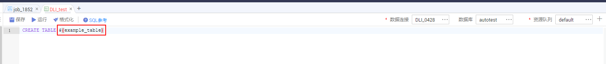

# 执行脚本<a name="dgc_02_0058"></a>

## 功能介绍<a name="zh-cn_topic_0181281350_section1738101810182"></a>

该接口用以执行指定脚本，支持执行DWS SQL、DLI SQL、RDS SQL、Flink SQL、、Hive SQL、Spark SQL、Presto SQL脚本。脚本每执行一次，生成一个脚本实例。执行脚本接口是一个异步命令，需要通过[查询脚本实例执行结果](查询脚本实例执行结果.md)获取执行状态和结果。

## URI<a name="zh-cn_topic_0181281350_section7934966101819"></a>

-   URI格式

    POST /v1/\{project\_id\}/scripts/\{script\_name\}/execute


-   参数说明

    **表 1**  URI参数说明

    <a name="zh-cn_topic_0181281350_zh-cn_topic_0093082049_table46023801181358"></a>
    <table><thead align="left"><tr id="zh-cn_topic_0181281350_zh-cn_topic_0093082049_row26974916181358"><th class="cellrowborder" valign="top" width="19.919999999999998%" id="mcps1.2.5.1.1"><p id="zh-cn_topic_0181281350_zh-cn_topic_0093082049_p37484572181358"><a name="zh-cn_topic_0181281350_zh-cn_topic_0093082049_p37484572181358"></a><a name="zh-cn_topic_0181281350_zh-cn_topic_0093082049_p37484572181358"></a>参数名</p>
    </th>
    <th class="cellrowborder" valign="top" width="10.66%" id="mcps1.2.5.1.2"><p id="zh-cn_topic_0181281350_zh-cn_topic_0093082049_p16351468181358"><a name="zh-cn_topic_0181281350_zh-cn_topic_0093082049_p16351468181358"></a><a name="zh-cn_topic_0181281350_zh-cn_topic_0093082049_p16351468181358"></a>是否必选</p>
    </th>
    <th class="cellrowborder" valign="top" width="16.24%" id="mcps1.2.5.1.3"><p id="zh-cn_topic_0181281350_zh-cn_topic_0093082049_p49400541181358"><a name="zh-cn_topic_0181281350_zh-cn_topic_0093082049_p49400541181358"></a><a name="zh-cn_topic_0181281350_zh-cn_topic_0093082049_p49400541181358"></a>参数类型</p>
    </th>
    <th class="cellrowborder" valign="top" width="53.18000000000001%" id="mcps1.2.5.1.4"><p id="zh-cn_topic_0181281350_zh-cn_topic_0093082049_p42020886181358"><a name="zh-cn_topic_0181281350_zh-cn_topic_0093082049_p42020886181358"></a><a name="zh-cn_topic_0181281350_zh-cn_topic_0093082049_p42020886181358"></a>说明</p>
    </th>
    </tr>
    </thead>
    <tbody><tr id="zh-cn_topic_0181281350_zh-cn_topic_0093082049_row48248640181358"><td class="cellrowborder" valign="top" width="19.919999999999998%" headers="mcps1.2.5.1.1 "><p id="zh-cn_topic_0181281350_zh-cn_topic_0093082049_p15825795181358"><a name="zh-cn_topic_0181281350_zh-cn_topic_0093082049_p15825795181358"></a><a name="zh-cn_topic_0181281350_zh-cn_topic_0093082049_p15825795181358"></a>project_id</p>
    </td>
    <td class="cellrowborder" valign="top" width="10.66%" headers="mcps1.2.5.1.2 "><p id="zh-cn_topic_0181281350_zh-cn_topic_0093082049_p6820998181358"><a name="zh-cn_topic_0181281350_zh-cn_topic_0093082049_p6820998181358"></a><a name="zh-cn_topic_0181281350_zh-cn_topic_0093082049_p6820998181358"></a>是</p>
    </td>
    <td class="cellrowborder" valign="top" width="16.24%" headers="mcps1.2.5.1.3 "><p id="zh-cn_topic_0181281350_zh-cn_topic_0093082049_p15629937181358"><a name="zh-cn_topic_0181281350_zh-cn_topic_0093082049_p15629937181358"></a><a name="zh-cn_topic_0181281350_zh-cn_topic_0093082049_p15629937181358"></a>String</p>
    </td>
    <td class="cellrowborder" valign="top" width="53.18000000000001%" headers="mcps1.2.5.1.4 "><p id="zh-cn_topic_0181281350_p8672138175612"><a name="zh-cn_topic_0181281350_p8672138175612"></a><a name="zh-cn_topic_0181281350_p8672138175612"></a>项目编号，获取方法请参见<a href="项目ID和帐号ID.md">项目ID和帐号ID</a>。</p>
    </td>
    </tr>
    <tr id="zh-cn_topic_0181281350_row28831818154718"><td class="cellrowborder" valign="top" width="19.919999999999998%" headers="mcps1.2.5.1.1 "><p id="zh-cn_topic_0181281350_p5884111818473"><a name="zh-cn_topic_0181281350_p5884111818473"></a><a name="zh-cn_topic_0181281350_p5884111818473"></a>script_name</p>
    </td>
    <td class="cellrowborder" valign="top" width="10.66%" headers="mcps1.2.5.1.2 "><p id="zh-cn_topic_0181281350_p788431814474"><a name="zh-cn_topic_0181281350_p788431814474"></a><a name="zh-cn_topic_0181281350_p788431814474"></a>是</p>
    </td>
    <td class="cellrowborder" valign="top" width="16.24%" headers="mcps1.2.5.1.3 "><p id="zh-cn_topic_0181281350_p188511183475"><a name="zh-cn_topic_0181281350_p188511183475"></a><a name="zh-cn_topic_0181281350_p188511183475"></a>String</p>
    </td>
    <td class="cellrowborder" valign="top" width="53.18000000000001%" headers="mcps1.2.5.1.4 "><p id="zh-cn_topic_0181281350_p1885151864710"><a name="zh-cn_topic_0181281350_p1885151864710"></a><a name="zh-cn_topic_0181281350_p1885151864710"></a>脚本名称。</p>
    </td>
    </tr>
    </tbody>
    </table>


## 请求消息<a name="zh-cn_topic_0181281350_section10789431145710"></a>

**表 2**  请求Header参数

<a name="zh-cn_topic_0181281350_table25071810112414"></a>
<table><thead align="left"><tr id="zh-cn_topic_0181281350_zh-cn_topic_0181281363_row3746915131710"><th class="cellrowborder" valign="top" width="15.010000000000002%" id="mcps1.2.5.1.1"><p id="zh-cn_topic_0181281350_zh-cn_topic_0181281363_p131491731112013"><a name="zh-cn_topic_0181281350_zh-cn_topic_0181281363_p131491731112013"></a><a name="zh-cn_topic_0181281350_zh-cn_topic_0181281363_p131491731112013"></a>参数名</p>
</th>
<th class="cellrowborder" valign="top" width="16.93%" id="mcps1.2.5.1.2"><p id="zh-cn_topic_0181281350_zh-cn_topic_0181281363_p3149113112204"><a name="zh-cn_topic_0181281350_zh-cn_topic_0181281363_p3149113112204"></a><a name="zh-cn_topic_0181281350_zh-cn_topic_0181281363_p3149113112204"></a>是否必选</p>
</th>
<th class="cellrowborder" valign="top" width="18.73%" id="mcps1.2.5.1.3"><p id="zh-cn_topic_0181281350_zh-cn_topic_0181281363_p13149173119204"><a name="zh-cn_topic_0181281350_zh-cn_topic_0181281363_p13149173119204"></a><a name="zh-cn_topic_0181281350_zh-cn_topic_0181281363_p13149173119204"></a>参数类型</p>
</th>
<th class="cellrowborder" valign="top" width="49.33%" id="mcps1.2.5.1.4"><p id="zh-cn_topic_0181281350_zh-cn_topic_0181281363_p11149331122017"><a name="zh-cn_topic_0181281350_zh-cn_topic_0181281363_p11149331122017"></a><a name="zh-cn_topic_0181281350_zh-cn_topic_0181281363_p11149331122017"></a>说明</p>
</th>
</tr>
</thead>
<tbody><tr id="zh-cn_topic_0181281350_zh-cn_topic_0181281363_row174620159179"><td class="cellrowborder" valign="top" width="15.010000000000002%" headers="mcps1.2.5.1.1 "><p id="zh-cn_topic_0181281350_zh-cn_topic_0181281363_p1150183116205"><a name="zh-cn_topic_0181281350_zh-cn_topic_0181281363_p1150183116205"></a><a name="zh-cn_topic_0181281350_zh-cn_topic_0181281363_p1150183116205"></a>workspace</p>
</td>
<td class="cellrowborder" valign="top" width="16.93%" headers="mcps1.2.5.1.2 "><p id="zh-cn_topic_0181281350_zh-cn_topic_0181281363_p4150531152016"><a name="zh-cn_topic_0181281350_zh-cn_topic_0181281363_p4150531152016"></a><a name="zh-cn_topic_0181281350_zh-cn_topic_0181281363_p4150531152016"></a>否</p>
</td>
<td class="cellrowborder" valign="top" width="18.73%" headers="mcps1.2.5.1.3 "><p id="zh-cn_topic_0181281350_zh-cn_topic_0181281363_p181505317209"><a name="zh-cn_topic_0181281350_zh-cn_topic_0181281363_p181505317209"></a><a name="zh-cn_topic_0181281350_zh-cn_topic_0181281363_p181505317209"></a>String</p>
</td>
<td class="cellrowborder" valign="top" width="49.33%" headers="mcps1.2.5.1.4 "><p id="zh-cn_topic_0181281350_zh-cn_topic_0181281363_p169341251122511"><a name="zh-cn_topic_0181281350_zh-cn_topic_0181281363_p169341251122511"></a><a name="zh-cn_topic_0181281350_zh-cn_topic_0181281363_p169341251122511"></a>工作空间id。</p>
<a name="zh-cn_topic_0181281350_zh-cn_topic_0181281363_ul776685742514"></a><a name="zh-cn_topic_0181281350_zh-cn_topic_0181281363_ul776685742514"></a><ul id="zh-cn_topic_0181281350_zh-cn_topic_0181281363_ul776685742514"><li>如果不设置该参数，默认查询default工作空间下的数据。</li><li>如果需要查询其他工作空间的数据，需要带上该消息头。</li></ul>
</td>
</tr>
</tbody>
</table>

**表 3**  参数说明

<a name="zh-cn_topic_0181281350_table19750184493418"></a>
<table><thead align="left"><tr id="zh-cn_topic_0181281350_row1475134418345"><th class="cellrowborder" valign="top" width="21.39%" id="mcps1.2.5.1.1"><p id="zh-cn_topic_0181281350_p1275244423417"><a name="zh-cn_topic_0181281350_p1275244423417"></a><a name="zh-cn_topic_0181281350_p1275244423417"></a>参数名</p>
</th>
<th class="cellrowborder" valign="top" width="10.33%" id="mcps1.2.5.1.2"><p id="zh-cn_topic_0181281350_p1375504413341"><a name="zh-cn_topic_0181281350_p1375504413341"></a><a name="zh-cn_topic_0181281350_p1375504413341"></a>是否必选</p>
</th>
<th class="cellrowborder" valign="top" width="20.9%" id="mcps1.2.5.1.3"><p id="zh-cn_topic_0181281350_p675774416349"><a name="zh-cn_topic_0181281350_p675774416349"></a><a name="zh-cn_topic_0181281350_p675774416349"></a>参数类型</p>
</th>
<th class="cellrowborder" valign="top" width="47.38%" id="mcps1.2.5.1.4"><p id="zh-cn_topic_0181281350_p475920448344"><a name="zh-cn_topic_0181281350_p475920448344"></a><a name="zh-cn_topic_0181281350_p475920448344"></a>说明</p>
</th>
</tr>
</thead>
<tbody><tr id="zh-cn_topic_0181281350_row104900151689"><td class="cellrowborder" valign="top" width="21.39%" headers="mcps1.2.5.1.1 "><p id="zh-cn_topic_0181281350_p2049191514818"><a name="zh-cn_topic_0181281350_p2049191514818"></a><a name="zh-cn_topic_0181281350_p2049191514818"></a>params</p>
</td>
<td class="cellrowborder" valign="top" width="10.33%" headers="mcps1.2.5.1.2 "><p id="zh-cn_topic_0181281350_p2491101514812"><a name="zh-cn_topic_0181281350_p2491101514812"></a><a name="zh-cn_topic_0181281350_p2491101514812"></a>否</p>
</td>
<td class="cellrowborder" valign="top" width="20.9%" headers="mcps1.2.5.1.3 "><p id="zh-cn_topic_0181281350_p1049114151287"><a name="zh-cn_topic_0181281350_p1049114151287"></a><a name="zh-cn_topic_0181281350_p1049114151287"></a>Map&lt;String,String&gt;</p>
</td>
<td class="cellrowborder" valign="top" width="47.38%" headers="mcps1.2.5.1.4 "><p id="zh-cn_topic_0181281350_p174912151883"><a name="zh-cn_topic_0181281350_p174912151883"></a><a name="zh-cn_topic_0181281350_p174912151883"></a>脚本参数。如果脚本中定义了参数，通过params携带参数值。默认值为空。</p>
</td>
</tr>
</tbody>
</table>

脚本参数指的是脚本内容里的参数，如下所示：



## 响应消息<a name="zh-cn_topic_0181281350_section561243517589"></a>

**表 4**  参数说明

<a name="zh-cn_topic_0181281350_table156150538710"></a>
<table><thead align="left"><tr id="zh-cn_topic_0181281350_row16156531079"><th class="cellrowborder" valign="top" width="21.63%" id="mcps1.2.5.1.1"><p id="zh-cn_topic_0181281350_p2615553976"><a name="zh-cn_topic_0181281350_p2615553976"></a><a name="zh-cn_topic_0181281350_p2615553976"></a>参数名</p>
</th>
<th class="cellrowborder" valign="top" width="10.209999999999999%" id="mcps1.2.5.1.2"><p id="zh-cn_topic_0181281350_p116153531175"><a name="zh-cn_topic_0181281350_p116153531175"></a><a name="zh-cn_topic_0181281350_p116153531175"></a>是否必选</p>
</th>
<th class="cellrowborder" valign="top" width="15.190000000000001%" id="mcps1.2.5.1.3"><p id="zh-cn_topic_0181281350_p96153531371"><a name="zh-cn_topic_0181281350_p96153531371"></a><a name="zh-cn_topic_0181281350_p96153531371"></a>参数类型</p>
</th>
<th class="cellrowborder" valign="top" width="52.96999999999999%" id="mcps1.2.5.1.4"><p id="zh-cn_topic_0181281350_p16157537714"><a name="zh-cn_topic_0181281350_p16157537714"></a><a name="zh-cn_topic_0181281350_p16157537714"></a>说明</p>
</th>
</tr>
</thead>
<tbody><tr id="zh-cn_topic_0181281350_row206153539712"><td class="cellrowborder" valign="top" width="21.63%" headers="mcps1.2.5.1.1 "><p id="zh-cn_topic_0181281350_p86151353073"><a name="zh-cn_topic_0181281350_p86151353073"></a><a name="zh-cn_topic_0181281350_p86151353073"></a>instanceId</p>
</td>
<td class="cellrowborder" valign="top" width="10.209999999999999%" headers="mcps1.2.5.1.2 "><p id="zh-cn_topic_0181281350_p76153534719"><a name="zh-cn_topic_0181281350_p76153534719"></a><a name="zh-cn_topic_0181281350_p76153534719"></a>是</p>
</td>
<td class="cellrowborder" valign="top" width="15.190000000000001%" headers="mcps1.2.5.1.3 "><p id="zh-cn_topic_0181281350_p56151653378"><a name="zh-cn_topic_0181281350_p56151653378"></a><a name="zh-cn_topic_0181281350_p56151653378"></a>String</p>
</td>
<td class="cellrowborder" valign="top" width="52.96999999999999%" headers="mcps1.2.5.1.4 "><p id="zh-cn_topic_0181281350_p1361519532710"><a name="zh-cn_topic_0181281350_p1361519532710"></a><a name="zh-cn_topic_0181281350_p1361519532710"></a>执行脚本的实例ID。在<a href="查询脚本实例执行结果.md">查询脚本实例执行结果</a>使用instanceId获取执行结果。</p>
</td>
</tr>
</tbody>
</table>

## 示例<a name="zh-cn_topic_0181281350_section358155716277"></a>

-   请求

    ```
    POST /v1/b384b9e9ab9b4ee8994c8633aabc9505/scripts/dws_sql/execute
    ```

    ```
    {
    "params":{"tableVar":"citys",
    "time":"2019-07-25"}
    }
    ```


-   成功响应

    HTTP状态码 200

    ```
    {
    "instanceId": "a1ad-448a-9d56-4154193d49c5"
    }
    ```


-   失败响应

    HTTP状态码 400

    ```
    {
        "error_code":"DLF.6201",
        "error_msg":"The script does not exist."
    }
    ```


## 状态码<a name="zh-cn_topic_0181281350_section1353211420567"></a>

状态码请参见[状态码](状态码.md)。

