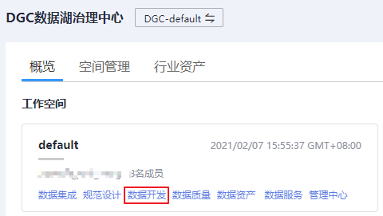
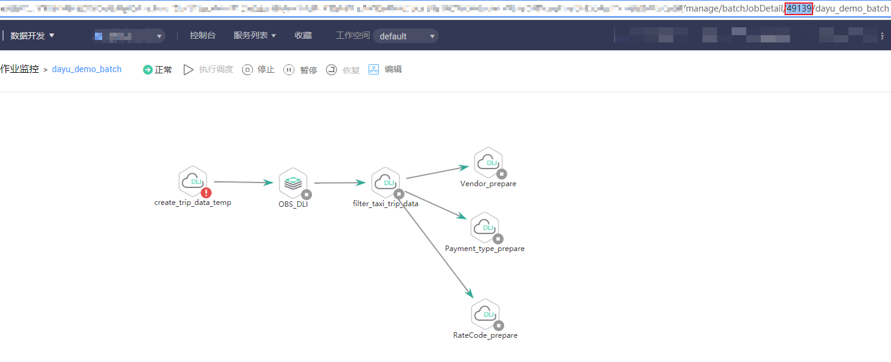

# 数据开发作业ID

在调用数据开发接口的时候，部分URL中需要填入作业ID（jobid），所以需要先在管理控制台上获取到作业ID。作业ID获取步骤如下：

1.  登录DGC控制台。选择对应工作空间的“数据开发“模块，进入数据开发页面。

    **图 1**  选择数据开发  
    

1.  在控制台的左侧导航栏，选择“运维调度  \>  作业监控“，根据需要查看的作业类型，选择“批作业监控”或“实时作业监控”。
2.  在“批作业监控”或“实时作业监控”页面，单击作业名称，进入作业监控界面。

    在当前页面的URL链接地址中，作业ID在作业类型（batchJobDetail或realTimeJobDetail）和作业名称之间，如下图所示。

    **图 2**  获取作业ID  
    

