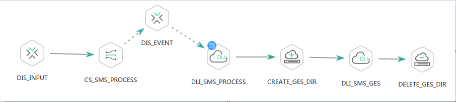

# 查询作业实例列表<a name="dgc_02_0094"></a>

## 功能介绍<a name="zh-cn_topic_0181281341_section1738101810182"></a>

查询作业实例列表。

对于配置了周期调度或事件触发调度的批处理作业，触发一次运行就会生产一个作业实例。如果实时作业里面包含了配置周期调度或事件触发调度节点，可以通过此接口查询节点所关联的子作业的实例列表，参数jobName格式为\[实时作业名称\]\_\[节点名称\]。

## URI<a name="zh-cn_topic_0181281341_section102234449285"></a>

-   URI格式

    GET /v1/\{project\_id\}/jobs/instances/detail?jobName=\{jobName\}&minPlanTime=\{minPlanTime\}&maxPlanTime=\{maxPlanTime\}&limit=\{limit\}&offset=\{offset\}&status=\{status\}


-   参数说明

    **表 1**  URI参数说明

    <a name="zh-cn_topic_0181281341_zh-cn_topic_0093082049_table46023801181358"></a>
    <table><thead align="left"><tr id="zh-cn_topic_0181281341_zh-cn_topic_0093082049_row26974916181358"><th class="cellrowborder" valign="top" width="19.8%" id="mcps1.2.5.1.1"><p id="zh-cn_topic_0181281341_zh-cn_topic_0093082049_p37484572181358"><a name="zh-cn_topic_0181281341_zh-cn_topic_0093082049_p37484572181358"></a><a name="zh-cn_topic_0181281341_zh-cn_topic_0093082049_p37484572181358"></a>参数名</p>
    </th>
    <th class="cellrowborder" valign="top" width="11.04%" id="mcps1.2.5.1.2"><p id="zh-cn_topic_0181281341_zh-cn_topic_0093082049_p16351468181358"><a name="zh-cn_topic_0181281341_zh-cn_topic_0093082049_p16351468181358"></a><a name="zh-cn_topic_0181281341_zh-cn_topic_0093082049_p16351468181358"></a>是否必选</p>
    </th>
    <th class="cellrowborder" valign="top" width="16.12%" id="mcps1.2.5.1.3"><p id="zh-cn_topic_0181281341_zh-cn_topic_0093082049_p49400541181358"><a name="zh-cn_topic_0181281341_zh-cn_topic_0093082049_p49400541181358"></a><a name="zh-cn_topic_0181281341_zh-cn_topic_0093082049_p49400541181358"></a>参数类型</p>
    </th>
    <th class="cellrowborder" valign="top" width="53.04%" id="mcps1.2.5.1.4"><p id="zh-cn_topic_0181281341_zh-cn_topic_0093082049_p42020886181358"><a name="zh-cn_topic_0181281341_zh-cn_topic_0093082049_p42020886181358"></a><a name="zh-cn_topic_0181281341_zh-cn_topic_0093082049_p42020886181358"></a>说明</p>
    </th>
    </tr>
    </thead>
    <tbody><tr id="zh-cn_topic_0181281341_zh-cn_topic_0093082049_row48248640181358"><td class="cellrowborder" valign="top" width="19.8%" headers="mcps1.2.5.1.1 "><p id="zh-cn_topic_0181281341_zh-cn_topic_0093082049_p15825795181358"><a name="zh-cn_topic_0181281341_zh-cn_topic_0093082049_p15825795181358"></a><a name="zh-cn_topic_0181281341_zh-cn_topic_0093082049_p15825795181358"></a>project_id</p>
    </td>
    <td class="cellrowborder" valign="top" width="11.04%" headers="mcps1.2.5.1.2 "><p id="zh-cn_topic_0181281341_zh-cn_topic_0093082049_p6820998181358"><a name="zh-cn_topic_0181281341_zh-cn_topic_0093082049_p6820998181358"></a><a name="zh-cn_topic_0181281341_zh-cn_topic_0093082049_p6820998181358"></a>是</p>
    </td>
    <td class="cellrowborder" valign="top" width="16.12%" headers="mcps1.2.5.1.3 "><p id="zh-cn_topic_0181281341_zh-cn_topic_0093082049_p15629937181358"><a name="zh-cn_topic_0181281341_zh-cn_topic_0093082049_p15629937181358"></a><a name="zh-cn_topic_0181281341_zh-cn_topic_0093082049_p15629937181358"></a>String</p>
    </td>
    <td class="cellrowborder" valign="top" width="53.04%" headers="mcps1.2.5.1.4 "><p id="zh-cn_topic_0181281341_p8672138175612"><a name="zh-cn_topic_0181281341_p8672138175612"></a><a name="zh-cn_topic_0181281341_p8672138175612"></a>项目编号，获取方法请参见<a href="项目ID和帐号ID.md">项目ID和帐号ID</a>。</p>
    </td>
    </tr>
    <tr id="zh-cn_topic_0181281341_row1998712117162"><td class="cellrowborder" valign="top" width="19.8%" headers="mcps1.2.5.1.1 "><p id="zh-cn_topic_0181281341_p102187318161"><a name="zh-cn_topic_0181281341_p102187318161"></a><a name="zh-cn_topic_0181281341_p102187318161"></a>jobName</p>
    </td>
    <td class="cellrowborder" valign="top" width="11.04%" headers="mcps1.2.5.1.2 "><p id="zh-cn_topic_0181281341_p162181632161"><a name="zh-cn_topic_0181281341_p162181632161"></a><a name="zh-cn_topic_0181281341_p162181632161"></a>否</p>
    </td>
    <td class="cellrowborder" valign="top" width="16.12%" headers="mcps1.2.5.1.3 "><p id="zh-cn_topic_0181281341_p1621814313163"><a name="zh-cn_topic_0181281341_p1621814313163"></a><a name="zh-cn_topic_0181281341_p1621814313163"></a>String</p>
    </td>
    <td class="cellrowborder" valign="top" width="53.04%" headers="mcps1.2.5.1.4 "><p id="zh-cn_topic_0181281341_p7538112212453"><a name="zh-cn_topic_0181281341_p7538112212453"></a><a name="zh-cn_topic_0181281341_p7538112212453"></a>作业名称。</p>
    <a name="zh-cn_topic_0181281341_ul16861630194512"></a><a name="zh-cn_topic_0181281341_ul16861630194512"></a><ul id="zh-cn_topic_0181281341_ul16861630194512"><li>如果要查询指定批处理作业的实例列表，jobName就是批处理作业名称；</li><li>如果要查询实时作业下某个节点关联的子作业，jobName格式为[实时作业名称]_[节点名称]。</li></ul>
    </td>
    </tr>
    <tr id="zh-cn_topic_0181281341_row10581131313164"><td class="cellrowborder" valign="top" width="19.8%" headers="mcps1.2.5.1.1 "><p id="zh-cn_topic_0181281341_p2285119151618"><a name="zh-cn_topic_0181281341_p2285119151618"></a><a name="zh-cn_topic_0181281341_p2285119151618"></a>minPlanTime</p>
    </td>
    <td class="cellrowborder" valign="top" width="11.04%" headers="mcps1.2.5.1.2 "><p id="zh-cn_topic_0181281341_p172856198164"><a name="zh-cn_topic_0181281341_p172856198164"></a><a name="zh-cn_topic_0181281341_p172856198164"></a>否</p>
    </td>
    <td class="cellrowborder" valign="top" width="16.12%" headers="mcps1.2.5.1.3 "><p id="zh-cn_topic_0181281341_p6273092181"><a name="zh-cn_topic_0181281341_p6273092181"></a><a name="zh-cn_topic_0181281341_p6273092181"></a>Long</p>
    </td>
    <td class="cellrowborder" valign="top" width="53.04%" headers="mcps1.2.5.1.4 "><p id="zh-cn_topic_0181281341_p328551914166"><a name="zh-cn_topic_0181281341_p328551914166"></a><a name="zh-cn_topic_0181281341_p328551914166"></a>返回计划执行时间大于minPlanTime的作业实例，单位为毫秒ms。</p>
    </td>
    </tr>
    <tr id="zh-cn_topic_0181281341_row14251217171618"><td class="cellrowborder" valign="top" width="19.8%" headers="mcps1.2.5.1.1 "><p id="zh-cn_topic_0181281341_p22854191164"><a name="zh-cn_topic_0181281341_p22854191164"></a><a name="zh-cn_topic_0181281341_p22854191164"></a>maxPlanTime</p>
    </td>
    <td class="cellrowborder" valign="top" width="11.04%" headers="mcps1.2.5.1.2 "><p id="zh-cn_topic_0181281341_p328551919165"><a name="zh-cn_topic_0181281341_p328551919165"></a><a name="zh-cn_topic_0181281341_p328551919165"></a>否</p>
    </td>
    <td class="cellrowborder" valign="top" width="16.12%" headers="mcps1.2.5.1.3 "><p id="zh-cn_topic_0181281341_p928551991617"><a name="zh-cn_topic_0181281341_p928551991617"></a><a name="zh-cn_topic_0181281341_p928551991617"></a>Long</p>
    </td>
    <td class="cellrowborder" valign="top" width="53.04%" headers="mcps1.2.5.1.4 "><p id="zh-cn_topic_0181281341_p5244231142412"><a name="zh-cn_topic_0181281341_p5244231142412"></a><a name="zh-cn_topic_0181281341_p5244231142412"></a>返回计划执行时间小于maxPlanTime的作业实例，单位为毫秒ms。</p>
    </td>
    </tr>
    <tr id="row16810104255318"><td class="cellrowborder" valign="top" width="19.8%" headers="mcps1.2.5.1.1 "><p id="zh-cn_topic_0181281341_p31081798172"><a name="zh-cn_topic_0181281341_p31081798172"></a><a name="zh-cn_topic_0181281341_p31081798172"></a>limit</p>
    </td>
    <td class="cellrowborder" valign="top" width="11.04%" headers="mcps1.2.5.1.2 "><p id="zh-cn_topic_0181281341_p14108169151713"><a name="zh-cn_topic_0181281341_p14108169151713"></a><a name="zh-cn_topic_0181281341_p14108169151713"></a>否</p>
    </td>
    <td class="cellrowborder" valign="top" width="16.12%" headers="mcps1.2.5.1.3 "><p id="zh-cn_topic_0181281341_p11108497173"><a name="zh-cn_topic_0181281341_p11108497173"></a><a name="zh-cn_topic_0181281341_p11108497173"></a>int</p>
    </td>
    <td class="cellrowborder" valign="top" width="53.04%" headers="mcps1.2.5.1.4 "><p id="zh-cn_topic_0181281341_p010910915170"><a name="zh-cn_topic_0181281341_p010910915170"></a><a name="zh-cn_topic_0181281341_p010910915170"></a>分页返回结果，指定每页最大记录数。</p>
    <p id="zh-cn_topic_0181281341_p13217857560"><a name="zh-cn_topic_0181281341_p13217857560"></a><a name="zh-cn_topic_0181281341_p13217857560"></a>范围[1,1000]</p>
    <p id="zh-cn_topic_0181281341_p163642582342"><a name="zh-cn_topic_0181281341_p163642582342"></a><a name="zh-cn_topic_0181281341_p163642582342"></a>默认值：10</p>
    </td>
    </tr>
    <tr id="zh-cn_topic_0181281341_row166164291719"><td class="cellrowborder" valign="top" width="19.8%" headers="mcps1.2.5.1.1 "><p id="zh-cn_topic_0181281341_p151085911174"><a name="zh-cn_topic_0181281341_p151085911174"></a><a name="zh-cn_topic_0181281341_p151085911174"></a>offset</p>
    </td>
    <td class="cellrowborder" valign="top" width="11.04%" headers="mcps1.2.5.1.2 "><p id="zh-cn_topic_0181281341_p51086916179"><a name="zh-cn_topic_0181281341_p51086916179"></a><a name="zh-cn_topic_0181281341_p51086916179"></a>否</p>
    </td>
    <td class="cellrowborder" valign="top" width="16.12%" headers="mcps1.2.5.1.3 "><p id="zh-cn_topic_0181281341_p810879131716"><a name="zh-cn_topic_0181281341_p810879131716"></a><a name="zh-cn_topic_0181281341_p810879131716"></a>int</p>
    </td>
    <td class="cellrowborder" valign="top" width="53.04%" headers="mcps1.2.5.1.4 "><p id="zh-cn_topic_0181281341_p1611914378613"><a name="zh-cn_topic_0181281341_p1611914378613"></a><a name="zh-cn_topic_0181281341_p1611914378613"></a>分页的起始页，默认值为0。取值范围大于等于0。</p>
    </td>
    </tr>
    <tr id="zh-cn_topic_0181281341_row1079625141717"><td class="cellrowborder" valign="top" width="19.8%" headers="mcps1.2.5.1.1 "><p id="zh-cn_topic_0181281341_p110911931717"><a name="zh-cn_topic_0181281341_p110911931717"></a><a name="zh-cn_topic_0181281341_p110911931717"></a>status</p>
    </td>
    <td class="cellrowborder" valign="top" width="11.04%" headers="mcps1.2.5.1.2 "><p id="zh-cn_topic_0181281341_p1109159121714"><a name="zh-cn_topic_0181281341_p1109159121714"></a><a name="zh-cn_topic_0181281341_p1109159121714"></a>否</p>
    </td>
    <td class="cellrowborder" valign="top" width="16.12%" headers="mcps1.2.5.1.3 "><p id="zh-cn_topic_0181281341_p1110918941710"><a name="zh-cn_topic_0181281341_p1110918941710"></a><a name="zh-cn_topic_0181281341_p1110918941710"></a>String</p>
    </td>
    <td class="cellrowborder" valign="top" width="53.04%" headers="mcps1.2.5.1.4 "><p id="zh-cn_topic_0181281341_p14109149161710"><a name="zh-cn_topic_0181281341_p14109149161710"></a><a name="zh-cn_topic_0181281341_p14109149161710"></a>实例运行状态：</p>
    <a name="zh-cn_topic_0181281341_ul15109794171"></a><a name="zh-cn_topic_0181281341_ul15109794171"></a><ul id="zh-cn_topic_0181281341_ul15109794171"><li>waiting： 等待运行</li><li>running：运行中</li><li>success： 运行成功</li><li>fail： 运行失败</li><li>running-exception： 运行异常</li><li>pause： 暂停</li><li>manual-stop： 取消</li></ul>
    </td>
    </tr>
    </tbody>
    </table>


## 请求消息<a name="zh-cn_topic_0181281341_section10789431145710"></a>

**表 2**  请求Header参数

<a name="zh-cn_topic_0181281341_table25071810112414"></a>
<table><thead align="left"><tr id="zh-cn_topic_0181281341_zh-cn_topic_0181281363_row3746915131710"><th class="cellrowborder" valign="top" width="15.010000000000002%" id="mcps1.2.5.1.1"><p id="zh-cn_topic_0181281341_zh-cn_topic_0181281363_p131491731112013"><a name="zh-cn_topic_0181281341_zh-cn_topic_0181281363_p131491731112013"></a><a name="zh-cn_topic_0181281341_zh-cn_topic_0181281363_p131491731112013"></a>参数名</p>
</th>
<th class="cellrowborder" valign="top" width="16.93%" id="mcps1.2.5.1.2"><p id="zh-cn_topic_0181281341_zh-cn_topic_0181281363_p3149113112204"><a name="zh-cn_topic_0181281341_zh-cn_topic_0181281363_p3149113112204"></a><a name="zh-cn_topic_0181281341_zh-cn_topic_0181281363_p3149113112204"></a>是否必选</p>
</th>
<th class="cellrowborder" valign="top" width="18.73%" id="mcps1.2.5.1.3"><p id="zh-cn_topic_0181281341_zh-cn_topic_0181281363_p13149173119204"><a name="zh-cn_topic_0181281341_zh-cn_topic_0181281363_p13149173119204"></a><a name="zh-cn_topic_0181281341_zh-cn_topic_0181281363_p13149173119204"></a>参数类型</p>
</th>
<th class="cellrowborder" valign="top" width="49.33%" id="mcps1.2.5.1.4"><p id="zh-cn_topic_0181281341_zh-cn_topic_0181281363_p11149331122017"><a name="zh-cn_topic_0181281341_zh-cn_topic_0181281363_p11149331122017"></a><a name="zh-cn_topic_0181281341_zh-cn_topic_0181281363_p11149331122017"></a>说明</p>
</th>
</tr>
</thead>
<tbody><tr id="zh-cn_topic_0181281341_zh-cn_topic_0181281363_row174620159179"><td class="cellrowborder" valign="top" width="15.010000000000002%" headers="mcps1.2.5.1.1 "><p id="zh-cn_topic_0181281341_zh-cn_topic_0181281363_p1150183116205"><a name="zh-cn_topic_0181281341_zh-cn_topic_0181281363_p1150183116205"></a><a name="zh-cn_topic_0181281341_zh-cn_topic_0181281363_p1150183116205"></a>workspace</p>
</td>
<td class="cellrowborder" valign="top" width="16.93%" headers="mcps1.2.5.1.2 "><p id="zh-cn_topic_0181281341_zh-cn_topic_0181281363_p4150531152016"><a name="zh-cn_topic_0181281341_zh-cn_topic_0181281363_p4150531152016"></a><a name="zh-cn_topic_0181281341_zh-cn_topic_0181281363_p4150531152016"></a>否</p>
</td>
<td class="cellrowborder" valign="top" width="18.73%" headers="mcps1.2.5.1.3 "><p id="zh-cn_topic_0181281341_zh-cn_topic_0181281363_p181505317209"><a name="zh-cn_topic_0181281341_zh-cn_topic_0181281363_p181505317209"></a><a name="zh-cn_topic_0181281341_zh-cn_topic_0181281363_p181505317209"></a>String</p>
</td>
<td class="cellrowborder" valign="top" width="49.33%" headers="mcps1.2.5.1.4 "><p id="zh-cn_topic_0181281341_zh-cn_topic_0181281363_p169341251122511"><a name="zh-cn_topic_0181281341_zh-cn_topic_0181281363_p169341251122511"></a><a name="zh-cn_topic_0181281341_zh-cn_topic_0181281363_p169341251122511"></a>工作空间id。</p>
<a name="zh-cn_topic_0181281341_zh-cn_topic_0181281363_ul776685742514"></a><a name="zh-cn_topic_0181281341_zh-cn_topic_0181281363_ul776685742514"></a><ul id="zh-cn_topic_0181281341_zh-cn_topic_0181281363_ul776685742514"><li>如果不设置该参数，默认查询default工作空间下的数据。</li><li>如果需要查询其他工作空间的数据，需要带上该消息头。</li></ul>
</td>
</tr>
</tbody>
</table>

## 响应消息<a name="zh-cn_topic_0181281341_section17656611145018"></a>

**表 3**  参数说明

<a name="zh-cn_topic_0181281341_table411392785710"></a>
<table><thead align="left"><tr id="zh-cn_topic_0181281341_row91151927115710"><th class="cellrowborder" valign="top" width="21.75%" id="mcps1.2.5.1.1"><p id="zh-cn_topic_0181281341_p1111772717571"><a name="zh-cn_topic_0181281341_p1111772717571"></a><a name="zh-cn_topic_0181281341_p1111772717571"></a>参数名</p>
</th>
<th class="cellrowborder" valign="top" width="10.33%" id="mcps1.2.5.1.2"><p id="zh-cn_topic_0181281341_p13117627145716"><a name="zh-cn_topic_0181281341_p13117627145716"></a><a name="zh-cn_topic_0181281341_p13117627145716"></a>是否必选</p>
</th>
<th class="cellrowborder" valign="top" width="15.310000000000002%" id="mcps1.2.5.1.3"><p id="zh-cn_topic_0181281341_p181192279574"><a name="zh-cn_topic_0181281341_p181192279574"></a><a name="zh-cn_topic_0181281341_p181192279574"></a>参数类型</p>
</th>
<th class="cellrowborder" valign="top" width="52.61%" id="mcps1.2.5.1.4"><p id="zh-cn_topic_0181281341_p712010276572"><a name="zh-cn_topic_0181281341_p712010276572"></a><a name="zh-cn_topic_0181281341_p712010276572"></a>说明</p>
</th>
</tr>
</thead>
<tbody><tr id="zh-cn_topic_0181281341_row4120162795712"><td class="cellrowborder" valign="top" width="21.75%" headers="mcps1.2.5.1.1 "><p id="zh-cn_topic_0181281341_p912012765717"><a name="zh-cn_topic_0181281341_p912012765717"></a><a name="zh-cn_topic_0181281341_p912012765717"></a>total</p>
</td>
<td class="cellrowborder" valign="top" width="10.33%" headers="mcps1.2.5.1.2 "><p id="zh-cn_topic_0181281341_p17123172712575"><a name="zh-cn_topic_0181281341_p17123172712575"></a><a name="zh-cn_topic_0181281341_p17123172712575"></a>是</p>
</td>
<td class="cellrowborder" valign="top" width="15.310000000000002%" headers="mcps1.2.5.1.3 "><p id="zh-cn_topic_0181281341_p10123142712570"><a name="zh-cn_topic_0181281341_p10123142712570"></a><a name="zh-cn_topic_0181281341_p10123142712570"></a>int</p>
</td>
<td class="cellrowborder" valign="top" width="52.61%" headers="mcps1.2.5.1.4 "><p id="zh-cn_topic_0181281341_p141241279572"><a name="zh-cn_topic_0181281341_p141241279572"></a><a name="zh-cn_topic_0181281341_p141241279572"></a>总记录数</p>
</td>
</tr>
<tr id="zh-cn_topic_0181281341_row8124627165711"><td class="cellrowborder" valign="top" width="21.75%" headers="mcps1.2.5.1.1 "><p id="zh-cn_topic_0181281341_p9126202735714"><a name="zh-cn_topic_0181281341_p9126202735714"></a><a name="zh-cn_topic_0181281341_p9126202735714"></a>instances</p>
</td>
<td class="cellrowborder" valign="top" width="10.33%" headers="mcps1.2.5.1.2 "><p id="zh-cn_topic_0181281341_p71261127125716"><a name="zh-cn_topic_0181281341_p71261127125716"></a><a name="zh-cn_topic_0181281341_p71261127125716"></a>是</p>
</td>
<td class="cellrowborder" valign="top" width="15.310000000000002%" headers="mcps1.2.5.1.3 "><p id="zh-cn_topic_0181281341_p10126112715719"><a name="zh-cn_topic_0181281341_p10126112715719"></a><a name="zh-cn_topic_0181281341_p10126112715719"></a>List&lt;Instance&gt;</p>
</td>
<td class="cellrowborder" valign="top" width="52.61%" headers="mcps1.2.5.1.4 "><p id="zh-cn_topic_0181281341_p10128527165714"><a name="zh-cn_topic_0181281341_p10128527165714"></a><a name="zh-cn_topic_0181281341_p10128527165714"></a>作业实例状态，参考<a href="#zh-cn_topic_0181281341_table4361191610322">表4</a></p>
</td>
</tr>
</tbody>
</table>

**表 4**  Instance属性说明

<a name="zh-cn_topic_0181281341_table4361191610322"></a>
<table><thead align="left"><tr id="zh-cn_topic_0181281341_row153631916203216"><th class="cellrowborder" valign="top" width="21.63%" id="mcps1.2.5.1.1"><p id="zh-cn_topic_0181281341_p43654167326"><a name="zh-cn_topic_0181281341_p43654167326"></a><a name="zh-cn_topic_0181281341_p43654167326"></a>参数名</p>
</th>
<th class="cellrowborder" valign="top" width="10.45%" id="mcps1.2.5.1.2"><p id="zh-cn_topic_0181281341_p14365111613325"><a name="zh-cn_topic_0181281341_p14365111613325"></a><a name="zh-cn_topic_0181281341_p14365111613325"></a>是否必选</p>
</th>
<th class="cellrowborder" valign="top" width="15.55%" id="mcps1.2.5.1.3"><p id="zh-cn_topic_0181281341_p18367121613212"><a name="zh-cn_topic_0181281341_p18367121613212"></a><a name="zh-cn_topic_0181281341_p18367121613212"></a>参数类型</p>
</th>
<th class="cellrowborder" valign="top" width="52.370000000000005%" id="mcps1.2.5.1.4"><p id="zh-cn_topic_0181281341_p9367141623218"><a name="zh-cn_topic_0181281341_p9367141623218"></a><a name="zh-cn_topic_0181281341_p9367141623218"></a>说明</p>
</th>
</tr>
</thead>
<tbody><tr id="zh-cn_topic_0181281341_row76031813145816"><td class="cellrowborder" valign="top" width="21.63%" headers="mcps1.2.5.1.1 "><p id="zh-cn_topic_0181281341_p8954181425819"><a name="zh-cn_topic_0181281341_p8954181425819"></a><a name="zh-cn_topic_0181281341_p8954181425819"></a>jobName</p>
</td>
<td class="cellrowborder" valign="top" width="10.45%" headers="mcps1.2.5.1.2 "><p id="zh-cn_topic_0181281341_p1956141425811"><a name="zh-cn_topic_0181281341_p1956141425811"></a><a name="zh-cn_topic_0181281341_p1956141425811"></a>是</p>
</td>
<td class="cellrowborder" valign="top" width="15.55%" headers="mcps1.2.5.1.3 "><p id="zh-cn_topic_0181281341_p39576141583"><a name="zh-cn_topic_0181281341_p39576141583"></a><a name="zh-cn_topic_0181281341_p39576141583"></a>String</p>
</td>
<td class="cellrowborder" valign="top" width="52.370000000000005%" headers="mcps1.2.5.1.4 "><p id="zh-cn_topic_0181281341_p119591714165813"><a name="zh-cn_topic_0181281341_p119591714165813"></a><a name="zh-cn_topic_0181281341_p119591714165813"></a>作业名称。如果要查询指定批处理作业的实例列表，jobName就是批处理作业名称；如果要查询实时作业下某个节点关联的子作业，jobName格式为[实时作业名称]_[节点名称]。</p>
</td>
</tr>
<tr id="row824412304557"><td class="cellrowborder" valign="top" width="21.63%" headers="mcps1.2.5.1.1 "><p id="p10245123005510"><a name="p10245123005510"></a><a name="p10245123005510"></a>jobInstanceName</p>
</td>
<td class="cellrowborder" valign="top" width="10.45%" headers="mcps1.2.5.1.2 "><p id="p024543045519"><a name="p024543045519"></a><a name="p024543045519"></a>是</p>
</td>
<td class="cellrowborder" valign="top" width="15.55%" headers="mcps1.2.5.1.3 "><p id="p6245163014550"><a name="p6245163014550"></a><a name="p6245163014550"></a>String</p>
</td>
<td class="cellrowborder" valign="top" width="52.370000000000005%" headers="mcps1.2.5.1.4 "><p id="p5245193019559"><a name="p5245193019559"></a><a name="p5245193019559"></a>作业实例运行时日志记录的实例名称, 非作业定义的名称</p>
</td>
</tr>
<tr id="zh-cn_topic_0181281341_row133672016183214"><td class="cellrowborder" valign="top" width="21.63%" headers="mcps1.2.5.1.1 "><p id="zh-cn_topic_0181281341_p83681116203218"><a name="zh-cn_topic_0181281341_p83681116203218"></a><a name="zh-cn_topic_0181281341_p83681116203218"></a>status</p>
</td>
<td class="cellrowborder" valign="top" width="10.45%" headers="mcps1.2.5.1.2 "><p id="zh-cn_topic_0181281341_p2036919165322"><a name="zh-cn_topic_0181281341_p2036919165322"></a><a name="zh-cn_topic_0181281341_p2036919165322"></a>是</p>
</td>
<td class="cellrowborder" valign="top" width="15.55%" headers="mcps1.2.5.1.3 "><p id="zh-cn_topic_0181281341_p13371161612323"><a name="zh-cn_topic_0181281341_p13371161612323"></a><a name="zh-cn_topic_0181281341_p13371161612323"></a>String</p>
</td>
<td class="cellrowborder" valign="top" width="52.370000000000005%" headers="mcps1.2.5.1.4 "><p id="zh-cn_topic_0181281341_p92439516577"><a name="zh-cn_topic_0181281341_p92439516577"></a><a name="zh-cn_topic_0181281341_p92439516577"></a>状态：</p>
<a name="zh-cn_topic_0181281341_ul1324355115574"></a><a name="zh-cn_topic_0181281341_ul1324355115574"></a><ul id="zh-cn_topic_0181281341_ul1324355115574"><li>waiting：等待运行</li><li>running：运行中</li><li>success： 运行成功</li><li>fail：运行失败</li><li>running-exception ：运行异常</li><li>pause ：暂停</li><li>manual-stop ：取消</li></ul>
</td>
</tr>
<tr id="zh-cn_topic_0181281341_row537117161327"><td class="cellrowborder" valign="top" width="21.63%" headers="mcps1.2.5.1.1 "><p id="zh-cn_topic_0181281341_p237213161325"><a name="zh-cn_topic_0181281341_p237213161325"></a><a name="zh-cn_topic_0181281341_p237213161325"></a>planTime</p>
</td>
<td class="cellrowborder" valign="top" width="10.45%" headers="mcps1.2.5.1.2 "><p id="zh-cn_topic_0181281341_p183731316173212"><a name="zh-cn_topic_0181281341_p183731316173212"></a><a name="zh-cn_topic_0181281341_p183731316173212"></a>是</p>
</td>
<td class="cellrowborder" valign="top" width="15.55%" headers="mcps1.2.5.1.3 "><p id="zh-cn_topic_0181281341_p10374716123215"><a name="zh-cn_topic_0181281341_p10374716123215"></a><a name="zh-cn_topic_0181281341_p10374716123215"></a>Long</p>
</td>
<td class="cellrowborder" valign="top" width="52.370000000000005%" headers="mcps1.2.5.1.4 "><p id="zh-cn_topic_0181281341_p137515169320"><a name="zh-cn_topic_0181281341_p137515169320"></a><a name="zh-cn_topic_0181281341_p137515169320"></a>作业实例计划执行时间</p>
</td>
</tr>
<tr id="zh-cn_topic_0181281341_row15560125010580"><td class="cellrowborder" valign="top" width="21.63%" headers="mcps1.2.5.1.1 "><p id="zh-cn_topic_0181281341_p4560135018586"><a name="zh-cn_topic_0181281341_p4560135018586"></a><a name="zh-cn_topic_0181281341_p4560135018586"></a>startTime</p>
</td>
<td class="cellrowborder" valign="top" width="10.45%" headers="mcps1.2.5.1.2 "><p id="zh-cn_topic_0181281341_p11560165013586"><a name="zh-cn_topic_0181281341_p11560165013586"></a><a name="zh-cn_topic_0181281341_p11560165013586"></a>是</p>
</td>
<td class="cellrowborder" valign="top" width="15.55%" headers="mcps1.2.5.1.3 "><p id="zh-cn_topic_0181281341_p298220262"><a name="zh-cn_topic_0181281341_p298220262"></a><a name="zh-cn_topic_0181281341_p298220262"></a>Long</p>
</td>
<td class="cellrowborder" valign="top" width="52.370000000000005%" headers="mcps1.2.5.1.4 "><p id="zh-cn_topic_0181281341_p165602505589"><a name="zh-cn_topic_0181281341_p165602505589"></a><a name="zh-cn_topic_0181281341_p165602505589"></a>作业实例实际执行开始时间</p>
</td>
</tr>
<tr id="zh-cn_topic_0181281341_row19943658185814"><td class="cellrowborder" valign="top" width="21.63%" headers="mcps1.2.5.1.1 "><p id="zh-cn_topic_0181281341_p1494375812588"><a name="zh-cn_topic_0181281341_p1494375812588"></a><a name="zh-cn_topic_0181281341_p1494375812588"></a>endTime</p>
</td>
<td class="cellrowborder" valign="top" width="10.45%" headers="mcps1.2.5.1.2 "><p id="zh-cn_topic_0181281341_p89431858165817"><a name="zh-cn_topic_0181281341_p89431858165817"></a><a name="zh-cn_topic_0181281341_p89431858165817"></a>否</p>
</td>
<td class="cellrowborder" valign="top" width="15.55%" headers="mcps1.2.5.1.3 "><p id="zh-cn_topic_0181281341_p1117442417264"><a name="zh-cn_topic_0181281341_p1117442417264"></a><a name="zh-cn_topic_0181281341_p1117442417264"></a>Long</p>
</td>
<td class="cellrowborder" valign="top" width="52.370000000000005%" headers="mcps1.2.5.1.4 "><p id="zh-cn_topic_0181281341_p973683785919"><a name="zh-cn_topic_0181281341_p973683785919"></a><a name="zh-cn_topic_0181281341_p973683785919"></a>作业实例实际执行结束时间</p>
</td>
</tr>
<tr id="zh-cn_topic_0181281341_row133610115596"><td class="cellrowborder" valign="top" width="21.63%" headers="mcps1.2.5.1.1 "><p id="zh-cn_topic_0181281341_p4336017591"><a name="zh-cn_topic_0181281341_p4336017591"></a><a name="zh-cn_topic_0181281341_p4336017591"></a>executeTime</p>
</td>
<td class="cellrowborder" valign="top" width="10.45%" headers="mcps1.2.5.1.2 "><p id="zh-cn_topic_0181281341_p10336319594"><a name="zh-cn_topic_0181281341_p10336319594"></a><a name="zh-cn_topic_0181281341_p10336319594"></a>否</p>
</td>
<td class="cellrowborder" valign="top" width="15.55%" headers="mcps1.2.5.1.3 "><p id="zh-cn_topic_0181281341_p3336816595"><a name="zh-cn_topic_0181281341_p3336816595"></a><a name="zh-cn_topic_0181281341_p3336816595"></a>Long</p>
</td>
<td class="cellrowborder" valign="top" width="52.370000000000005%" headers="mcps1.2.5.1.4 "><p id="zh-cn_topic_0181281341_p13362155919"><a name="zh-cn_topic_0181281341_p13362155919"></a><a name="zh-cn_topic_0181281341_p13362155919"></a>执行耗时，单位：毫秒</p>
</td>
</tr>
<tr id="zh-cn_topic_0181281341_row161656155811"><td class="cellrowborder" valign="top" width="21.63%" headers="mcps1.2.5.1.1 "><p id="zh-cn_topic_0181281341_p261185635815"><a name="zh-cn_topic_0181281341_p261185635815"></a><a name="zh-cn_topic_0181281341_p261185635815"></a>instanceId</p>
</td>
<td class="cellrowborder" valign="top" width="10.45%" headers="mcps1.2.5.1.2 "><p id="zh-cn_topic_0181281341_p261756125819"><a name="zh-cn_topic_0181281341_p261756125819"></a><a name="zh-cn_topic_0181281341_p261756125819"></a>是</p>
</td>
<td class="cellrowborder" valign="top" width="15.55%" headers="mcps1.2.5.1.3 "><p id="zh-cn_topic_0181281341_p13273173015"><a name="zh-cn_topic_0181281341_p13273173015"></a><a name="zh-cn_topic_0181281341_p13273173015"></a>Long</p>
</td>
<td class="cellrowborder" valign="top" width="52.370000000000005%" headers="mcps1.2.5.1.4 "><p id="zh-cn_topic_0181281341_p66175610589"><a name="zh-cn_topic_0181281341_p66175610589"></a><a name="zh-cn_topic_0181281341_p66175610589"></a>作业实例ID</p>
</td>
</tr>
<tr id="zh-cn_topic_0181281341_row1444111292012"><td class="cellrowborder" valign="top" width="21.63%" headers="mcps1.2.5.1.1 "><p id="zh-cn_topic_0181281341_p244142911010"><a name="zh-cn_topic_0181281341_p244142911010"></a><a name="zh-cn_topic_0181281341_p244142911010"></a>submitTime</p>
</td>
<td class="cellrowborder" valign="top" width="10.45%" headers="mcps1.2.5.1.2 "><p id="zh-cn_topic_0181281341_p114411299017"><a name="zh-cn_topic_0181281341_p114411299017"></a><a name="zh-cn_topic_0181281341_p114411299017"></a>是</p>
</td>
<td class="cellrowborder" valign="top" width="15.55%" headers="mcps1.2.5.1.3 "><p id="zh-cn_topic_0181281341_p19990193022619"><a name="zh-cn_topic_0181281341_p19990193022619"></a><a name="zh-cn_topic_0181281341_p19990193022619"></a>Long</p>
</td>
<td class="cellrowborder" valign="top" width="52.370000000000005%" headers="mcps1.2.5.1.4 "><p id="zh-cn_topic_0181281341_p1944120291309"><a name="zh-cn_topic_0181281341_p1944120291309"></a><a name="zh-cn_topic_0181281341_p1944120291309"></a>作业提交运行时间</p>
</td>
</tr>
</tbody>
</table>

## 示例1<a name="zh-cn_topic_0181281341_section358155716277"></a>

查询批处理作业job\_batch的实例列表

-   请求

    ```
    GET /v1/b384b9e9ab9b4ee8994c8633aabc9505/jobs/instances/detail?jobName=job_batch
    ```


-   成功响应

    ```
    {
    	"total": 2,
    	"instances": [{
    		"endTime": 1551671598000,
    		"executeTime": 0.3,
    		"instanceId": 34765,
                    
    		"jobName": "job_batch",
                    "jobInstanceName": "job_batch",
    		"planTime": 1551671580000,
    		"startTime": 1551671580000,
    		"status": "success",
    		"submitTime": 1550910278706
    	},
    	{
    		"endTime": 1551671538000,
    		"executeTime": 0.3,
    		"instanceId": 34764,
                    
    		"jobName": "job_batch",
                    "jobInstanceName": "job_batch",
    		"planTime": 1551671520000,
    		"startTime": 1551671521000,
    		"status": "success",
    		"submitTime": 1550910278706
    	}]
    }
    ```


## 示例3<a name="zh-cn_topic_0181281341_section4694549195112"></a>

查询实时作业job\_sms的节点DLI\_SMS\_PROCESS所关联的子作业实例列表，job\_sms作业如[图1](#zh-cn_topic_0181281341_fig16566104782818)，其中节点DLI\_SMS\_PROCESS配置了事件监听。

**图 1**  job\_sms<a name="zh-cn_topic_0181281341_fig16566104782818"></a>  


-   请求

    ```
    GET /v1/b384b9e9ab9b4ee8994c8633aabc9505/jobs/instances/detail?jobName=job_sms_DLI_SMS_PROCESS
    ```


-   响应

    ```
    {
    	"total": 2,
    	"instances": [{
    		"endTime": 1551425387000,
    		"exeTime": 1.0,
    		"instanceId": 30654,
    		"jobName": "job_sms_DLI_SMS_PROCESS",
    		"jobInstanceName": "job_sms_DLI_SMS_PROCESS",
    		"planTime": 1551425326540,
    		"startTime": 1551425327000,
    		"status": "fail",
    		"submitTime": 1551409464657
    	},
    	{
    		"endTime": 1551409570000,
    		"exeTime": 0.5,
    		"instanceId": 28960,
    		"jobName": "job_sms_DLI_SMS_PROCESS",
    		"jobInstanceName": "job_sms_DLI_SMS_PROCESS",
    		"planTime": 1551323851910,
    		"startTime": 1551409540000,
    		"status": "fail",
    		"submitTime": 1551323793766
    	}]
    }
    ```

    -   失败响应

        HTTP状态码 400

        ```
        {
            "error_code":"DLF.3051",
            "error_msg":"The request parameter is invalid."
        }
        ```


