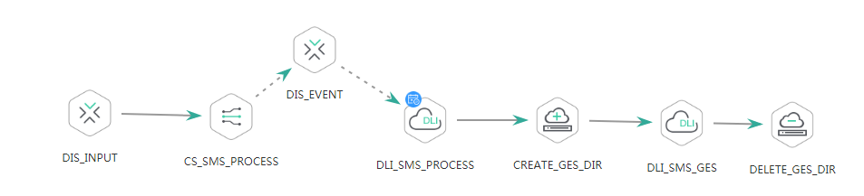

# 查询实时作业运行状态<a name="dgc_02_0093"></a>

## 功能介绍<a name="zh-cn_topic_0181281320_section1738101810182"></a>

查询指定实时作业的运行状态。

## URI<a name="zh-cn_topic_0181281320_section102234449285"></a>

-   URI格式

    GET /v1/\{project\_id\}/jobs/\{job\_name\}/status


-   参数说明

    **表 1**  URI参数说明

    <a name="zh-cn_topic_0181281320_zh-cn_topic_0093082049_table46023801181358"></a>
    <table><thead align="left"><tr id="zh-cn_topic_0181281320_zh-cn_topic_0093082049_row26974916181358"><th class="cellrowborder" valign="top" width="19.8%" id="mcps1.2.5.1.1"><p id="zh-cn_topic_0181281320_zh-cn_topic_0093082049_p37484572181358"><a name="zh-cn_topic_0181281320_zh-cn_topic_0093082049_p37484572181358"></a><a name="zh-cn_topic_0181281320_zh-cn_topic_0093082049_p37484572181358"></a>参数名</p>
    </th>
    <th class="cellrowborder" valign="top" width="10.91%" id="mcps1.2.5.1.2"><p id="zh-cn_topic_0181281320_zh-cn_topic_0093082049_p16351468181358"><a name="zh-cn_topic_0181281320_zh-cn_topic_0093082049_p16351468181358"></a><a name="zh-cn_topic_0181281320_zh-cn_topic_0093082049_p16351468181358"></a>是否必选</p>
    </th>
    <th class="cellrowborder" valign="top" width="16.24%" id="mcps1.2.5.1.3"><p id="zh-cn_topic_0181281320_zh-cn_topic_0093082049_p49400541181358"><a name="zh-cn_topic_0181281320_zh-cn_topic_0093082049_p49400541181358"></a><a name="zh-cn_topic_0181281320_zh-cn_topic_0093082049_p49400541181358"></a>参数类型</p>
    </th>
    <th class="cellrowborder" valign="top" width="53.05%" id="mcps1.2.5.1.4"><p id="zh-cn_topic_0181281320_zh-cn_topic_0093082049_p42020886181358"><a name="zh-cn_topic_0181281320_zh-cn_topic_0093082049_p42020886181358"></a><a name="zh-cn_topic_0181281320_zh-cn_topic_0093082049_p42020886181358"></a>说明</p>
    </th>
    </tr>
    </thead>
    <tbody><tr id="zh-cn_topic_0181281320_zh-cn_topic_0093082049_row48248640181358"><td class="cellrowborder" valign="top" width="19.8%" headers="mcps1.2.5.1.1 "><p id="zh-cn_topic_0181281320_zh-cn_topic_0093082049_p15825795181358"><a name="zh-cn_topic_0181281320_zh-cn_topic_0093082049_p15825795181358"></a><a name="zh-cn_topic_0181281320_zh-cn_topic_0093082049_p15825795181358"></a>project_id</p>
    </td>
    <td class="cellrowborder" valign="top" width="10.91%" headers="mcps1.2.5.1.2 "><p id="zh-cn_topic_0181281320_zh-cn_topic_0093082049_p6820998181358"><a name="zh-cn_topic_0181281320_zh-cn_topic_0093082049_p6820998181358"></a><a name="zh-cn_topic_0181281320_zh-cn_topic_0093082049_p6820998181358"></a>是</p>
    </td>
    <td class="cellrowborder" valign="top" width="16.24%" headers="mcps1.2.5.1.3 "><p id="zh-cn_topic_0181281320_zh-cn_topic_0093082049_p15629937181358"><a name="zh-cn_topic_0181281320_zh-cn_topic_0093082049_p15629937181358"></a><a name="zh-cn_topic_0181281320_zh-cn_topic_0093082049_p15629937181358"></a>String</p>
    </td>
    <td class="cellrowborder" valign="top" width="53.05%" headers="mcps1.2.5.1.4 "><p id="zh-cn_topic_0181281320_p8672138175612"><a name="zh-cn_topic_0181281320_p8672138175612"></a><a name="zh-cn_topic_0181281320_p8672138175612"></a>项目编号，获取方法请参见<a href="项目ID和帐号ID.md">项目ID和帐号ID</a>。</p>
    </td>
    </tr>
    <tr id="zh-cn_topic_0181281320_row19970910202918"><td class="cellrowborder" valign="top" width="19.8%" headers="mcps1.2.5.1.1 "><p id="zh-cn_topic_0181281320_p471876151414"><a name="zh-cn_topic_0181281320_p471876151414"></a><a name="zh-cn_topic_0181281320_p471876151414"></a>job_name</p>
    </td>
    <td class="cellrowborder" valign="top" width="10.91%" headers="mcps1.2.5.1.2 "><p id="zh-cn_topic_0181281320_p19718146161420"><a name="zh-cn_topic_0181281320_p19718146161420"></a><a name="zh-cn_topic_0181281320_p19718146161420"></a>是</p>
    </td>
    <td class="cellrowborder" valign="top" width="16.24%" headers="mcps1.2.5.1.3 "><p id="zh-cn_topic_0181281320_p9718196161417"><a name="zh-cn_topic_0181281320_p9718196161417"></a><a name="zh-cn_topic_0181281320_p9718196161417"></a>String</p>
    </td>
    <td class="cellrowborder" valign="top" width="53.05%" headers="mcps1.2.5.1.4 "><p id="zh-cn_topic_0181281320_p2571117161416"><a name="zh-cn_topic_0181281320_p2571117161416"></a><a name="zh-cn_topic_0181281320_p2571117161416"></a>作业名称</p>
    </td>
    </tr>
    </tbody>
    </table>


## 请求消息<a name="zh-cn_topic_0181281320_section10789431145710"></a>

**表 2**  请求Header参数

<a name="zh-cn_topic_0181281320_table25071810112414"></a>
<table><thead align="left"><tr id="zh-cn_topic_0181281320_zh-cn_topic_0181281363_row3746915131710"><th class="cellrowborder" valign="top" width="15.010000000000002%" id="mcps1.2.5.1.1"><p id="zh-cn_topic_0181281320_zh-cn_topic_0181281363_p131491731112013"><a name="zh-cn_topic_0181281320_zh-cn_topic_0181281363_p131491731112013"></a><a name="zh-cn_topic_0181281320_zh-cn_topic_0181281363_p131491731112013"></a>参数名</p>
</th>
<th class="cellrowborder" valign="top" width="16.93%" id="mcps1.2.5.1.2"><p id="zh-cn_topic_0181281320_zh-cn_topic_0181281363_p3149113112204"><a name="zh-cn_topic_0181281320_zh-cn_topic_0181281363_p3149113112204"></a><a name="zh-cn_topic_0181281320_zh-cn_topic_0181281363_p3149113112204"></a>是否必选</p>
</th>
<th class="cellrowborder" valign="top" width="18.73%" id="mcps1.2.5.1.3"><p id="zh-cn_topic_0181281320_zh-cn_topic_0181281363_p13149173119204"><a name="zh-cn_topic_0181281320_zh-cn_topic_0181281363_p13149173119204"></a><a name="zh-cn_topic_0181281320_zh-cn_topic_0181281363_p13149173119204"></a>参数类型</p>
</th>
<th class="cellrowborder" valign="top" width="49.33%" id="mcps1.2.5.1.4"><p id="zh-cn_topic_0181281320_zh-cn_topic_0181281363_p11149331122017"><a name="zh-cn_topic_0181281320_zh-cn_topic_0181281363_p11149331122017"></a><a name="zh-cn_topic_0181281320_zh-cn_topic_0181281363_p11149331122017"></a>说明</p>
</th>
</tr>
</thead>
<tbody><tr id="zh-cn_topic_0181281320_zh-cn_topic_0181281363_row174620159179"><td class="cellrowborder" valign="top" width="15.010000000000002%" headers="mcps1.2.5.1.1 "><p id="zh-cn_topic_0181281320_zh-cn_topic_0181281363_p1150183116205"><a name="zh-cn_topic_0181281320_zh-cn_topic_0181281363_p1150183116205"></a><a name="zh-cn_topic_0181281320_zh-cn_topic_0181281363_p1150183116205"></a>workspace</p>
</td>
<td class="cellrowborder" valign="top" width="16.93%" headers="mcps1.2.5.1.2 "><p id="zh-cn_topic_0181281320_zh-cn_topic_0181281363_p4150531152016"><a name="zh-cn_topic_0181281320_zh-cn_topic_0181281363_p4150531152016"></a><a name="zh-cn_topic_0181281320_zh-cn_topic_0181281363_p4150531152016"></a>否</p>
</td>
<td class="cellrowborder" valign="top" width="18.73%" headers="mcps1.2.5.1.3 "><p id="zh-cn_topic_0181281320_zh-cn_topic_0181281363_p181505317209"><a name="zh-cn_topic_0181281320_zh-cn_topic_0181281363_p181505317209"></a><a name="zh-cn_topic_0181281320_zh-cn_topic_0181281363_p181505317209"></a>String</p>
</td>
<td class="cellrowborder" valign="top" width="49.33%" headers="mcps1.2.5.1.4 "><p id="zh-cn_topic_0181281320_zh-cn_topic_0181281363_p169341251122511"><a name="zh-cn_topic_0181281320_zh-cn_topic_0181281363_p169341251122511"></a><a name="zh-cn_topic_0181281320_zh-cn_topic_0181281363_p169341251122511"></a>工作空间id。</p>
<a name="zh-cn_topic_0181281320_zh-cn_topic_0181281363_ul776685742514"></a><a name="zh-cn_topic_0181281320_zh-cn_topic_0181281363_ul776685742514"></a><ul id="zh-cn_topic_0181281320_zh-cn_topic_0181281363_ul776685742514"><li>如果不设置该参数，默认查询default工作空间下的数据。</li><li>如果需要查询其他工作空间的数据，需要带上该消息头。</li></ul>
</td>
</tr>
</tbody>
</table>

## 响应消息<a name="zh-cn_topic_0181281320_section17656611145018"></a>

**表 3**  参数说明

<a name="zh-cn_topic_0181281320_table19656151112506"></a>
<table><thead align="left"><tr id="zh-cn_topic_0181281320_row1965718115501"><th class="cellrowborder" valign="top" width="21.39%" id="mcps1.2.5.1.1"><p id="zh-cn_topic_0181281320_p17659111205011"><a name="zh-cn_topic_0181281320_p17659111205011"></a><a name="zh-cn_topic_0181281320_p17659111205011"></a>参数名</p>
</th>
<th class="cellrowborder" valign="top" width="10.33%" id="mcps1.2.5.1.2"><p id="zh-cn_topic_0181281320_p565991111500"><a name="zh-cn_topic_0181281320_p565991111500"></a><a name="zh-cn_topic_0181281320_p565991111500"></a>是否必选</p>
</th>
<th class="cellrowborder" valign="top" width="15.67%" id="mcps1.2.5.1.3"><p id="zh-cn_topic_0181281320_p565913119501"><a name="zh-cn_topic_0181281320_p565913119501"></a><a name="zh-cn_topic_0181281320_p565913119501"></a>参数类型</p>
</th>
<th class="cellrowborder" valign="top" width="52.61%" id="mcps1.2.5.1.4"><p id="zh-cn_topic_0181281320_p865911125012"><a name="zh-cn_topic_0181281320_p865911125012"></a><a name="zh-cn_topic_0181281320_p865911125012"></a>说明</p>
</th>
</tr>
</thead>
<tbody><tr id="zh-cn_topic_0181281320_row18287105520520"><td class="cellrowborder" valign="top" width="21.39%" headers="mcps1.2.5.1.1 "><p id="zh-cn_topic_0181281320_p628745514521"><a name="zh-cn_topic_0181281320_p628745514521"></a><a name="zh-cn_topic_0181281320_p628745514521"></a>name</p>
</td>
<td class="cellrowborder" valign="top" width="10.33%" headers="mcps1.2.5.1.2 "><p id="zh-cn_topic_0181281320_p928710559523"><a name="zh-cn_topic_0181281320_p928710559523"></a><a name="zh-cn_topic_0181281320_p928710559523"></a>是</p>
</td>
<td class="cellrowborder" valign="top" width="15.67%" headers="mcps1.2.5.1.3 "><p id="zh-cn_topic_0181281320_p1228755515211"><a name="zh-cn_topic_0181281320_p1228755515211"></a><a name="zh-cn_topic_0181281320_p1228755515211"></a>String</p>
</td>
<td class="cellrowborder" valign="top" width="52.61%" headers="mcps1.2.5.1.4 "><p id="zh-cn_topic_0181281320_p15288125555214"><a name="zh-cn_topic_0181281320_p15288125555214"></a><a name="zh-cn_topic_0181281320_p15288125555214"></a>解决方案名称</p>
</td>
</tr>
<tr id="zh-cn_topic_0181281320_row892530194114"><td class="cellrowborder" valign="top" width="21.39%" headers="mcps1.2.5.1.1 "><p id="zh-cn_topic_0181281320_p1292516018415"><a name="zh-cn_topic_0181281320_p1292516018415"></a><a name="zh-cn_topic_0181281320_p1292516018415"></a>nodes</p>
</td>
<td class="cellrowborder" valign="top" width="10.33%" headers="mcps1.2.5.1.2 "><p id="zh-cn_topic_0181281320_p2925180114118"><a name="zh-cn_topic_0181281320_p2925180114118"></a><a name="zh-cn_topic_0181281320_p2925180114118"></a>否</p>
</td>
<td class="cellrowborder" valign="top" width="15.67%" headers="mcps1.2.5.1.3 "><p id="zh-cn_topic_0181281320_p7925190164111"><a name="zh-cn_topic_0181281320_p7925190164111"></a><a name="zh-cn_topic_0181281320_p7925190164111"></a>列表数据结构</p>
</td>
<td class="cellrowborder" valign="top" width="52.61%" headers="mcps1.2.5.1.4 "><p id="zh-cn_topic_0181281320_p6925170134118"><a name="zh-cn_topic_0181281320_p6925170134118"></a><a name="zh-cn_topic_0181281320_p6925170134118"></a>节点状态列表</p>
</td>
</tr>
<tr id="zh-cn_topic_0181281320_row077506114110"><td class="cellrowborder" valign="top" width="21.39%" headers="mcps1.2.5.1.1 "><p id="zh-cn_topic_0181281320_p177751569414"><a name="zh-cn_topic_0181281320_p177751569414"></a><a name="zh-cn_topic_0181281320_p177751569414"></a>status</p>
</td>
<td class="cellrowborder" valign="top" width="10.33%" headers="mcps1.2.5.1.2 "><p id="zh-cn_topic_0181281320_p977513654113"><a name="zh-cn_topic_0181281320_p977513654113"></a><a name="zh-cn_topic_0181281320_p977513654113"></a>否</p>
</td>
<td class="cellrowborder" valign="top" width="15.67%" headers="mcps1.2.5.1.3 "><p id="zh-cn_topic_0181281320_p477515612416"><a name="zh-cn_topic_0181281320_p477515612416"></a><a name="zh-cn_topic_0181281320_p477515612416"></a>String</p>
</td>
<td class="cellrowborder" valign="top" width="52.61%" headers="mcps1.2.5.1.4 "><p id="zh-cn_topic_0181281320_p1730741716425"><a name="zh-cn_topic_0181281320_p1730741716425"></a><a name="zh-cn_topic_0181281320_p1730741716425"></a>作业状态：</p>
<a name="zh-cn_topic_0181281320_ul8308217164217"></a><a name="zh-cn_topic_0181281320_ul8308217164217"></a><ul id="zh-cn_topic_0181281320_ul8308217164217"><li>STARTTING ： 启动中</li><li>NORMAL：正常</li><li>EXCEPTION ：异常</li><li>STOPPING ：停止中</li><li>STOPPED：停止</li></ul>
</td>
</tr>
<tr id="zh-cn_topic_0181281320_row28823319412"><td class="cellrowborder" valign="top" width="21.39%" headers="mcps1.2.5.1.1 "><p id="zh-cn_topic_0181281320_p5882153144117"><a name="zh-cn_topic_0181281320_p5882153144117"></a><a name="zh-cn_topic_0181281320_p5882153144117"></a>startTime</p>
</td>
<td class="cellrowborder" valign="top" width="10.33%" headers="mcps1.2.5.1.2 "><p id="zh-cn_topic_0181281320_p3882113174113"><a name="zh-cn_topic_0181281320_p3882113174113"></a><a name="zh-cn_topic_0181281320_p3882113174113"></a>是</p>
</td>
<td class="cellrowborder" valign="top" width="15.67%" headers="mcps1.2.5.1.3 "><p id="zh-cn_topic_0181281320_p28821030418"><a name="zh-cn_topic_0181281320_p28821030418"></a><a name="zh-cn_topic_0181281320_p28821030418"></a>Date</p>
</td>
<td class="cellrowborder" valign="top" width="52.61%" headers="mcps1.2.5.1.4 "><p id="zh-cn_topic_0181281320_p0882833416"><a name="zh-cn_topic_0181281320_p0882833416"></a><a name="zh-cn_topic_0181281320_p0882833416"></a>启动时间</p>
</td>
</tr>
<tr id="zh-cn_topic_0181281320_row1840552110437"><td class="cellrowborder" valign="top" width="21.39%" headers="mcps1.2.5.1.1 "><p id="zh-cn_topic_0181281320_p940642174317"><a name="zh-cn_topic_0181281320_p940642174317"></a><a name="zh-cn_topic_0181281320_p940642174317"></a>endTime</p>
</td>
<td class="cellrowborder" valign="top" width="10.33%" headers="mcps1.2.5.1.2 "><p id="zh-cn_topic_0181281320_p15406142113432"><a name="zh-cn_topic_0181281320_p15406142113432"></a><a name="zh-cn_topic_0181281320_p15406142113432"></a>否</p>
</td>
<td class="cellrowborder" valign="top" width="15.67%" headers="mcps1.2.5.1.3 "><p id="zh-cn_topic_0181281320_p540672194316"><a name="zh-cn_topic_0181281320_p540672194316"></a><a name="zh-cn_topic_0181281320_p540672194316"></a>Date</p>
</td>
<td class="cellrowborder" valign="top" width="52.61%" headers="mcps1.2.5.1.4 "><p id="zh-cn_topic_0181281320_p18406182117436"><a name="zh-cn_topic_0181281320_p18406182117436"></a><a name="zh-cn_topic_0181281320_p18406182117436"></a>停止时间</p>
</td>
</tr>
<tr id="zh-cn_topic_0181281320_row1086581714319"><td class="cellrowborder" valign="top" width="21.39%" headers="mcps1.2.5.1.1 "><p id="zh-cn_topic_0181281320_p4865131714310"><a name="zh-cn_topic_0181281320_p4865131714310"></a><a name="zh-cn_topic_0181281320_p4865131714310"></a>lastUpdateTime</p>
</td>
<td class="cellrowborder" valign="top" width="10.33%" headers="mcps1.2.5.1.2 "><p id="zh-cn_topic_0181281320_p4865917104313"><a name="zh-cn_topic_0181281320_p4865917104313"></a><a name="zh-cn_topic_0181281320_p4865917104313"></a>否</p>
</td>
<td class="cellrowborder" valign="top" width="15.67%" headers="mcps1.2.5.1.3 "><p id="zh-cn_topic_0181281320_p6865151734315"><a name="zh-cn_topic_0181281320_p6865151734315"></a><a name="zh-cn_topic_0181281320_p6865151734315"></a>Date</p>
</td>
<td class="cellrowborder" valign="top" width="52.61%" headers="mcps1.2.5.1.4 "><p id="zh-cn_topic_0181281320_p1086781734319"><a name="zh-cn_topic_0181281320_p1086781734319"></a><a name="zh-cn_topic_0181281320_p1086781734319"></a>状态最后更新时间</p>
</td>
</tr>
</tbody>
</table>

**表 4**  nodes字段数据结构说明

<a name="zh-cn_topic_0181281320_table1178110044316"></a>
<table><thead align="left"><tr id="zh-cn_topic_0181281320_row578760124314"><th class="cellrowborder" valign="top" width="21.63%" id="mcps1.2.5.1.1"><p id="zh-cn_topic_0181281320_p147891609430"><a name="zh-cn_topic_0181281320_p147891609430"></a><a name="zh-cn_topic_0181281320_p147891609430"></a>参数名</p>
</th>
<th class="cellrowborder" valign="top" width="10.33%" id="mcps1.2.5.1.2"><p id="zh-cn_topic_0181281320_p117918014318"><a name="zh-cn_topic_0181281320_p117918014318"></a><a name="zh-cn_topic_0181281320_p117918014318"></a>是否必选</p>
</th>
<th class="cellrowborder" valign="top" width="15.310000000000002%" id="mcps1.2.5.1.3"><p id="zh-cn_topic_0181281320_p2792150164315"><a name="zh-cn_topic_0181281320_p2792150164315"></a><a name="zh-cn_topic_0181281320_p2792150164315"></a>参数类型</p>
</th>
<th class="cellrowborder" valign="top" width="52.73%" id="mcps1.2.5.1.4"><p id="zh-cn_topic_0181281320_p157943018434"><a name="zh-cn_topic_0181281320_p157943018434"></a><a name="zh-cn_topic_0181281320_p157943018434"></a>说明</p>
</th>
</tr>
</thead>
<tbody><tr id="zh-cn_topic_0181281320_row1479919019438"><td class="cellrowborder" valign="top" width="21.63%" headers="mcps1.2.5.1.1 "><p id="zh-cn_topic_0181281320_p580013074318"><a name="zh-cn_topic_0181281320_p580013074318"></a><a name="zh-cn_topic_0181281320_p580013074318"></a>name</p>
</td>
<td class="cellrowborder" valign="top" width="10.33%" headers="mcps1.2.5.1.2 "><p id="zh-cn_topic_0181281320_p1180210134320"><a name="zh-cn_topic_0181281320_p1180210134320"></a><a name="zh-cn_topic_0181281320_p1180210134320"></a>是</p>
</td>
<td class="cellrowborder" valign="top" width="15.310000000000002%" headers="mcps1.2.5.1.3 "><p id="zh-cn_topic_0181281320_p280460204318"><a name="zh-cn_topic_0181281320_p280460204318"></a><a name="zh-cn_topic_0181281320_p280460204318"></a>String</p>
</td>
<td class="cellrowborder" valign="top" width="52.73%" headers="mcps1.2.5.1.4 "><p id="zh-cn_topic_0181281320_p208081302437"><a name="zh-cn_topic_0181281320_p208081302437"></a><a name="zh-cn_topic_0181281320_p208081302437"></a>节点名称</p>
</td>
</tr>
<tr id="zh-cn_topic_0181281320_row1680912014436"><td class="cellrowborder" valign="top" width="21.63%" headers="mcps1.2.5.1.1 "><p id="zh-cn_topic_0181281320_p5810160154310"><a name="zh-cn_topic_0181281320_p5810160154310"></a><a name="zh-cn_topic_0181281320_p5810160154310"></a>status</p>
</td>
<td class="cellrowborder" valign="top" width="10.33%" headers="mcps1.2.5.1.2 "><p id="zh-cn_topic_0181281320_p148121906430"><a name="zh-cn_topic_0181281320_p148121906430"></a><a name="zh-cn_topic_0181281320_p148121906430"></a>否</p>
</td>
<td class="cellrowborder" valign="top" width="15.310000000000002%" headers="mcps1.2.5.1.3 "><p id="zh-cn_topic_0181281320_p243112566115"><a name="zh-cn_topic_0181281320_p243112566115"></a><a name="zh-cn_topic_0181281320_p243112566115"></a>String</p>
</td>
<td class="cellrowborder" valign="top" width="52.73%" headers="mcps1.2.5.1.4 "><p id="zh-cn_topic_0181281320_p274416320433"><a name="zh-cn_topic_0181281320_p274416320433"></a><a name="zh-cn_topic_0181281320_p274416320433"></a>节点状态：</p>
<a name="zh-cn_topic_0181281320_ul169612010101212"></a><a name="zh-cn_topic_0181281320_ul169612010101212"></a><ul id="zh-cn_topic_0181281320_ul169612010101212"><li>STARTTING ：启动中</li><li>NORMAL：正常</li><li>EXCEPTION ：异常</li><li>STOPPING ： 停止中</li><li>STOPPED：停止</li></ul>
</td>
</tr>
<tr id="zh-cn_topic_0181281320_row651951412273"><td class="cellrowborder" valign="top" width="21.63%" headers="mcps1.2.5.1.1 "><p id="zh-cn_topic_0181281320_p10519141462712"><a name="zh-cn_topic_0181281320_p10519141462712"></a><a name="zh-cn_topic_0181281320_p10519141462712"></a>logPath</p>
</td>
<td class="cellrowborder" valign="top" width="10.33%" headers="mcps1.2.5.1.2 "><p id="zh-cn_topic_0181281320_p752021411278"><a name="zh-cn_topic_0181281320_p752021411278"></a><a name="zh-cn_topic_0181281320_p752021411278"></a>否</p>
</td>
<td class="cellrowborder" valign="top" width="15.310000000000002%" headers="mcps1.2.5.1.3 "><p id="zh-cn_topic_0181281320_p1852011141275"><a name="zh-cn_topic_0181281320_p1852011141275"></a><a name="zh-cn_topic_0181281320_p1852011141275"></a>String</p>
</td>
<td class="cellrowborder" valign="top" width="52.73%" headers="mcps1.2.5.1.4 "><p id="zh-cn_topic_0181281320_p16520814132717"><a name="zh-cn_topic_0181281320_p16520814132717"></a><a name="zh-cn_topic_0181281320_p16520814132717"></a>节点运行日志路径</p>
</td>
</tr>
<tr id="zh-cn_topic_0181281320_row6898184711285"><td class="cellrowborder" valign="top" width="21.63%" headers="mcps1.2.5.1.1 "><p id="zh-cn_topic_0181281320_p08983471282"><a name="zh-cn_topic_0181281320_p08983471282"></a><a name="zh-cn_topic_0181281320_p08983471282"></a>type</p>
</td>
<td class="cellrowborder" valign="top" width="10.33%" headers="mcps1.2.5.1.2 "><p id="zh-cn_topic_0181281320_p15898164717282"><a name="zh-cn_topic_0181281320_p15898164717282"></a><a name="zh-cn_topic_0181281320_p15898164717282"></a>是</p>
</td>
<td class="cellrowborder" valign="top" width="15.310000000000002%" headers="mcps1.2.5.1.3 "><p id="zh-cn_topic_0181281320_p38981947192815"><a name="zh-cn_topic_0181281320_p38981947192815"></a><a name="zh-cn_topic_0181281320_p38981947192815"></a>String</p>
</td>
<td class="cellrowborder" valign="top" width="52.73%" headers="mcps1.2.5.1.4 "><p id="zh-cn_topic_0181281320_p1056001918506"><a name="zh-cn_topic_0181281320_p1056001918506"></a><a name="zh-cn_topic_0181281320_p1056001918506"></a>节点类型:</p>
<a name="zh-cn_topic_0181281320_ul124475504160"></a><a name="zh-cn_topic_0181281320_ul124475504160"></a><ul id="zh-cn_topic_0181281320_ul124475504160"><li>Hive SQL ：执行Hive SQL脚本</li><li>Spark SQL ：执行Spark SQL脚本</li><li>DWS SQL ： 执行DWS SQL脚本</li><li>DLI SQL ： 执行DLI SQL脚本</li><li>Shell：执行Shell SQL脚本</li><li>CDM Job：执行CDM作业</li><li>DISTransferTask ：创建DIS转储任务</li><li>CS Job ：创建CloudStream作业，并启动作业</li><li>CloudTableManager节点 ：CloudTable表管理，参考创建和删除表。</li><li>OBSManager： OBS路径管理，包括创建和删除路径</li><li>RESTAPI ： REST API请求</li><li>SMN ： 发送短信或邮件</li><li>MRS Spark ：执行MRS服务的Spark作业</li><li>MapReduce ：执行MRS服务的MapReduce作业</li></ul>
</td>
</tr>
</tbody>
</table>

## 示例<a name="zh-cn_topic_0181281320_section358155716277"></a>

查询实时作业job\_sms作业运行状态以及各个节点运行状态。job\_sms有7个节点，如下

**图 1**  job\_sms<a name="zh-cn_topic_0181281320_fig1940695511248"></a>  


-   请求

    ```
    GET /v1/b384b9e9ab9b4ee8994c8633aabc9505/jobs/job_sms/status
    ```


-   成功响应（作业运行中，其中DLI\_SMS\_GES运行异常）

    ```
    {
    	"lastUpdateTime": 1551409406000,
    	"name": "job_sms",
    	"nodes": [{
    		"name": "CREATE_GES_DIR",
    		"status": "NORMAL",
    		"totalGetBytes": 0,
    		"totalGetRecords": 0,
    		"totalPutBytes": 0,
    		"totalPutRecords": 0,
    		"type": "Create OBS"
    	},
    	{
    		"logPath": "obs://dlf-log-b384b9e9ab9b4ee8994c8633aabc9505/job_sms/2019-03-01 11_04_24.000/CS_SMS_PROCESS/CS_SMS_PROCESS-IrU8hS82_20190301_110433_183.job",
    		"name": "CS_SMS_PROCESS",
    		"runningData": "{\"jobName\":\"CS_SMS_PROCESS\",\"jobId\":\"107016\",\"App_dis-input\":\"app_sms_process\"}",
    		"status": "NORMAL",
    		"totalGetBytes": 0,
    		"totalGetRecords": 165,
    		"totalPutBytes": 0,
    		"totalPutRecords": 165,
    		"type": "ExecuteCloudStream"
    	},
    	{
    		"name": "DELETE_GES_DIR",
    		"status": "STOPPED",
    		"totalGetBytes": 0,
    		"totalGetRecords": 0,
    		"totalPutBytes": 0,
    		"totalPutRecords": 0,
    		"type": "Delete OBS"
    	},
    	{
    		"logPath": "obs://dlf-log-b384b9e9ab9b4ee8994c8633aabc9505/job_sms/2019-03-01 11_04_24.000/DIS_EVENT/DIS_EVENT-kefeNV5B_20190301_110439_984.job",
    		"name": "DIS_EVENT",
    		"runningData": "{\"app\":\"DLF_job_sms_DLI_SMS_PROCESS\",\"streamName\":\"dis-event\"}",
    		"status": "NORMAL",
    		"totalGetBytes": 0,
    		"totalGetRecords": 8602,
    		"totalPutBytes": 0,
    		"totalPutRecords": 8596,
    		"type": "ExecuteDISStream"
    	},
    	{
    		"logPath": "obs://dlf-log-b384b9e9ab9b4ee8994c8633aabc9505/job_sms/2019-03-01 11_04_24.000/DIS_INPUT/DIS_INPUT-T18JOYTc_20190301_110428_754.job",
    		"name": "DIS_INPUT",
    		"runningData": "{\"streamName\":\"dis-input\"}",
    		"status": "NORMAL",
    		"totalGetBytes": 0,
    		"totalGetRecords": 70341,
    		"totalPutBytes": 0,
    		"totalPutRecords": 70341,
    		"type": "ExecuteDISStream"
    	},
    	{
    		"name": "DLI_SMS_GES",
    		"status": "EXCEPTION",
    		"totalGetBytes": 0,
    		"totalGetRecords": 0,
    		"totalPutBytes": 0,
    		"totalPutRecords": 0,
    		"type": "DLI SQL"
    	},
    	{
    		"name": "DLI_SMS_PROCESS",
    		"status": "NORMAL",
    		"totalGetBytes": 0,
    		"totalGetRecords": 208,
    		"totalPutBytes": 0,
    		"totalPutRecords": 208,
    		"type": "DLI SQL"
    	}],
    	"startTime": 1551409465000,
    	"status": "NORMAL"
    }
    ```

-   失败响应

    HTTP状态码 400

    ```
    {
        "error_code":"DLF.0100",
        "error_msg":"The job does not exists."
    }
    ```


