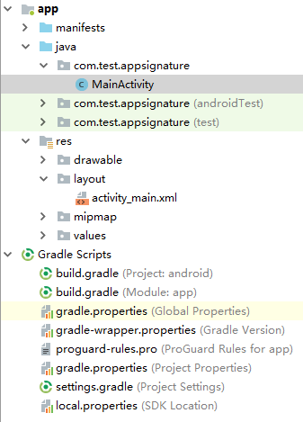

# Android<a name="dayu_06_1012"></a>

## 操作场景<a name="zh-cn_topic_0184564547_section18586174761315"></a>

使用Android语言调用APP认证的API时，您需要先获取SDK，然后新建工程，最后参考API调用示例调用API。

## 准备环境<a name="zh-cn_topic_0184564547_section1495121117502"></a>

-   已获取API的域名、请求url、请求方法、AppKey和AppSecret等信息，具体参见[认证前准备](认证前准备.md#dayu_06_1003)。
-   获取并安装Android Studio，如果未安装，请至[Android Studio官方网站](https://developer.android.com/studio/)下载。

## 获取SDK<a name="zh-cn_topic_0184564547_section17783814506"></a>

请访问https://apig.$\{OBS服务的域名\}/apig-sdk/ApiGateway-android-sdk.zip下载SDK。

其中，$\{OBS服务的域名\}需要根据实际情况进行替换，请向管理员获取OBS服务的域名。

[下载SDK](https://obs.cn-north-1.myhuaweicloud.com/apig-sdk/ApiGateway-android-sdk.zip)，获取“ApiGateway-android-sdk.zip”压缩包，解压后目录结构如下：

<a name="zh-cn_topic_0184564547_table98162204301"></a>
<table><thead align="left"><tr id="zh-cn_topic_0184564547_row38171220113013"><th class="cellrowborder" valign="top" width="35%" id="mcps1.1.3.1.1"><p id="zh-cn_topic_0184564547_p08202020163012"><a name="zh-cn_topic_0184564547_p08202020163012"></a><a name="zh-cn_topic_0184564547_p08202020163012"></a>名称</p>
</th>
<th class="cellrowborder" valign="top" width="65%" id="mcps1.1.3.1.2"><p id="zh-cn_topic_0184564547_p18211420183016"><a name="zh-cn_topic_0184564547_p18211420183016"></a><a name="zh-cn_topic_0184564547_p18211420183016"></a>说明</p>
</th>
</tr>
</thead>
<tbody><tr id="zh-cn_topic_0184564547_row178221920163017"><td class="cellrowborder" valign="top" width="35%" headers="mcps1.1.3.1.1 "><p id="zh-cn_topic_0184564547_p382210203300"><a name="zh-cn_topic_0184564547_p382210203300"></a><a name="zh-cn_topic_0184564547_p382210203300"></a>app\</p>
</td>
<td class="cellrowborder" valign="top" width="65%" headers="mcps1.1.3.1.2 "><p id="zh-cn_topic_0184564547_p128221420133013"><a name="zh-cn_topic_0184564547_p128221420133013"></a><a name="zh-cn_topic_0184564547_p128221420133013"></a>安卓工程代码</p>
</td>
</tr>
<tr id="zh-cn_topic_0184564547_row3826132015303"><td class="cellrowborder" valign="top" width="35%" headers="mcps1.1.3.1.1 "><p id="zh-cn_topic_0184564547_p8463185417262"><a name="zh-cn_topic_0184564547_p8463185417262"></a><a name="zh-cn_topic_0184564547_p8463185417262"></a>gradle\</p>
</td>
<td class="cellrowborder" valign="top" width="65%" headers="mcps1.1.3.1.2 "><p id="zh-cn_topic_0184564547_p13161749125719"><a name="zh-cn_topic_0184564547_p13161749125719"></a><a name="zh-cn_topic_0184564547_p13161749125719"></a>gradle相关文件</p>
</td>
</tr>
<tr id="zh-cn_topic_0184564547_row1773122811302"><td class="cellrowborder" valign="top" width="35%" headers="mcps1.1.3.1.1 "><p id="zh-cn_topic_0184564547_p1477432818308"><a name="zh-cn_topic_0184564547_p1477432818308"></a><a name="zh-cn_topic_0184564547_p1477432818308"></a>build.gradle</p>
</td>
<td class="cellrowborder" rowspan="3" valign="top" width="65%" headers="mcps1.1.3.1.2 "><p id="zh-cn_topic_0184564547_p19774132816301"><a name="zh-cn_topic_0184564547_p19774132816301"></a><a name="zh-cn_topic_0184564547_p19774132816301"></a>gradle配置文件</p>
<p id="zh-cn_topic_0184564547_p233181865916"><a name="zh-cn_topic_0184564547_p233181865916"></a><a name="zh-cn_topic_0184564547_p233181865916"></a></p>
<p id="zh-cn_topic_0184564547_p19157255135912"><a name="zh-cn_topic_0184564547_p19157255135912"></a><a name="zh-cn_topic_0184564547_p19157255135912"></a></p>
</td>
</tr>
<tr id="zh-cn_topic_0184564547_row692919447393"><td class="cellrowborder" valign="top" headers="mcps1.1.3.1.1 "><p id="zh-cn_topic_0184564547_p412718121598"><a name="zh-cn_topic_0184564547_p412718121598"></a><a name="zh-cn_topic_0184564547_p412718121598"></a>gradle.properties</p>
</td>
</tr>
<tr id="zh-cn_topic_0184564547_row1015711553596"><td class="cellrowborder" valign="top" headers="mcps1.1.3.1.1 "><p id="zh-cn_topic_0184564547_p1415785565917"><a name="zh-cn_topic_0184564547_p1415785565917"></a><a name="zh-cn_topic_0184564547_p1415785565917"></a>settings.gradle</p>
</td>
</tr>
<tr id="zh-cn_topic_0184564547_row447617399115"><td class="cellrowborder" valign="top" width="35%" headers="mcps1.1.3.1.1 "><p id="zh-cn_topic_0184564547_p1847643914112"><a name="zh-cn_topic_0184564547_p1847643914112"></a><a name="zh-cn_topic_0184564547_p1847643914112"></a>gradlew</p>
</td>
<td class="cellrowborder" rowspan="2" valign="top" width="65%" headers="mcps1.1.3.1.2 "><p id="zh-cn_topic_0184564547_p6476113917119"><a name="zh-cn_topic_0184564547_p6476113917119"></a><a name="zh-cn_topic_0184564547_p6476113917119"></a>gradle wrapper执行脚本</p>
<p id="zh-cn_topic_0184564547_p6857918212"><a name="zh-cn_topic_0184564547_p6857918212"></a><a name="zh-cn_topic_0184564547_p6857918212"></a></p>
</td>
</tr>
<tr id="zh-cn_topic_0184564547_row148589225"><td class="cellrowborder" valign="top" headers="mcps1.1.3.1.1 "><p id="zh-cn_topic_0184564547_p13851291129"><a name="zh-cn_topic_0184564547_p13851291129"></a><a name="zh-cn_topic_0184564547_p13851291129"></a>gradlew.bat</p>
</td>
</tr>
</tbody>
</table>

## 打开工程<a name="zh-cn_topic_0184564547_section39549480354"></a>

1.  打开Android Studio，选择“File \> Open”。

    在弹出的对话框中选择解压后的SDK路径。

2.  打开工程后，目录结构如下。

    **图 1**  工程目录结构<a name="zh-cn_topic_0184564547_fig938822923817"></a>  
    


## 调用API示例<a name="zh-cn_topic_0184564547_section1398155573513"></a>

1.  在Android工程中的“app/libs”目录下，加入SDK所需jar包。其中jar包必须包括：
    -   java-sdk-core-x.x.x.jar
    -   commons-logging-1.2.jar
    -   joda-time-2.9.9.jar

2.  在“build.gradle”文件中加入okhttp库的依赖。

    在“build.gradle”文件中的“dependencies”下加入“implementation 'com.squareup.okhttp3:okhttp:3.11.0'”。

    ```
    dependencies {    
        ...
        ...
        implementation 'com.squareup.okhttp3:okhttp:3.11.0'
    }
    ```

3.  创建request，输入AppKey和AppSecret，并指定域名、方法名、请求uri和body。其中所访问API的ID为必填项，需要填入具体的ID信息，示例代码如“x-api-id”作为样例。

    ```
    Request request = new Request();
    try {
    	request.setKey("4f5f626b-073f-402f-a1e0-e52171c6100c");
    	request.setSecrect("******");
    	request.setMethod("POST");
    	request.setUrl("https://c967a237-cd6c-470e-906f-a8655461897e.apigw.cn-north-1.huaweicloud.comserviceEndpoint/app1");
    	request.addQueryStringParam("name", "value");
    	request.addHeader("Content-Type", "text/plain");
            request.addHeader("x-api-id", "*********");
    	request.setBody("demo");
    } catch (Exception e) {
    	e.printStackTrace();
    	return;
    }
    ```

4.  对请求进行签名，并为请求添加x-Authorization头，值与Authorization头相同。然后生成okhttp3.Request对象来访问API。

    ```
    okhttp3.Request signedRequest = Client.signOkhttp(request);
    String authorization = signedRequest.header("Authorization");
    signedRequest = signedRequest.newBuilder().addHeader("x-Authorization",authorization).build();
    OkHttpClient client = new OkHttpClient.Builder().build();
    Response response = client.newCall(signedRequest).execute();
    ```


