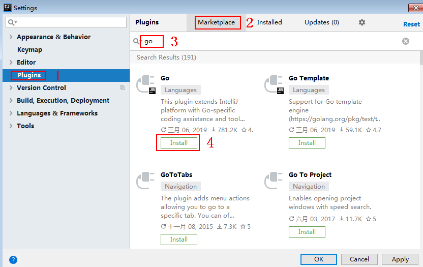
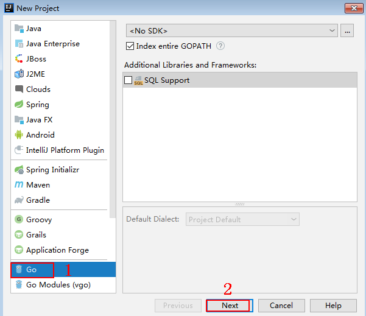
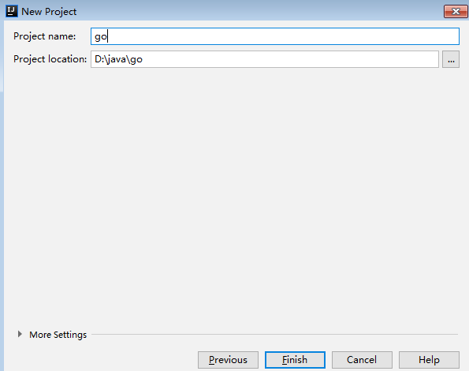
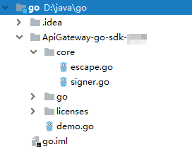

# Go<a name="dayu_06_1005"></a>

## 操作场景<a name="zh-cn_topic_0184564537_section18586174761315"></a>

使用Go语言调用APP认证的API时，您需要先获取SDK，然后新建工程，最后参考调用API示例调用API。

本章节以IntelliJ IDEA 2018.3.5版本为例介绍。

## 前提条件<a name="zh-cn_topic_0184564537_section1495121117502"></a>

-   已获取API的域名、ID、请求url、请求方法、AppKey和AppSecret等信息，具体参见[认证前准备](认证前准备.md#dayu_06_1003)。
-   获取并安装Go安装包，如果未安装，请至[Go官方下载页面](https://golang.org/dl/)下载。
-   获取并安装IntelliJ IDEA，如果未安装，请至[IntelliJ IDEA官方网站](https://www.jetbrains.com/idea/)下载。
-   已在IntelliJ IDEA中安装Go插件，如果未安装，请按照[图1](#zh-cn_topic_0184564537_fig1527451510101)所示安装。

    **图 1**  安装Go插件<a name="zh-cn_topic_0184564537_fig1527451510101"></a>  
    


## 获取SDK<a name="zh-cn_topic_0184564537_section17783814506"></a>

请访问https://apig.$\{OBS服务的域名\}/apig-sdk/ApiGateway-go-sdk.zip下载SDK。

其中，$\{OBS服务的域名\}需要根据实际情况进行替换，请向管理员获取OBS服务的域名。

[下载SDK](https://obs.cn-north-1.myhuaweicloud.com/apig-sdk/ApiGateway-go-sdk.zip)，获取“ApiGateway-go-sdk.zip”压缩包，解压后目录结构如下：

<a name="zh-cn_topic_0184564537_table98162204301"></a>
<table><thead align="left"><tr id="zh-cn_topic_0184564537_row38171220113013"><th class="cellrowborder" valign="top" width="35%" id="mcps1.1.3.1.1"><p id="zh-cn_topic_0184564537_p08202020163012"><a name="zh-cn_topic_0184564537_p08202020163012"></a><a name="zh-cn_topic_0184564537_p08202020163012"></a>名称</p>
</th>
<th class="cellrowborder" valign="top" width="65%" id="mcps1.1.3.1.2"><p id="zh-cn_topic_0184564537_p18211420183016"><a name="zh-cn_topic_0184564537_p18211420183016"></a><a name="zh-cn_topic_0184564537_p18211420183016"></a>说明</p>
</th>
</tr>
</thead>
<tbody><tr id="zh-cn_topic_0184564537_row178221920163017"><td class="cellrowborder" valign="top" width="35%" headers="mcps1.1.3.1.1 "><p id="zh-cn_topic_0184564537_p382210203300"><a name="zh-cn_topic_0184564537_p382210203300"></a><a name="zh-cn_topic_0184564537_p382210203300"></a>core\escape.go</p>
</td>
<td class="cellrowborder" rowspan="2" valign="top" width="65%" headers="mcps1.1.3.1.2 "><p id="zh-cn_topic_0184564537_p128221420133013"><a name="zh-cn_topic_0184564537_p128221420133013"></a><a name="zh-cn_topic_0184564537_p128221420133013"></a>SDK代码</p>
<p id="zh-cn_topic_0184564537_p17823720183010"><a name="zh-cn_topic_0184564537_p17823720183010"></a><a name="zh-cn_topic_0184564537_p17823720183010"></a></p>
</td>
</tr>
<tr id="zh-cn_topic_0184564537_row3826132015303"><td class="cellrowborder" valign="top" headers="mcps1.1.3.1.1 "><p id="zh-cn_topic_0184564537_p193011124183117"><a name="zh-cn_topic_0184564537_p193011124183117"></a><a name="zh-cn_topic_0184564537_p193011124183117"></a>core\signer.go</p>
</td>
</tr>
<tr id="zh-cn_topic_0184564537_row1773122811302"><td class="cellrowborder" valign="top" width="35%" headers="mcps1.1.3.1.1 "><p id="zh-cn_topic_0184564537_p1477432818308"><a name="zh-cn_topic_0184564537_p1477432818308"></a><a name="zh-cn_topic_0184564537_p1477432818308"></a>demo.go</p>
</td>
<td class="cellrowborder" valign="top" width="65%" headers="mcps1.1.3.1.2 "><p id="zh-cn_topic_0184564537_p19774132816301"><a name="zh-cn_topic_0184564537_p19774132816301"></a><a name="zh-cn_topic_0184564537_p19774132816301"></a>示例代码</p>
</td>
</tr>
</tbody>
</table>

## 新建工程<a name="zh-cn_topic_0184564537_section204893423218"></a>

1.  打开IntelliJ IDEA，选择菜单“File \> New \> Project”。

    弹出“New Project”对话框，选择“Go”，单击“Next”。

    **图 2**  New Project<a name="zh-cn_topic_0184564537_fig7901135114407"></a>  
    

2.  单击“...”，在弹出的对话框中选择解压后的SDK路径，单击“Finish”。

    **图 3**  选择解压后的SDK路径<a name="zh-cn_topic_0184564537_fig1089918301416"></a>  
    

3.  完成工程创建后，目录结构如下。

    **图 4**  新建工程的目录结构<a name="zh-cn_topic_0184564537_fig174772049191712"></a>  
    

    “demo.go”为示例代码，请根据实际情况修改参数后使用。具体代码说明请参考[调用API示例](#zh-cn_topic_0184564537_section941525372117)。


## 调用API示例<a name="zh-cn_topic_0184564537_section941525372117"></a>

1.  在工程中引入sdk（signer.go）。

    ```
    import "apig-sdk/go/core"
    ```

2.  生成一个新的Signer，输入AppKey和AppSecret。

    ```
    s := core.Signer{
            Key: "4f5f626b-073f-402f-a1e0-e52171c6100c",
            Secret: "******",
    }
    ```

3.  生成一个新的Request，指定域名、方法名、请求url、query和body。

    ```
    r, _ := http.NewRequest("POST", "http://c967a237-cd6c-470e-906f-a8655461897e.apigw.cn-north-1.huaweicloud.comserviceEndpoint/api?a=1&b=2",
                             ioutil.NopCloser(bytes.NewBuffer([]byte("foo=bar"))))
    ```

4.  给请求添加header头，内容为具体参数数据。如有需要，添加需要签名的其他头域。其中所访问API的ID为必填项，需要填入具体的ID信息，示例代码如“x-api-id”作为样例。

    ```
    r.Header.Add("x-stage", "RELEASE")
    r.Header.Add("x-api-id","*******")
    ```

5.  进行签名，执行此函数会在请求中添加用于签名的X-Sdk-Date头和Authorization头。然后为请求添加x-Authorization头，值与Authorization头相同。

    ```
    s.Sign(r)
    authorization := r.Header.Get("Authorization")
    r.Header.Add("x-Authorization", authorization)
    ```

6.  访问API，查看访问结果。

    ```
    resp, err := http.DefaultClient.Do(r)
    body, err := ioutil.ReadAll(resp.Body)
    ```


