# Java<a name="dayu_06_1004"></a>

## 操作场景<a name="zh-cn_topic_0184564526_section18586174761315"></a>

使用Java语言调用APP认证的API时，您需要先获取SDK，然后新建工程或导入工程，最后参考调用API示例调用API。

本章节以Eclipse 4.5.2版本为例介绍。

**图 1**  调用流程<a name="zh-cn_topic_0184564526_fig1532619511915"></a>  
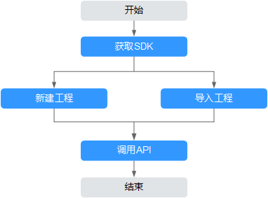

## 前提条件<a name="zh-cn_topic_0184564526_section1495121117502"></a>

-   已获取API的域名、ID、请求url、请求方法、AppKey和AppSecret等信息，具体参见[认证前准备](认证前准备.md#dayu_06_1003)。
-   已安装Eclipse 3.6.0或以上版本，如果未安装，请至[Eclipse官方网站](https://www.eclipse.org/downloads/)下载。

-   已安装Java Development Kit 1.8.111或以上版本，如果未安装，请至[Oracle官方下载页面](https://www.oracle.com/technetwork/java/javase/downloads/index.html)下载。

## 获取SDK<a name="zh-cn_topic_0184564526_section17783814506"></a>

请访问https://apig.$\{OBS服务的域名\}/apig-sdk/ApiGateway-java-sdk.zip下载SDK。

其中，$\{OBS服务的域名\}需要根据实际情况进行替换，请向管理员获取OBS服务的域名。

[下载SDK](https://obs.cn-north-1.myhuaweicloud.com/apig-sdk/ApiGateway-java-sdk.zip)，获取“ApiGateway-java-sdk.zip”压缩包，解压后目录结构如下：

<a name="zh-cn_topic_0184564526_table98162204301"></a>
<table><thead align="left"><tr id="zh-cn_topic_0184564526_row38171220113013"><th class="cellrowborder" valign="top" width="35%" id="mcps1.1.3.1.1"><p id="zh-cn_topic_0184564526_p08202020163012"><a name="zh-cn_topic_0184564526_p08202020163012"></a><a name="zh-cn_topic_0184564526_p08202020163012"></a>名称</p>
</th>
<th class="cellrowborder" valign="top" width="65%" id="mcps1.1.3.1.2"><p id="zh-cn_topic_0184564526_p18211420183016"><a name="zh-cn_topic_0184564526_p18211420183016"></a><a name="zh-cn_topic_0184564526_p18211420183016"></a>说明</p>
</th>
</tr>
</thead>
<tbody><tr id="zh-cn_topic_0184564526_row1912105616316"><td class="cellrowborder" valign="top" width="35%" headers="mcps1.1.3.1.1 "><p id="zh-cn_topic_0184564526_p198891221343"><a name="zh-cn_topic_0184564526_p198891221343"></a><a name="zh-cn_topic_0184564526_p198891221343"></a>libs\</p>
</td>
<td class="cellrowborder" valign="top" width="65%" headers="mcps1.1.3.1.2 "><p id="zh-cn_topic_0184564526_p23841381245"><a name="zh-cn_topic_0184564526_p23841381245"></a><a name="zh-cn_topic_0184564526_p23841381245"></a>SDK依赖库</p>
</td>
</tr>
<tr id="zh-cn_topic_0184564526_row178221920163017"><td class="cellrowborder" valign="top" width="35%" headers="mcps1.1.3.1.1 "><p id="zh-cn_topic_0184564526_p382210203300"><a name="zh-cn_topic_0184564526_p382210203300"></a><a name="zh-cn_topic_0184564526_p382210203300"></a>libs\java-sdk-core-<em id="zh-cn_topic_0184564526_i92446411116"><a name="zh-cn_topic_0184564526_i92446411116"></a><a name="zh-cn_topic_0184564526_i92446411116"></a>x.x.x</em>.jar</p>
</td>
<td class="cellrowborder" valign="top" width="65%" headers="mcps1.1.3.1.2 "><p id="zh-cn_topic_0184564526_p128221420133013"><a name="zh-cn_topic_0184564526_p128221420133013"></a><a name="zh-cn_topic_0184564526_p128221420133013"></a>SDK包</p>
</td>
</tr>
<tr id="zh-cn_topic_0184564526_row1773122811302"><td class="cellrowborder" valign="top" width="35%" headers="mcps1.1.3.1.1 "><p id="zh-cn_topic_0184564526_p1477432818308"><a name="zh-cn_topic_0184564526_p1477432818308"></a><a name="zh-cn_topic_0184564526_p1477432818308"></a>src\com\apig\sdk\demo\Main.java</p>
</td>
<td class="cellrowborder" rowspan="3" valign="top" width="65%" headers="mcps1.1.3.1.2 "><p id="zh-cn_topic_0184564526_p19774132816301"><a name="zh-cn_topic_0184564526_p19774132816301"></a><a name="zh-cn_topic_0184564526_p19774132816301"></a>使用SDK签名请求示例代码</p>
</td>
</tr>
<tr id="zh-cn_topic_0184564526_row199561746153713"><td class="cellrowborder" valign="top" headers="mcps1.1.3.1.1 "><p id="zh-cn_topic_0184564526_p1095624612373"><a name="zh-cn_topic_0184564526_p1095624612373"></a><a name="zh-cn_topic_0184564526_p1095624612373"></a>src\com\apig\sdk\demo\OkHttpDemo.java</p>
</td>
</tr>
<tr id="zh-cn_topic_0184564526_row916312118475"><td class="cellrowborder" valign="top" headers="mcps1.1.3.1.1 "><p id="zh-cn_topic_0184564526_p2046151274714"><a name="zh-cn_topic_0184564526_p2046151274714"></a><a name="zh-cn_topic_0184564526_p2046151274714"></a>src\com\apig\sdk\demo\LargeFileUploadDemo.java</p>
</td>
</tr>
<tr id="zh-cn_topic_0184564526_row12695181925314"><td class="cellrowborder" valign="top" width="35%" headers="mcps1.1.3.1.1 "><p id="zh-cn_topic_0184564526_p890412529412"><a name="zh-cn_topic_0184564526_p890412529412"></a><a name="zh-cn_topic_0184564526_p890412529412"></a>.classpath</p>
</td>
<td class="cellrowborder" rowspan="2" valign="top" width="65%" headers="mcps1.1.3.1.2 "><p id="zh-cn_topic_0184564526_p1567581212518"><a name="zh-cn_topic_0184564526_p1567581212518"></a><a name="zh-cn_topic_0184564526_p1567581212518"></a>Java工程配置文件</p>
<p id="zh-cn_topic_0184564526_p3675612956"><a name="zh-cn_topic_0184564526_p3675612956"></a><a name="zh-cn_topic_0184564526_p3675612956"></a></p>
</td>
</tr>
<tr id="zh-cn_topic_0184564526_row1333210560419"><td class="cellrowborder" valign="top" headers="mcps1.1.3.1.1 "><p id="zh-cn_topic_0184564526_p1033320561542"><a name="zh-cn_topic_0184564526_p1033320561542"></a><a name="zh-cn_topic_0184564526_p1033320561542"></a>.project</p>
</td>
</tr>
</tbody>
</table>

如果使用maven构建，SDK包中“java-sdk-core-_x.x.x_.jar”的maven仓库地址为[https://mirrors.huaweicloud.com/repository/maven/huaweicloudsdk/](https://mirrors.huaweicloud.com/repository/maven/huaweicloudsdk/)，配置maven源的方法可参见[https://bbs.huaweicloud.com/forum/forum.php?mod=viewthread&tid=1779](https://bbs.huaweicloud.com/forum/forum.php?mod=viewthread&tid=1779)。

加入java-sdk-core依赖的maven配置项为：

```
<dependency>
    <groupId>com.huawei.apigateway</groupId>
    <artifactId>java-sdk-core</artifactId>
    <version>3.0.10</version>
</dependency>
```

## 导入工程<a name="zh-cn_topic_0184564526_section061754619387"></a>

1.  打开Eclipse，在菜单栏选择“File \> Import”。

    弹出“Import”对话框。

2.  选择“General \> Existing Projects into Workspace”，单击“Next”。

    弹出“Import Projects”对话框。

    **图 2**  Import<a name="zh-cn_topic_0184564526_fig1587782216539"></a>  
    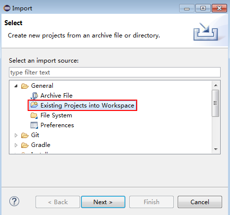

3.  单击“Browse”，在弹出的对话框中选择解压后的SDK路径。

    **图 3**  选择demo工程<a name="zh-cn_topic_0184564526_fig18558104413532"></a>  
    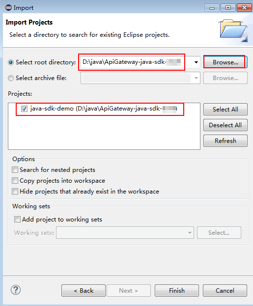

4.  单击“Finish”，完成工程导入。

    最终工程目录结构如下：

    **图 4**  导入工程的目录结构<a name="zh-cn_topic_0184564526_fig219304617569"></a>  
    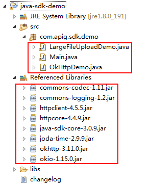

    “Main.java”为示例代码，请根据实际情况修改参数后使用。具体代码说明请参考[调用API示例](#zh-cn_topic_0184564526_section062317297163)。


## 新建工程<a name="zh-cn_topic_0184564526_section36222467389"></a>

1.  打开Eclipse，在菜单栏选择“File \> New \> Java Project”。

    弹出“New Java Project”对话框。

2.  自定义“Project name”，以“java-sdk-demo”为例，其他参数保持默认，单击“Finish”。

    **图 5**  新建工程<a name="zh-cn_topic_0184564526_fig1718113018573"></a>  
    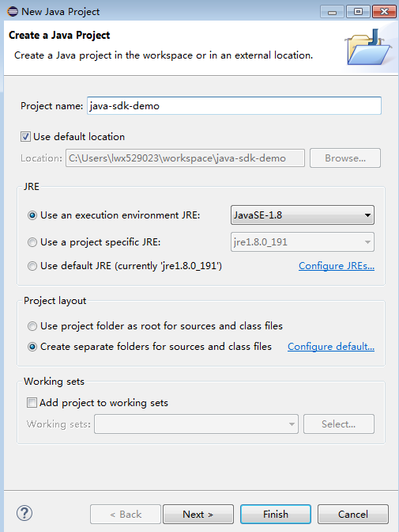

3.  导入API Gateway Java SDK的“jar”文件。
    1.  选择“java-sdk-demo”，单击鼠标右键，选择“Build Path \> Add External Archives”。

        **图 6**  导入jar文件<a name="zh-cn_topic_0184564526_fig1612011120577"></a>  
        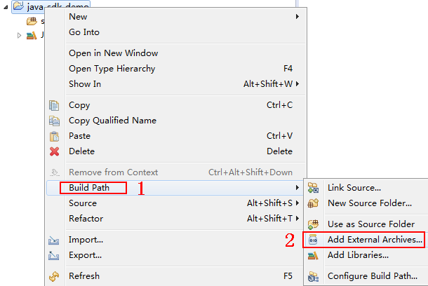

    2.  选择SDK中“\\libs”目录下所有以“jar”结尾的文件，单击“打开”。

        **图 7**  选择jar文件<a name="zh-cn_topic_0184564526_fig20262132311591"></a>  
        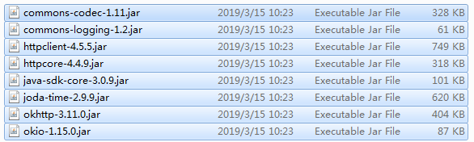

4.  新建“Package”及“Main”文件。
    1.  选择“src”，单击鼠标右键，选择“New \> Package”。

        **图 8**  新建Package<a name="zh-cn_topic_0184564526_fig125083812596"></a>  
        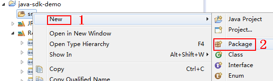

    2.  在“Name”中输入“com.apig.sdk.demo”。

        **图 9**  设置Package的名称<a name="zh-cn_topic_0184564526_fig2429639904"></a>  
        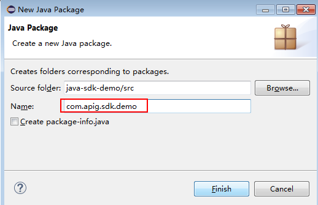

    3.  单击“Finish”。

        完成“Package”的创建。

    4.  选择“com.apig.sdk.demo”，单击鼠标右键，选择“New \> Class”。

        **图 10**  新建Class<a name="zh-cn_topic_0184564526_fig11463758307"></a>  
        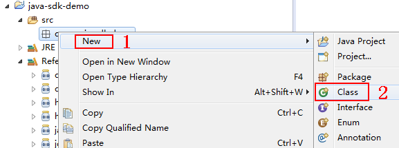

    5.  在“Name”中输入“Main”，勾选“public static void main\(String\[\] args\)”。

        **图 11**  设置Class的配置<a name="zh-cn_topic_0184564526_fig155657101116"></a>  
        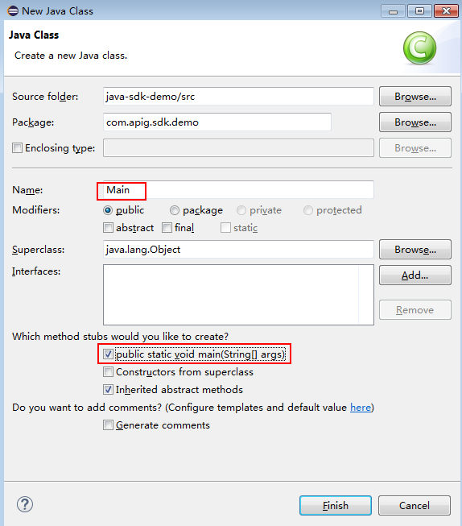

    6.  单击“Finish”。

        完成“Main”文件的创建。

5.  完成工程创建后，最终目录结构如下。

    **图 12**  新建工程的目录结构<a name="zh-cn_topic_0184564526_fig4114441519"></a>  
    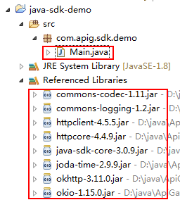

    “Main.java”无法直接使用，请根据实际情况参考[调用API示例](#zh-cn_topic_0184564526_section062317297163)输入所需代码。


## 调用API示例<a name="zh-cn_topic_0184564526_section062317297163"></a>

> **说明：**   
>-   示例演示如何访问发布的API。  
>-   您需要在数据服务控制台自行创建和发布一个API。创建及发布API的步骤请参见《DAYU用户指南》。  
>-   示例API的后端为打桩的HTTP服务，此后端返回一个“200”响应码及“Congratulations, sdk demo is running”消息体。  

1.  在“Main.java”中加入以下引用。

    ```
    import java.io.IOException;
    import javax.net.ssl.SSLContext;
    
    import org.apache.http.Header;
    import org.apache.http.HttpEntity;
    import org.apache.http.HttpResponse;
    import org.apache.http.client.methods.HttpRequestBase;
    import org.apache.http.conn.ssl.AllowAllHostnameVerifier;
    import org.apache.http.conn.ssl.SSLConnectionSocketFactory;
    import org.apache.http.conn.ssl.SSLContexts;
    import org.apache.http.conn.ssl.TrustSelfSignedStrategy;
    import org.apache.http.impl.client.CloseableHttpClient; 
    import org.apache.http.impl.client.HttpClients; 
    import org.apache.http.util.EntityUtils; 
    
    import com.cloud.apigateway.sdk.utils.Client; 
    import com.cloud.apigateway.sdk.utils.Request;
    ```

2.  创建request，过程中需要用到如下参数。

    -   AppKey：通过[认证前准备](认证前准备.md#dayu_06_1003)获取。根据实际情况填写，示例代码使用“4f5f626b-073f-402f-a1e0-e52171c6100c”作为样例。
    -   AppSecret：通过[认证前准备](认证前准备.md#dayu_06_1003)获取。根据实际情况填写，示例代码使用“\*\*\*\*\*\*”作为样例。
    -   Method：请求的方法名。根据API实际情况填写，示例代码使用“POST”作为样例。
    -   url：请求的url，不包含QueryString及fragment部分。域名部分请使用API所在的分组绑定的您自己的独立域名。示例代码使用“http://c967a237-cd6c-470e-906f-a8655461897e.apigw.cn-north-1.huaweicloud.com/java-sdk”“http://serviceEndpoint/java-sdk”作为样例。
    -   queryString: url携带参数的部分，根据API实际情况填写。支持的字符集为\[0-9a-zA-Z./;\[\]\\-=\~\#%^&\_+: "\]。示例代码使用“name=value”作为样例。
    -   header：请求的头域。根据API实际情况填写，不支持中文和下划线。示例代码使用“Content-Type:text/plain”作为样例。其中所访问API的ID为必填项，需要填入具体的ID信息，示例代码如“x-api-id”作为样例。
    -   body：请求的正文。根据API实际情况填写，示例代码使用“demo”作为样例。

    样例代码如下：

    ```
            Request request = new Request();
            try
            {
                request.setKey("4f5f626b-073f-402f-a1e0-e52171c6100c"); //创建应用时得到
                request.setSecret("*****"); //创建应用时得到
                request.setMethod("POST");
                request.setUrl("http://c967a237-cd6c-470e-906f-a8655461897e.apigw.cn-north-1.huaweicloud.comserviceEndpoint/java-sdk");
                 //url地址在创建API分组时得到
                request.addQueryStringParam("name", "value");
                request.addHeader("x-api-id","**********");
                request.addHeader("Content-Type", "text/plain");
                //request.addHeader("x-stage", "publish_env_name"); //如果API发布到非RELEASE环境，需要增加自定义的环境名称
                request.setBody("demo");
            } catch (Exception e)
            {
                e.printStackTrace();
                return;
            }
    ```

3.  对请求进行签名、新增x-Authorization头、访问API并打印结果：

    样例代码如下：

    ```
            CloseableHttpClient client = null;
            try
            {
                HttpRequestBase signedRequest = Client.sign(request);
                Header[] authorization = signedRequest.getHeaders("Authorization");
                signedRequest.addHeader("x-Authorization",authorization[0].getValue());
    
                client = HttpClients.custom().build();
                HttpResponse response = client.execute(signedRequest);
                System.out.println(response.getStatusLine().toString());
                Header[] resHeaders = response.getAllHeaders();
                for (Header h : resHeaders)
                {
                    System.out.println(h.getName() + ":" + h.getValue());
                }
                HttpEntity resEntity = response.getEntity();
                if (resEntity != null)
                {
                    System.out.println(System.getProperty("line.separator") + EntityUtils.toString(resEntity, "UTF-8"));
                }
    
            } catch (Exception e)
            {
                e.printStackTrace();
            } finally
            {
                try
                {
                    if (client != null)
                    {
                        client.close();
                    }
                } catch (IOException e)
                {
                    e.printStackTrace();
                }
            }
    ```

4.  选择“Main.java”，单击鼠标右键，选择“Run As \> Java Application”，运行工程测试代码。

    **图 13**  运行工程测试代码<a name="zh-cn_topic_0184564526_fig325211321720"></a>  
    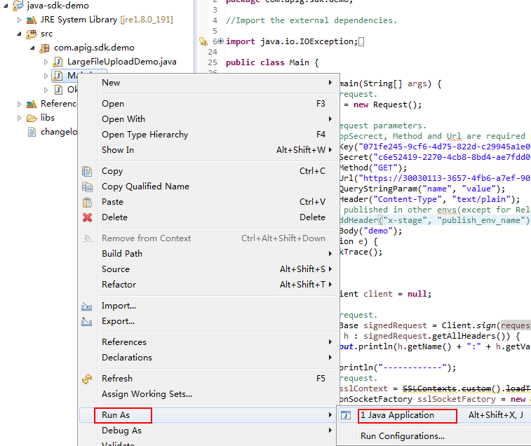

5.  在“Console”页签，查看运行结果。

    **图 14**  调用成功后的返回信息<a name="zh-cn_topic_0184564526_fig1026818194912"></a>  
    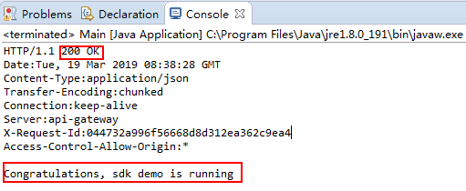


