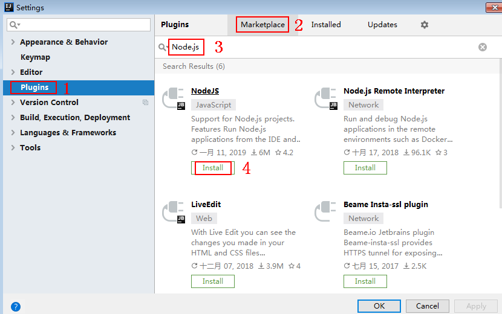
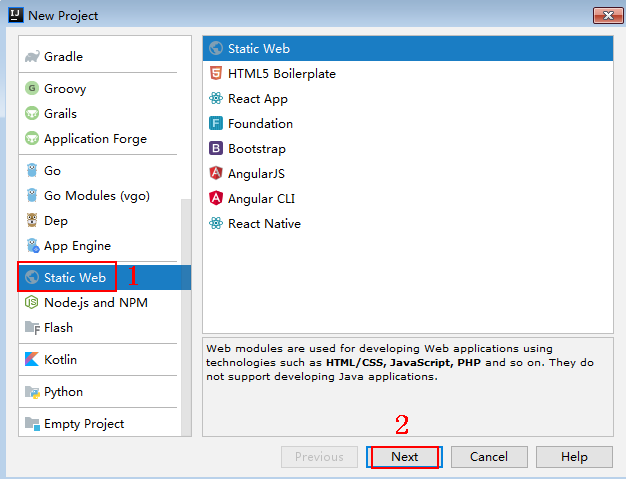
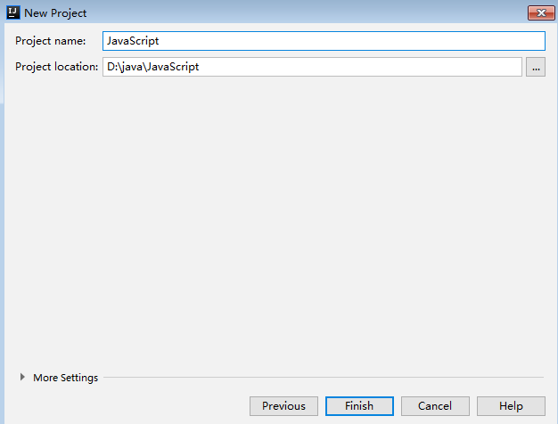
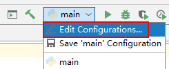
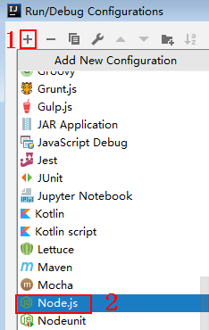
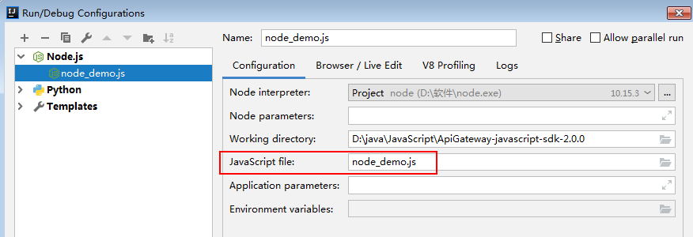

# JavaScript<a name="dayu_06_1008"></a>

## 操作场景<a name="zh-cn_topic_0184564508_section18586174761315"></a>

使用JavaScript语言调用APP认证的API时，您需要先获取SDK，然后新建工程，最后参考API调用示例调用API。

本章节以IntelliJ IDEA 2018.3.5版本、搭建Node.js开发环境为例介绍。

## 准备环境<a name="zh-cn_topic_0184564508_section1495121117502"></a>

-   已获取API的域名、请求url、请求方法、AppKey和AppSecret等信息，具体参见[认证前准备](认证前准备.md#dayu_06_1003)。
-   获取并安装Nodejs安装包，如果未安装，请至[Nodejs官方下载页面](https://nodejs.org/en/)下载。

    Nodejs安装后，在命令行中，用npm安装“moment”和“moment-timezone”模块。

    ```
    npm install moment --save
    npm install moment-timezone --save
    ```

-   获取并安装IntelliJ IDEA，如果未安装，请至[IntelliJ IDEA官方网站](https://www.jetbrains.com/idea/)下载。
-   已在IntelliJ IDEA中安装NodeJS插件，如果未安装，请按照[图1](#zh-cn_topic_0184564508_fig174515063115)所示安装。

    **图 1**  安装NodeJS插件<a name="zh-cn_topic_0184564508_fig174515063115"></a>  
    


## 获取SDK<a name="zh-cn_topic_0184564508_section17783814506"></a>

请访问https://apig.$\{OBS服务的域名\}/apig-sdk/ApiGateway-javascript-sdk.zip下载SDK。

其中，$\{OBS服务的域名\}需要根据实际情况进行替换，请向管理员获取OBS服务的域名。

[下载SDK](https://obs.cn-north-1.myhuaweicloud.com/apig-sdk/ApiGateway-javascript-sdk.zip)，获取“ApiGateway-javascript-sdk.zip”压缩包，解压后目录结构如下：

<a name="zh-cn_topic_0184564508_table98162204301"></a>
<table><thead align="left"><tr id="zh-cn_topic_0184564508_row38171220113013"><th class="cellrowborder" valign="top" width="35%" id="mcps1.1.3.1.1"><p id="zh-cn_topic_0184564508_p08202020163012"><a name="zh-cn_topic_0184564508_p08202020163012"></a><a name="zh-cn_topic_0184564508_p08202020163012"></a>名称</p>
</th>
<th class="cellrowborder" valign="top" width="65%" id="mcps1.1.3.1.2"><p id="zh-cn_topic_0184564508_p18211420183016"><a name="zh-cn_topic_0184564508_p18211420183016"></a><a name="zh-cn_topic_0184564508_p18211420183016"></a>说明</p>
</th>
</tr>
</thead>
<tbody><tr id="zh-cn_topic_0184564508_row13962924163615"><td class="cellrowborder" valign="top" width="35%" headers="mcps1.1.3.1.1 "><p id="zh-cn_topic_0184564508_p39620243363"><a name="zh-cn_topic_0184564508_p39620243363"></a><a name="zh-cn_topic_0184564508_p39620243363"></a>signer.js</p>
</td>
<td class="cellrowborder" valign="top" width="65%" headers="mcps1.1.3.1.2 "><p id="zh-cn_topic_0184564508_p1962424183613"><a name="zh-cn_topic_0184564508_p1962424183613"></a><a name="zh-cn_topic_0184564508_p1962424183613"></a>SDK代码</p>
</td>
</tr>
<tr id="zh-cn_topic_0184564508_row756816379373"><td class="cellrowborder" valign="top" width="35%" headers="mcps1.1.3.1.1 "><p id="zh-cn_topic_0184564508_p1956823703720"><a name="zh-cn_topic_0184564508_p1956823703720"></a><a name="zh-cn_topic_0184564508_p1956823703720"></a>node_demo.js</p>
</td>
<td class="cellrowborder" valign="top" width="65%" headers="mcps1.1.3.1.2 "><p id="zh-cn_topic_0184564508_p55681737183719"><a name="zh-cn_topic_0184564508_p55681737183719"></a><a name="zh-cn_topic_0184564508_p55681737183719"></a>Nodejs示例代码</p>
</td>
</tr>
<tr id="zh-cn_topic_0184564508_row550204388"><td class="cellrowborder" valign="top" width="35%" headers="mcps1.1.3.1.1 "><p id="zh-cn_topic_0184564508_p12959202163811"><a name="zh-cn_topic_0184564508_p12959202163811"></a><a name="zh-cn_topic_0184564508_p12959202163811"></a>demo.html</p>
</td>
<td class="cellrowborder" valign="top" width="65%" headers="mcps1.1.3.1.2 "><p id="zh-cn_topic_0184564508_p9959192103812"><a name="zh-cn_topic_0184564508_p9959192103812"></a><a name="zh-cn_topic_0184564508_p9959192103812"></a>浏览器示例代码</p>
</td>
</tr>
<tr id="zh-cn_topic_0184564508_row995962113810"><td class="cellrowborder" valign="top" width="35%" headers="mcps1.1.3.1.1 "><p id="zh-cn_topic_0184564508_p7709625103810"><a name="zh-cn_topic_0184564508_p7709625103810"></a><a name="zh-cn_topic_0184564508_p7709625103810"></a>demo_require.html</p>
</td>
<td class="cellrowborder" valign="top" width="65%" headers="mcps1.1.3.1.2 "><p id="zh-cn_topic_0184564508_p1122314336386"><a name="zh-cn_topic_0184564508_p1122314336386"></a><a name="zh-cn_topic_0184564508_p1122314336386"></a>浏览器示例代码（使用require加载）</p>
</td>
</tr>
<tr id="zh-cn_topic_0184564508_row9584161917371"><td class="cellrowborder" valign="top" width="35%" headers="mcps1.1.3.1.1 "><p id="zh-cn_topic_0184564508_p9584111943715"><a name="zh-cn_topic_0184564508_p9584111943715"></a><a name="zh-cn_topic_0184564508_p9584111943715"></a>test.js</p>
</td>
<td class="cellrowborder" valign="top" width="65%" headers="mcps1.1.3.1.2 "><p id="zh-cn_topic_0184564508_p158414193378"><a name="zh-cn_topic_0184564508_p158414193378"></a><a name="zh-cn_topic_0184564508_p158414193378"></a>测试用例</p>
</td>
</tr>
<tr id="zh-cn_topic_0184564508_row178221920163017"><td class="cellrowborder" valign="top" width="35%" headers="mcps1.1.3.1.1 "><p id="zh-cn_topic_0184564508_p3696154093414"><a name="zh-cn_topic_0184564508_p3696154093414"></a><a name="zh-cn_topic_0184564508_p3696154093414"></a>js\hmac-sha256.js</p>
</td>
<td class="cellrowborder" rowspan="3" valign="top" width="65%" headers="mcps1.1.3.1.2 "><p id="zh-cn_topic_0184564508_p3401189352"><a name="zh-cn_topic_0184564508_p3401189352"></a><a name="zh-cn_topic_0184564508_p3401189352"></a>依赖库</p>
</td>
</tr>
<tr id="zh-cn_topic_0184564508_row3826132015303"><td class="cellrowborder" valign="top" headers="mcps1.1.3.1.1 "><p id="zh-cn_topic_0184564508_p7837724163519"><a name="zh-cn_topic_0184564508_p7837724163519"></a><a name="zh-cn_topic_0184564508_p7837724163519"></a>js\moment.min.js</p>
</td>
</tr>
<tr id="zh-cn_topic_0184564508_row1773122811302"><td class="cellrowborder" valign="top" headers="mcps1.1.3.1.1 "><p id="zh-cn_topic_0184564508_p8382226123517"><a name="zh-cn_topic_0184564508_p8382226123517"></a><a name="zh-cn_topic_0184564508_p8382226123517"></a>js\moment-timezone-with-data.min.js</p>
</td>
</tr>
<tr id="zh-cn_topic_0184564508_row1619714201363"><td class="cellrowborder" valign="top" width="35%" headers="mcps1.1.3.1.1 "><p id="zh-cn_topic_0184564508_p12721814113211"><a name="zh-cn_topic_0184564508_p12721814113211"></a><a name="zh-cn_topic_0184564508_p12721814113211"></a>licenses\license-crypto-js</p>
</td>
<td class="cellrowborder" rowspan="4" valign="top" width="65%" headers="mcps1.1.3.1.2 "><p id="zh-cn_topic_0184564508_p0358153317314"><a name="zh-cn_topic_0184564508_p0358153317314"></a><a name="zh-cn_topic_0184564508_p0358153317314"></a>第三方库license文件</p>
</td>
</tr>
<tr id="zh-cn_topic_0184564508_row18759171553612"><td class="cellrowborder" valign="top" headers="mcps1.1.3.1.1 "><p id="zh-cn_topic_0184564508_p8759715163615"><a name="zh-cn_topic_0184564508_p8759715163615"></a><a name="zh-cn_topic_0184564508_p8759715163615"></a>licenses\license-moment</p>
</td>
</tr>
<tr id="zh-cn_topic_0184564508_row132591118133612"><td class="cellrowborder" valign="top" headers="mcps1.1.3.1.1 "><p id="zh-cn_topic_0184564508_p92591184367"><a name="zh-cn_topic_0184564508_p92591184367"></a><a name="zh-cn_topic_0184564508_p92591184367"></a>licenses\license-moment-timezone</p>
</td>
</tr>
<tr id="zh-cn_topic_0184564508_row1258713135363"><td class="cellrowborder" valign="top" headers="mcps1.1.3.1.1 "><p id="zh-cn_topic_0184564508_p175872013143610"><a name="zh-cn_topic_0184564508_p175872013143610"></a><a name="zh-cn_topic_0184564508_p175872013143610"></a>licenses\license-node</p>
</td>
</tr>
</tbody>
</table>

## 创建工程<a name="zh-cn_topic_0184564508_section775684822310"></a>

1.  打开IntelliJ IDEA，选择菜单“File \> New \> Project”。

    弹出“New Project”对话框。选择“Static Web”，单击“Next”。

    **图 2**  New Project<a name="zh-cn_topic_0184564508_fig1981655175910"></a>  
    

2.  单击“...”，在弹出的对话框中选择解压后的SDK路径，单击“Finish”。

    **图 3**  选择解压后的SDK路径<a name="zh-cn_topic_0184564508_fig125569864"></a>  
    

3.  完成工程创建后，目录结构如下。

    **图 4**  新建工程的目录结构<a name="zh-cn_topic_0184564508_fig161531134161313"></a>  
    

    -   node\_demo.js：Nodejs示例代码，请根据实际情况修改参数后使用。具体代码说明请参考[调用API（Node.js）示例](#zh-cn_topic_0184564508_section933141732413)。

4.  单击“Edit Configurations”，弹出“Run/Debug Configurations”对话框。

    **图 5**  Edit Configurations<a name="zh-cn_topic_0184564508_fig1348114312371"></a>  
    

5.  单击“+”，选择“Node.js”。

    **图 6**  选择Node.js<a name="zh-cn_topic_0184564508_fig18901915104410"></a>  
    

6.  “JavaScript file”选择“node\_demo.js”，单击“OK”，完成配置。

    **图 7**  选择node\_demo.js<a name="zh-cn_topic_0184564508_fig192185131412"></a>  
    


## 调用API（Node.js）示例<a name="zh-cn_topic_0184564508_section933141732413"></a>

1.  在工程中引入signer.js。

    ```
    var signer = require('./signer')
    var http = require('http')
    ```

2.  生成一个新的Signer，填入AppKey和AppSecret。

    ```
    var sig = new signer.Signer()
    sig.Key = "4f5f626b-073f-402f-a1e0-e52171c6100c"
    sig.Secret = "******"
    ```

3.  生成一个Request对象，指定方法名、请求uri和body。

    ```
    var r = new signer.HttpRequest("POST", "c967a237-cd6c-470e-906f-a8655461897e.apigw.cn-north-1.huaweicloud.comserviceEndpoint/app1?a=1");
    r.body = '{"a":1}'
    ```

4.  给请求添加header头，内容为具体参数数据。如有需要，添加需要签名的其他头域。其中所访问API的ID为必填项，需要填入具体的ID信息，示例代码如“x-api-id”作为样例。

    ```
    r.headers = { "x-stage":"RELEASE", "x-api-id": "*******"}
    ```

5.  进行签名，执行此函数会生成请求参数，用于创建http\(s\)请求，请求参数中添加了用于签名的X-Sdk-Date头和Authorization头。然后为请求参数添加x-Authorization头，值与Authorization头相同。

    ```
    var opt = sig.Sign(r)
    opt.headers["x-Authorization"] = opt.headers["Authorization"]
    ```

6.  访问API，查看访问结果。如果使用https访问，则将“http.request”改为“https.request”。

    ```
    var req=http.request(opt, function(res){
            console.log(res.statusCode)  
            res.on("data",	function(chunk){
    		console.log(chunk.toString())
    	})
    })
    req.on("error",function(err){
    	console.log(err.message)
    })
    req.write(r.body)
    req.end()
    ```


