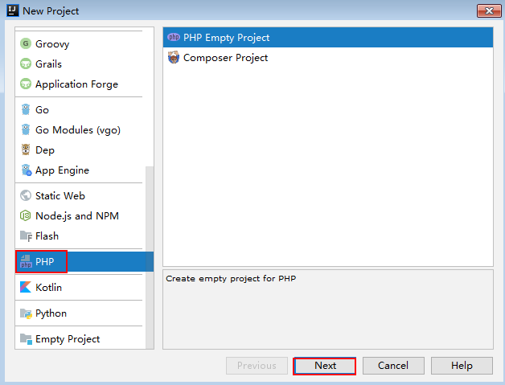
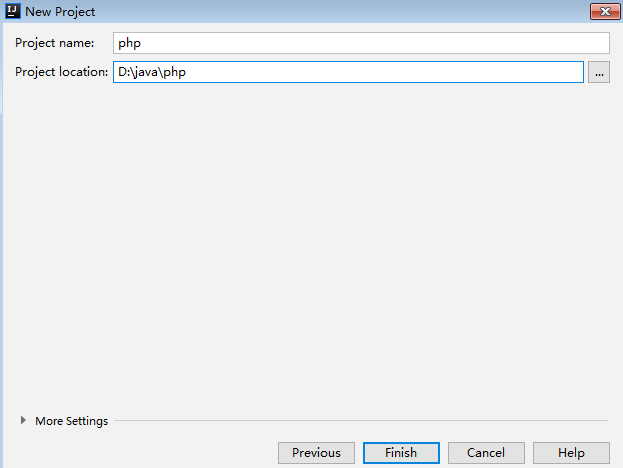
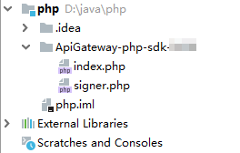

# PHP<a name="dayu_06_1009"></a>

## 操作场景<a name="zh-cn_topic_0184564503_section18586174761315"></a>

使用PHP语言调用APP认证的API时，您需要先获取SDK，然后新建工程，最后参考[调用API示例](#zh-cn_topic_0184564503_section182201947142417)调用API。

本章节以IntelliJ IDEA 2018.3.5版本为例介绍。

## 准备环境<a name="zh-cn_topic_0184564503_section1495121117502"></a>

-   已获取API的域名、请求url、请求方法、AppKey和AppSecret等信息，具体参见[认证前准备](认证前准备.md#dayu_06_1003)。
-   获取并安装IntelliJ IDEA，如果未安装，请至[IntelliJ IDEA官方网站](https://www.jetbrains.com/idea/)下载。
-   获取并安装PHP安装包，如果未安装，请至[PHP官方下载页面](https://windows.php.net/download/)下载。
-   将PHP安装目录中的“php.ini-production”文件复制到“C:\\windows”，改名为“php.ini”，并在文件中增加如下内容。

    ```
    extension_dir = "php安装目录/ext"
    extension=openssl
    extension=curl
    ```

-   已在IntelliJ IDEA中安装PHP插件，如果未安装，请按照[图1](#zh-cn_topic_0184564503_fig1271514384912)所示安装。

    **图 1**  安装PHP插件<a name="zh-cn_topic_0184564503_fig1271514384912"></a>  
    


## 获取SDK<a name="zh-cn_topic_0184564503_section17783814506"></a>

请访问https://apig.$\{OBS服务的域名\}/apig-sdk/ApiGateway-php-sdk.zip下载SDK。

其中，$\{OBS服务的域名\}需要根据实际情况进行替换，请向管理员获取OBS服务的域名。

[下载SDK](https://obs.cn-north-1.myhuaweicloud.com/apig-sdk/ApiGateway-php-sdk.zip)，获取“ApiGateway-php-sdk.zip”压缩包，解压后目录结构如下：

<a name="zh-cn_topic_0184564503_table98162204301"></a>
<table><thead align="left"><tr id="zh-cn_topic_0184564503_row38171220113013"><th class="cellrowborder" valign="top" width="35%" id="mcps1.1.3.1.1"><p id="zh-cn_topic_0184564503_p08202020163012"><a name="zh-cn_topic_0184564503_p08202020163012"></a><a name="zh-cn_topic_0184564503_p08202020163012"></a>名称</p>
</th>
<th class="cellrowborder" valign="top" width="65%" id="mcps1.1.3.1.2"><p id="zh-cn_topic_0184564503_p18211420183016"><a name="zh-cn_topic_0184564503_p18211420183016"></a><a name="zh-cn_topic_0184564503_p18211420183016"></a>说明</p>
</th>
</tr>
</thead>
<tbody><tr id="zh-cn_topic_0184564503_row13962924163615"><td class="cellrowborder" valign="top" width="35%" headers="mcps1.1.3.1.1 "><p id="zh-cn_topic_0184564503_p39620243363"><a name="zh-cn_topic_0184564503_p39620243363"></a><a name="zh-cn_topic_0184564503_p39620243363"></a>signer.php</p>
</td>
<td class="cellrowborder" valign="top" width="65%" headers="mcps1.1.3.1.2 "><p id="zh-cn_topic_0184564503_p1962424183613"><a name="zh-cn_topic_0184564503_p1962424183613"></a><a name="zh-cn_topic_0184564503_p1962424183613"></a>SDK代码</p>
</td>
</tr>
<tr id="zh-cn_topic_0184564503_row756816379373"><td class="cellrowborder" valign="top" width="35%" headers="mcps1.1.3.1.1 "><p id="zh-cn_topic_0184564503_p1956823703720"><a name="zh-cn_topic_0184564503_p1956823703720"></a><a name="zh-cn_topic_0184564503_p1956823703720"></a>index.php</p>
</td>
<td class="cellrowborder" valign="top" width="65%" headers="mcps1.1.3.1.2 "><p id="zh-cn_topic_0184564503_p55681737183719"><a name="zh-cn_topic_0184564503_p55681737183719"></a><a name="zh-cn_topic_0184564503_p55681737183719"></a>示例代码</p>
</td>
</tr>
</tbody>
</table>

## 新建工程<a name="zh-cn_topic_0184564503_section553534182420"></a>

1.  打开IDEA，选择菜单“File \> New \> Project”。

    弹出“New Project”对话框，选择“PHP”，单击“Next”。

    **图 2**  New Project<a name="zh-cn_topic_0184564503_fig03501213165418"></a>  
    

2.  单击“...”，在弹出的对话框中选择解压后的SDK路径，单击“Finish”。

    **图 3**  选择解压后的SDK路径<a name="zh-cn_topic_0184564503_fig157461135515"></a>  
    

3.  完成工程创建后，目录结构如下。

    **图 4**  新建工程的目录结构<a name="zh-cn_topic_0184564503_fig19560422300"></a>  
    

    “signer.php”为示例代码，请根据实际情况修改参数后使用。具体代码说明请参考[调用API示例](#zh-cn_topic_0184564503_section182201947142417)。


## 调用API示例<a name="zh-cn_topic_0184564503_section182201947142417"></a>

1.  在代码中引入sdk。

    ```
    require 'signer.php';
    ```

2.  生成一个新的Signer， 填入AppKey和AppSecret。

    ```
    $signer = new Signer();
    $signer->Key = '4f5f626b-073f-402f-a1e0-e52171c6100c';
    $signer->Secret = "******";
    ```

3.  生成一个新的Request，指定方法名、请求url和body。

    ```
    $req = new Request('GET', "https://c967a237-cd6c-470e-906f-a8655461897e.apigw.cn-north-1.huaweicloud.comserviceEndpoint/app1?a=1");
    $req->body = '';
    ```

4.  给请求添加header头，内容为具体参数数据。如果有需要，添加需要签名的其他头域。其中所访问API的ID为必填项，需要填入具体的ID信息，示例代码如“x-api-id”作为样例。

    ```
    $req->headers = array(
        'x-stage' => 'RELEASE',
        'x-api-id'=> 'f9d56b010e5c34d9ff92a08bfa3d7fb5',
    );
    ```

5.  进行签名，执行此函数会生成一个$curl上下文变量。然后为请求添加x-Authorization头，值与Authorization头相同。

    ```
    $curl = $signer->Sign($req);
    $req->headers['x-Authorization'] = $req->headers['Authorization'];
    $header = array();
    foreach ($req->headers as $key => $value) {
        array_push($header, strtolower($key) . ':' . trim($value));
    }
    curl_setopt($curl, CURLOPT_HTTPHEADER, $header);
    ```

6.  访问API，查看访问结果。

    ```
    $response = curl_exec($curl);
    echo curl_getinfo($curl, CURLINFO_HTTP_CODE);
    echo $response;
    curl_close($curl);
    ```


