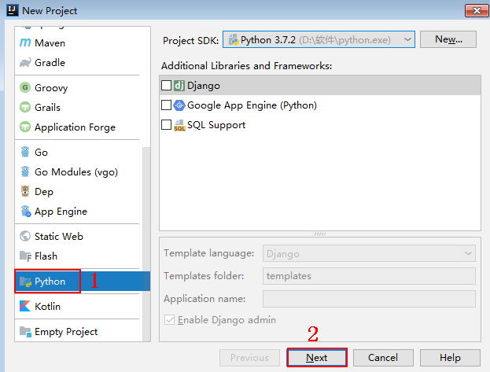
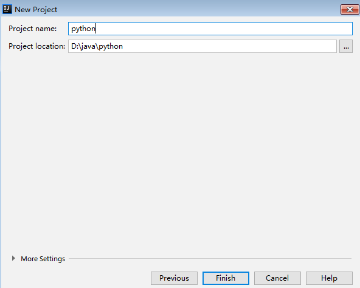
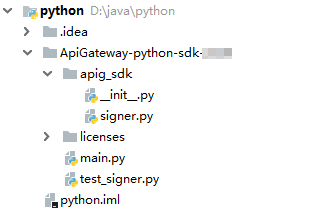

# Python<a name="dayu_06_1006"></a>

## 操作场景<a name="zh-cn_topic_0184564509_section18586174761315"></a>

使用Python语言调用APP认证的API时，您需要先获取SDK，然后新建工程，最后参考调用API示例调用API。

本章节以IntelliJ IDEA 2018.3.5版本为例介绍。

## 准备环境<a name="zh-cn_topic_0184564509_section1495121117502"></a>

-   已获取API的域名、请求url、请求方法、AppKey和AppSecret等信息，具体参见[认证前准备](认证前准备.md#dayu_06_1003)。
-   获取并安装Python安装包（可使用2.7.9+或3.X），如果未安装，请至[Python官方下载页面](https://www.python.org/downloads/)下载。

    Python安装完成后，在命令行中使用pip安装“requests”库。

    ```
    pip install requests
    ```

    > **说明：**   
    >如果pip安装requests遇到证书错误，请下载并使用Python执行[此文件](https://bootstrap.pypa.io/get-pip.py)，升级pip，然后再执行以上命令安装。  

-   获取并安装IntelliJ IDEA，如果未安装，请至[IntelliJ IDEA官方网站](https://www.jetbrains.com/idea/)下载。
-   已在IntelliJ IDEA中安装Python插件，如果未安装，请按照[图1](#zh-cn_topic_0184564509_fig174515063115)所示安装。

    **图 1**  安装Python插件<a name="zh-cn_topic_0184564509_fig174515063115"></a>  
    


## 获取SDK<a name="zh-cn_topic_0184564509_section17783814506"></a>

请访问https://apig.$\{OBS服务的域名\}/apig-sdk/ApiGateway-python-sdk.zip下载SDK。

其中，$\{OBS服务的域名\}需要根据实际情况进行替换，请向管理员获取OBS服务的域名。

[下载SDK](https://obs.cn-north-1.myhuaweicloud.com/apig-sdk/ApiGateway-python-sdk.zip)，获取“ApiGateway-python-sdk.zip”压缩包，解压后目录结构如下：

<a name="zh-cn_topic_0184564509_table98162204301"></a>
<table><thead align="left"><tr id="zh-cn_topic_0184564509_row38171220113013"><th class="cellrowborder" valign="top" width="35%" id="mcps1.1.3.1.1"><p id="zh-cn_topic_0184564509_p08202020163012"><a name="zh-cn_topic_0184564509_p08202020163012"></a><a name="zh-cn_topic_0184564509_p08202020163012"></a>名称</p>
</th>
<th class="cellrowborder" valign="top" width="65%" id="mcps1.1.3.1.2"><p id="zh-cn_topic_0184564509_p18211420183016"><a name="zh-cn_topic_0184564509_p18211420183016"></a><a name="zh-cn_topic_0184564509_p18211420183016"></a>说明</p>
</th>
</tr>
</thead>
<tbody><tr id="zh-cn_topic_0184564509_row178221920163017"><td class="cellrowborder" valign="top" width="35%" headers="mcps1.1.3.1.1 "><p id="zh-cn_topic_0184564509_p382210203300"><a name="zh-cn_topic_0184564509_p382210203300"></a><a name="zh-cn_topic_0184564509_p382210203300"></a>apig_sdk\__init__.py</p>
</td>
<td class="cellrowborder" rowspan="2" valign="top" width="65%" headers="mcps1.1.3.1.2 "><p id="zh-cn_topic_0184564509_p128221420133013"><a name="zh-cn_topic_0184564509_p128221420133013"></a><a name="zh-cn_topic_0184564509_p128221420133013"></a>SDK代码</p>
<p id="zh-cn_topic_0184564509_p17823720183010"><a name="zh-cn_topic_0184564509_p17823720183010"></a><a name="zh-cn_topic_0184564509_p17823720183010"></a></p>
</td>
</tr>
<tr id="zh-cn_topic_0184564509_row3826132015303"><td class="cellrowborder" valign="top" headers="mcps1.1.3.1.1 "><p id="zh-cn_topic_0184564509_p8463185417262"><a name="zh-cn_topic_0184564509_p8463185417262"></a><a name="zh-cn_topic_0184564509_p8463185417262"></a>apig_sdk\signer.py</p>
</td>
</tr>
<tr id="zh-cn_topic_0184564509_row1773122811302"><td class="cellrowborder" valign="top" width="35%" headers="mcps1.1.3.1.1 "><p id="zh-cn_topic_0184564509_p1477432818308"><a name="zh-cn_topic_0184564509_p1477432818308"></a><a name="zh-cn_topic_0184564509_p1477432818308"></a>main.py</p>
</td>
<td class="cellrowborder" valign="top" width="65%" headers="mcps1.1.3.1.2 "><p id="zh-cn_topic_0184564509_p19774132816301"><a name="zh-cn_topic_0184564509_p19774132816301"></a><a name="zh-cn_topic_0184564509_p19774132816301"></a>示例代码</p>
</td>
</tr>
<tr id="zh-cn_topic_0184564509_row1810381413307"><td class="cellrowborder" valign="top" width="35%" headers="mcps1.1.3.1.1 "><p id="zh-cn_topic_0184564509_p1010311417301"><a name="zh-cn_topic_0184564509_p1010311417301"></a><a name="zh-cn_topic_0184564509_p1010311417301"></a>backend_signature.py</p>
</td>
<td class="cellrowborder" valign="top" width="65%" headers="mcps1.1.3.1.2 "><p id="zh-cn_topic_0184564509_p910311147300"><a name="zh-cn_topic_0184564509_p910311147300"></a><a name="zh-cn_topic_0184564509_p910311147300"></a>后端签名示例代码</p>
</td>
</tr>
<tr id="zh-cn_topic_0184564509_row692919447393"><td class="cellrowborder" valign="top" width="35%" headers="mcps1.1.3.1.1 "><p id="zh-cn_topic_0184564509_p12721814113211"><a name="zh-cn_topic_0184564509_p12721814113211"></a><a name="zh-cn_topic_0184564509_p12721814113211"></a>licenses\license-requests</p>
</td>
<td class="cellrowborder" valign="top" width="65%" headers="mcps1.1.3.1.2 "><p id="zh-cn_topic_0184564509_p13744113282711"><a name="zh-cn_topic_0184564509_p13744113282711"></a><a name="zh-cn_topic_0184564509_p13744113282711"></a>第三方库license文件</p>
</td>
</tr>
</tbody>
</table>

## 新建工程<a name="zh-cn_topic_0184564509_section14553194417222"></a>

1.  打开IDEA，选择菜单“File \> New \> Project”。

    弹出“New Project”对话框，选择“Python”，单击“Next”。

    **图 2**  New Project<a name="zh-cn_topic_0184564509_fig24519673713"></a>  
    

2.  再次单击“Next”，弹出以下对话框。单击“...”，在弹出的对话框中选择解压后的SDK路径，单击“Finish”。

    **图 3**  选择解压后的SDK路径<a name="zh-cn_topic_0184564509_fig164447245463"></a>  
    

3.  完成工程创建后，目录结构如下。

    **图 4**  新建工程的目录结构<a name="zh-cn_topic_0184564509_fig152821237184917"></a>  
    

    “main.py”为示例代码，请根据实际情况修改参数后使用。具体代码说明请参考[调用API示例](#zh-cn_topic_0184564509_section1553717505225)。


## 调用API示例<a name="zh-cn_topic_0184564509_section1553717505225"></a>

1.  在工程中引入apig\_sdk。

    ```
    from apig_sdk import signer
    import requests
    ```

2.  生成一个新的Signer，填入AppKey和AppSecret。

    ```
    sig = signer.Signer()
    sig.Key = "4f5f626b-073f-402f-a1e0-e52171c6100c"
    sig.Secret = "******"
    ```

3.  生成一个Request对象，指定方法名、请求uri、header和body。其中所访问API的ID为必填项，需要填入具体的ID信息，示例代码如“x-api-id”作为样例。

    ```
    r = signer.HttpRequest("POST",
                           "https://c967a237-cd6c-470e-906f-a8655461897e.apigw.cn-north-1.huaweicloud.comserviceEndpoint/app1?a=1",
                           {"x-stage": "RELEASE", "x-api-id": "*********"},
                           "body")
    ```

4.  进行签名，执行此函数会在请求参数中添加用于签名的X-Sdk-Date头和Authorization头。然后为请求添加x-Authorization头，值与Authorization头相同。

    ```
    sig.Sign(r)
    r.headers["x-Authorization"] = r.headers["Authorization"]
    ```

5.  访问API，查看访问结果。

    ```
    resp = requests.request(r.method, r.scheme + "://" + r.host + r.uri, headers=r.headers, data=r.body)
    print(resp.status_code, resp.reason)
    print(resp.content)
    ```


