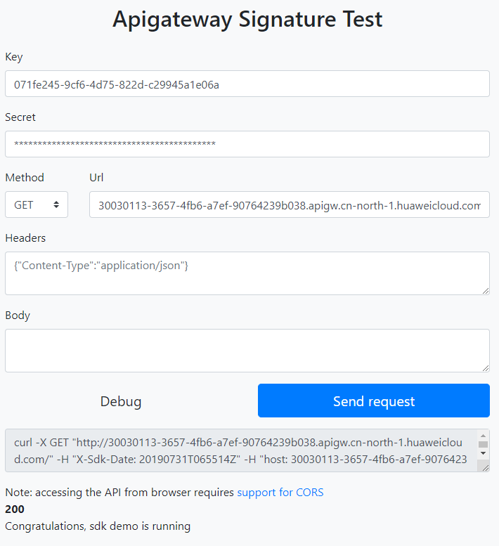

# curl<a name="dayu_06_1013"></a>

## 操作场景<a name="zh-cn_topic_0184564544_section18586174761315"></a>

使用curl命令调用APP认证的API时，您需要先下载JavaScript SDK生成curl命令，然后将curl命令复制到命令行调用API。

## 前提条件<a name="zh-cn_topic_0184564544_section9546443152513"></a>

已获取API的域名、请求url、请求方法、AppKey和AppSecret等信息，具体参见[认证前准备](认证前准备.md#dayu_06_1003)。

## 调用API示例<a name="zh-cn_topic_0184564544_section18450652112514"></a>

1.  使用JavaScript SDK生成curl命令。

    下载[JavaScript SDK](https://obs.cn-north-1.myhuaweicloud.com/apig-sdk/ApiGateway-javascript-sdk.zip)，并解压。在浏览器中打开demo.html，页面如下图所示。

    

2.  填入Key、Secret、方法名、请求协议、域名和url。例如：

    ```
    Key=4f5f626b-073f-402f-a1e0-e52171c6100c
    Secret=******
    Method=POST
    Url=https://30030113-3657-4fb6-a7ef-90764239b038.apigw.cn-north-1.huaweicloud.comserviceEndpoint
    ```

3.  填入json格式的Query和Headers，填入Body。
4.  单击“Send request”，生成curl命令。将curl命令复制到命令行，访问API。

    ```
    $ curl -X POST "https://30030113-3657-4fb6-a7ef-90764239b038.apigw.cn-north-1.huaweicloud.comserviceEndpoint/" -H "X-Sdk-Date: 20180530T115847Z" -H "Authorization: SDK-HMAC-SHA256 Access=071fe245-9cf6-4d75-822d-c29945a1e06a, SignedHeaders=host;x-sdk-date, Signature=9e5314bd156d517******dd3e5765fdde4" -d ""
    Congratulations, sdk demo is running
    ```


