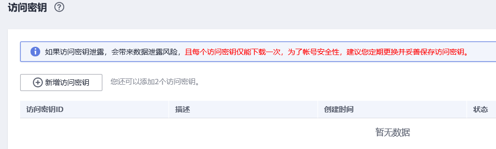

# 获取认证信息

## 获取访问密钥

您可以通过如下方式获取访问密钥。

1.  登录控制台，在用户名额下拉列表中选择“我的凭证”。
2.  进入“我的凭证“页面，选择“访问密钥 \> 新增访问密钥“，如[图1](#zh-cn_topic_0080205343_zh-cn_topic_0000001129241845_zh-cn_topic_0183643042_fig1552229194615)所示。

    **图 1**  单击新增访问密钥  
    

3.  单击“确定”，根据浏览器提示，保存密钥文件。密钥文件会直接保存到浏览器默认的下载文件夹中。打开名称为“credentials.csv”的文件，即可查看访问密钥（Access Key Id和Secret Access Key）。

## 获取项目ID和帐号ID

项目ID表示租户的资源，帐号ID对应当前帐号。用户可在对应页面下查看不同Region对应的项目ID和帐号ID。

1.  注册并登录管理控制台。
2.  在用户名的下拉列表中单击“我的凭证“。
3.  在“我的凭证“页面，查看帐号名和帐号ID，在项目列表中查看项目ID。

## 获取region和endpoint

终端节点（Endpoint）即调用API的**请求地址**，不同服务不同区域的终端节点不同。Endpoint您可以从[终端节点及区域说明](https://developer.huaweicloud.com/endpoint)获取。

