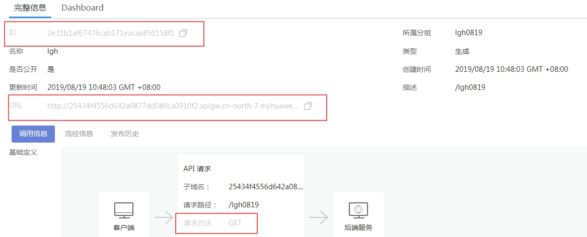
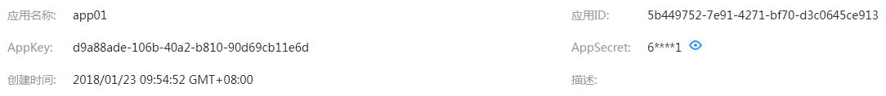

# 认证前准备

通过SDK访问APP认证前，需要获取如下信息：

-   访问服务前，首先需要得到API的ID、域名、请求url和请求方法

    在数据服务的“服务市场“页面，单击API名称，在“完整信息“页面查看API的ID、URL和请求方法。

    **图 1**  API基础定义  
    

-   对于APP认证的API，您必须提供有效的AppKey、AppSecret才能够生成认证签名。

    在“应用管理”中生成一个APP，并将APP绑定到API，就可以使用APP对应的AppKey和AppSecert访问该API。可在应用详细信息中查看AppKey和AppSecret。

    **图 2**  查看AppKey和AppSecret  
    

    > **说明：**   
    >-   AppKey：APP访问密钥ID。与私有访问密钥关联的唯一标识符；访问密钥ID和私有访问密钥一起使用，对请求进行加密签名。  
    >-   AppSecret：与访问密钥ID结合使用的密钥，对请求进行加密签名，可标识发送方，并防止请求被修改。  

-   发送API请求时，需要将当前时间置于HTTP的X-Sdk-Date头，将签名信息置于Authorization头。签名只在一个有限的时间内是有效的，超时即无效。

