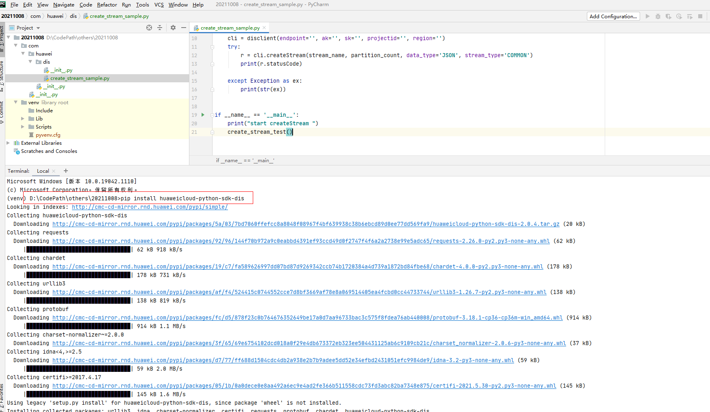
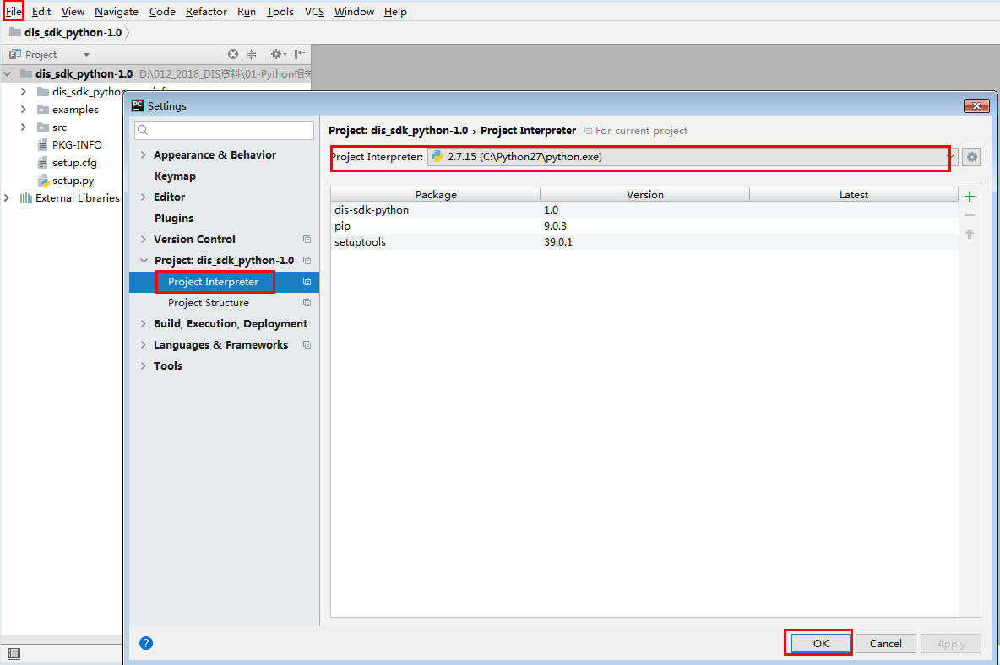

# 配置样例工程

样例代码请看：https://github.com/huaweicloud/huaweicloud-sdk-python-dis/tree/master/dis\_sdk\_python\_demo

## 操作步骤

1.  __****__ huaweicloud-python-sdk-dis已发布到 PyPi 之后，打开CMD，通过以下方式安装：pip install huaweicloud-python-sdk-dis
2.  导入pycharm项目。
    1.  打开pycharm。选择“File \> open“弹出“Open File or Project“窗口。
    2.  选择本地（可通过环境变量去查找）python安装目录下的“\\Lib\\site-packages \\dis\_sdk\_python”样例工程的存储位置。（安装之后若未找到dis\_sdk\_python，请尝试升级pip，或者安装huaweicloud-python-sdk-dis）：
    3.  单击“OK“完成项目导入。

3.  配置sdk\_python工程。

    1.  在左侧导航栏中选择“File  \>   Settings  \>   Editor  \>   Font“  ，设置字体背景色等
    2.  在左侧导航栏中选择“File  \>   Settings  \>     \>   Project Interpreter““， 添加Python。

    1.  选取合适的project Interpreter，单击“ok“。

    **图 1**  添加python  
    

    1.  在左侧导航栏中选择“File  \>   Settings  \>   Editor  \>   File Encodings“， 设置pycharm编码。

        Global Encoding、Project Encoding和Default encoding for properties files分别设置为UTF-8。

