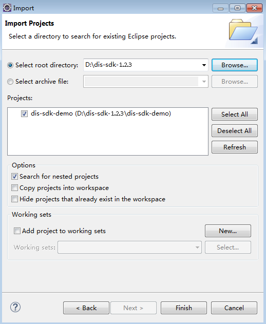
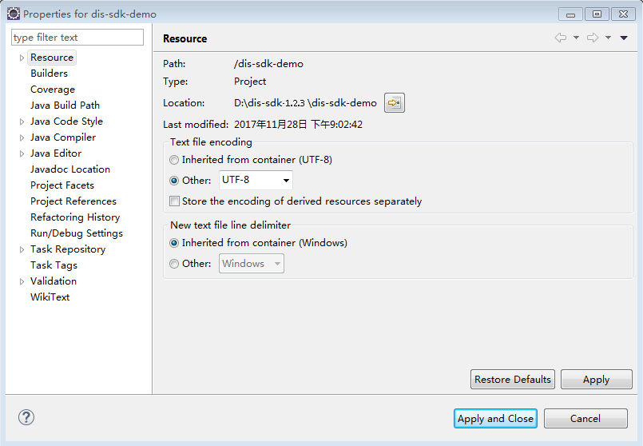

# 配置样例工程

[SDK下载](SDK下载.md)的“huaweicloud-sdk-dis-java-_X.X.X_.zip ”最新版本压缩包中提供了示例工程，您可以在本地设备上使用开发工具（如Eclipse）编译运行示例工程。或以示例工程为基础开发您的应用。示例工程代码路径：“\\dis-sdk-demo\\src\\main\\java\\com\\bigdata\\dis\\sdk\\demo“。

<table><thead align="left"><tr id="zh-cn_topic_0080238915_row5828575110530"><th class="cellrowborder" valign="top" width="50%" id="mcps1.1.3.1.1">
<strong id="zh-cn_topic_0080238915_b1040162510530">示例代码</strong>

</th>
<th class="cellrowborder" valign="top" width="50%" id="mcps1.1.3.1.2">
<strong id="zh-cn_topic_0080238915_b6659213110530">说明</strong>

</th>
</tr>
</thead>
<tbody><tr id="zh-cn_topic_0080238915_row2525355510530"><td class="cellrowborder" valign="top" width="50%" headers="mcps1.1.3.1.1 ">
ConsumerDemo.java

</td>
<td class="cellrowborder" valign="top" width="50%" headers="mcps1.1.3.1.2 ">
展示了下载数据的用法

</td>
</tr>
<tr id="zh-cn_topic_0080238915_row3825274910530"><td class="cellrowborder" valign="top" width="50%" headers="mcps1.1.3.1.1 ">
ProducerDemo.java

</td>
<td class="cellrowborder" valign="top" width="50%" headers="mcps1.1.3.1.2 ">
展示了上传数据的用法

</td>
</tr>
</tbody>
</table>

## 操作步骤

1.  解压[SDK下载](SDK下载.md)的“huaweicloud-sdk-dis-java-_X.X.X_.zip ”压缩包获得dis-sdk-demo包和示例工程。
2.  导入Eclipse项目。
    1.  打开Eclipse。选择“File \> Import”弹出“Import”窗口。

    1.  选择“Maven \> Existing Maven Projects”，单击“Next”，进入“Import Maven Projects”页面。
    2.  单击“Browse“按钮，根据实际情况选择“dis-sdk-demo”样例工程的存储位置，勾选样例工程，如[图1](#zh-cn_topic_0080238915_zh-cn_topic_0068150545_fig96131055317)所示。

        **图 1**  Import Maven Projects  
        

    3.  单击“Finish”完成项目导入。

3.  配置Demo工程。
    1.  配置项目编码为“UTF-8”。

        1.  在左侧导航栏“Project Explorer”中右键单击所需工程，选择“Properties ”，进入“Properties for dis-sdk-demo”页面。
        2.  左侧页签栏选择“Resource”，右侧对话框显示“Resource”页面。
        3.  在“Text file encoding”栏中选择“Other”，单击下拉框选择“UTF-8”。
        4.  单击“Apply and Close”完成编码配置。

        **图 2**  Resource  
        

    2.  添加JDK。
        1.  在左侧导航栏“Project Explorer”中右键单击所需工程，选择“Properties ”，进入“Properties for dis-sdk-demo”页面。
        2.  左侧页签栏选择“Java Build Path”，右侧对话框显示“Java Build Path”页面。
        3.  在“Java Build Path”页面选择“Libraries”页签，单击“Add Library”，弹出“Add Library”对话框。
        4.  选择“JRE System Library”，单击“Next”确认“Workspace default JRE”为jdk1.8及以上版本。
        5.  单击“Finish”退出“Add Library”对话框。
        6.  单击“Apply and Close”完成JDK添加。

