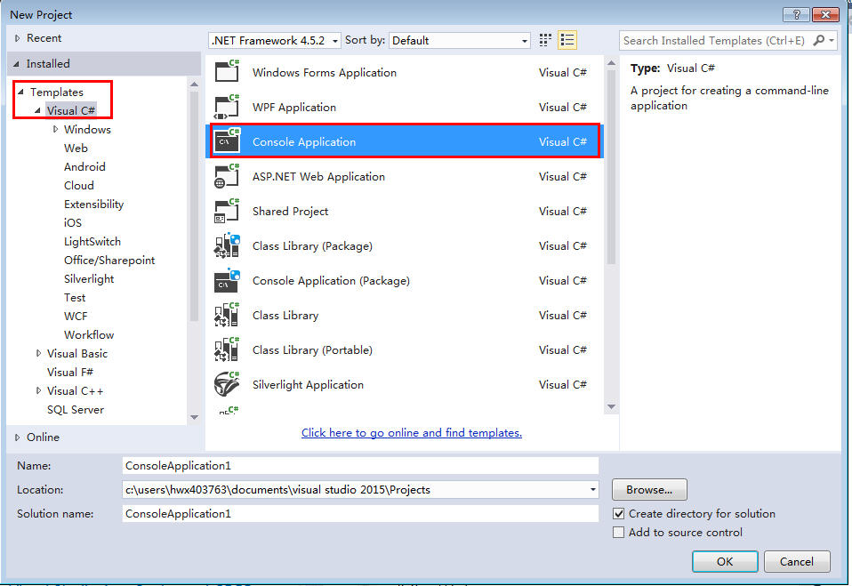
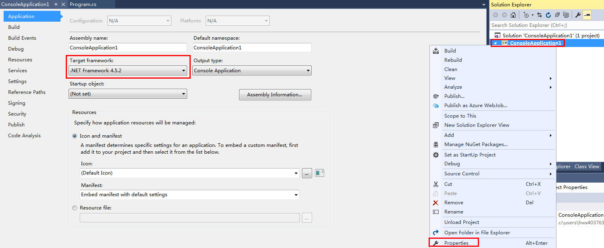
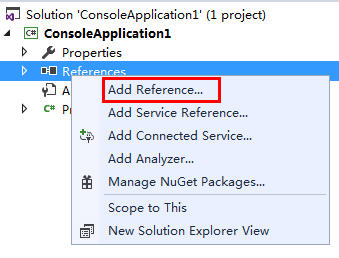
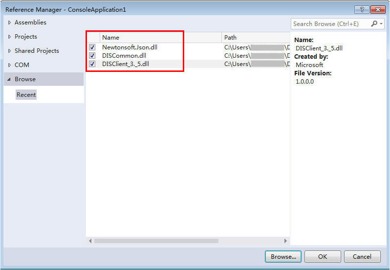

# 配置样例工程<a name="dayu_06_0008"></a>

[SDK下载](SDK下载.md)的“huaweicloud-sdk-dis-net- _X.X.X_.zip ”最新版本压缩包中提供了示例工程，您可以在本地设备上使用开发工具（如Microsoft Visual Studio）编译运行示例工程。或以示例工程为基础开发您的应用。示例工程代码路径：\[$path\]\\huaweicloud-sdk-dis-net-X.X.X\\DIS .NET SDK\\DIS .NET SDK。

<a name="zh-cn_topic_0124367671_table5818041310530"></a>
<table><thead align="left"><tr id="zh-cn_topic_0124367671_row5828575110530"><th class="cellrowborder" valign="top" width="28.999999999999996%" id="mcps1.1.3.1.1"><p id="zh-cn_topic_0124367671_p2352535710530"><a name="zh-cn_topic_0124367671_p2352535710530"></a><a name="zh-cn_topic_0124367671_p2352535710530"></a>样例工程文件</p>
</th>
<th class="cellrowborder" valign="top" width="71%" id="mcps1.1.3.1.2"><p id="zh-cn_topic_0124367671_p3722528710530"><a name="zh-cn_topic_0124367671_p3722528710530"></a><a name="zh-cn_topic_0124367671_p3722528710530"></a><strong id="zh-cn_topic_0124367671_b6659213110530"><a name="zh-cn_topic_0124367671_b6659213110530"></a><a name="zh-cn_topic_0124367671_b6659213110530"></a>说明</strong></p>
</th>
</tr>
</thead>
<tbody><tr id="zh-cn_topic_0124367671_row2525355510530"><td class="cellrowborder" valign="top" width="28.999999999999996%" headers="mcps1.1.3.1.1 "><p id="zh-cn_topic_0124367671_p103421514134412"><a name="zh-cn_topic_0124367671_p103421514134412"></a><a name="zh-cn_topic_0124367671_p103421514134412"></a>demo</p>
</td>
<td class="cellrowborder" valign="top" width="71%" headers="mcps1.1.3.1.2 "><p id="zh-cn_topic_0124367671_p1545371914441"><a name="zh-cn_topic_0124367671_p1545371914441"></a><a name="zh-cn_topic_0124367671_p1545371914441"></a>样例代码，分别包含net35和net45的样例代码。</p>
</td>
</tr>
<tr id="zh-cn_topic_0124367671_row3825274910530"><td class="cellrowborder" valign="top" width="28.999999999999996%" headers="mcps1.1.3.1.1 "><p id="zh-cn_topic_0124367671_p6311116164420"><a name="zh-cn_topic_0124367671_p6311116164420"></a><a name="zh-cn_topic_0124367671_p6311116164420"></a>net35</p>
</td>
<td class="cellrowborder" valign="top" width="71%" headers="mcps1.1.3.1.2 "><p id="zh-cn_topic_0124367671_p1660655632718"><a name="zh-cn_topic_0124367671_p1660655632718"></a><a name="zh-cn_topic_0124367671_p1660655632718"></a>包含：</p>
<a name="zh-cn_topic_0124367671_ul11391113417292"></a><a name="zh-cn_topic_0124367671_ul11391113417292"></a><ul id="zh-cn_topic_0124367671_ul11391113417292"><li>第三方日志库文件log4net.dll</li><li>DIS库文件</li><li>相关依赖*.dll文件</li></ul>
</td>
</tr>
<tr id="zh-cn_topic_0124367671_row2451144052610"><td class="cellrowborder" valign="top" width="28.999999999999996%" headers="mcps1.1.3.1.1 "><p id="zh-cn_topic_0124367671_p127194311305"><a name="zh-cn_topic_0124367671_p127194311305"></a><a name="zh-cn_topic_0124367671_p127194311305"></a>net45</p>
</td>
<td class="cellrowborder" valign="top" width="71%" headers="mcps1.1.3.1.2 "><p id="zh-cn_topic_0124367671_p97195159309"><a name="zh-cn_topic_0124367671_p97195159309"></a><a name="zh-cn_topic_0124367671_p97195159309"></a>包含：</p>
<a name="zh-cn_topic_0124367671_ul11719181511304"></a><a name="zh-cn_topic_0124367671_ul11719181511304"></a><ul id="zh-cn_topic_0124367671_ul11719181511304"><li>第三方日志库文件log4net.dll</li><li>DIS库文件</li><li>相关依赖*.dll文件</li></ul>
</td>
</tr>
<tr id="zh-cn_topic_0124367671_row618515432266"><td class="cellrowborder" valign="top" width="28.999999999999996%" headers="mcps1.1.3.1.1 "><p id="zh-cn_topic_0124367671_p12185143162614"><a name="zh-cn_topic_0124367671_p12185143162614"></a><a name="zh-cn_topic_0124367671_p12185143162614"></a>config</p>
</td>
<td class="cellrowborder" valign="top" width="71%" headers="mcps1.1.3.1.2 "><p id="zh-cn_topic_0124367671_p14185643182618"><a name="zh-cn_topic_0124367671_p14185643182618"></a><a name="zh-cn_topic_0124367671_p14185643182618"></a>包含DIS 参数配置dis.properties文件和version.properties版本信息。</p>
</td>
</tr>
</tbody>
</table>

## 操作步骤<a name="zh-cn_topic_0124367671_section16759162213113"></a>

1.  解压[SDK下载](SDK下载.md)的“huaweicloud-sdk-dis-net-_X.X.X_.zip ”压缩包获得dis-sdk-.NET包和示例工程。
2.  启动Visual Studio，选择“File  \>   New   \>   Project“，系统弹出“New Project“对话框。
3.  选择“Templates  \>   Visual C\#  \>   Console Application“，新建一个Console Application工程。

    **图 1**  新建Console Application<a name="zh-cn_topic_0124367671_fig9306184718549"></a>  
    

4.  选择新建的工程，单击右键，选择“Properties“。将“Target framework“对应版本修改为“.Net Framework 3.5“。在弹出的确认对话框中单击“OK“。

    **图 2**  修改版本<a name="zh-cn_topic_0124367671_fig92322111317"></a>  
    

5.  <a name="zh-cn_topic_0124367671_li6919414112317"></a>在Visual Studio中选择新建的工程，单击右键，选择Open Folder in File Explorer获取工程路径，例如“C:\\Users\\XXX\\Documents\\visual studio 2015\\Projects\\ConsoleApplication1\\ConsoleApplication1。“
6.  将解压后的SDK包中的net35文件复制至[5](#zh-cn_topic_0124367671_li6919414112317)的工程路径中。
7.  将解压后的SDK包中的config目录下的两个配置文件dis.properties和version.properties，拷贝至【$工程路径】\\bin\\Debug目录下。
8.  修改dis.properties配置信息，其中，“endpoint“，“ak“，“sk“，“region“，“projectId“信息请参看[获取认证信息](获取认证信息.md)。

    ```
    IS_DEFAULT_TRUSTED_JKS_ENABLED=false
    data.encrypt.enabled=false
    
    #todo
    endpoint=https://yourdomainname
    region=Provide your region
    ak=Provide your Access Key
    sk=Provide your Secret Key
    projectId=Provide your project Id
    ```

9.  将解压后的SDK包中的demo文件夹下的Program.cs文件，拷贝替换【$工程路径】下的此文件。
10. 在Visual Studio中选择新建工程下的References，单击右键，选择“Add Reference....“。

    **图 3**  添加Reference<a name="zh-cn_topic_0124367671_fig24849207915"></a>  
    

11. 系统弹出“Reference Manager“对话框，单击“Browse..“，分别选择【$工程路径】\\net35中的

    **DISClient\_3.\_5.dll**、**DISCommon.dll**和**Newtonsoft.Json.dll**。

    **图 4**  添加依赖\*.dll文件<a name="zh-cn_topic_0124367671_fig113960333717"></a>  
    

12. 单击“OK“。

