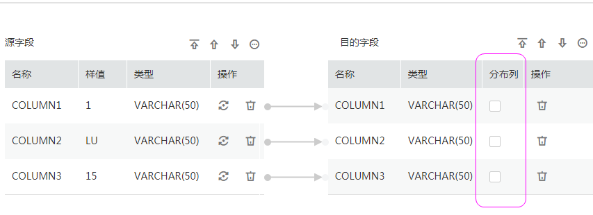

# CDM迁移数据到DWS时如何选取分布列？

在使用CDM迁移数据到数据仓库服务（DWS）或者FusionInsight LibrA，且CDM在DWS端自动创建一个新表时，在创建作业的字段映射界面，需要选择分布列，如[图1](#zh-cn_topic_0109007834_fig4363452123517)所示。

**图 1**  选取分布列  

由于分布列的选取，对于DWS/FusionInsight LibrA的运行非常重要，在CDM数据迁移到DWS/FusionInsight LibrA过程中，建议按如下顺序选取分布列：

1.  有主键可以使用主键作为分布列。
2.  多个数据段联合做主键的场景，建议设置所有主键作为分布列。
3.  在没有主键的场景下，如果没有选择分布列，DWS会默认第一列作为分布列，可能会有数据倾斜风险。

因此，在单表或整库导入到DWS/FusionInsight LibrA时，建议您在此处手动选择分布列，如果您没有选择，CDM会自动选择一个分布列。关于分布列的更多信息，请参见[数据仓库服务](https://support.huaweicloud.com/devg-dws/dws_04_0033.html)。

DWS主键或表只有一个字段时，要求字段类型必须是如下常用的字符串、数值、日期类型。从其他数据库迁移到DWS时，如果选择自动建表，主键必须为以下类型，未设置主键的情况下至少要有一个字段是以下类型，否则会无法创建表导致CDM作业失败。

-   INTEGER TYPES：TINYINT，SMALLINT，INT，BIGINT，NUMERIC/DECIMAL
-   CHARACTER TYPES：CHAR，BPCHAR，VARCHAR，VARCHAR2，NVARCHAR2，TEXT
-   DATA/TIME TYPES：DATE，TIME，TIMETZ，TIMESTAMP，TIMESTAMPTZ，INTERVAL，SMALLDATETIME

