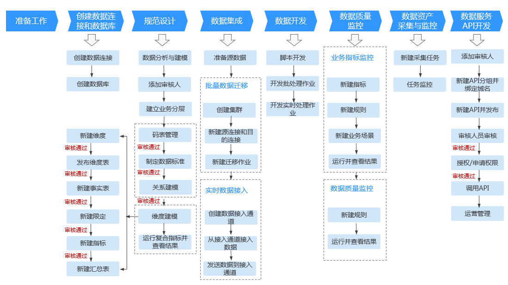

# DAYU使用简介

智能数据湖运营平台\(DAYU\)是具有数据全生命周期管理、智能数据管理能力的一站式治理运营平台，支持行业知识库智能化建设，支持大数据存储、大数据计算分析引擎等数据底座，帮助企业快速构建从数据接入到数据分析的端到端智能数据系统，消除数据孤岛，统一数据标准，加快数据变现，实现数字化转型。

## 使用DAYU的用户

根据人员的职能进行划分，使用DAYU的用户主要可以分为以下4类：

-   **管理员**

    面向熟悉业务并具有管理、决策、审核权限的管理人员。管理员具有除工作空间管理之外的其他所有DAYU权限，包括开发者权限、审核人员权限、工作空间成员管理、数据资产管理、配置管理等权限。例如，在规范设计、数据服务模块中，审核人员可以对开发人员发布的数据模型、API等数据对象进行审核，把好质量关。

-   **开发者**

    面向数据建模师、熟悉脚本开发的开发人员。DAYU为开发者提供了从管理中心、规范设计、数据集成、数据开发、数据质量、数据资产到数据服务的端到端开发和运营流程，帮助您快速、简单且高效地构建一个智能数据系统。

    数据系统构建完成后，其他开发人员就可以通过SDK的方式调用DAYU提供的数据服务API进行数据分析。

    开发者具有整个DAYU数据运营流程的大部分权限，具有除工作空间及其成员管理、同步表模型、编辑/删除系统默认时间限定、编辑数据标准模板、批量数据迁移的EIP管理等权限以外的其他所有DAYU权限。

-   **运维者**

    面向运维人员。运维者主要具有查看详细信息、运维调度、资源监控等权限。DAYU的数据资产360度全链路可视化，数据质量可检验，数据使用可控、可追溯，帮助运维人员实现端到端的作业调度和监控，从数据采集到数据消费运维一条龙。

-   **访客**

    访客仅具备只读权限，可以查看详细信息。

## DAYU使用流程简介

DAYU典型的端到端开发流程如下图所示：

