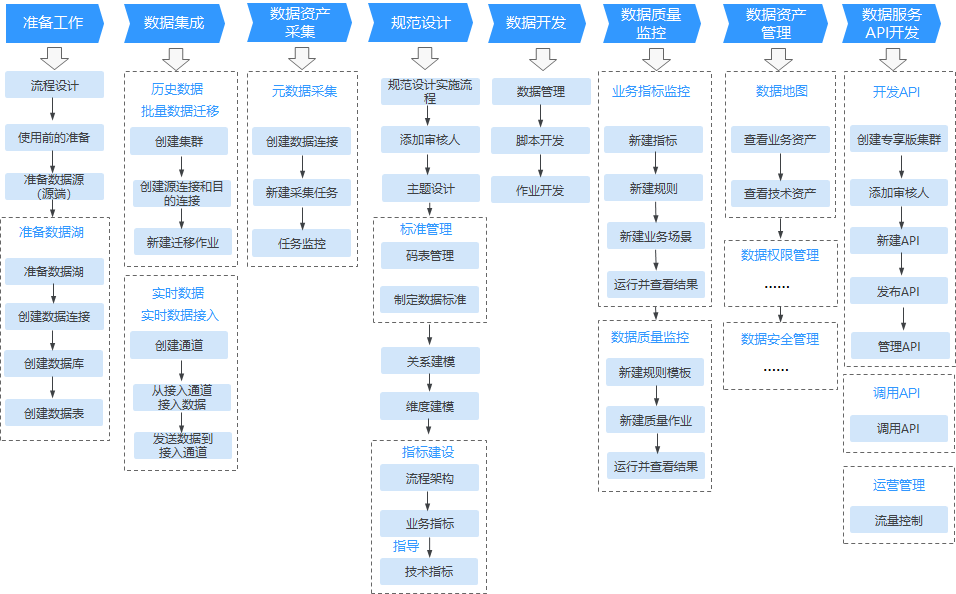

# DGC使用简介

数据湖治理中心DGC是具有数据全生命周期管理、智能数据管理能力的一站式治理运营平台，支持行业知识库智能化建设，支持大数据存储、大数据计算分析引擎等数据底座，帮助企业快速构建从数据接入到数据分析的端到端智能数据系统，消除数据孤岛，统一数据标准，加快数据变现，实现数字化转型。

## 使用DGC的用户

根据人员的职能进行划分，使用DGC的用户主要可以分为以下四类。四类角色具有不同的DGC权限，详情请参见[DGC权限列表](https://support.huaweicloud.com/productdesc-dgc/dgc_07_013.html)章节。

-   **管理员**

    面向熟悉业务并具有管理、决策、审核权限的管理人员。管理员具有除创建工作空间之外的其他所有DGC权限，包括开发者权限、审核人员权限、工作空间管理、数据资产管理、配置管理等权限。例如，在规范设计、数据服务模块中，审核人员可以对开发人员发布的数据模型、API等数据对象进行审核，把好质量关。

-   **开发者**

    面向数据建模师、熟悉脚本开发的开发人员。DGC为开发者提供了从管理中心、规范设计、数据集成、数据开发、数据质量、数据资产到数据服务的端到端开发和运营流程，帮助您快速、简单且高效地构建一个智能数据系统。

    数据系统构建完成后，其他开发人员就可以通过SDK的方式调用DGC提供的数据服务API进行数据分析。

    开发者具有除审核人员权限、工作空间及其成员管理等少数权限以外的大部分DGC权限。

-   **运维者**

    面向运维人员。运维者主要具有查看详细信息、运维调度、资源监控等权限。DGC的数据资产360度全链路可视化，数据质量可检验，数据使用可控、可追溯，帮助运维人员实现端到端的作业调度和监控，从数据采集到数据消费运维一条龙服务。

-   **访客**

    访客仅具备只读权限，可以查看详细信息。

## DGC使用流程简介

DGC典型的端到端开发流程如下图所示：

**图 1**  DGC使用流程  

使用DGC平台，通常包括以下步骤：

**表 1**  DGC全流程开发

<table><thead align="left"><tr id="row15174155213125"><th class="cellrowborder" valign="top" width="18.45815418458154%" id="mcps1.2.5.1.1">
主流程

</th>
<th class="cellrowborder" valign="top" width="41.4058594140586%" id="mcps1.2.5.1.2">
说明

</th>
<th class="cellrowborder" valign="top" width="16.52834716528347%" id="mcps1.2.5.1.3">
子任务

</th>
<th class="cellrowborder" valign="top" width="23.607639236076395%" id="mcps1.2.5.1.4">
操作指导

</th>
</tr>
</thead>
<tbody><tr id="row1456331035312"><td class="cellrowborder" rowspan="4" valign="top" width="18.45815418458154%" headers="mcps1.2.5.1.1 ">
使用前的准备

</td>
<td class="cellrowborder" valign="top" width="41.4058594140586%" headers="mcps1.2.5.1.2 ">
如果您是第一次使用DGC，需要先完成注册华为云帐号、购买DGC实例、创建工作空间、创建用户并授予DGC权限、添加工作空间成员和角色等一系列操作。

</td>
<td class="cellrowborder" valign="top" width="16.52834716528347%" headers="mcps1.2.5.1.3 ">
准备工作

</td>
<td class="cellrowborder" valign="top" width="23.607639236076395%" headers="mcps1.2.5.1.4 ">
<a href="使用DGC前的准备.md#section485519219101">DGC准备工作</a>

</td>
</tr>
<tr id="row13662152114170"><td class="cellrowborder" valign="top" headers="mcps1.2.5.1.1 ">
获取数据源的连接地址等信息，并确保数据源所在的主机和华为云网络互通。

</td>
<td class="cellrowborder" valign="top" headers="mcps1.2.5.1.2 ">
准备数据源

</td>
<td class="cellrowborder" valign="top" headers="mcps1.2.5.1.3 ">
<a href="使用DGC前的准备.md#section104811741192013">准备数据源</a>

</td>
</tr>
<tr id="row151252519188"><td class="cellrowborder" valign="top" headers="mcps1.2.5.1.1 ">
根据业务场景选择符合需求的云服务作为数据湖，用于存储原始数据和数据治理过程中的数据，并进行数据开发、治理和运营。

</td>
<td class="cellrowborder" valign="top" headers="mcps1.2.5.1.2 ">
准备数据湖

</td>
<td class="cellrowborder" valign="top" headers="mcps1.2.5.1.3 ">
<a href="使用DGC前的准备.md#section19482194142011">准备数据湖</a>

</td>
</tr>
<tr id="row17174185211125"><td class="cellrowborder" valign="top" headers="mcps1.2.5.1.1 ">
根据自身的业务特点和源数据类型，进行数据存储与分析系统的选型，选取合适的云服务用于存储源数据并进行数据查询和分析。然后，创建该云服务相应的数据连接。

</td>
<td class="cellrowborder" valign="top" headers="mcps1.2.5.1.2 ">
创建数据连接

</td>
<td class="cellrowborder" valign="top" headers="mcps1.2.5.1.3 ">
<a href="创建数据连接.md">创建数据连接</a>

</td>
</tr>
<tr id="row1017416527122"><td class="cellrowborder" valign="top" width="18.45815418458154%" headers="mcps1.2.5.1.1 ">
数据集成（批量数据迁移）

</td>
<td class="cellrowborder" valign="top" width="41.4058594140586%" headers="mcps1.2.5.1.2 ">
通过DGC平台将源数据上传或者接入到云上。

批量数据迁移提供同构/异构数据源之间批量数据迁移的服务，支持自建和云上的文件系统，关系数据库，数据仓库，NoSQL，大数据云服务，对象存储等数据源。

</td>
<td class="cellrowborder" valign="top" width="16.52834716528347%" headers="mcps1.2.5.1.3 ">
批量数据迁移

</td>
<td class="cellrowborder" valign="top" width="23.607639236076395%" headers="mcps1.2.5.1.4 ">
<a href="支持的数据源.md">支持的数据源</a>

<a href="创建集群.md">创建集群</a>

<a href="创建连接.md">创建连接</a>

<a href="创建作业.md">创建作业</a>

</td>
</tr>
<tr id="row1399813106420"><td class="cellrowborder" valign="top" width="18.45815418458154%" headers="mcps1.2.5.1.1 ">
数据集成（实时数据接入）

</td>
<td class="cellrowborder" valign="top" width="41.4058594140586%" headers="mcps1.2.5.1.2 ">
通过DGC平台将源数据上传或者接入到云上。

实时数据接入可以将云下的实时数据接入到云服务中。

</td>
<td class="cellrowborder" valign="top" width="16.52834716528347%" headers="mcps1.2.5.1.3 ">
实时数据接入

</td>
<td class="cellrowborder" valign="top" width="23.607639236076395%" headers="mcps1.2.5.1.4 ">
<a href="实时数据接入快速入门.md#section12577139103116">按需计费方式购买实时数据接入的增量包</a>

<a href="实时数据接入快速入门.md">实时数据接入快速入门</a>

</td>
</tr>
<tr id="row10465165318372"><td class="cellrowborder" valign="top" width="18.45815418458154%" headers="mcps1.2.5.1.1 ">
数据资产采集

</td>
<td class="cellrowborder" valign="top" width="41.4058594140586%" headers="mcps1.2.5.1.2 ">
为了在DGC平台中对迁移到云上的原始数据层进行管理和监控，先对其元数据进行采集并监控。

</td>
<td class="cellrowborder" valign="top" width="16.52834716528347%" headers="mcps1.2.5.1.3 ">
元数据采集

</td>
<td class="cellrowborder" valign="top" width="23.607639236076395%" headers="mcps1.2.5.1.4 ">
<a href="元数据采集.md">元数据采集</a>

</td>
</tr>
<tr id="row820133914351"><td class="cellrowborder" rowspan="7" valign="top" width="18.45815418458154%" headers="mcps1.2.5.1.1 ">
规范设计

</td>
<td class="cellrowborder" rowspan="7" valign="top" width="41.4058594140586%" headers="mcps1.2.5.1.2 ">
规范设计以关系建模、维度建模理论支撑实现规范化、可视化、标准化数据模型开发，定位于数据治理流程设计落地阶段，输出成果用于指导开发人员实践落地数据治理方法论。

根据业务需求设计关系模型、维度模型，在规范设计模块中，一步一步建立模型中的对象，例如维度、事实表、指标、汇总表等。

</td>
<td class="cellrowborder" valign="top" width="16.52834716528347%" headers="mcps1.2.5.1.3 ">
规范设计实施流程

</td>
<td class="cellrowborder" valign="top" width="23.607639236076395%" headers="mcps1.2.5.1.4 ">
<a href="数据规范使用流程.md">数据规范使用流程</a>

</td>
</tr>
<tr id="row421810157363"><td class="cellrowborder" valign="top" headers="mcps1.2.5.1.1 ">
添加审核人

</td>
<td class="cellrowborder" valign="top" headers="mcps1.2.5.1.2 ">
<a href="添加审核人.md#zh-cn_topic_0190201557_section128061611164613">添加审核人</a>

</td>
</tr>
<tr id="row993085711353"><td class="cellrowborder" valign="top" headers="mcps1.2.5.1.1 ">
主题设计

</td>
<td class="cellrowborder" valign="top" headers="mcps1.2.5.1.2 ">
<a href="主题设计.md">主题设计</a>

</td>
</tr>
<tr id="row04039115367"><td class="cellrowborder" valign="top" headers="mcps1.2.5.1.1 ">
码表管理

</td>
<td class="cellrowborder" valign="top" headers="mcps1.2.5.1.2 ">
<a href="新建码表.md">新建码表</a>

</td>
</tr>
<tr id="row174203453616"><td class="cellrowborder" valign="top" headers="mcps1.2.5.1.1 ">
制定数据标准

</td>
<td class="cellrowborder" valign="top" headers="mcps1.2.5.1.2 ">
<a href="新建数据标准.md">新建数据标准</a>

</td>
</tr>
<tr id="row399886362"><td class="cellrowborder" valign="top" headers="mcps1.2.5.1.1 ">
关系建模

</td>
<td class="cellrowborder" valign="top" headers="mcps1.2.5.1.2 ">
<a href="关系建模.md">关系建模</a>

</td>
</tr>
<tr id="row12162711113618"><td class="cellrowborder" valign="top" headers="mcps1.2.5.1.1 ">
维度建模

</td>
<td class="cellrowborder" valign="top" headers="mcps1.2.5.1.2 ">
<a href="维度建模.md">维度建模</a>

</td>
</tr>
<tr id="row1666715816395"><td class="cellrowborder" rowspan="4" valign="top" width="18.45815418458154%" headers="mcps1.2.5.1.1 ">
数据开发

</td>
<td class="cellrowborder" rowspan="4" valign="top" width="41.4058594140586%" headers="mcps1.2.5.1.2 ">
可管理多种大数据服务，提供一站式的大数据开发环境。

使用DGC数据开发，用户可进行数据管理、数据集成、脚本开发、作业开发、作业调度、运维监控等操作，轻松完成整个数据的处理分析流程。

</td>
<td class="cellrowborder" valign="top" width="16.52834716528347%" headers="mcps1.2.5.1.3 ">
数据管理

</td>
<td class="cellrowborder" valign="top" width="23.607639236076395%" headers="mcps1.2.5.1.4 ">
<a href="数据管理.md">数据管理</a>

</td>
</tr>
<tr id="row11175185281217"><td class="cellrowborder" valign="top" headers="mcps1.2.5.1.1 ">
脚本开发

</td>
<td class="cellrowborder" valign="top" headers="mcps1.2.5.1.2 ">
<a href="脚本开发.md">脚本开发</a>

</td>
</tr>
<tr id="row438118613100"><td class="cellrowborder" valign="top" headers="mcps1.2.5.1.1 ">
作业开发

</td>
<td class="cellrowborder" valign="top" headers="mcps1.2.5.1.2 ">
<a href="作业开发.md">作业开发</a>

</td>
</tr>
<tr id="row200141463911"><td class="cellrowborder" valign="top" headers="mcps1.2.5.1.1 ">
运维调度

</td>
<td class="cellrowborder" valign="top" headers="mcps1.2.5.1.2 ">
<a href="运维调度.md">运维调度</a>

</td>
</tr>
<tr id="row91757521121"><td class="cellrowborder" rowspan="2" valign="top" width="18.45815418458154%" headers="mcps1.2.5.1.1 ">
数据质量监控

</td>
<td class="cellrowborder" rowspan="2" valign="top" width="41.4058594140586%" headers="mcps1.2.5.1.2 ">
对业务指标和数据指标进行监控。您可从完整性、有效性、及时性、一致性、准确性、唯一性六个维度进行单列、跨列、跨行和跨表的分析。支持数据的清洗和标准化，能够根据数据标准自动生成清洗和标准化的质量规则。支持周期性的监控和清洗。

</td>
<td class="cellrowborder" valign="top" width="16.52834716528347%" headers="mcps1.2.5.1.3 ">
业务指标监控

</td>
<td class="cellrowborder" valign="top" width="23.607639236076395%" headers="mcps1.2.5.1.4 ">
<a href="新建指标.md">新建指标</a>

<a href="新建规则.md">新建规则</a>

<a href="新建业务场景.md">新建业务场景</a>

</td>
</tr>
<tr id="row317391381311"><td class="cellrowborder" valign="top" headers="mcps1.2.5.1.1 ">
数据质量监控

</td>
<td class="cellrowborder" valign="top" headers="mcps1.2.5.1.2 ">
<a href="新建规则模板.md">新建规则模板</a>

<a href="新建质量作业.md">新建质量作业</a>

<a href="新建对账作业.md">新建对账作业</a>

</td>
</tr>
<tr id="row1175952191216"><td class="cellrowborder" valign="top" width="18.45815418458154%" headers="mcps1.2.5.1.1 ">
数据资产管理

</td>
<td class="cellrowborder" valign="top" width="41.4058594140586%" headers="mcps1.2.5.1.2 ">
在DGC数据资产模块中，您可以查看数据地图，还可以对数据资产进行数据权限管理。

</td>
<td class="cellrowborder" valign="top" width="16.52834716528347%" headers="mcps1.2.5.1.3 ">
-

</td>
<td class="cellrowborder" valign="top" width="23.607639236076395%" headers="mcps1.2.5.1.4 ">
<a href="数据地图.md">数据地图</a>

<a href="数据权限.md">数据权限</a>

</td>
</tr>
<tr id="row16175135213125"><td class="cellrowborder" rowspan="2" valign="top" width="18.45815418458154%" headers="mcps1.2.5.1.1 ">
数据服务API开发

</td>
<td class="cellrowborder" rowspan="2" valign="top" width="41.4058594140586%" headers="mcps1.2.5.1.2 ">
统一管理对内对外的API服务，提供快速将数据表生成数据API的能力，同时支持将现有的API快速注册到数据服务平台以统一管理和发布。

</td>
<td class="cellrowborder" valign="top" width="16.52834716528347%" headers="mcps1.2.5.1.3 ">
开发API

</td>
<td class="cellrowborder" valign="top" width="23.607639236076395%" headers="mcps1.2.5.1.4 ">
<a href="准备工作-9.md">准备工作</a>

<a href="创建API.md">创建API</a>

<a href="调试API.md">调试API</a>

<a href="发布API.md">发布API</a>

<a href="管理API.md">管理API</a>

<a href="流量控制.md">流量控制</a>

</td>
</tr>
<tr id="row16249320151713"><td class="cellrowborder" valign="top" headers="mcps1.2.5.1.1 ">
调用API

</td>
<td class="cellrowborder" valign="top" headers="mcps1.2.5.1.2 ">
<a href="调用API.md">调用API</a>

</td>
</tr>
</tbody>
</table>

