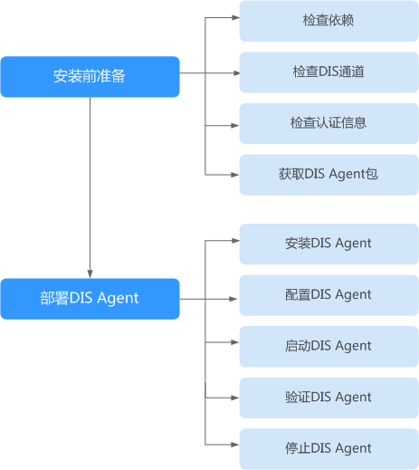

# DIS Agent概述

DIS Agent是数据接入服务（DIS）提供的一个客户端程序，具有如下功能：

持续查询文本文件，实时收集增量数据按分隔符解析并上传到DIS通道\(通道源数据类型为BLOB/JSON/CSV\)。

DIS Agent安装流程如[图1](#zh-cn_topic_0194140864_fig20851204491117)所示。

**图 1**  安装流程  

