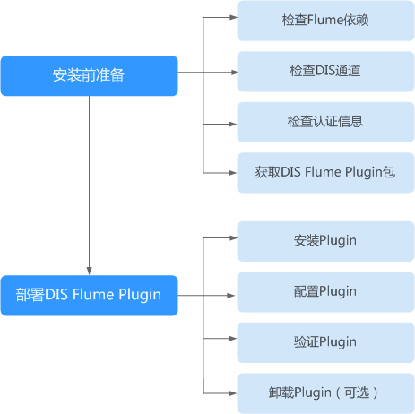

# DIS Flume Plugin概述

DIS Flume Plugin是数据接入服务（DIS）为Flume开发的插件，包含DIS Source与DIS Sink。DIS Source用于从DIS服务下载数据到Flume Channel，DIS Sink用于将Flume Channel中的数据上传到DIS服务。DIS Flume Plugin安装流程如[图1](#zh-cn_topic_0120206082_fig173115413564)所示。

**图 1**  DIS Flume Plugin安装流程  

