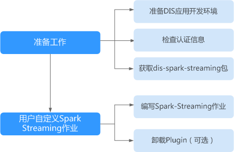

# DIS Spark Streaming概述

DIS Spark Streaming是数据接入服务（DIS）提供的一个sdk，支持将DIS作为数据源创建DStream对接SparkStreaming。dis-spark-streaming使用流程如[图1](#zh-cn_topic_0120206026_fig1482251912485)所示。

**图 1**  DIS Spark Streaming使用流程  

