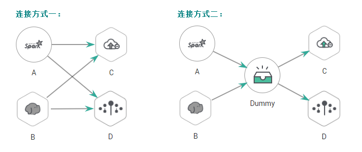

# Dummy

## 功能

Dummy节点是一个空的节点，不执行任何操作。用于简化节点的连接视图，便于用户理解复杂节点流的连接关系，示例如[图1](#zh-cn_topic_0121253876_fig16251257164711)所示。

**图 1**  连接方式对比  

## 参数

用户可参考[表1](#zh-cn_topic_0121253876_table3764823994826)配置Dummy节点的参数。

**表 1**  属性参数

<table><thead align="left"><tr id="zh-cn_topic_0121253876_row3170822394826"><th class="cellrowborder" valign="top" width="21.62%" id="mcps1.2.4.1.1">
参数

</th>
<th class="cellrowborder" valign="top" width="10.27%" id="mcps1.2.4.1.2">
是否必选

</th>
<th class="cellrowborder" valign="top" width="68.11%" id="mcps1.2.4.1.3">
说明

</th>
</tr>
</thead>
<tbody><tr id="zh-cn_topic_0121253876_row1991457694826"><td class="cellrowborder" valign="top" width="21.62%" headers="mcps1.2.4.1.1 ">
节点名称

</td>
<td class="cellrowborder" valign="top" width="10.27%" headers="mcps1.2.4.1.2 ">
是

</td>
<td class="cellrowborder" valign="top" width="68.11%" headers="mcps1.2.4.1.3 ">
节点名称，可以包含中文、英文字母、数字、“_”、“-”、“/”、“&lt;”、“&gt;”等各类特殊字符，长度为1～128个字符。

</td>
</tr>
</tbody>
</table>

