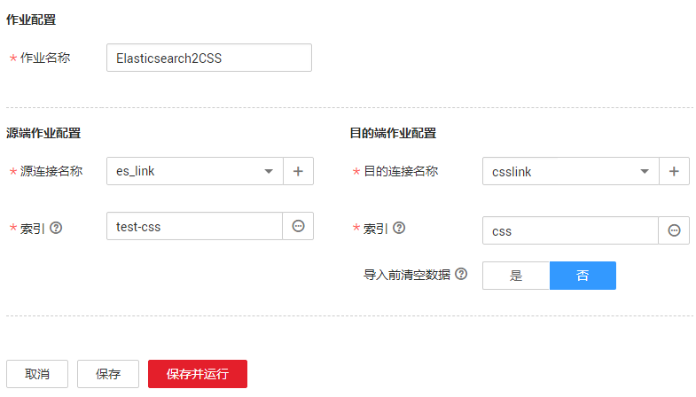

# Elasticsearch整库迁移到云搜索服务

## 操作场景

云搜索服务（Cloud Search Service）为用户提供结构化、非结构化文本的多条件检索、统计、报表，本章节介绍如何通过CDM将本地Elasticsearch整库迁移到云搜索服务中，流程如下：

1.  [创建CDM集群并绑定EIP](#zh-cn_topic_0123220230_section286612269318)
2.  [创建云搜索服务连接](#zh-cn_topic_0123220230_section14541143415338)
3.  [创建Elasticsearch连接](#zh-cn_topic_0123220230_section46839536342)
4.  [创建整库迁移作业](#zh-cn_topic_0123220230_section1508747294234)

## 前提条件

-   拥有EIP配额。
-   已经开通了云搜索服务，且获取云搜索服务集群的IP地址和端口。
-   已获取本地Elasticsearch数据库的服务器IP、端口、用户名和密码。

    如果Elasticsearch服务器是在本地数据中心或第三方云上，需要确保Elasticsearch可通过公网IP访问，或者是已经建立好了企业内部数据中心到华为云的VPN通道或专线。

## 创建CDM集群并绑定EIP

1.  创建CDM集群，具体操作请参见[创建集群](创建集群.md)，关键配置如下：
    -   CDM集群的规格，按待迁移的数据量选择，一般选择cdm.medium即可，满足大部分迁移场景。
    -   CDM集群的VPC必须和云搜索服务集群所在VPC一致，且推荐子网、安全组也与云搜索服务一致。
    -   如果安全控制原因不能使用相同子网和安全组，那么需要确保安全组规则能允许CDM访问云搜索服务集群。

2.  CDM集群创建完成后，在集群管理界面选择“绑定弹性IP“，CDM通过EIP访问本地Elasticsearch。

    > **说明：**   
    >如果用户对本地数据源的访问通道做了SSL加密，则CDM无法通过弹性IP连接数据源。  

## 创建云搜索服务连接

1.  单击CDM集群后的“作业管理“，进入作业管理界面，再选择“连接管理  \>  新建连接“，进入选择连接器类型的界面，如[图1](#zh-cn_topic_0108275437_zh-cn_topic_0108275298_fig13640155194015)所示。

    **图 1**  选择连接器类型  
    

2.  连接器类型选择“云搜索服务“后单击“下一步“，配置云搜索服务连接参数。

    -   名称：用户自定义连接名称，例如“csslink“。
    -   Elasticsearch服务器列表：配置为云搜索服务集群的连接地址、端口，格式为“ip:port“，多个地址之间使用分号（；）分隔，例如192.168.0.1:9200;192.168.0.2:9200。
    -   用户名、密码：配置为访问云搜索服务集群的用户，需要拥有数据库的读写权限。

    **图 2**  创建云搜索服务连接  
    

3.  单击“保存“回到连接管理界面。

## 创建Elasticsearch连接

1.  在连接管理界面，单击“新建连接“，连接器类型选择“Elasticsearch“后单击“下一步“，配置Elasticsearch连接参数，Elasticsearch连接参数与云搜索服务的连接参数一样：
    -   名称：用户自定义连接名称，例如“es\_link“。
    -   Elasticsearch服务器列表：配置为本地Elasticsearch数据库的IP地址、端口，多个地址之间使用分号（；）分隔。
    -   用户名、密码：如果Elasticsearch数据库有用户限制，这里还需配置为能够读写Elasticsearch数据库的用户。没有用户限制时不用配置这2个参数。

2.  单击“保存“回到连接管理界面。

## 创建整库迁移作业

1.  选择“整库迁移  \>  新建作业“，开始创建Elasticsearch整库迁移到云搜索服务的任务。

    **图 3**  创建Elasticsearch整库迁移作业  
    

    -   作业名称：用户自定义便于记忆、区分的任务名称。
    -   源端作业配置
        -   源连接名称：选择[创建Elasticsearch连接](#zh-cn_topic_0123220230_section46839536342)中的“es\_link“。
        -   索引：单击输入框后面的按钮，可选择本地Elasticsearch数据库中的一个索引，也可以手动输入索引名称，名称只能全部小写。需要一次迁移多个索引时，这里可配置为通配符，CDM会迁移所有符合通配符条件的索引。例如这里配置为cdm\*时，CDM将迁移所有名称为cdm开头的索引：cdm01、cdmB3、cdm\_45……

    -   目的端作业配置
        -   目的连接名称：选择[创建云搜索服务连接](#zh-cn_topic_0123220230_section14541143415338)中的“csslink“。
        -   索引：待写入数据的索引，这里可以选择一个云搜索服务中已存在的索引，也可以手动输入一个不存在的索引名称，名称只能全部小写，CDM会自动在云搜索服务中创建该索引。一次迁移多个索引时，该参数将被禁止配置，CDM自动在目的端创建索引。
        -   导入前清空数据：如果上面选择的索引，在云搜索服务中已存在，这里可以选择导入数据前是否清空该索引中的数据。如果选择不清空，则数据追加写入该索引。

1.  作业配置完成后，单击“保存并运行“，回到作业管理界面，在整库迁移的作业管理界面可查看执行进度和结果。

    本地Elasticsearch索引中的每个类型都会生成一个子作业并发执行，可以单击作业名查看子作业进度。

1.  作业执行完成后，单击作业操作列的“历史记录“，可查看该作业的历史执行记录、读取和写入的统计数据，以及日志信息（子作业才有日志）。

    **图 4**  作业执行记录  
    

