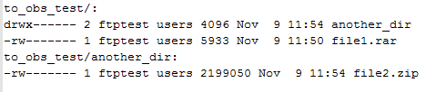
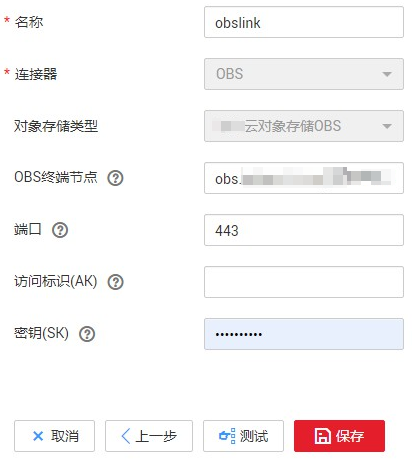
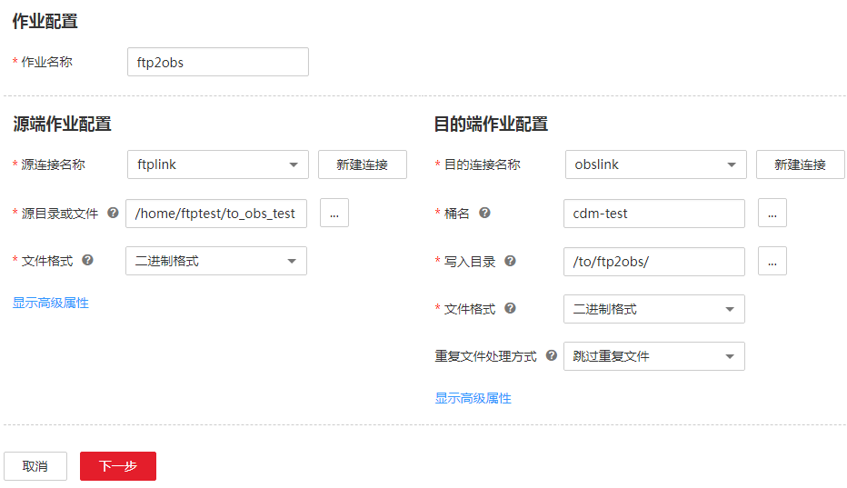
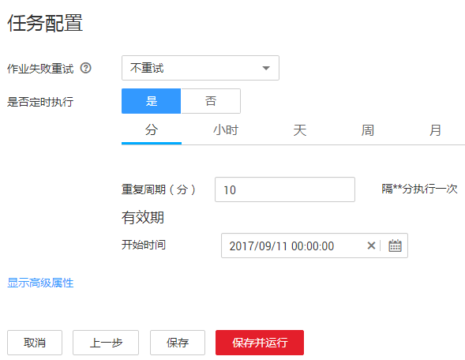
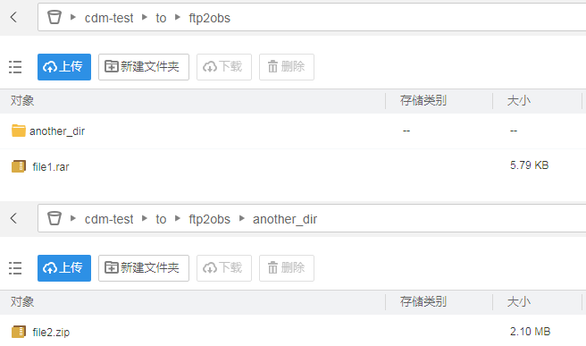
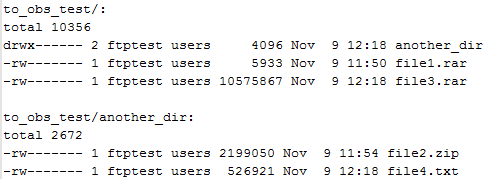
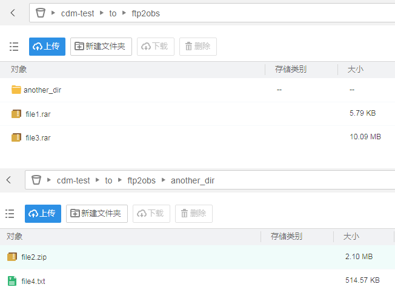

# FTP/SFTP文件增量迁移到OBS服务

## 操作场景

CDM支持周期性自动将新增文件上传到OBS，不需要写代码，也不需要用户频繁手动上传即可使用OBS的海量存储能力进行文件备份。

这里以CDM周期性备份FTP的文件到OBS为例进行介绍。

例如：FTP服务器的“to\_obs\_test“目录下有一个子目录“another\_dir“和两个文件“file1“和“file2“，其中“file2“在“another\_dir“目录下，如[图1](#zh-cn_topic_0108275445_fig25672730142024)所示。现在通过CDM的定时任务先将这些文件传输到OBS，然后在该目录下新增文件“file3“和“file4“，验证CDM会定期将新增文件再传输到OBS上。

**图 1**  FTP服务器的文件  

## 前提条件

-   拥有EIP配额。
-   已创建OBS桶，且已获取访问密钥（AK和SK）。
-   已获取FTP服务器的IP地址、用户名和密码。
-   如果FTP服务器是在本地环境，需要确保FTP服务器可通过公网访问，或者已经建立好企业内部数据中心到云服务平台的VPN通道或专线。

## 创建CDM集群并绑定EIP

1.  如果是独立CDM服务，参考[创建集群](https://support.huaweicloud.com/usermanual-cdm/cdm_01_0018.html)创建CDM集群；如果是作为DGC服务CDM组件使用，参考[创建集群](https://support.huaweicloud.com/usermanual-dgc/dgc_01_0576.html)创建CDM集群。

    关键配置如下：

    -   集群的实例规格选择“cdm.medium“，适用大部分迁移场景。
    -   如果该集群只用于迁移云服务平台以外的数据到OBS上，则该CDM集群的VPC、子网、安全组没有要求，任选一个即可。

2.  创建集群成功后，在CDM集群管理界面，选择集群操作列的“绑定弹性IP“，CDM集群需要通过EIP访问本地FTP。

    > **说明：** 
    >如果用户对本地数据源的访问通道做了SSL加密，则CDM无法通过弹性IP连接数据源。

## 创建OBS连接

1.  单击CDM集群后的“作业管理“，进入作业管理界面，再选择“连接管理  \>  新建连接“，进入选择连接器类型的界面，如[图2](#zh-cn_topic_0108275445_zh-cn_topic_0108275298_fig13640155194015)所示。

    **图 2**  选择连接器类型  
    

2.  选择“对象存储服务（OBS）“后，单击“下一步“配置OBS连接参数。

    -   名称：用户自定义连接名称，例如“obslink“。
    -   OBS服务器、端口：配置为OBS实际的地址信息。
    -   访问标识（AK）、密钥（SK）：登录OBS的AK、SK。

    **图 3**  配置OBS连接的参数  
    

3.  单击“保存“回到连接管理界面。

## 创建FTP连接

1.  在连接管理界面，单击“新建连接“，连接器类型选择“FTP“，单击“下一步“配置FTP连接参数。
    -   名称：用户自定义连接名称，例如“ftplink“。
    -   主机名或IP、端口：配置为本地FTP服务器的地址。
    -   用户名、密码：配置为登录FTP服务器的用户名和密码。

2.  单击“保存“回到连接管理界面。

## 创建定时迁移作业

1.  选择“表/文件迁移  \>  新建作业“，创建数据迁移任务。

    **图 4**  创建FTP到OBS的迁移任务  
    

    -   作业名称：用户自定义。
    -   源连接名称：选择[创建FTP连接](#zh-cn_topic_0108275445_section7521142854314)中的“ftplink“。
        -   源目录或文件：选择“to\_obs\_test“所在的路径。
        -   文件格式：这里选择“二进制格式“，二进制格式适用于文件的原样复制。如果需要把文件写入到数据库，则选择CSV格式或JSON格式。

    -   目的连接名称：选择[创建OBS连接](#zh-cn_topic_0108275445_section19123145293513)中的“obslink“。
        -   桶名：存储FTP文件的OBS桶名。
        -   写入目录：可选择已有的目录，也可以手动输入，目录不存在时CDM会自动创建。例如这里配置为“/to/ftp2obs/“。
        -   文件格式：与源端保持一致，选择“二进制格式“。
        -   重复文件处理方式：选择“跳过重复文件“，避免相同文件重复传输。

2.  单击“下一步“配置定时任务，这里配置为每10分钟执行一次，其他参数保持默认即可。

    **图 5**  配置定时任务  
    

3.  选择“保存并运行“。

## 验证周期备份结果

1.  作业执行成功后，登录OBS客户端，可以看到OBS上已经有相应文件，如[图6](#zh-cn_topic_0108275445_fig118811157477)所示。

    **图 6**  OBS客户端文件  
    

2.  在FTP服务器目录下再新增两个文件“file3“和“file4“，其中“file3“和“file1“在同一级目录，“file2“和“file4“在同一级目录，如[图7](#zh-cn_topic_0108275445_fig1488121514714)所示。

    **图 7**  FTP服务器新增文件  
    

3.  等待10分钟，CDM自动触发定时任务后，登录OBS可以看到新增的“file3“和“file4“文件，如[图8](#zh-cn_topic_0108275445_fig88851514714)所示。

    **图 8**  OBS新增文件  
    

4.  在CDM作业管理界面，单击作业操作列的“历史记录“进入历史记录界面，可查看该作业的历史执行记录、读取和写入的统计数据。
5.  在历史记录界面单击“日志“，可查看作业执行的日志信息。

