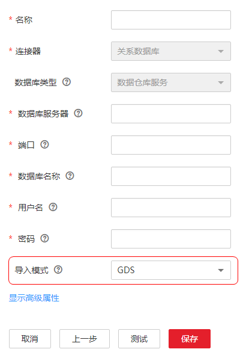

# GDS导入模式

在创建DWS连接时，数据仓库服务（Data Warehouse Service，简称DWS）的连接可以选择以下导入模式：COPY或GDS。

**图 1**  导入模式  

GDS（General Data Service）是DWS提供的数据并行加载工具，通过和外表机制的配合，实现数据高速导入到DWS。COPY和GDS两种模式的网络通讯方向不一样：

-   使用COPY模式时，CDM主动向DWS推送数据。
-   使用GDS模式时，CDM会临时创建一个外表，DWS的多个数据节点（DN）并发从CDM抽取数据，数据不经过DWS的管理节点（MN），迁移速度、性能更好。

CDM已内置GDS，无需额外安装GDS工具包。使用CDM的GDS模式高速导入数据到DWS（CDM暂不支持使用GDS模式从DWS导出数据），关键配置如下：

1.  修改CDM集群所在的安全组规则，允许DWS数据节点访问CDM集群内网IP的25000端口。
2.  创建DWS连接时“导入模式“选择“GDS“。
3.  创建CDM的表/文件迁移作业，“目的连接名称“选择已启用GDS模式的DWS连接。

