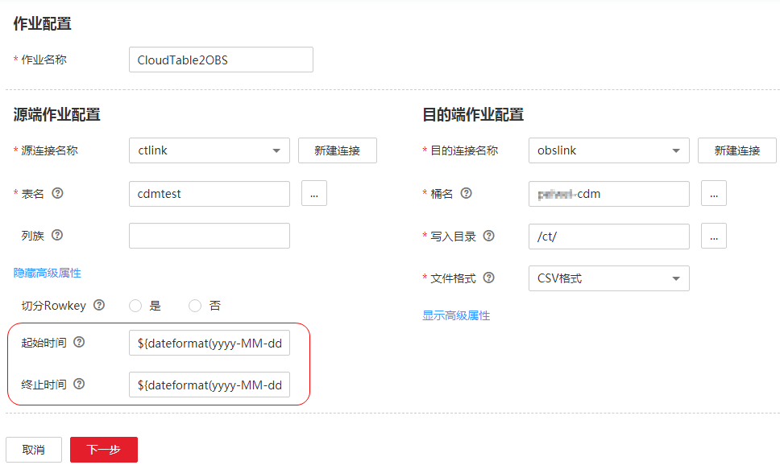

# HBase/CloudTable增量迁移

使用CDM导出HBase（包括MRS HBase、FusionInsight HBase、Apache HBase）或者表格存储服务（CloudTable）的数据时，支持导出指定时间段内的数据，配合CDM的[定时任务](配置定时任务.md)，可以实现HBase/CloudTable的增量迁移。

在创建CDM表/文件迁移的作业，源连接选择为[配置HBase连接](配置HBase连接.md)或[配置CloudTable连接](配置CloudTable连接.md)时，高级属性的可选参数中可以配置时间区间。

**图 1**  HBase时间区间  

-   起始时间（包含该值），格式为“yyyy-MM-dd HH:mm:ss“，表示只抽取该时间及以后的数据。
-   终止时间（不包含该值），格式为“yyyy-MM-dd HH:mm:ss“，表示只抽取该时间以前的数据。

这2个参数支持配置为[使用时间宏变量完成增量同步](使用时间宏变量完成增量同步.md)[时间宏变量](使用时间宏变量完成增量同步.md)，例如：

-   起始时间配置为**$\{dateformat\(yyyy-MM-dd HH:mm:ss, -1, DAY\)\}**时，表示只导出昨天以后的数据。
-   终止时间配置为**$\{dateformat\(yyyy-MM-dd HH:mm:ss\)\}**时，表示只导出当前时间以前的数据。

这2个参数同时配置后，CDM就只导出前一天内的数据，再将该作业配置为每天0点执行一次，就可以增量同步每天新生成的数据。

