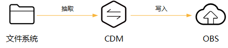
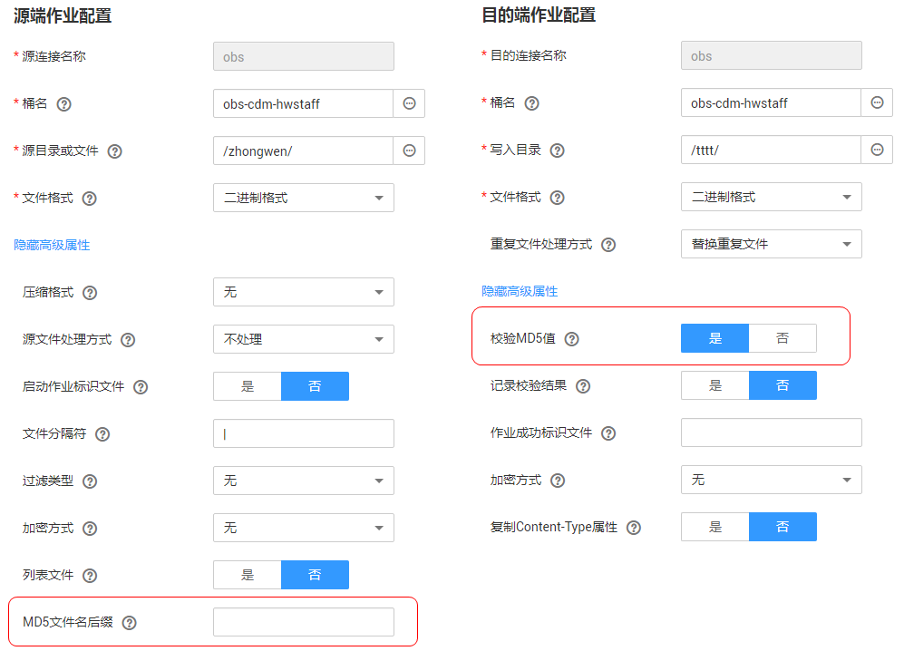

# MD5校验文件一致性

CDM数据迁移以抽取-写入模式进行，CDM首先从源端抽取数据，然后将数据写入到目的端。在迁移文件到OBS时，迁移模式如[图1](#zh-cn_topic_0108275377_fig4667102414522)所示。

**图 1**  迁移文件到OBS  

在这个过程中，CDM支持使用MD5检验文件一致性，配置参数如[图2](#zh-cn_topic_0108275377_fig20882751194516)所示。

-   **抽取时**
    -   校验CDM抽取的文件，是否与源文件一致。
    -   该功能由源端作业参数“MD5文件名后缀“控制，配置为源端文件系统中的MD5文件名后缀。
    -   当源端数据文件同一目录下有对应后缀的保存md5值的文件，例如build.sh和build.sh.md5在同一目录下。若配置了“MD5文件名后缀”，则只迁移有MD5值的文件至目的端，没有MD5值或者MD5不匹配的数据文件将迁移失败，MD5文件自身不被迁移。
    -   若未配置“MD5文件名后缀”，则迁移所有。
    -   该功能支持源端为OBS、FTP、SFTP、NAS、SFS、HTTP。

-   **写入时**
    -   校验写入OBS的文件，是否与CDM抽取的文件一致。
    -   该功能由目的端作业参数“校验MD5值“控制，读取文件后写入OBS时，通过HTTP Header将MD5值提供给OBS做写入校验，并将校验结果写入OBS桶（该桶可以不是存储迁移文件的桶）。如果源端没有MD5文件则不校验。
    -   该功能目前只支持目的端为OBS。

**图 2**  使用MD5校验文件一致性  

> **说明：**   
>-   迁移文件到文件系统时，目前只支持校验CDM抽取的文件是否与源文件一致（即只校验抽取的数据）。  
>-   迁移文件到OBS时，支持抽取和写入文件时都校验。  
>-   如果选择使用MD5校验，则无法[使用KMS加密](迁移文件时加解密.md#dayu_01_0102)。  

