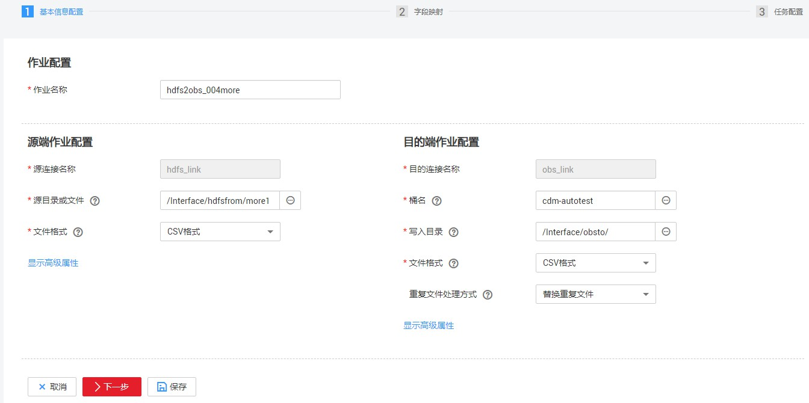

# MRS HDFS数据迁移到OBS

## 操作场景

CDM支持文件到文件类数据的迁移，本章节以MRS HDFS--\>OBS为例，介绍如何通过CDM将文件类数据迁移到文件中。流程如下：

1.  [创建CDM集群并绑定EIP](#zh-cn_topic_0284710797_section1596917553011)
2.  [创建MRS HDFS连接](#zh-cn_topic_0284710797_section136013511582)
3.  [创建OBS连接](#zh-cn_topic_0284710797_section5774720191611)
4.  [创建迁移作业](#zh-cn_topic_0284710797_section119151411712)

## 前提条件

-   已获取OBS的访问域名、端口，以及AK、SK。
-   已经购买了MRS。
-   拥有EIP配额。

## 创建CDM集群并绑定EIP

1.  如果是独立CDM服务，参考[创建集群](https://support.huaweicloud.com/usermanual-cdm/cdm_01_0018.html)创建CDM集群；如果是作为DGC服务CDM组件使用，参考[创建集群](https://support.huaweicloud.com/usermanual-dgc/dgc_01_0576.html)创建CDM集群。

    关键配置如下：

    -   CDM集群的规格，按待迁移的数据量选择，一般选择cdm.medium即可，满足大部分迁移场景。
    -   CDM集群所在VPC、子网、安全组，选择与MRS集群所在的网络一致。

2.  CDM集群创建完成后，选择集群操作列的“绑定弹性IP“，CDM通过EIP访问MRS HDFS。

    **图 1**  集群列表  
    

    > **说明：** 
    >如果用户对本地数据源的访问通道做了SSL加密，则CDM无法通过弹性IP连接数据源。

## 创建MRS HDFS连接

1.  在连接管理界面单击“新建连接“，连接器类型选择“MRS HDFS“后，单击“下一步“，配置MRS HDFS链接参数。
    -   名称：用户自定义连接名称，例如“mrs\_hdfs\_link”。
    -   Manage IP：MRS Manager的IP地址，可以单击输入框后的“选择“来选定已创建的MRS集群，CDM会自动填充下面的鉴权参数。
    -   用户名：选择KERBEROS鉴权时，需要配置MRS Manager的用户名和密码。

        从HDFS导出目录时，如果需要创建快照，这里配置的用户需要HDFS系统的管理员权限。

    -   密码：访问MRS Manager的用户密码。
    -   认证类型：访问MRS的认证类型。
    -   运行模式：选择HDFS连接的运行模式。

## 创建OBS连接

1.  在连接管理界面单击“新建连接“，连接器类型选择“对象存储服务（OBS）“后，单击“下一步“配置OBS连接参数，如[图2](#zh-cn_topic_0284710797_zh-cn_topic_0123434187_fig27331126173315)所示。

    -   名称：用户自定义连接名称，例如“obslink“。
    -   OBS服务器、端口：配置为OBS实际的地址信息。
    -   访问标识（AK）、密钥（SK）：登录OBS的AK、SK。

    **图 2**  创建OBS连接  
    

2.  单击“保存“回到连接管理界面。

## 创建迁移作业

1.  选择“表/文件迁移  \>  新建作业“，开始创建从MRS HDFS导出数据到OBS的任务。

    **图 3**  创建MRS HDFS到OBS的迁移任务  
    

    -   作业名称：用户自定义便于记忆、区分的任务名称。
    -   源端作业配置
        -   源连接名称：选择[创建MRS HDFS连接](#zh-cn_topic_0284710797_section136013511582)中的“hdfs\_llink“。
        -   源目录或文件：待迁移数据的目录或单个文件路径。
        -   文件格式：传输数据时所用的文件格式，这里选择“二进制格式”。不解析文件内容直接传输，不要求文件格式必须为二进制。适用于文件到文件的原样复制。
        -   其他可选参数一般情况下保持默认即可，详细说明请参见[配置HDFS源端参数](配置HDFS源端参数.md#dgc_01_0049)。

    -   目的端作业配置
        -   目的连接名称：选择[创建OBS连接](#zh-cn_topic_0284710797_section5774720191611)中的“obs\_link“。
        -   桶名：待迁移数据的桶。
        -   写入目录：写入数据到OBS服务器的目录。
        -   文件格式：迁移文件类数据到文件时，文件格式选择“二进制格式“。
        -   高级属性里的可选参数一般情况下保持默认既可，详细说明请参见[配置OBS目的端参数](配置OBS目的端参数.md#dgc_01_0062)。

2.  单击“下一步“进入字段映射界面，CDM会自动匹配源和目的字段。
    -   如果字段映射顺序不匹配，可通过拖拽字段调整。
    -   CDM的表达式已经预置常用字符串、日期、数值等类型的字段内容转换，详细请参见[字段转换](https://support.huaweicloud.com/bestpractice-dgc/dgc_05_0012.html)。

3.  单击“下一步“配置任务参数，一般情况下全部保持默认即可。

    该步骤用户可以配置如下可选功能：

    -   作业失败重试：如果作业执行失败，可选择是否自动重试，这里保持默认值“不重试“。
    -   作业分组：选择作业所属的分组，默认分组为“DEFAULT“。在CDM“作业管理“界面，支持作业分组显示、按组批量启动作业、按分组导出作业等操作。
    -   是否定时执行：如果需要配置作业定时自动执行，请参见[配置定时任务](配置定时任务.md#dgc_01_0082)。这里保持默认值“否“。
    -   抽取并发数：设置同时执行的抽取任务数。CDM支持多个文件的并发抽取，调大参数有利于提高迁移效率
    -   是否写入脏数据：否，文件到文件属于二进制迁移，不存在脏数据。
    -   作业运行完是否删除：这里保持默认值“不删除“。根据使用场景，也可配置为“删除”，防止迁移作业堆积。

4.  单击“保存并运行“，回到作业管理界面，在作业管理界面可查看作业执行进度和结果。
5.  作业执行成功后，单击作业操作列的“历史记录“，可查看该作业的历史执行记录、读取和写入的统计数据。

    在历史记录界面单击“日志“，可查看作业的日志信息。

