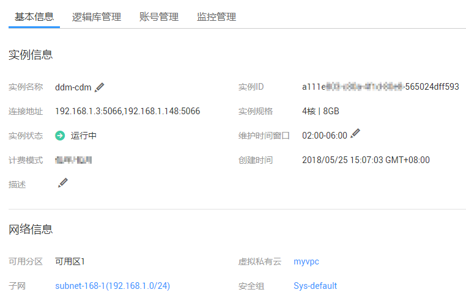
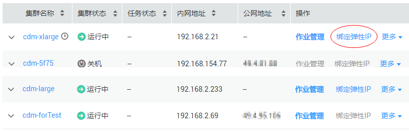
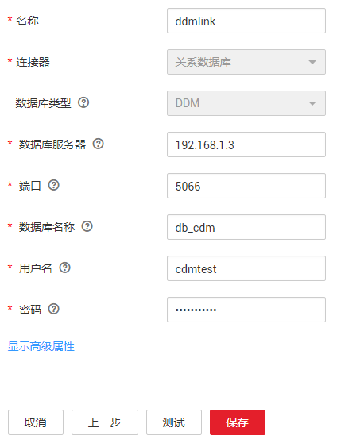
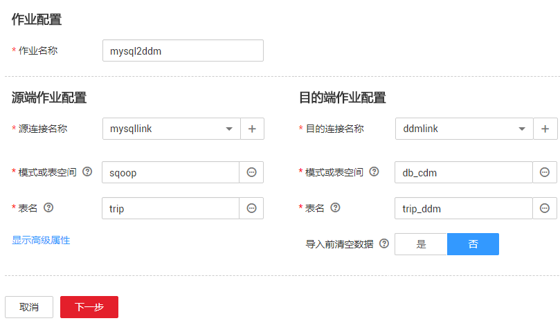
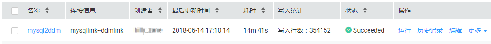
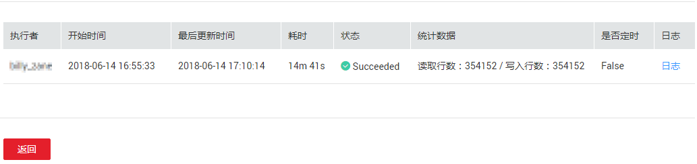

# MySQL数据库迁移到云上DDM服务<a name="dayu_01_0093"></a>

[分布式数据库中间件](https://www.huaweicloud.com/product/ddm.html)（Distributed Database Middleware，以下简称DDM）是解决数据库容量、性能瓶颈和分布式扩展问题的中间件服务，提供分库分表、读写分离、弹性扩容等能力，应对海量数据的高并发访问场景，有效提升数据库读写性能。

下面介绍如何使用CDM将本地MySQL的一张表迁移到DDM，将数据进行分布式存储。

## 操作场景<a name="zh-cn_topic_0117257775_section848194854517"></a>

1.  例如MySQL类型的本地数据库名称为“sqoop“，sqoop上有一张表trip，保存了自行车骑行记录，里面有起始时间、结束时间，起始站点、结束站点、骑手ID等信息，trip表字段定义如[表1](#zh-cn_topic_0117257775_table121392501982)所示。

    **表 1**  trip表字段

    <a name="zh-cn_topic_0117257775_table121392501982"></a>
    <table><thead align="left"><tr id="zh-cn_topic_0117257775_row1213911502089"><th class="cellrowborder" valign="top" width="50%" id="mcps1.2.3.1.1"><p id="zh-cn_topic_0117257775_p613916501985"><a name="zh-cn_topic_0117257775_p613916501985"></a><a name="zh-cn_topic_0117257775_p613916501985"></a>字段名</p>
    </th>
    <th class="cellrowborder" valign="top" width="50%" id="mcps1.2.3.1.2"><p id="zh-cn_topic_0117257775_p967675216105"><a name="zh-cn_topic_0117257775_p967675216105"></a><a name="zh-cn_topic_0117257775_p967675216105"></a>字段类型</p>
    </th>
    </tr>
    </thead>
    <tbody><tr id="zh-cn_topic_0117257775_row101391150587"><td class="cellrowborder" valign="top" width="50%" headers="mcps1.2.3.1.1 "><p id="zh-cn_topic_0117257775_p1713913501887"><a name="zh-cn_topic_0117257775_p1713913501887"></a><a name="zh-cn_topic_0117257775_p1713913501887"></a>tripid</p>
    </td>
    <td class="cellrowborder" valign="top" width="50%" headers="mcps1.2.3.1.2 "><p id="zh-cn_topic_0117257775_p41391050583"><a name="zh-cn_topic_0117257775_p41391050583"></a><a name="zh-cn_topic_0117257775_p41391050583"></a>int</p>
    </td>
    </tr>
    <tr id="zh-cn_topic_0117257775_row15944135017115"><td class="cellrowborder" valign="top" width="50%" headers="mcps1.2.3.1.1 "><p id="zh-cn_topic_0117257775_p99447503111"><a name="zh-cn_topic_0117257775_p99447503111"></a><a name="zh-cn_topic_0117257775_p99447503111"></a>duration</p>
    </td>
    <td class="cellrowborder" valign="top" width="50%" headers="mcps1.2.3.1.2 "><p id="zh-cn_topic_0117257775_p1694416506118"><a name="zh-cn_topic_0117257775_p1694416506118"></a><a name="zh-cn_topic_0117257775_p1694416506118"></a>int</p>
    </td>
    </tr>
    <tr id="zh-cn_topic_0117257775_row313925013810"><td class="cellrowborder" valign="top" width="50%" headers="mcps1.2.3.1.1 "><p id="zh-cn_topic_0117257775_p513916501820"><a name="zh-cn_topic_0117257775_p513916501820"></a><a name="zh-cn_topic_0117257775_p513916501820"></a>startdate</p>
    </td>
    <td class="cellrowborder" valign="top" width="50%" headers="mcps1.2.3.1.2 "><p id="zh-cn_topic_0117257775_p11397507811"><a name="zh-cn_topic_0117257775_p11397507811"></a><a name="zh-cn_topic_0117257775_p11397507811"></a>timestamp</p>
    </td>
    </tr>
    <tr id="zh-cn_topic_0117257775_row16139145013813"><td class="cellrowborder" valign="top" width="50%" headers="mcps1.2.3.1.1 "><p id="zh-cn_topic_0117257775_p10139750882"><a name="zh-cn_topic_0117257775_p10139750882"></a><a name="zh-cn_topic_0117257775_p10139750882"></a>startstation</p>
    </td>
    <td class="cellrowborder" valign="top" width="50%" headers="mcps1.2.3.1.2 "><p id="zh-cn_topic_0117257775_p111399501984"><a name="zh-cn_topic_0117257775_p111399501984"></a><a name="zh-cn_topic_0117257775_p111399501984"></a>varchar(64)</p>
    </td>
    </tr>
    <tr id="zh-cn_topic_0117257775_row813912501989"><td class="cellrowborder" valign="top" width="50%" headers="mcps1.2.3.1.1 "><p id="zh-cn_topic_0117257775_p913913505813"><a name="zh-cn_topic_0117257775_p913913505813"></a><a name="zh-cn_topic_0117257775_p913913505813"></a>startterminal</p>
    </td>
    <td class="cellrowborder" valign="top" width="50%" headers="mcps1.2.3.1.2 "><p id="zh-cn_topic_0117257775_p313975010814"><a name="zh-cn_topic_0117257775_p313975010814"></a><a name="zh-cn_topic_0117257775_p313975010814"></a>int</p>
    </td>
    </tr>
    <tr id="zh-cn_topic_0117257775_row181392050787"><td class="cellrowborder" valign="top" width="50%" headers="mcps1.2.3.1.1 "><p id="zh-cn_topic_0117257775_p171398501088"><a name="zh-cn_topic_0117257775_p171398501088"></a><a name="zh-cn_topic_0117257775_p171398501088"></a>enddata</p>
    </td>
    <td class="cellrowborder" valign="top" width="50%" headers="mcps1.2.3.1.2 "><p id="zh-cn_topic_0117257775_p131391450280"><a name="zh-cn_topic_0117257775_p131391450280"></a><a name="zh-cn_topic_0117257775_p131391450280"></a>timestamp</p>
    </td>
    </tr>
    <tr id="zh-cn_topic_0117257775_row14139950887"><td class="cellrowborder" valign="top" width="50%" headers="mcps1.2.3.1.1 "><p id="zh-cn_topic_0117257775_p413995012816"><a name="zh-cn_topic_0117257775_p413995012816"></a><a name="zh-cn_topic_0117257775_p413995012816"></a>endstation</p>
    </td>
    <td class="cellrowborder" valign="top" width="50%" headers="mcps1.2.3.1.2 "><p id="zh-cn_topic_0117257775_p8139850083"><a name="zh-cn_topic_0117257775_p8139850083"></a><a name="zh-cn_topic_0117257775_p8139850083"></a>varchar(64)</p>
    </td>
    </tr>
    <tr id="zh-cn_topic_0117257775_row1413995015813"><td class="cellrowborder" valign="top" width="50%" headers="mcps1.2.3.1.1 "><p id="zh-cn_topic_0117257775_p2013915501582"><a name="zh-cn_topic_0117257775_p2013915501582"></a><a name="zh-cn_topic_0117257775_p2013915501582"></a>endterminal</p>
    </td>
    <td class="cellrowborder" valign="top" width="50%" headers="mcps1.2.3.1.2 "><p id="zh-cn_topic_0117257775_p7139115013813"><a name="zh-cn_topic_0117257775_p7139115013813"></a><a name="zh-cn_topic_0117257775_p7139115013813"></a>int</p>
    </td>
    </tr>
    <tr id="zh-cn_topic_0117257775_row13774134616121"><td class="cellrowborder" valign="top" width="50%" headers="mcps1.2.3.1.1 "><p id="zh-cn_topic_0117257775_p677418464125"><a name="zh-cn_topic_0117257775_p677418464125"></a><a name="zh-cn_topic_0117257775_p677418464125"></a>bike</p>
    </td>
    <td class="cellrowborder" valign="top" width="50%" headers="mcps1.2.3.1.2 "><p id="zh-cn_topic_0117257775_p1777414619126"><a name="zh-cn_topic_0117257775_p1777414619126"></a><a name="zh-cn_topic_0117257775_p1777414619126"></a>int</p>
    </td>
    </tr>
    <tr id="zh-cn_topic_0117257775_row157903568129"><td class="cellrowborder" valign="top" width="50%" headers="mcps1.2.3.1.1 "><p id="zh-cn_topic_0117257775_p479015621210"><a name="zh-cn_topic_0117257775_p479015621210"></a><a name="zh-cn_topic_0117257775_p479015621210"></a>subscriberType</p>
    </td>
    <td class="cellrowborder" valign="top" width="50%" headers="mcps1.2.3.1.2 "><p id="zh-cn_topic_0117257775_p87901356191216"><a name="zh-cn_topic_0117257775_p87901356191216"></a><a name="zh-cn_topic_0117257775_p87901356191216"></a>varchar(32)</p>
    </td>
    </tr>
    <tr id="zh-cn_topic_0117257775_row115512271316"><td class="cellrowborder" valign="top" width="50%" headers="mcps1.2.3.1.1 "><p id="zh-cn_topic_0117257775_p1655152191315"><a name="zh-cn_topic_0117257775_p1655152191315"></a><a name="zh-cn_topic_0117257775_p1655152191315"></a>zipcode</p>
    </td>
    <td class="cellrowborder" valign="top" width="50%" headers="mcps1.2.3.1.2 "><p id="zh-cn_topic_0117257775_p10555213135"><a name="zh-cn_topic_0117257775_p10555213135"></a><a name="zh-cn_topic_0117257775_p10555213135"></a>varchar(10)</p>
    </td>
    </tr>
    </tbody>
    </table>

2.  已购买云服务DDM实例并创建逻辑库，具体操作请参见《分布式数据库中间件用户指南》。

    例如这里购买的DDM实例如[图1](#zh-cn_topic_0117257775_fig1045205382910)所示，DDM上创建的逻辑库名称为“db\_cdm“。

    > **说明：**   
    >DDM目前支持多种不同规格的实例。核数越多，并行计算能力越强；内存越大，支持更复杂更大批量的数据查询与处理。  
    >您可以根据业务规划选择合适的规格，在满足业务需要的同时降低使用成本。  

    **图 1**  DDM实例基本信息<a name="zh-cn_topic_0117257775_fig1045205382910"></a>  
    


现在使用CDM将sqoop数据库上的trip表，迁移到DDM的逻辑库db\_cdm中，流程如下：

1.  [在DDM逻辑库上创建分片表](#zh-cn_topic_0117257775_section34795311323)
2.  [购买CDM集群并绑定EIP](#zh-cn_topic_0117257775_section82715408342)
3.  [创建MySQL连接](#zh-cn_topic_0117257775_section18874174820389)
4.  [创建DDM连接](#zh-cn_topic_0117257775_section926624711407)
5.  [创建迁移作业](#zh-cn_topic_0117257775_section459563891734)

## 前提条件<a name="zh-cn_topic_0117257775_section425442671733"></a>

-   拥有公网弹性IP，本地MySQL数据库能够被该公网IP访问。
-   已获取连接sqoop数据库的IP地址、端口、用户名、密码，且该用户拥有数据库的读写权限。
-   已获取DDM逻辑库db\_cdm的用户名、密码，且该用户拥有逻辑库的读写权限。
-   DDM实例已关联同一VPC中的RDS实例，具体操作请参见《分布式数据库中间件用户指南》。

## 在DDM逻辑库上创建分片表<a name="zh-cn_topic_0117257775_section34795311323"></a>

在DDM的逻辑库db\_cdm上创建一张名为trip\_ddm的分片表，字段名和字段类型与本地MySQL的trip表一致。建表涉及“逻辑表类型“、“拆分算法“、“拆分键“、“建表SQL“等参数配置，建表SQL如下：

```
create table trip_ddm( tripid int, duration int, startdate timestamp, startstation varchar(64), startterminal int, enddata timestamp, endstation varchar(64), endterminal int, bike int, subscriberType varchar(32), zipcode varchar(10) )
```

## 购买CDM集群并绑定EIP<a name="zh-cn_topic_0117257775_section82715408342"></a>

1.  单击“购买云数据迁移服务“，进入创建CDM集群的界面，参数配置如[表2](#zh-cn_topic_0117257775_table2093612810365)所示。

    **表 2**  配置CDM集群参数

    <a name="zh-cn_topic_0117257775_table2093612810365"></a>
    <table><thead align="left"><tr id="zh-cn_topic_0117257775_row11936828123612"><th class="cellrowborder" valign="top" width="18.72%" id="mcps1.2.4.1.1"><p id="zh-cn_topic_0117257775_p179361728163610"><a name="zh-cn_topic_0117257775_p179361728163610"></a><a name="zh-cn_topic_0117257775_p179361728163610"></a>参数名称</p>
    </th>
    <th class="cellrowborder" valign="top" width="21.44%" id="mcps1.2.4.1.2"><p id="zh-cn_topic_0117257775_p2936172883617"><a name="zh-cn_topic_0117257775_p2936172883617"></a><a name="zh-cn_topic_0117257775_p2936172883617"></a>样例</p>
    </th>
    <th class="cellrowborder" valign="top" width="59.84%" id="mcps1.2.4.1.3"><p id="zh-cn_topic_0117257775_p1193619287361"><a name="zh-cn_topic_0117257775_p1193619287361"></a><a name="zh-cn_topic_0117257775_p1193619287361"></a>说明</p>
    </th>
    </tr>
    </thead>
    <tbody><tr id="zh-cn_topic_0117257775_row1193682823612"><td class="cellrowborder" valign="top" width="18.72%" headers="mcps1.2.4.1.1 "><p id="zh-cn_topic_0117257775_p1493652813610"><a name="zh-cn_topic_0117257775_p1493652813610"></a><a name="zh-cn_topic_0117257775_p1493652813610"></a>当前区域</p>
    </td>
    <td class="cellrowborder" valign="top" width="21.44%" headers="mcps1.2.4.1.2 "><p id="zh-cn_topic_0117257775_p69363284363"><a name="zh-cn_topic_0117257775_p69363284363"></a><a name="zh-cn_topic_0117257775_p69363284363"></a>华北-北京一</p>
    </td>
    <td class="cellrowborder" valign="top" width="59.84%" headers="mcps1.2.4.1.3 "><p id="zh-cn_topic_0117257775_p29368288363"><a name="zh-cn_topic_0117257775_p29368288363"></a><a name="zh-cn_topic_0117257775_p29368288363"></a>服务所在的区域，这里需要选择与DDM实例的所在区域一致。</p>
    </td>
    </tr>
    <tr id="zh-cn_topic_0117257775_row3936328183617"><td class="cellrowborder" valign="top" width="18.72%" headers="mcps1.2.4.1.1 "><p id="zh-cn_topic_0117257775_p1693632863619"><a name="zh-cn_topic_0117257775_p1693632863619"></a><a name="zh-cn_topic_0117257775_p1693632863619"></a>可用区</p>
    </td>
    <td class="cellrowborder" valign="top" width="21.44%" headers="mcps1.2.4.1.2 "><p id="zh-cn_topic_0117257775_p1293617281362"><a name="zh-cn_topic_0117257775_p1293617281362"></a><a name="zh-cn_topic_0117257775_p1293617281362"></a>可用区1</p>
    </td>
    <td class="cellrowborder" valign="top" width="59.84%" headers="mcps1.2.4.1.3 "><p id="zh-cn_topic_0117257775_p111421771711"><a name="zh-cn_topic_0117257775_p111421771711"></a><a name="zh-cn_topic_0117257775_p111421771711"></a>不同可用分区之间的内网互通，任选一个即可。</p>
    </td>
    </tr>
    <tr id="zh-cn_topic_0117257775_row139361828143611"><td class="cellrowborder" valign="top" width="18.72%" headers="mcps1.2.4.1.1 "><p id="zh-cn_topic_0117257775_p493618282369"><a name="zh-cn_topic_0117257775_p493618282369"></a><a name="zh-cn_topic_0117257775_p493618282369"></a>集群名称</p>
    </td>
    <td class="cellrowborder" valign="top" width="21.44%" headers="mcps1.2.4.1.2 "><p id="zh-cn_topic_0117257775_p209361328123618"><a name="zh-cn_topic_0117257775_p209361328123618"></a><a name="zh-cn_topic_0117257775_p209361328123618"></a>cdm131</p>
    </td>
    <td class="cellrowborder" valign="top" width="59.84%" headers="mcps1.2.4.1.3 "><p id="zh-cn_topic_0117257775_p129369287361"><a name="zh-cn_topic_0117257775_p129369287361"></a><a name="zh-cn_topic_0117257775_p129369287361"></a>自定义CDM集群名称。</p>
    </td>
    </tr>
    <tr id="zh-cn_topic_0117257775_row1936162893617"><td class="cellrowborder" valign="top" width="18.72%" headers="mcps1.2.4.1.1 "><p id="zh-cn_topic_0117257775_p1393642818361"><a name="zh-cn_topic_0117257775_p1393642818361"></a><a name="zh-cn_topic_0117257775_p1393642818361"></a>版本</p>
    </td>
    <td class="cellrowborder" valign="top" width="21.44%" headers="mcps1.2.4.1.2 "><p id="zh-cn_topic_0117257775_p1493622863616"><a name="zh-cn_topic_0117257775_p1493622863616"></a><a name="zh-cn_topic_0117257775_p1493622863616"></a>1.8.0</p>
    </td>
    <td class="cellrowborder" valign="top" width="59.84%" headers="mcps1.2.4.1.3 "><p id="zh-cn_topic_0117257775_p19936122817367"><a name="zh-cn_topic_0117257775_p19936122817367"></a><a name="zh-cn_topic_0117257775_p19936122817367"></a>保持默认即可。</p>
    </td>
    </tr>
    <tr id="zh-cn_topic_0117257775_row1393692833614"><td class="cellrowborder" valign="top" width="18.72%" headers="mcps1.2.4.1.1 "><p id="zh-cn_topic_0117257775_p59366288360"><a name="zh-cn_topic_0117257775_p59366288360"></a><a name="zh-cn_topic_0117257775_p59366288360"></a>实例类型</p>
    </td>
    <td class="cellrowborder" valign="top" width="21.44%" headers="mcps1.2.4.1.2 "><p id="zh-cn_topic_0117257775_p593602813612"><a name="zh-cn_topic_0117257775_p593602813612"></a><a name="zh-cn_topic_0117257775_p593602813612"></a>cdm.medium</p>
    </td>
    <td class="cellrowborder" valign="top" width="59.84%" headers="mcps1.2.4.1.3 "><p id="zh-cn_topic_0117257775_p1393682853611"><a name="zh-cn_topic_0117257775_p1393682853611"></a><a name="zh-cn_topic_0117257775_p1393682853611"></a>目前CDM支持以下规格供用户选择：</p>
    <a name="zh-cn_topic_0117257775_ul293612281368"></a><a name="zh-cn_topic_0117257775_ul293612281368"></a><ul id="zh-cn_topic_0117257775_ul293612281368"><li>cdm.small：2核CPU、4G内存的虚拟机，最大带宽/基准带宽为0.8/0.2Gbps，能够并发执行的作业个数为10，适合PoC验证和开发测试。</li><li>cdm.medium：4核CPU、8G内存的虚拟机，最大带宽/基准带宽为1.5/0.4Gbps，能够并发执行的作业个数为20，适合单张表规模&lt;1000万条的场景。</li><li>cdm.large：8核CPU、16G内存的虚拟机，最大带宽/基准带宽为3/0.8Gbps，能够并发执行的作业个数为30，适合单张表规模≥1000万条的场景。</li><li>cdm.xlarge：16核CPU、32G内存的虚拟机，最大带宽/基准带宽为10/4Gbps，能够并发执行的作业个数为100，适合使用10GE高速带宽进行TB以上的数据量迁移。</li></ul>
    <p id="zh-cn_topic_0117257775_p99361728153614"><a name="zh-cn_topic_0117257775_p99361728153614"></a><a name="zh-cn_topic_0117257775_p99361728153614"></a>这里选择cdm.medium即可，适合大部分迁移场景。</p>
    </td>
    </tr>
    <tr id="zh-cn_topic_0117257775_row149366283369"><td class="cellrowborder" valign="top" width="18.72%" headers="mcps1.2.4.1.1 "><p id="zh-cn_topic_0117257775_p293662853612"><a name="zh-cn_topic_0117257775_p293662853612"></a><a name="zh-cn_topic_0117257775_p293662853612"></a>虚拟私有云</p>
    </td>
    <td class="cellrowborder" valign="top" width="21.44%" headers="mcps1.2.4.1.2 "><p id="zh-cn_topic_0117257775_p09366287367"><a name="zh-cn_topic_0117257775_p09366287367"></a><a name="zh-cn_topic_0117257775_p09366287367"></a>myvpc</p>
    </td>
    <td class="cellrowborder" rowspan="3" valign="top" width="59.84%" headers="mcps1.2.4.1.3 "><p id="zh-cn_topic_0117257775_p1693682819364"><a name="zh-cn_topic_0117257775_p1693682819364"></a><a name="zh-cn_topic_0117257775_p1693682819364"></a>CDM集群所属VPC、子网、安全组，这里选择与DDM实例所在的VPC、子网、安全组一致，DDM实例的网络信息请见<a href="#zh-cn_topic_0117257775_fig1045205382910">图1</a>。</p>
    <p id="zh-cn_topic_0117257775_p093612803614"><a name="zh-cn_topic_0117257775_p093612803614"></a><a name="zh-cn_topic_0117257775_p093612803614"></a>CDM通过内网访问DDM。</p>
    </td>
    </tr>
    <tr id="zh-cn_topic_0117257775_row59361528203618"><td class="cellrowborder" valign="top" headers="mcps1.2.4.1.1 "><p id="zh-cn_topic_0117257775_p5936112813616"><a name="zh-cn_topic_0117257775_p5936112813616"></a><a name="zh-cn_topic_0117257775_p5936112813616"></a>子网</p>
    </td>
    <td class="cellrowborder" valign="top" headers="mcps1.2.4.1.2 "><p id="zh-cn_topic_0117257775_p493617281364"><a name="zh-cn_topic_0117257775_p493617281364"></a><a name="zh-cn_topic_0117257775_p493617281364"></a>subnet-168-1(192.168.1.0/24)</p>
    </td>
    </tr>
    <tr id="zh-cn_topic_0117257775_row169360281360"><td class="cellrowborder" valign="top" headers="mcps1.2.4.1.1 "><p id="zh-cn_topic_0117257775_p209361328173615"><a name="zh-cn_topic_0117257775_p209361328173615"></a><a name="zh-cn_topic_0117257775_p209361328173615"></a>安全组</p>
    </td>
    <td class="cellrowborder" valign="top" headers="mcps1.2.4.1.2 "><p id="zh-cn_topic_0117257775_p109361028153620"><a name="zh-cn_topic_0117257775_p109361028153620"></a><a name="zh-cn_topic_0117257775_p109361028153620"></a>Sys-default</p>
    </td>
    </tr>
    <tr id="zh-cn_topic_0117257775_row1293642811360"><td class="cellrowborder" valign="top" width="18.72%" headers="mcps1.2.4.1.1 "><p id="zh-cn_topic_0117257775_p149361128143611"><a name="zh-cn_topic_0117257775_p149361128143611"></a><a name="zh-cn_topic_0117257775_p149361128143611"></a>自动关机</p>
    </td>
    <td class="cellrowborder" valign="top" width="21.44%" headers="mcps1.2.4.1.2 "><p id="zh-cn_topic_0117257775_p1693632863615"><a name="zh-cn_topic_0117257775_p1693632863615"></a><a name="zh-cn_topic_0117257775_p1693632863615"></a>否</p>
    </td>
    <td class="cellrowborder" rowspan="4" valign="top" width="59.84%" headers="mcps1.2.4.1.3 "><p id="zh-cn_topic_0117257775_p9936182893617"><a name="zh-cn_topic_0117257775_p9936182893617"></a><a name="zh-cn_topic_0117257775_p9936182893617"></a>这里的配置保持默认即可。</p>
    </td>
    </tr>
    <tr id="zh-cn_topic_0117257775_row109361328143612"><td class="cellrowborder" valign="top" headers="mcps1.2.4.1.1 "><p id="zh-cn_topic_0117257775_p1393672810360"><a name="zh-cn_topic_0117257775_p1393672810360"></a><a name="zh-cn_topic_0117257775_p1393672810360"></a>定时开机</p>
    </td>
    <td class="cellrowborder" valign="top" headers="mcps1.2.4.1.2 "><p id="zh-cn_topic_0117257775_p12936192853611"><a name="zh-cn_topic_0117257775_p12936192853611"></a><a name="zh-cn_topic_0117257775_p12936192853611"></a>否</p>
    </td>
    </tr>
    <tr id="zh-cn_topic_0117257775_row1993612873615"><td class="cellrowborder" valign="top" headers="mcps1.2.4.1.1 "><p id="zh-cn_topic_0117257775_p59361528103620"><a name="zh-cn_topic_0117257775_p59361528103620"></a><a name="zh-cn_topic_0117257775_p59361528103620"></a>定时关机</p>
    </td>
    <td class="cellrowborder" valign="top" headers="mcps1.2.4.1.2 "><p id="zh-cn_topic_0117257775_p793612812367"><a name="zh-cn_topic_0117257775_p793612812367"></a><a name="zh-cn_topic_0117257775_p793612812367"></a>否</p>
    </td>
    </tr>
    <tr id="zh-cn_topic_0117257775_row186579251233"><td class="cellrowborder" valign="top" headers="mcps1.2.4.1.1 "><p id="zh-cn_topic_0117257775_p1065862542316"><a name="zh-cn_topic_0117257775_p1065862542316"></a><a name="zh-cn_topic_0117257775_p1065862542316"></a>消息通知</p>
    </td>
    <td class="cellrowborder" valign="top" headers="mcps1.2.4.1.2 "><p id="zh-cn_topic_0117257775_p1165816253239"><a name="zh-cn_topic_0117257775_p1165816253239"></a><a name="zh-cn_topic_0117257775_p1165816253239"></a>否</p>
    </td>
    </tr>
    </tbody>
    </table>

2.  CDM集群创建成功后，在集群管理界面为CDM集群绑定EIP，CDM通过EIP访问本地MySQL数据库，如[图2](#zh-cn_topic_0117257775_fig1993652853615)所示。

    **图 2**  绑定EIP<a name="zh-cn_topic_0117257775_fig1993652853615"></a>  
    

    > **说明：**   
    >如果用户对本地数据源的访问通道做了SSL加密，则CDM无法通过弹性IP连接数据源。  


## 创建MySQL连接<a name="zh-cn_topic_0117257775_section18874174820389"></a>

1.  在集群管理界面，单击集群后的“作业管理“，选择“连接管理  \>  新建连接“，进入连接器类型的选择界面，如[图3](#zh-cn_topic_0111325168_fig15373426133913)所示。

    **图 3**  选择连接器类型3<a name="zh-cn_topic_0111325168_fig15373426133913"></a>  
    

2.  选择“MySQL“后单击“下一步“，配置MySQL连接的参数。

    **图 4**  创建MySQL连接4<a name="zh-cn_topic_0111325168_zh-cn_topic_0108275298_fig32415531174450"></a>  
    

    单击“显示高级属性“可查看更多可选参数，具体请参见[配置关系数据库连接](配置关系数据库连接.md)。这里保持默认，必填参数如[表3](#zh-cn_topic_0111325168_zh-cn_topic_0108275298_table5321744015490)所示。

    **表 3**  MySQL连接参数

    <a name="zh-cn_topic_0111325168_zh-cn_topic_0108275298_table5321744015490"></a>
    <table><thead align="left"><tr id="zh-cn_topic_0111325168_zh-cn_topic_0108275298_row185605615490"><th class="cellrowborder" valign="top" width="21.39%" id="mcps1.2.4.1.1"><p id="zh-cn_topic_0111325168_zh-cn_topic_0108275298_p3088488815490"><a name="zh-cn_topic_0111325168_zh-cn_topic_0108275298_p3088488815490"></a><a name="zh-cn_topic_0111325168_zh-cn_topic_0108275298_p3088488815490"></a>参数名</p>
    </th>
    <th class="cellrowborder" valign="top" width="46.01%" id="mcps1.2.4.1.2"><p id="zh-cn_topic_0111325168_zh-cn_topic_0108275298_p1864797615490"><a name="zh-cn_topic_0111325168_zh-cn_topic_0108275298_p1864797615490"></a><a name="zh-cn_topic_0111325168_zh-cn_topic_0108275298_p1864797615490"></a>说明</p>
    </th>
    <th class="cellrowborder" valign="top" width="32.6%" id="mcps1.2.4.1.3"><p id="zh-cn_topic_0111325168_zh-cn_topic_0108275298_p12195902165556"><a name="zh-cn_topic_0111325168_zh-cn_topic_0108275298_p12195902165556"></a><a name="zh-cn_topic_0111325168_zh-cn_topic_0108275298_p12195902165556"></a>取值样例</p>
    </th>
    </tr>
    </thead>
    <tbody><tr id="zh-cn_topic_0111325168_zh-cn_topic_0108275298_row6448267615421"><td class="cellrowborder" valign="top" width="21.39%" headers="mcps1.2.4.1.1 "><p id="zh-cn_topic_0111325168_zh-cn_topic_0108275298_p5571423915421"><a name="zh-cn_topic_0111325168_zh-cn_topic_0108275298_p5571423915421"></a><a name="zh-cn_topic_0111325168_zh-cn_topic_0108275298_p5571423915421"></a>名称</p>
    </td>
    <td class="cellrowborder" valign="top" width="46.01%" headers="mcps1.2.4.1.2 "><p id="zh-cn_topic_0111325168_zh-cn_topic_0108275298_p1655951515421"><a name="zh-cn_topic_0111325168_zh-cn_topic_0108275298_p1655951515421"></a><a name="zh-cn_topic_0111325168_zh-cn_topic_0108275298_p1655951515421"></a>输入便于记忆和区分的连接名称。</p>
    </td>
    <td class="cellrowborder" valign="top" width="32.6%" headers="mcps1.2.4.1.3 "><p id="zh-cn_topic_0111325168_zh-cn_topic_0108275298_p6625233515421"><a name="zh-cn_topic_0111325168_zh-cn_topic_0108275298_p6625233515421"></a><a name="zh-cn_topic_0111325168_zh-cn_topic_0108275298_p6625233515421"></a>mysqllink</p>
    </td>
    </tr>
    <tr id="zh-cn_topic_0111325168_zh-cn_topic_0108275298_row23645714155554"><td class="cellrowborder" valign="top" width="21.39%" headers="mcps1.2.4.1.1 "><p id="zh-cn_topic_0111325168_zh-cn_topic_0108275298_p36254680155554"><a name="zh-cn_topic_0111325168_zh-cn_topic_0108275298_p36254680155554"></a><a name="zh-cn_topic_0111325168_zh-cn_topic_0108275298_p36254680155554"></a>数据库服务器</p>
    </td>
    <td class="cellrowborder" valign="top" width="46.01%" headers="mcps1.2.4.1.2 "><p id="zh-cn_topic_0111325168_zh-cn_topic_0108275298_p57055815164650"><a name="zh-cn_topic_0111325168_zh-cn_topic_0108275298_p57055815164650"></a><a name="zh-cn_topic_0111325168_zh-cn_topic_0108275298_p57055815164650"></a>MySQL数据库的IP地址或域名。</p>
    </td>
    <td class="cellrowborder" valign="top" width="32.6%" headers="mcps1.2.4.1.3 "><p id="zh-cn_topic_0111325168_zh-cn_topic_0108275298_p54006514165556"><a name="zh-cn_topic_0111325168_zh-cn_topic_0108275298_p54006514165556"></a><a name="zh-cn_topic_0111325168_zh-cn_topic_0108275298_p54006514165556"></a>192.168.0.1</p>
    </td>
    </tr>
    <tr id="zh-cn_topic_0111325168_zh-cn_topic_0108275298_row35721234155558"><td class="cellrowborder" valign="top" width="21.39%" headers="mcps1.2.4.1.1 "><p id="zh-cn_topic_0111325168_zh-cn_topic_0108275298_p7738819155558"><a name="zh-cn_topic_0111325168_zh-cn_topic_0108275298_p7738819155558"></a><a name="zh-cn_topic_0111325168_zh-cn_topic_0108275298_p7738819155558"></a>端口</p>
    </td>
    <td class="cellrowborder" valign="top" width="46.01%" headers="mcps1.2.4.1.2 "><p id="zh-cn_topic_0111325168_zh-cn_topic_0108275298_p44462215165646"><a name="zh-cn_topic_0111325168_zh-cn_topic_0108275298_p44462215165646"></a><a name="zh-cn_topic_0111325168_zh-cn_topic_0108275298_p44462215165646"></a>MySQL数据库的端口。</p>
    </td>
    <td class="cellrowborder" valign="top" width="32.6%" headers="mcps1.2.4.1.3 "><p id="zh-cn_topic_0111325168_zh-cn_topic_0108275298_p44954710165556"><a name="zh-cn_topic_0111325168_zh-cn_topic_0108275298_p44954710165556"></a><a name="zh-cn_topic_0111325168_zh-cn_topic_0108275298_p44954710165556"></a>3306</p>
    </td>
    </tr>
    <tr id="zh-cn_topic_0111325168_zh-cn_topic_0108275298_row58054787162632"><td class="cellrowborder" valign="top" width="21.39%" headers="mcps1.2.4.1.1 "><p id="zh-cn_topic_0111325168_zh-cn_topic_0108275298_p4817321162632"><a name="zh-cn_topic_0111325168_zh-cn_topic_0108275298_p4817321162632"></a><a name="zh-cn_topic_0111325168_zh-cn_topic_0108275298_p4817321162632"></a>数据库名称</p>
    </td>
    <td class="cellrowborder" valign="top" width="46.01%" headers="mcps1.2.4.1.2 "><p id="zh-cn_topic_0111325168_zh-cn_topic_0108275298_p23569444165647"><a name="zh-cn_topic_0111325168_zh-cn_topic_0108275298_p23569444165647"></a><a name="zh-cn_topic_0111325168_zh-cn_topic_0108275298_p23569444165647"></a>MySQL数据库的名称。</p>
    </td>
    <td class="cellrowborder" valign="top" width="32.6%" headers="mcps1.2.4.1.3 "><p id="zh-cn_topic_0111325168_zh-cn_topic_0108275298_p22858665165556"><a name="zh-cn_topic_0111325168_zh-cn_topic_0108275298_p22858665165556"></a><a name="zh-cn_topic_0111325168_zh-cn_topic_0108275298_p22858665165556"></a>sqoop</p>
    </td>
    </tr>
    <tr id="zh-cn_topic_0111325168_zh-cn_topic_0108275298_row121116115490"><td class="cellrowborder" valign="top" width="21.39%" headers="mcps1.2.4.1.1 "><p id="zh-cn_topic_0111325168_zh-cn_topic_0108275298_p3099525315490"><a name="zh-cn_topic_0111325168_zh-cn_topic_0108275298_p3099525315490"></a><a name="zh-cn_topic_0111325168_zh-cn_topic_0108275298_p3099525315490"></a>用户名</p>
    </td>
    <td class="cellrowborder" valign="top" width="46.01%" headers="mcps1.2.4.1.2 "><p id="zh-cn_topic_0111325168_zh-cn_topic_0108275298_p2758753215490"><a name="zh-cn_topic_0111325168_zh-cn_topic_0108275298_p2758753215490"></a><a name="zh-cn_topic_0111325168_zh-cn_topic_0108275298_p2758753215490"></a>拥有MySQL数据库的读、写和删除权限的用户。</p>
    </td>
    <td class="cellrowborder" valign="top" width="32.6%" headers="mcps1.2.4.1.3 "><p id="zh-cn_topic_0111325168_zh-cn_topic_0108275298_p14053644165556"><a name="zh-cn_topic_0111325168_zh-cn_topic_0108275298_p14053644165556"></a><a name="zh-cn_topic_0111325168_zh-cn_topic_0108275298_p14053644165556"></a>admin</p>
    </td>
    </tr>
    <tr id="zh-cn_topic_0111325168_zh-cn_topic_0108275298_row4576104015490"><td class="cellrowborder" valign="top" width="21.39%" headers="mcps1.2.4.1.1 "><p id="zh-cn_topic_0111325168_zh-cn_topic_0108275298_p1565673415490"><a name="zh-cn_topic_0111325168_zh-cn_topic_0108275298_p1565673415490"></a><a name="zh-cn_topic_0111325168_zh-cn_topic_0108275298_p1565673415490"></a>密码</p>
    </td>
    <td class="cellrowborder" valign="top" width="46.01%" headers="mcps1.2.4.1.2 "><p id="zh-cn_topic_0111325168_zh-cn_topic_0108275298_p6023590815490"><a name="zh-cn_topic_0111325168_zh-cn_topic_0108275298_p6023590815490"></a><a name="zh-cn_topic_0111325168_zh-cn_topic_0108275298_p6023590815490"></a>用户的密码。</p>
    </td>
    <td class="cellrowborder" valign="top" width="32.6%" headers="mcps1.2.4.1.3 "><p id="zh-cn_topic_0111325168_zh-cn_topic_0108275298_p44559445165556"><a name="zh-cn_topic_0111325168_zh-cn_topic_0108275298_p44559445165556"></a><a name="zh-cn_topic_0111325168_zh-cn_topic_0108275298_p44559445165556"></a>-</p>
    </td>
    </tr>
    </tbody>
    </table>

3.  单击“保存“回到连接管理界面。

    > **说明：**   
    >如果保存时出错，一般是由于MySQL数据库的安全设置问题，需要设置允许CDM集群的EIP访问MySQL数据库。  


## 创建DDM连接<a name="zh-cn_topic_0117257775_section926624711407"></a>

1.  在连接管理界面，单击“新建连接“来创建DDM连接，连接器类型选择关系型数据库下的“分布式数据库中间件（DDM）“。
2.  单击“下一步“配置DDM连接参数，如[图5](#zh-cn_topic_0117257775_fig10110616184112)所示。

    **图 5**  创建DDM连接<a name="zh-cn_topic_0117257775_fig10110616184112"></a>  
    

    > **说明：**   
    >-   数据库服务器、端口：配置为DDM实例的连接地址中的一个，DDM实例的连接地址见[图1](#zh-cn_topic_0117257775_fig1045205382910)。  
    >-   数据库名称：配置为DDM实例的逻辑库名称，例如这里是“db\_cdm“。  
    >-   用户名、密码：配置为DDM账号，要求该账号有权限读写逻辑库db\_cdm。  

3.  单击“保存“回到连接管理界面。

## 创建迁移作业<a name="zh-cn_topic_0117257775_section459563891734"></a>

1.  选择“表/文件迁移  \>  新建作业“，开始创建数据迁移任务，如[图6](#zh-cn_topic_0117257775_fig018951114217)所示。

    **图 6**  创建MySQL到DDM的迁移任务<a name="zh-cn_topic_0117257775_fig018951114217"></a>  
    

    > **说明：**   
    >-   作业名称：用户自定义。  
    >-   源端作业配置：  
    >    -   源连接名称：这里选择[创建MySQL连接](#zh-cn_topic_0117257775_section18874174820389)中的“mysqllink“。  
    >    -   模式或表空间：选择trip表所在的数据库“sqoop“。  
    >    -   表名：选择trip表。  
    >-   目的端作业配置：  
    >    -   目的连接名称：这里选择[创建DDM连接](#zh-cn_topic_0117257775_section926624711407)中的“ddmlink“。  
    >    -   模式或表空间：选择DDM实例的逻辑库“db\_cdm“。  
    >    -   表名：选择DDM实例的逻辑表“trip\_ddm“，即[在DDM逻辑库上创建分片表](#zh-cn_topic_0117257775_section34795311323)中的分片表。  
    >    -   导入前清空数据：这里保持默认即可。  

2.  单击“下一步“，进入字段映射界面，如[图7](#zh-cn_topic_0117257775_fig53295174214)所示。

    因为sqoop中的trip表字段与DDM中的trip\_ddm表字段完全一样，这里CDM会自动映射同名字段，用户只需检查字段映射关系和时间格式是否正确即可。

    **图 7**  DDM字段映射<a name="zh-cn_topic_0117257775_fig53295174214"></a>  
    

    > **说明：**   
    >-   如果字段映射关系不正确，用户单击字段所在行选中后，按住鼠标左键可拖拽字段调整映射关系。  
    >-   如果需要转换源端字段内容，可在该步骤配置，具体操作请参见[字段转换](字段转换.md)，这里选择不进行字段转换。  

3.  单击“下一步“配置任务参数，一般情况下全部保持默认即可。

    该步骤用户可以配置如下可选功能：

    -   作业失败重试：如果作业执行失败，可选择是否自动重试，这里保持默认值“不重试“。
    -   作业分组：选择作业所属的分组，默认分组为“DEFAULT“。在CDM“作业管理“界面，支持作业分组显示、按组批量启动作业、按分组导出作业等操作。
    -   是否定时执行：如果需要配置作业定时自动执行，请参见[配置定时任务](配置定时任务.md)。这里保持默认值“否“。
    -   抽取并发数：设置同时执行的抽取任务数。这里保持默认值“1“。
    -   是否写入脏数据：如果需要将作业执行过程中处理失败的数据、或者被清洗过滤掉的数据写入OBS中，以便后面查看，可通过该参数配置，写入脏数据前需要先配置好OBS连接。这里保持默认值“否“即可，不记录脏数据。
    -   作业运行完是否删除：这里保持默认值“不删除“。

4.  单击“保存并运行“，回到作业管理界面，可查看作业执行进度和结果。

    **图 8**  作业执行结果<a name="zh-cn_topic_0117257775_fig103211511424"></a>  
    

5.  作业执行成功后，单击作业操作列的“历史记录“，可查看该作业的历史执行记录、读取和写入的统计数据，以及执行日志。

    **图 9**  查询迁移作业记录<a name="zh-cn_topic_0117257775_fig1332155116421"></a>  
    


