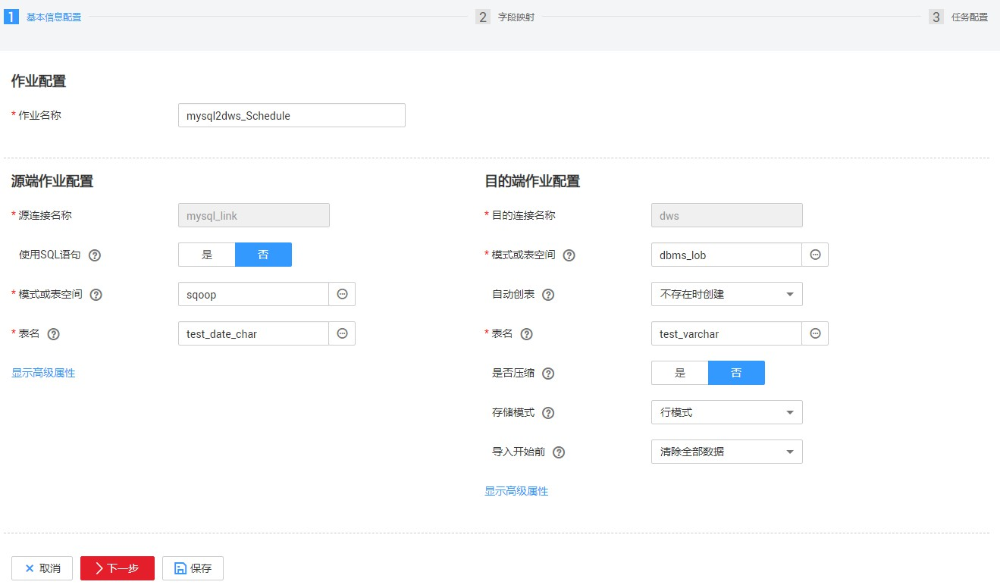
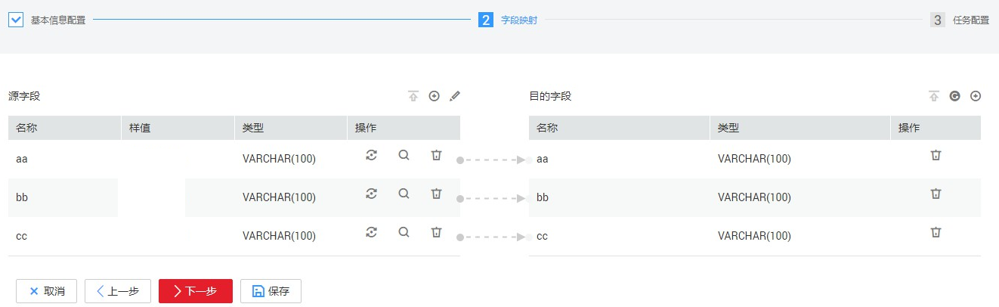

# MySQL数据迁移到DWS

## 操作场景

CDM支持表到表的迁移，本章节以MySQL--\>DWS为例，介绍如何通过CDM将表数据迁移到表中。流程如下：

1.  [创建CDM集群并绑定EIP](#zh-cn_topic_0284710798_section1596917553011)
2.  [创建MySQL连接](#zh-cn_topic_0284710798_section4972205516016)
3.  [创建DWS连接](#zh-cn_topic_0284710798_section5774720191611)
4.  [创建迁移作业](#zh-cn_topic_0284710798_section119151411712)

## 前提条件

-   已获取DWS数据库的IP地址、端口、数据库名称、用户名、密码，且该用户拥有DWS数据库的读、写和删除权限。
-   已获取连接MySQL数据库的IP地址、端口、数据库名称、用户名、密码，且该用户拥有MySQL数据库的读写权限。
-   用户已参考[管理驱动](管理驱动.md#dgc_01_0132)，上传了MySQL数据库驱动。

## 创建CDM集群并绑定EIP

1.  如果是独立CDM服务，参考[创建集群](https://support.huaweicloud.com/usermanual-cdm/cdm_01_0018.html)创建CDM集群；如果是作为DGC服务CDM组件使用，参考[创建集群](https://support.huaweicloud.com/usermanual-dgc/dgc_01_0576.html)创建CDM集群。

    关键配置如下：

    -   CDM集群的规格，按待迁移的数据量选择，一般选择cdm.medium即可，满足大部分迁移场景。
    -   CDM集群所在VPC、子网、安全组，选择与DWS集群所在的网络一致。

2.  CDM集群创建完成后，选择集群操作列的“绑定弹性IP“，CDM通过EIP访问MySQL。

    **图 1**  集群列表  
    

    > **说明：** 
    >如果用户对本地数据源的访问通道做了SSL加密，则CDM无法通过弹性IP连接数据源。

## 创建MySQL连接

1.  在集群管理界面，单击集群后的“作业管理“，选择“连接管理  \>  新建连接“，进入连接器类型的选择界面，如[图2](#zh-cn_topic_0284710798_zh-cn_topic_0111325168_fig15373426133913)所示。

    **图 2**  选择连接器类型  
    

2.  选择“MySQL“后单击“下一步“，配置MySQL连接的参数。

    **图 3**  创建MySQL连接  
    

    单击“显示高级属性“可查看更多可选参数，具体请参见[配置关系数据库连接](配置关系数据库连接.md#dgc_01_0044)。这里保持默认，必填参数如[表1](#zh-cn_topic_0284710798_zh-cn_topic_0111325168_zh-cn_topic_0108275298_table5321744015490)所示。

    **表 1**  MySQL连接参数

    
    <table><thead align="left"><tr id="zh-cn_topic_0284710798_zh-cn_topic_0111325168_zh-cn_topic_0108275298_row185605615490"><th class="cellrowborder" valign="top" width="21.39%" id="mcps1.2.4.1.1">
参数名

    </th>
    <th class="cellrowborder" valign="top" width="46.01%" id="mcps1.2.4.1.2">
说明

    </th>
    <th class="cellrowborder" valign="top" width="32.6%" id="mcps1.2.4.1.3">
取值样例

    </th>
    </tr>
    </thead>
    <tbody><tr id="zh-cn_topic_0284710798_zh-cn_topic_0111325168_zh-cn_topic_0108275298_row6448267615421"><td class="cellrowborder" valign="top" width="21.39%" headers="mcps1.2.4.1.1 ">
名称

    </td>
    <td class="cellrowborder" valign="top" width="46.01%" headers="mcps1.2.4.1.2 ">
输入便于记忆和区分的连接名称。

    </td>
    <td class="cellrowborder" valign="top" width="32.6%" headers="mcps1.2.4.1.3 ">
mysqllink

    </td>
    </tr>
    <tr id="zh-cn_topic_0284710798_zh-cn_topic_0111325168_zh-cn_topic_0108275298_row23645714155554"><td class="cellrowborder" valign="top" width="21.39%" headers="mcps1.2.4.1.1 ">
数据库服务器

    </td>
    <td class="cellrowborder" valign="top" width="46.01%" headers="mcps1.2.4.1.2 ">
MySQL数据库的IP地址或域名。

    </td>
    <td class="cellrowborder" valign="top" width="32.6%" headers="mcps1.2.4.1.3 ">
192.168.1.110

    </td>
    </tr>
    <tr id="zh-cn_topic_0284710798_zh-cn_topic_0111325168_zh-cn_topic_0108275298_row35721234155558"><td class="cellrowborder" valign="top" width="21.39%" headers="mcps1.2.4.1.1 ">
端口

    </td>
    <td class="cellrowborder" valign="top" width="46.01%" headers="mcps1.2.4.1.2 ">
MySQL数据库的端口。

    </td>
    <td class="cellrowborder" valign="top" width="32.6%" headers="mcps1.2.4.1.3 ">
3306

    </td>
    </tr>
    <tr id="zh-cn_topic_0284710798_zh-cn_topic_0111325168_zh-cn_topic_0108275298_row58054787162632"><td class="cellrowborder" valign="top" width="21.39%" headers="mcps1.2.4.1.1 ">
数据库名称

    </td>
    <td class="cellrowborder" valign="top" width="46.01%" headers="mcps1.2.4.1.2 ">
MySQL数据库的名称。

    </td>
    <td class="cellrowborder" valign="top" width="32.6%" headers="mcps1.2.4.1.3 ">
sqoop

    </td>
    </tr>
    <tr id="zh-cn_topic_0284710798_zh-cn_topic_0111325168_zh-cn_topic_0108275298_row121116115490"><td class="cellrowborder" valign="top" width="21.39%" headers="mcps1.2.4.1.1 ">
用户名

    </td>
    <td class="cellrowborder" valign="top" width="46.01%" headers="mcps1.2.4.1.2 ">
拥有MySQL数据库的读、写和删除权限的用户。

    </td>
    <td class="cellrowborder" valign="top" width="32.6%" headers="mcps1.2.4.1.3 ">
admin

    </td>
    </tr>
    <tr id="zh-cn_topic_0284710798_zh-cn_topic_0111325168_zh-cn_topic_0108275298_row4576104015490"><td class="cellrowborder" valign="top" width="21.39%" headers="mcps1.2.4.1.1 ">
密码

    </td>
    <td class="cellrowborder" valign="top" width="46.01%" headers="mcps1.2.4.1.2 ">
用户的密码。

    </td>
    <td class="cellrowborder" valign="top" width="32.6%" headers="mcps1.2.4.1.3 ">
-

    </td>
    </tr>
    <tr id="zh-cn_topic_0284710798_zh-cn_topic_0111325168_zh-cn_topic_0108275298_row117692617437"><td class="cellrowborder" valign="top" width="21.39%" headers="mcps1.2.4.1.1 ">
使用Agent

    </td>
    <td class="cellrowborder" valign="top" width="46.01%" headers="mcps1.2.4.1.2 ">
是否选择通过Agent从源端提取数据。

    </td>
    <td class="cellrowborder" valign="top" width="32.6%" headers="mcps1.2.4.1.3 ">
是

    </td>
    </tr>
    <tr id="zh-cn_topic_0284710798_zh-cn_topic_0111325168_zh-cn_topic_0108275298_row1178882914433"><td class="cellrowborder" valign="top" width="21.39%" headers="mcps1.2.4.1.1 ">
Agent

    </td>
    <td class="cellrowborder" valign="top" width="46.01%" headers="mcps1.2.4.1.2 ">
单击“选择”，选择<a href="管理Agent.md#zh-cn_topic_0207402273_zh-cn_topic_0191978474_section1072083564713">连接Agent</a>中已创建的Agent。

    </td>
    <td class="cellrowborder" valign="top" width="32.6%" headers="mcps1.2.4.1.3 ">
-

    </td>
    </tr>
    </tbody>
    </table>

3.  单击“保存“回到连接管理界面。

    > **说明：** 
    >如果保存时出错，一般是由于MySQL数据库的安全设置问题，需要设置允许CDM集群的EIP访问MySQL数据库。

## 创建DWS连接

1.  在“连接管理“界面单击“新建连接“，连接器类型选择“数据仓库服务（DWS）“。
2.  单击“下一步“配置DWS连接参数，必填参数如[表2](#zh-cn_topic_0284710798_zh-cn_topic_0108275326_zh-cn_topic_0108275298_table385644710314)所示，可选参数保持默认即可。

    **表 2**  DWS连接参数

    
    <table><thead align="left"><tr id="zh-cn_topic_0284710798_zh-cn_topic_0108275326_zh-cn_topic_0108275298_row19841847103118"><th class="cellrowborder" valign="top" width="21.39%" id="mcps1.2.4.1.1">
参数名

    </th>
    <th class="cellrowborder" valign="top" width="46.01%" id="mcps1.2.4.1.2">
说明

    </th>
    <th class="cellrowborder" valign="top" width="32.6%" id="mcps1.2.4.1.3">
取值样例

    </th>
    </tr>
    </thead>
    <tbody><tr id="zh-cn_topic_0284710798_zh-cn_topic_0108275326_zh-cn_topic_0108275298_row20841154712312"><td class="cellrowborder" valign="top" width="21.39%" headers="mcps1.2.4.1.1 ">
名称

    </td>
    <td class="cellrowborder" valign="top" width="46.01%" headers="mcps1.2.4.1.2 ">
输入便于记忆和区分的连接名称。

    </td>
    <td class="cellrowborder" valign="top" width="32.6%" headers="mcps1.2.4.1.3 ">
dwslink

    </td>
    </tr>
    <tr id="zh-cn_topic_0284710798_zh-cn_topic_0108275326_zh-cn_topic_0108275298_row19841194733113"><td class="cellrowborder" valign="top" width="21.39%" headers="mcps1.2.4.1.1 ">
数据库服务器

    </td>
    <td class="cellrowborder" valign="top" width="46.01%" headers="mcps1.2.4.1.2 ">
DWS数据库的IP地址或域名。

    </td>
    <td class="cellrowborder" valign="top" width="32.6%" headers="mcps1.2.4.1.3 ">
192.168.0.3

    </td>
    </tr>
    <tr id="zh-cn_topic_0284710798_zh-cn_topic_0108275326_zh-cn_topic_0108275298_row984144713312"><td class="cellrowborder" valign="top" width="21.39%" headers="mcps1.2.4.1.1 ">
端口

    </td>
    <td class="cellrowborder" valign="top" width="46.01%" headers="mcps1.2.4.1.2 ">
DWS数据库的端口。

    </td>
    <td class="cellrowborder" valign="top" width="32.6%" headers="mcps1.2.4.1.3 ">
8000

    </td>
    </tr>
    <tr id="zh-cn_topic_0284710798_zh-cn_topic_0108275326_zh-cn_topic_0108275298_row11841547133120"><td class="cellrowborder" valign="top" width="21.39%" headers="mcps1.2.4.1.1 ">
数据库名称

    </td>
    <td class="cellrowborder" valign="top" width="46.01%" headers="mcps1.2.4.1.2 ">
DWS数据库的名称。

    </td>
    <td class="cellrowborder" valign="top" width="32.6%" headers="mcps1.2.4.1.3 ">
db_demo

    </td>
    </tr>
    <tr id="zh-cn_topic_0284710798_zh-cn_topic_0108275326_zh-cn_topic_0108275298_row16841114716310"><td class="cellrowborder" valign="top" width="21.39%" headers="mcps1.2.4.1.1 ">
用户名

    </td>
    <td class="cellrowborder" valign="top" width="46.01%" headers="mcps1.2.4.1.2 ">
拥有DWS数据库的读、写和删除权限的用户。

    </td>
    <td class="cellrowborder" valign="top" width="32.6%" headers="mcps1.2.4.1.3 ">
dbadmin

    </td>
    </tr>
    <tr id="zh-cn_topic_0284710798_zh-cn_topic_0108275326_zh-cn_topic_0108275298_row98411347163117"><td class="cellrowborder" valign="top" width="21.39%" headers="mcps1.2.4.1.1 ">
密码

    </td>
    <td class="cellrowborder" valign="top" width="46.01%" headers="mcps1.2.4.1.2 ">
用户的密码。

    </td>
    <td class="cellrowborder" valign="top" width="32.6%" headers="mcps1.2.4.1.3 ">
-

    </td>
    </tr>
    <tr id="zh-cn_topic_0284710798_zh-cn_topic_0108275326_zh-cn_topic_0108275298_row5426134013239"><td class="cellrowborder" valign="top" width="21.39%" headers="mcps1.2.4.1.1 ">
使用Agent

    </td>
    <td class="cellrowborder" valign="top" width="46.01%" headers="mcps1.2.4.1.2 ">
是否选择通过Agent从源端提取数据。

    </td>
    <td class="cellrowborder" valign="top" width="32.6%" headers="mcps1.2.4.1.3 ">
是

    </td>
    </tr>
    <tr id="zh-cn_topic_0284710798_zh-cn_topic_0108275326_zh-cn_topic_0108275298_row9800836192314"><td class="cellrowborder" valign="top" width="21.39%" headers="mcps1.2.4.1.1 ">
Agent

    </td>
    <td class="cellrowborder" valign="top" width="46.01%" headers="mcps1.2.4.1.2 ">
单击“选择”，选择<a href="管理Agent.md#zh-cn_topic_0207402273_zh-cn_topic_0191978474_section1072083564713">连接Agent</a>中已创建的Agent。

    </td>
    <td class="cellrowborder" valign="top" width="32.6%" headers="mcps1.2.4.1.3 ">
-

    </td>
    </tr>
    <tr id="zh-cn_topic_0284710798_zh-cn_topic_0108275326_zh-cn_topic_0108275298_row128561847143117"><td class="cellrowborder" valign="top" width="21.39%" headers="mcps1.2.4.1.1 ">
导入模式

    </td>
    <td class="cellrowborder" valign="top" width="46.01%" headers="mcps1.2.4.1.2 ">
COPY模式：将源数据经过DWS管理节点后拷贝到数据节点。如果需要通过Internet访问DWS，只能使用COPY模式。

    </td>
    <td class="cellrowborder" valign="top" width="32.6%" headers="mcps1.2.4.1.3 ">
COPY

    </td>
    </tr>
    </tbody>
    </table>

3.  单击“保存“完成创建连接。

## 创建迁移作业

1.  选择“表/文件迁移  \>  新建作业“，开始创建从MySQL导出数据到DWS的任务。

    **图 4**  创建MySQL到DWS的迁移任务  
    

    -   作业名称：用户自定义便于记忆、区分的任务名称。
    -   源端作业配置
        -   源连接名称：选择[创建MySQL连接](#zh-cn_topic_0284710798_section4972205516016)中的“mysqllink“。
        -   使用SQL语句：否。
        -   模式或表空间：待抽取数据的模式或表空间名称。
        -   表名：要抽取的表名。
        -   其他可选参数一般情况下保持默认即可，详细说明请参见[配置关系数据库源端参数](配置关系数据库源端参数.md#dgc_01_0054)。

    -   目的端作业配置
        -   目的连接名称：选择[创建DWS连接](#zh-cn_topic_0284710798_section5774720191611)中的连接“dwslink“。
        -   模式或表空间：选择待写入数据的DWS数据库。
        -   自动创表：只有当源端和目的端都为关系数据库时，才有该参数。
        -   表名：待写入数据的表名，可以手动输入一个不存在表名，CDM会在DWS中自动创建该表。
        -   是否压缩：DWS提供的压缩数据能力，如果选择“是“，将进行高级别压缩，CDM提供了适用I/O读写量大，CPU富足（计算相对小）的压缩场景。更多压缩级别详细说明请参见[压缩级别](https://support.huaweicloud.com/bestpractice-dws/dws_05_0011.html#section1)。
        -   存储模式：可以根据具体应用场景，建表的时候选择行存储还是列存储表。一般情况下，如果表的字段比较多（大宽表），查询中涉及到的列不多的情况下，适合列存储。如果表的字段个数比较少，查询大部分字段，那么选择行存储比较好。
        -   扩大字符字段长度：当目的端和源端数据编码格式不一样时，自动建表的字符字段长度可能不够用，配置此选项后CDM自动建表时会将字符字段扩大3倍。
        -   导入前清空数据：任务启动前，是否清除目的表中数据，用户可根据实际需要选择。

2.  单击“下一步“进入字段映射界面，CDM会自动匹配源和目的字段，如[图5](#zh-cn_topic_0284710798_fig1534811262293)所示。

    -   如果字段映射顺序不匹配，可通过拖拽字段调整。
    -   单击，可批量映射字段。
    -   CDM的表达式已经预置常用字符串、日期、数值等类型的字段内容转换，详细请参见[字段转换](https://support.huaweicloud.com/bestpractice-dgc/dgc_05_0012.html)。

    **图 5**  表到表的字段映射  
    

3.  单击“下一步“配置任务参数，一般情况下全部保持默认即可。

    该步骤用户可以配置如下可选功能：

    -   作业失败重试：如果作业执行失败，可选择是否自动重试，这里保持默认值“不重试“。
    -   作业分组：选择作业所属的分组，默认分组为“DEFAULT“。在CDM“作业管理“界面，支持作业分组显示、按组批量启动作业、按分组导出作业等操作。
    -   是否定时执行：如果需要配置作业定时自动执行，请参见[配置定时任务](配置定时任务.md#dgc_01_0082)。这里保持默认值“否“。
    -   抽取并发数：设置同时执行的抽取任务数。可适当调大参数，提升迁移效率。
    -   是否写入脏数据：表到表的迁移容易出现脏数据，建议配置脏数据归档。
    -   作业运行完是否删除：这里保持默认值“不删除“。

4.  单击“保存并运行“，回到作业管理界面，在作业管理界面可查看作业执行进度和结果。
5.  作业执行成功后，单击作业操作列的“历史记录“，可查看该作业的历史执行记录、读取和写入的统计数据。

    在历史记录界面单击“日志“，可查看作业的日志信息。

