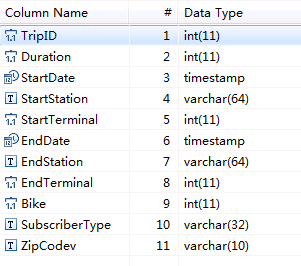
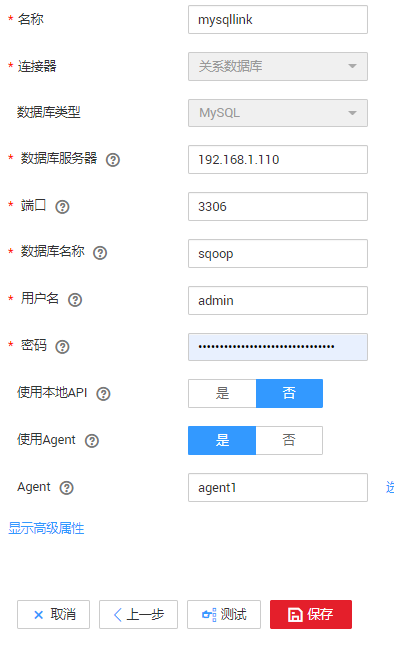
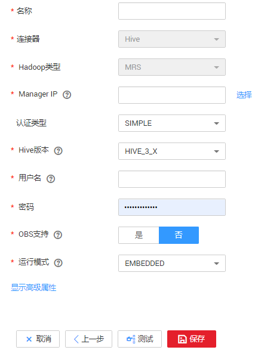
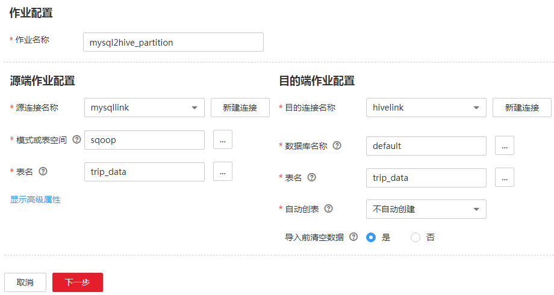
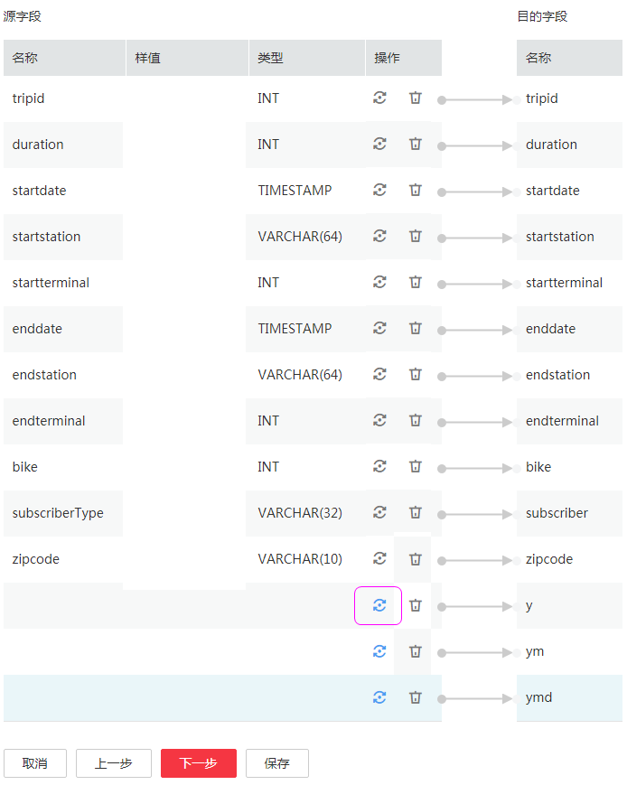
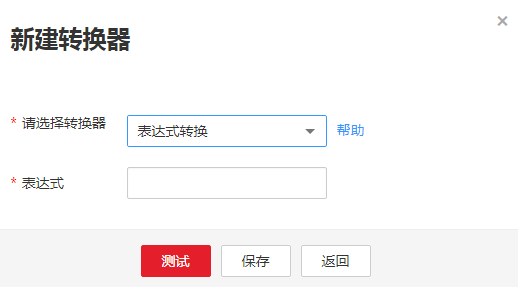

# MySQL数据迁移到MRS Hive分区表<a name="dgc_01_0092"></a>

MapReduce服务（MapReduce Service，简称MRS）提供企业级大数据集群云服务，里面包含HDFS、Hive、Spark等组件，适用于企业海量数据分析。

其中Hive提供类SQL查询语言，帮助用户对大规模的数据进行提取、转换和加载，即通常所称的ETL（Extraction，Transformation，and Loading）操作。对庞大的数据集查询需要耗费大量的时间去处理，在许多场景下，可以通过建立Hive分区方法减少每一次扫描的总数据量，这种做法可以显著地改善性能。

Hive的分区使用HDFS的子目录功能实现，每一个子目录包含了分区对应的列名和每一列的值。当分区很多时，会有很多HDFS子目录，如果不依赖工具，将外部数据加载到Hive表各分区不是一件容易的事情。云数据迁移服务（CDM）可以请轻松将外部数据源（关系数据库、对象存储服务、文件系统服务等）加载到Hive分区表。

下面使用CDM将MySQL数据导入到MRS Hive分区表为例进行介绍。

## 操作场景<a name="zh-cn_topic_0111325168_section848194854517"></a>

假设MySQL上有一张表trip\_data，保存了自行车骑行记录，里面有起始时间、结束时间，起始站点、结束站点、骑手ID等信息，trip\_data表字段定义如[图1](#zh-cn_topic_0111325168_fig5406153795610)所示。

**图 1**  MySQL表字段<a name="zh-cn_topic_0111325168_fig5406153795610"></a>  


使用CDM将MySQL中的表trip\_data导入到MRS Hive分区表，流程如下：

1.  [在MRS Hive上创建Hive分区表](#zh-cn_topic_0111325168_section143383811272)
2.  [创建CDM集群并绑定EIP](#zh-cn_topic_0111325168_section563314494359)
3.  [创建MySQL连接](#zh-cn_topic_0111325168_section459563891734)
4.  [创建Hive连接](#zh-cn_topic_0111325168_section209397834812)
5.  [创建迁移作业](#zh-cn_topic_0111325168_section1821596484)

## 前提条件<a name="zh-cn_topic_0111325168_section425442671733"></a>

-   已经购买MRS。
-   已获取连接MySQL数据库的IP地址、端口、数据库名称、用户名、密码，且该用户拥有MySQL数据库的读写权限。
-   已参考[管理驱动](管理驱动.md#dgc_01_0132)，上传了MySQL数据库驱动。

## 在MRS Hive上创建Hive分区表<a name="zh-cn_topic_0111325168_section143383811272"></a>

在MRS的Hive上使用下面SQL语句创建一张Hive分区表，表名与MySQL上的表trip\_data一致，且Hive表比MySQL表多建三个字段y、ym、ymd，作为Hive的分区字段。SQL语句如下：

```
create table trip_data(TripID int,Duration int,StartDate timestamp,StartStation varchar(64),StartTerminal int,EndDate timestamp,EndStation varchar(64),EndTerminal int,Bike int,SubscriberType varchar(32),ZipCodev varchar(10))partitioned by (y int,ym int,ymd int);
```

> **说明：** 
>Hive表trip\_data有三个分区字段：骑行起始时间的年、骑行起始时间的年月、骑行起始时间的年月日，例如一条骑行记录的起始时间为2018/5/11 9:40，那么这条记录会保存在分区trip\_data/2018/201805/20180511下面。对trip\_data进行按时间维度统计汇总时，只需要对局部数据扫描，大大提升性能。

## 创建CDM集群并绑定EIP<a name="zh-cn_topic_0111325168_section563314494359"></a>

1.  如果是独立CDM服务，参考[创建集群](https://support.huaweicloud.com/usermanual-cdm/cdm_01_0018.html)创建CDM集群；如果是作为DGC服务CDM组件使用，参考[创建集群](https://support.huaweicloud.com/usermanual-dgc/dgc_01_0576.html)创建CDM集群。

    关键配置如下：

    -   CDM集群的规格，按待迁移的数据量选择，一般选择cdm.medium即可，满足大部分迁移场景。
    -   CDM集群所在VPC、子网、安全组，选择与MRS集群所在的网络一致。

2.  CDM集群创建完成后，选择集群操作列的“绑定弹性IP“，CDM通过EIP访问MySQL。

    **图 2**  集群列表<a name="zh-cn_topic_0111325168_fig570312018444"></a>  
    

    > **说明：** 
    >如果用户对本地数据源的访问通道做了SSL加密，则CDM无法通过弹性IP连接数据源。


## 创建MySQL连接<a name="zh-cn_topic_0111325168_section459563891734"></a>

1.  在集群管理界面，单击集群后的“作业管理“，选择“连接管理  \>  新建连接“，进入连接器类型的选择界面，如[图3](#zh-cn_topic_0111325168_fig15373426133913)所示。

    **图 3**  选择连接器类型<a name="zh-cn_topic_0111325168_fig15373426133913"></a>  
    

2.  选择“MySQL“后单击“下一步“，配置MySQL连接的参数。

    **图 4**  创建MySQL连接<a name="zh-cn_topic_0111325168_zh-cn_topic_0108275298_fig17438459415"></a>  
    

    单击“显示高级属性“可查看更多可选参数，具体请参见[配置关系数据库连接](配置关系数据库连接.md#dgc_01_0044)。这里保持默认，必填参数如[表1](#zh-cn_topic_0111325168_zh-cn_topic_0108275298_table5321744015490)所示。

    **表 1**  MySQL连接参数

    <a name="zh-cn_topic_0111325168_zh-cn_topic_0108275298_table5321744015490"></a>
    <table><thead align="left"><tr id="zh-cn_topic_0111325168_zh-cn_topic_0108275298_row185605615490"><th class="cellrowborder" valign="top" width="21.39%" id="mcps1.2.4.1.1"><p id="zh-cn_topic_0111325168_zh-cn_topic_0108275298_p3088488815490"><a name="zh-cn_topic_0111325168_zh-cn_topic_0108275298_p3088488815490"></a><a name="zh-cn_topic_0111325168_zh-cn_topic_0108275298_p3088488815490"></a>参数名</p>
    </th>
    <th class="cellrowborder" valign="top" width="46.01%" id="mcps1.2.4.1.2"><p id="zh-cn_topic_0111325168_zh-cn_topic_0108275298_p1864797615490"><a name="zh-cn_topic_0111325168_zh-cn_topic_0108275298_p1864797615490"></a><a name="zh-cn_topic_0111325168_zh-cn_topic_0108275298_p1864797615490"></a>说明</p>
    </th>
    <th class="cellrowborder" valign="top" width="32.6%" id="mcps1.2.4.1.3"><p id="zh-cn_topic_0111325168_zh-cn_topic_0108275298_p12195902165556"><a name="zh-cn_topic_0111325168_zh-cn_topic_0108275298_p12195902165556"></a><a name="zh-cn_topic_0111325168_zh-cn_topic_0108275298_p12195902165556"></a>取值样例</p>
    </th>
    </tr>
    </thead>
    <tbody><tr id="zh-cn_topic_0111325168_zh-cn_topic_0108275298_row6448267615421"><td class="cellrowborder" valign="top" width="21.39%" headers="mcps1.2.4.1.1 "><p id="zh-cn_topic_0111325168_zh-cn_topic_0108275298_p5571423915421"><a name="zh-cn_topic_0111325168_zh-cn_topic_0108275298_p5571423915421"></a><a name="zh-cn_topic_0111325168_zh-cn_topic_0108275298_p5571423915421"></a>名称</p>
    </td>
    <td class="cellrowborder" valign="top" width="46.01%" headers="mcps1.2.4.1.2 "><p id="zh-cn_topic_0111325168_zh-cn_topic_0108275298_p1655951515421"><a name="zh-cn_topic_0111325168_zh-cn_topic_0108275298_p1655951515421"></a><a name="zh-cn_topic_0111325168_zh-cn_topic_0108275298_p1655951515421"></a>输入便于记忆和区分的连接名称。</p>
    </td>
    <td class="cellrowborder" valign="top" width="32.6%" headers="mcps1.2.4.1.3 "><p id="zh-cn_topic_0111325168_zh-cn_topic_0108275298_p6625233515421"><a name="zh-cn_topic_0111325168_zh-cn_topic_0108275298_p6625233515421"></a><a name="zh-cn_topic_0111325168_zh-cn_topic_0108275298_p6625233515421"></a>mysqllink</p>
    </td>
    </tr>
    <tr id="zh-cn_topic_0111325168_zh-cn_topic_0108275298_row23645714155554"><td class="cellrowborder" valign="top" width="21.39%" headers="mcps1.2.4.1.1 "><p id="zh-cn_topic_0111325168_zh-cn_topic_0108275298_p36254680155554"><a name="zh-cn_topic_0111325168_zh-cn_topic_0108275298_p36254680155554"></a><a name="zh-cn_topic_0111325168_zh-cn_topic_0108275298_p36254680155554"></a>数据库服务器</p>
    </td>
    <td class="cellrowborder" valign="top" width="46.01%" headers="mcps1.2.4.1.2 "><p id="zh-cn_topic_0111325168_zh-cn_topic_0108275298_p57055815164650"><a name="zh-cn_topic_0111325168_zh-cn_topic_0108275298_p57055815164650"></a><a name="zh-cn_topic_0111325168_zh-cn_topic_0108275298_p57055815164650"></a>MySQL数据库的IP地址或域名。</p>
    </td>
    <td class="cellrowborder" valign="top" width="32.6%" headers="mcps1.2.4.1.3 "><p id="zh-cn_topic_0111325168_zh-cn_topic_0108275298_p54006514165556"><a name="zh-cn_topic_0111325168_zh-cn_topic_0108275298_p54006514165556"></a><a name="zh-cn_topic_0111325168_zh-cn_topic_0108275298_p54006514165556"></a>192.168.1.110</p>
    </td>
    </tr>
    <tr id="zh-cn_topic_0111325168_zh-cn_topic_0108275298_row35721234155558"><td class="cellrowborder" valign="top" width="21.39%" headers="mcps1.2.4.1.1 "><p id="zh-cn_topic_0111325168_zh-cn_topic_0108275298_p7738819155558"><a name="zh-cn_topic_0111325168_zh-cn_topic_0108275298_p7738819155558"></a><a name="zh-cn_topic_0111325168_zh-cn_topic_0108275298_p7738819155558"></a>端口</p>
    </td>
    <td class="cellrowborder" valign="top" width="46.01%" headers="mcps1.2.4.1.2 "><p id="zh-cn_topic_0111325168_zh-cn_topic_0108275298_p44462215165646"><a name="zh-cn_topic_0111325168_zh-cn_topic_0108275298_p44462215165646"></a><a name="zh-cn_topic_0111325168_zh-cn_topic_0108275298_p44462215165646"></a>MySQL数据库的端口。</p>
    </td>
    <td class="cellrowborder" valign="top" width="32.6%" headers="mcps1.2.4.1.3 "><p id="zh-cn_topic_0111325168_zh-cn_topic_0108275298_p44954710165556"><a name="zh-cn_topic_0111325168_zh-cn_topic_0108275298_p44954710165556"></a><a name="zh-cn_topic_0111325168_zh-cn_topic_0108275298_p44954710165556"></a>3306</p>
    </td>
    </tr>
    <tr id="zh-cn_topic_0111325168_zh-cn_topic_0108275298_row58054787162632"><td class="cellrowborder" valign="top" width="21.39%" headers="mcps1.2.4.1.1 "><p id="zh-cn_topic_0111325168_zh-cn_topic_0108275298_p4817321162632"><a name="zh-cn_topic_0111325168_zh-cn_topic_0108275298_p4817321162632"></a><a name="zh-cn_topic_0111325168_zh-cn_topic_0108275298_p4817321162632"></a>数据库名称</p>
    </td>
    <td class="cellrowborder" valign="top" width="46.01%" headers="mcps1.2.4.1.2 "><p id="zh-cn_topic_0111325168_zh-cn_topic_0108275298_p23569444165647"><a name="zh-cn_topic_0111325168_zh-cn_topic_0108275298_p23569444165647"></a><a name="zh-cn_topic_0111325168_zh-cn_topic_0108275298_p23569444165647"></a>MySQL数据库的名称。</p>
    </td>
    <td class="cellrowborder" valign="top" width="32.6%" headers="mcps1.2.4.1.3 "><p id="zh-cn_topic_0111325168_zh-cn_topic_0108275298_p22858665165556"><a name="zh-cn_topic_0111325168_zh-cn_topic_0108275298_p22858665165556"></a><a name="zh-cn_topic_0111325168_zh-cn_topic_0108275298_p22858665165556"></a>sqoop</p>
    </td>
    </tr>
    <tr id="zh-cn_topic_0111325168_zh-cn_topic_0108275298_row121116115490"><td class="cellrowborder" valign="top" width="21.39%" headers="mcps1.2.4.1.1 "><p id="zh-cn_topic_0111325168_zh-cn_topic_0108275298_p3099525315490"><a name="zh-cn_topic_0111325168_zh-cn_topic_0108275298_p3099525315490"></a><a name="zh-cn_topic_0111325168_zh-cn_topic_0108275298_p3099525315490"></a>用户名</p>
    </td>
    <td class="cellrowborder" valign="top" width="46.01%" headers="mcps1.2.4.1.2 "><p id="zh-cn_topic_0111325168_zh-cn_topic_0108275298_p2758753215490"><a name="zh-cn_topic_0111325168_zh-cn_topic_0108275298_p2758753215490"></a><a name="zh-cn_topic_0111325168_zh-cn_topic_0108275298_p2758753215490"></a>拥有MySQL数据库的读、写和删除权限的用户。</p>
    </td>
    <td class="cellrowborder" valign="top" width="32.6%" headers="mcps1.2.4.1.3 "><p id="zh-cn_topic_0111325168_zh-cn_topic_0108275298_p14053644165556"><a name="zh-cn_topic_0111325168_zh-cn_topic_0108275298_p14053644165556"></a><a name="zh-cn_topic_0111325168_zh-cn_topic_0108275298_p14053644165556"></a>admin</p>
    </td>
    </tr>
    <tr id="zh-cn_topic_0111325168_zh-cn_topic_0108275298_row4576104015490"><td class="cellrowborder" valign="top" width="21.39%" headers="mcps1.2.4.1.1 "><p id="zh-cn_topic_0111325168_zh-cn_topic_0108275298_p1565673415490"><a name="zh-cn_topic_0111325168_zh-cn_topic_0108275298_p1565673415490"></a><a name="zh-cn_topic_0111325168_zh-cn_topic_0108275298_p1565673415490"></a>密码</p>
    </td>
    <td class="cellrowborder" valign="top" width="46.01%" headers="mcps1.2.4.1.2 "><p id="zh-cn_topic_0111325168_zh-cn_topic_0108275298_p6023590815490"><a name="zh-cn_topic_0111325168_zh-cn_topic_0108275298_p6023590815490"></a><a name="zh-cn_topic_0111325168_zh-cn_topic_0108275298_p6023590815490"></a>用户的密码。</p>
    </td>
    <td class="cellrowborder" valign="top" width="32.6%" headers="mcps1.2.4.1.3 "><p id="zh-cn_topic_0111325168_zh-cn_topic_0108275298_p44559445165556"><a name="zh-cn_topic_0111325168_zh-cn_topic_0108275298_p44559445165556"></a><a name="zh-cn_topic_0111325168_zh-cn_topic_0108275298_p44559445165556"></a>-</p>
    </td>
    </tr>
    <tr id="zh-cn_topic_0111325168_zh-cn_topic_0108275298_row117692617437"><td class="cellrowborder" valign="top" width="21.39%" headers="mcps1.2.4.1.1 "><p id="zh-cn_topic_0111325168_zh-cn_topic_0108275298_p18773153334318"><a name="zh-cn_topic_0111325168_zh-cn_topic_0108275298_p18773153334318"></a><a name="zh-cn_topic_0111325168_zh-cn_topic_0108275298_p18773153334318"></a>使用Agent</p>
    </td>
    <td class="cellrowborder" valign="top" width="46.01%" headers="mcps1.2.4.1.2 "><p id="zh-cn_topic_0111325168_zh-cn_topic_0108275298_p877373317439"><a name="zh-cn_topic_0111325168_zh-cn_topic_0108275298_p877373317439"></a><a name="zh-cn_topic_0111325168_zh-cn_topic_0108275298_p877373317439"></a>是否选择通过Agent从源端提取数据。</p>
    </td>
    <td class="cellrowborder" valign="top" width="32.6%" headers="mcps1.2.4.1.3 "><p id="zh-cn_topic_0111325168_zh-cn_topic_0108275298_p1977311335439"><a name="zh-cn_topic_0111325168_zh-cn_topic_0108275298_p1977311335439"></a><a name="zh-cn_topic_0111325168_zh-cn_topic_0108275298_p1977311335439"></a>是</p>
    </td>
    </tr>
    <tr id="zh-cn_topic_0111325168_zh-cn_topic_0108275298_row1178882914433"><td class="cellrowborder" valign="top" width="21.39%" headers="mcps1.2.4.1.1 "><p id="zh-cn_topic_0111325168_zh-cn_topic_0108275298_p2077320332430"><a name="zh-cn_topic_0111325168_zh-cn_topic_0108275298_p2077320332430"></a><a name="zh-cn_topic_0111325168_zh-cn_topic_0108275298_p2077320332430"></a>Agent</p>
    </td>
    <td class="cellrowborder" valign="top" width="46.01%" headers="mcps1.2.4.1.2 "><p id="zh-cn_topic_0111325168_zh-cn_topic_0108275298_p1877310336437"><a name="zh-cn_topic_0111325168_zh-cn_topic_0108275298_p1877310336437"></a><a name="zh-cn_topic_0111325168_zh-cn_topic_0108275298_p1877310336437"></a>单击<span class="uicontrol" id="zh-cn_topic_0111325168_zh-cn_topic_0108275298_uicontrol1773183344318"><a name="zh-cn_topic_0111325168_zh-cn_topic_0108275298_uicontrol1773183344318"></a><a name="zh-cn_topic_0111325168_zh-cn_topic_0108275298_uicontrol1773183344318"></a>“选择”</span>，选择<a href="管理Agent.md#zh-cn_topic_0207402273_zh-cn_topic_0191978474_section1072083564713">连接Agent</a>中已创建的Agent。</p>
    </td>
    <td class="cellrowborder" valign="top" width="32.6%" headers="mcps1.2.4.1.3 "><p id="zh-cn_topic_0111325168_zh-cn_topic_0108275298_p16773533154317"><a name="zh-cn_topic_0111325168_zh-cn_topic_0108275298_p16773533154317"></a><a name="zh-cn_topic_0111325168_zh-cn_topic_0108275298_p16773533154317"></a>-</p>
    </td>
    </tr>
    </tbody>
    </table>

3.  单击“保存“回到连接管理界面。

    > **说明：** 
    >如果保存时出错，一般是由于MySQL数据库的安全设置问题，需要设置允许CDM集群的EIP访问MySQL数据库。


## 创建Hive连接<a name="zh-cn_topic_0111325168_section209397834812"></a>

1.  在连接管理界面，单击“新建连接“，连接器类型选择“MRS Hive“。
2.  单击“下一步“配置Hive连接参数，如[图5](#zh-cn_topic_0111325168_fig1219924816)所示。

    **图 5**  创建Hive连接<a name="zh-cn_topic_0111325168_fig1219924816"></a>  
    

    各参数说明如[表2](#zh-cn_topic_0111325168_table6441152003419)所示，需要您根据实际情况配置。

    **表 2**  MRS Hive连接参数

    <a name="zh-cn_topic_0111325168_table6441152003419"></a>
    <table><thead align="left"><tr id="zh-cn_topic_0111325168_zh-cn_topic_0108618545_row918111835015"><th class="cellrowborder" valign="top" width="16.72%" id="mcps1.2.4.1.1"><p id="zh-cn_topic_0111325168_zh-cn_topic_0108618545_p111816835015"><a name="zh-cn_topic_0111325168_zh-cn_topic_0108618545_p111816835015"></a><a name="zh-cn_topic_0111325168_zh-cn_topic_0108618545_p111816835015"></a>参数名</p>
    </th>
    <th class="cellrowborder" valign="top" width="62.1%" id="mcps1.2.4.1.2"><p id="zh-cn_topic_0111325168_zh-cn_topic_0108618545_p171813845018"><a name="zh-cn_topic_0111325168_zh-cn_topic_0108618545_p171813845018"></a><a name="zh-cn_topic_0111325168_zh-cn_topic_0108618545_p171813845018"></a>说明</p>
    </th>
    <th class="cellrowborder" valign="top" width="21.18%" id="mcps1.2.4.1.3"><p id="zh-cn_topic_0111325168_zh-cn_topic_0108618545_p8181198115015"><a name="zh-cn_topic_0111325168_zh-cn_topic_0108618545_p8181198115015"></a><a name="zh-cn_topic_0111325168_zh-cn_topic_0108618545_p8181198115015"></a>取值样例</p>
    </th>
    </tr>
    </thead>
    <tbody><tr id="zh-cn_topic_0111325168_zh-cn_topic_0108618545_row151817815505"><td class="cellrowborder" valign="top" width="16.72%" headers="mcps1.2.4.1.1 "><p id="zh-cn_topic_0111325168_zh-cn_topic_0108618545_p218198205013"><a name="zh-cn_topic_0111325168_zh-cn_topic_0108618545_p218198205013"></a><a name="zh-cn_topic_0111325168_zh-cn_topic_0108618545_p218198205013"></a>名称</p>
    </td>
    <td class="cellrowborder" valign="top" width="62.1%" headers="mcps1.2.4.1.2 "><p id="zh-cn_topic_0111325168_zh-cn_topic_0108618545_p5181487501"><a name="zh-cn_topic_0111325168_zh-cn_topic_0108618545_p5181487501"></a><a name="zh-cn_topic_0111325168_zh-cn_topic_0108618545_p5181487501"></a>连接的名称，根据连接的数据源类型，用户可自定义便于记忆、区分的连接名。</p>
    </td>
    <td class="cellrowborder" valign="top" width="21.18%" headers="mcps1.2.4.1.3 "><p id="zh-cn_topic_0111325168_zh-cn_topic_0108618545_p10181138135017"><a name="zh-cn_topic_0111325168_zh-cn_topic_0108618545_p10181138135017"></a><a name="zh-cn_topic_0111325168_zh-cn_topic_0108618545_p10181138135017"></a>hivelink</p>
    </td>
    </tr>
    <tr id="zh-cn_topic_0111325168_zh-cn_topic_0108618545_row16181208165013"><td class="cellrowborder" valign="top" width="16.72%" headers="mcps1.2.4.1.1 "><p id="zh-cn_topic_0111325168_zh-cn_topic_0108618545_p21818818506"><a name="zh-cn_topic_0111325168_zh-cn_topic_0108618545_p21818818506"></a><a name="zh-cn_topic_0111325168_zh-cn_topic_0108618545_p21818818506"></a>Manager IP</p>
    </td>
    <td class="cellrowborder" valign="top" width="62.1%" headers="mcps1.2.4.1.2 "><p id="zh-cn_topic_0111325168_zh-cn_topic_0108618545_p218148165010"><a name="zh-cn_topic_0111325168_zh-cn_topic_0108618545_p218148165010"></a><a name="zh-cn_topic_0111325168_zh-cn_topic_0108618545_p218148165010"></a>MRS Manager的浮动IP地址，可以单击输入框后的<span class="uicontrol" id="zh-cn_topic_0111325168_zh-cn_topic_0108618545_zh-cn_topic_0108275286_uicontrol926725316310"><a name="zh-cn_topic_0111325168_zh-cn_topic_0108618545_zh-cn_topic_0108275286_uicontrol926725316310"></a><a name="zh-cn_topic_0111325168_zh-cn_topic_0108618545_zh-cn_topic_0108275286_uicontrol926725316310"></a>“选择”</span>来选定已创建的MRS集群，CDM会自动填充下面的鉴权参数。</p>
    </td>
    <td class="cellrowborder" valign="top" width="21.18%" headers="mcps1.2.4.1.3 "><p id="zh-cn_topic_0111325168_zh-cn_topic_0108618545_p718110815509"><a name="zh-cn_topic_0111325168_zh-cn_topic_0108618545_p718110815509"></a><a name="zh-cn_topic_0111325168_zh-cn_topic_0108618545_p718110815509"></a>127.0.0.1</p>
    </td>
    </tr>
    <tr id="zh-cn_topic_0111325168_zh-cn_topic_0108618545_row7181168105018"><td class="cellrowborder" valign="top" width="16.72%" headers="mcps1.2.4.1.1 "><p id="zh-cn_topic_0111325168_zh-cn_topic_0108618545_p141816885017"><a name="zh-cn_topic_0111325168_zh-cn_topic_0108618545_p141816885017"></a><a name="zh-cn_topic_0111325168_zh-cn_topic_0108618545_p141816885017"></a>认证类型</p>
    </td>
    <td class="cellrowborder" valign="top" width="62.1%" headers="mcps1.2.4.1.2 "><div class="p" id="zh-cn_topic_0111325168_zh-cn_topic_0108618545_p11181148185017"><a name="zh-cn_topic_0111325168_zh-cn_topic_0108618545_p11181148185017"></a><a name="zh-cn_topic_0111325168_zh-cn_topic_0108618545_p11181148185017"></a>访问MRS的认证类型：<a name="zh-cn_topic_0111325168_zh-cn_topic_0108618545_ul12623191718453"></a><a name="zh-cn_topic_0111325168_zh-cn_topic_0108618545_ul12623191718453"></a><ul id="zh-cn_topic_0111325168_zh-cn_topic_0108618545_ul12623191718453"><li>SIMPLE：非安全模式选择Simple鉴权。</li><li>KERBEROS：安全模式选择Kerberos鉴权。</li></ul>
    </div>
    </td>
    <td class="cellrowborder" valign="top" width="21.18%" headers="mcps1.2.4.1.3 "><p id="zh-cn_topic_0111325168_zh-cn_topic_0108618545_p818111819508"><a name="zh-cn_topic_0111325168_zh-cn_topic_0108618545_p818111819508"></a><a name="zh-cn_topic_0111325168_zh-cn_topic_0108618545_p818111819508"></a>SIMPLE</p>
    </td>
    </tr>
    <tr id="zh-cn_topic_0111325168_zh-cn_topic_0108618545_row6181138195013"><td class="cellrowborder" valign="top" width="16.72%" headers="mcps1.2.4.1.1 "><p id="zh-cn_topic_0111325168_zh-cn_topic_0108618545_p51811188500"><a name="zh-cn_topic_0111325168_zh-cn_topic_0108618545_p51811188500"></a><a name="zh-cn_topic_0111325168_zh-cn_topic_0108618545_p51811188500"></a>Hive版本</p>
    </td>
    <td class="cellrowborder" valign="top" width="62.1%" headers="mcps1.2.4.1.2 "><p id="zh-cn_topic_0111325168_zh-cn_topic_0108618545_p111811682501"><a name="zh-cn_topic_0111325168_zh-cn_topic_0108618545_p111811682501"></a><a name="zh-cn_topic_0111325168_zh-cn_topic_0108618545_p111811682501"></a>Hive的版本。根据服务端Hive版本设置。</p>
    </td>
    <td class="cellrowborder" valign="top" width="21.18%" headers="mcps1.2.4.1.3 "><p id="zh-cn_topic_0111325168_zh-cn_topic_0108618545_p191811987501"><a name="zh-cn_topic_0111325168_zh-cn_topic_0108618545_p191811987501"></a><a name="zh-cn_topic_0111325168_zh-cn_topic_0108618545_p191811987501"></a>HIVE_3_X</p>
    </td>
    </tr>
    <tr id="zh-cn_topic_0111325168_zh-cn_topic_0108618545_row818110813502"><td class="cellrowborder" valign="top" width="16.72%" headers="mcps1.2.4.1.1 "><p id="zh-cn_topic_0111325168_zh-cn_topic_0108618545_p1818118185015"><a name="zh-cn_topic_0111325168_zh-cn_topic_0108618545_p1818118185015"></a><a name="zh-cn_topic_0111325168_zh-cn_topic_0108618545_p1818118185015"></a>用户名</p>
    </td>
    <td class="cellrowborder" valign="top" width="62.1%" headers="mcps1.2.4.1.2 "><p id="zh-cn_topic_0111325168_zh-cn_topic_0108618545_p1018178155019"><a name="zh-cn_topic_0111325168_zh-cn_topic_0108618545_p1018178155019"></a><a name="zh-cn_topic_0111325168_zh-cn_topic_0108618545_p1018178155019"></a>选择KERBEROS鉴权时，需要配置MRS Manager的用户名和密码。从HDFS导出目录时，如果需要创建快照，这里配置的用户需要HDFS系统的管理员权限。</p>
    <div class="p" id="zh-cn_topic_0111325168_zh-cn_topic_0108618545_p129641211269"><a name="zh-cn_topic_0111325168_zh-cn_topic_0108618545_p129641211269"></a><a name="zh-cn_topic_0111325168_zh-cn_topic_0108618545_p129641211269"></a>如果要创建MRS安全集群的数据连接，不能使用admin用户。因为admin用户是默认的管理页面用户，这个用户无法作为安全集群的认证用户来使用。您可以创建一个新的MRS用户，然后在创建MRS数据连接时，<span class="parmname" id="zh-cn_topic_0111325168_zh-cn_topic_0108618545_dgc_01_0009_parmname3468191262313"><a name="zh-cn_topic_0111325168_zh-cn_topic_0108618545_dgc_01_0009_parmname3468191262313"></a><a name="zh-cn_topic_0111325168_zh-cn_topic_0108618545_dgc_01_0009_parmname3468191262313"></a>“用户名”</span>和<span class="parmname" id="zh-cn_topic_0111325168_zh-cn_topic_0108618545_dgc_01_0009_parmname64683124231"><a name="zh-cn_topic_0111325168_zh-cn_topic_0108618545_dgc_01_0009_parmname64683124231"></a><a name="zh-cn_topic_0111325168_zh-cn_topic_0108618545_dgc_01_0009_parmname64683124231"></a>“密码”</span>填写为新建的MRS用户及其密码。<div class="note" id="zh-cn_topic_0111325168_zh-cn_topic_0108618545_note15451659151217"><a name="zh-cn_topic_0111325168_zh-cn_topic_0108618545_note15451659151217"></a><a name="zh-cn_topic_0111325168_zh-cn_topic_0108618545_note15451659151217"></a><span class="notetitle"> 说明： </span><div class="notebody"><a name="zh-cn_topic_0111325168_zh-cn_topic_0108618545_ul17715141011134"></a><a name="zh-cn_topic_0111325168_zh-cn_topic_0108618545_ul17715141011134"></a><ul id="zh-cn_topic_0111325168_zh-cn_topic_0108618545_ul17715141011134"><li>如果CDM集群为2.9.0版本及之后版本，且MRS集群为3.1.0及之后版本，则所创建的用户至少需具备Manager_viewer的角色权限才能在CDM创建连接；如果需要对应组件的进行库、表、数据的操作，还需要添加对应组件的用户组权限。</li><li>如果CDM集群为2.9.0之前的版本，或MRS集群为3.1.0之前的版本，则所创建的用户需要具备Manager_administrator或System_administrator权限，才能在CDM创建连接。</li><li>仅具备Manager_tenant或Manager_auditor权限，无法创建连接。</li></ul>
    </div></div>
    </div>
    </td>
    <td class="cellrowborder" valign="top" width="21.18%" headers="mcps1.2.4.1.3 "><p id="zh-cn_topic_0111325168_zh-cn_topic_0108618545_p1318119865013"><a name="zh-cn_topic_0111325168_zh-cn_topic_0108618545_p1318119865013"></a><a name="zh-cn_topic_0111325168_zh-cn_topic_0108618545_p1318119865013"></a>cdm</p>
    </td>
    </tr>
    <tr id="zh-cn_topic_0111325168_zh-cn_topic_0108618545_row8181188155013"><td class="cellrowborder" valign="top" width="16.72%" headers="mcps1.2.4.1.1 "><p id="zh-cn_topic_0111325168_zh-cn_topic_0108618545_p12181583505"><a name="zh-cn_topic_0111325168_zh-cn_topic_0108618545_p12181583505"></a><a name="zh-cn_topic_0111325168_zh-cn_topic_0108618545_p12181583505"></a>密码</p>
    </td>
    <td class="cellrowborder" valign="top" width="62.1%" headers="mcps1.2.4.1.2 "><p id="zh-cn_topic_0111325168_zh-cn_topic_0108618545_p14181480502"><a name="zh-cn_topic_0111325168_zh-cn_topic_0108618545_p14181480502"></a><a name="zh-cn_topic_0111325168_zh-cn_topic_0108618545_p14181480502"></a>访问MRS Manager的用户密码。</p>
    </td>
    <td class="cellrowborder" valign="top" width="21.18%" headers="mcps1.2.4.1.3 "><p id="zh-cn_topic_0111325168_zh-cn_topic_0108618545_p6181689507"><a name="zh-cn_topic_0111325168_zh-cn_topic_0108618545_p6181689507"></a><a name="zh-cn_topic_0111325168_zh-cn_topic_0108618545_p6181689507"></a>-</p>
    </td>
    </tr>
    <tr id="zh-cn_topic_0111325168_zh-cn_topic_0108618545_row191817855019"><td class="cellrowborder" valign="top" width="16.72%" headers="mcps1.2.4.1.1 "><p id="zh-cn_topic_0111325168_zh-cn_topic_0108618545_p718111875014"><a name="zh-cn_topic_0111325168_zh-cn_topic_0108618545_p718111875014"></a><a name="zh-cn_topic_0111325168_zh-cn_topic_0108618545_p718111875014"></a>OBS支持</p>
    </td>
    <td class="cellrowborder" valign="top" width="62.1%" headers="mcps1.2.4.1.2 "><p id="zh-cn_topic_0111325168_zh-cn_topic_0108618545_p15181783504"><a name="zh-cn_topic_0111325168_zh-cn_topic_0108618545_p15181783504"></a><a name="zh-cn_topic_0111325168_zh-cn_topic_0108618545_p15181783504"></a>需服务端支持OBS存储。在创建Hive表时，您可以指定将表存储在OBS中。</p>
    </td>
    <td class="cellrowborder" valign="top" width="21.18%" headers="mcps1.2.4.1.3 "><p id="zh-cn_topic_0111325168_zh-cn_topic_0108618545_p141818819501"><a name="zh-cn_topic_0111325168_zh-cn_topic_0108618545_p141818819501"></a><a name="zh-cn_topic_0111325168_zh-cn_topic_0108618545_p141818819501"></a>否</p>
    </td>
    </tr>
    <tr id="zh-cn_topic_0111325168_zh-cn_topic_0108618545_row218148115017"><td class="cellrowborder" valign="top" width="16.72%" headers="mcps1.2.4.1.1 "><p id="zh-cn_topic_0111325168_zh-cn_topic_0108618545_p1718178205019"><a name="zh-cn_topic_0111325168_zh-cn_topic_0108618545_p1718178205019"></a><a name="zh-cn_topic_0111325168_zh-cn_topic_0108618545_p1718178205019"></a>运行模式</p>
    </td>
    <td class="cellrowborder" valign="top" width="62.1%" headers="mcps1.2.4.1.2 "><div class="p" id="zh-cn_topic_0111325168_zh-cn_topic_0108618545_p918188135016"><a name="zh-cn_topic_0111325168_zh-cn_topic_0108618545_p918188135016"></a><a name="zh-cn_topic_0111325168_zh-cn_topic_0108618545_p918188135016"></a><span class="parmvalue" id="zh-cn_topic_0111325168_zh-cn_topic_0108618545_parmvalue12272019556"><a name="zh-cn_topic_0111325168_zh-cn_topic_0108618545_parmvalue12272019556"></a><a name="zh-cn_topic_0111325168_zh-cn_topic_0108618545_parmvalue12272019556"></a>“HIVE_3_X”</span>版本支持该参数。支持以下模式：<a name="zh-cn_topic_0111325168_zh-cn_topic_0108618545_ul111811818502"></a><a name="zh-cn_topic_0111325168_zh-cn_topic_0108618545_ul111811818502"></a><ul id="zh-cn_topic_0111325168_zh-cn_topic_0108618545_ul111811818502"><li>EMBEDDED：连接实例与CDM运行在一起，该模式性能较好。</li><li>STANDALONE：连接实例运行在独立进程。如果CDM需要对接多个Hadoop数据源（MRS、Hadoop或CloudTable），并且既有KERBEROS认证模式又有SIMPLE认证模式，只能使用STANDALONE模式或者配置不同的Agent。<p id="zh-cn_topic_0111325168_zh-cn_topic_0108618545_p1184511312281"><a name="zh-cn_topic_0111325168_zh-cn_topic_0108618545_p1184511312281"></a><a name="zh-cn_topic_0111325168_zh-cn_topic_0108618545_p1184511312281"></a><strong id="zh-cn_topic_0111325168_zh-cn_topic_0108618545_b6845133152817"><a name="zh-cn_topic_0111325168_zh-cn_topic_0108618545_b6845133152817"></a><a name="zh-cn_topic_0111325168_zh-cn_topic_0108618545_b6845133152817"></a>说明</strong>：STANDALONE模式主要是用来解决版本冲突问题的运行模式。当同一种数据连接的源端或者目的端连接器的版本不一致时，存在jar包冲突的情况，这时需要将源端或目的端放在STANDALONE进程里，防止冲突导致迁移失败。</p>
    </li></ul>
    </div>
    </td>
    <td class="cellrowborder" valign="top" width="21.18%" headers="mcps1.2.4.1.3 "><p id="zh-cn_topic_0111325168_zh-cn_topic_0108618545_p161817865014"><a name="zh-cn_topic_0111325168_zh-cn_topic_0108618545_p161817865014"></a><a name="zh-cn_topic_0111325168_zh-cn_topic_0108618545_p161817865014"></a>EMBEDDED</p>
    </td>
    </tr>
    <tr id="zh-cn_topic_0111325168_zh-cn_topic_0108618545_row1574651145712"><td class="cellrowborder" valign="top" width="16.72%" headers="mcps1.2.4.1.1 "><p id="zh-cn_topic_0111325168_zh-cn_topic_0108618545_p720517447382"><a name="zh-cn_topic_0111325168_zh-cn_topic_0108618545_p720517447382"></a><a name="zh-cn_topic_0111325168_zh-cn_topic_0108618545_p720517447382"></a>是否使用集群配置</p>
    </td>
    <td class="cellrowborder" valign="top" width="62.1%" headers="mcps1.2.4.1.2 "><p id="zh-cn_topic_0111325168_zh-cn_topic_0108618545_p15999193719436"><a name="zh-cn_topic_0111325168_zh-cn_topic_0108618545_p15999193719436"></a><a name="zh-cn_topic_0111325168_zh-cn_topic_0108618545_p15999193719436"></a>您可以通过使用集群配置，简化Hadoop连接参数配置。</p>
    </td>
    <td class="cellrowborder" valign="top" width="21.18%" headers="mcps1.2.4.1.3 "><p id="zh-cn_topic_0111325168_zh-cn_topic_0108618545_p1820544419380"><a name="zh-cn_topic_0111325168_zh-cn_topic_0108618545_p1820544419380"></a><a name="zh-cn_topic_0111325168_zh-cn_topic_0108618545_p1820544419380"></a>否</p>
    </td>
    </tr>
    <tr id="zh-cn_topic_0111325168_zh-cn_topic_0108618545_row25741451205711"><td class="cellrowborder" valign="top" width="16.72%" headers="mcps1.2.4.1.1 "><p id="zh-cn_topic_0111325168_zh-cn_topic_0108618545_p71575599434"><a name="zh-cn_topic_0111325168_zh-cn_topic_0108618545_p71575599434"></a><a name="zh-cn_topic_0111325168_zh-cn_topic_0108618545_p71575599434"></a>集群配置名</p>
    </td>
    <td class="cellrowborder" valign="top" width="62.1%" headers="mcps1.2.4.1.2 "><p id="zh-cn_topic_0111325168_zh-cn_topic_0108618545_p16157155904317"><a name="zh-cn_topic_0111325168_zh-cn_topic_0108618545_p16157155904317"></a><a name="zh-cn_topic_0111325168_zh-cn_topic_0108618545_p16157155904317"></a>仅当“是否使用集群配置”为“是”时，此参数有效。此参数用于选择用户已经创建好的集群配置。</p>
    <p id="zh-cn_topic_0111325168_zh-cn_topic_0108618545_p192441948154613"><a name="zh-cn_topic_0111325168_zh-cn_topic_0108618545_p192441948154613"></a><a name="zh-cn_topic_0111325168_zh-cn_topic_0108618545_p192441948154613"></a>集群配置的创建方法请参见<a href="管理集群配置.md#dgc_01_1096">管理集群配置</a>。</p>
    </td>
    <td class="cellrowborder" valign="top" width="21.18%" headers="mcps1.2.4.1.3 "><p id="zh-cn_topic_0111325168_zh-cn_topic_0108618545_p1115715591436"><a name="zh-cn_topic_0111325168_zh-cn_topic_0108618545_p1115715591436"></a><a name="zh-cn_topic_0111325168_zh-cn_topic_0108618545_p1115715591436"></a>hive_01</p>
    </td>
    </tr>
    </tbody>
    </table>

3.  单击“保存“回到连接管理界面。

## 创建迁移作业<a name="zh-cn_topic_0111325168_section1821596484"></a>

1.  选择“表/文件迁移  \>  新建作业“，开始创建数据迁移任务，如[图6](#zh-cn_topic_0111325168_fig125979433490)所示。

    **图 6**  创建MySQL到Hive的迁移任务<a name="zh-cn_topic_0111325168_fig125979433490"></a>  
    

    > **说明：** 
    >“导入前清空数据“选“是“，这样每次导入前，会将之前已经导入到Hive表的数据清空。

2.  作业参数配置完成后，单击“下一步“，进入字段映射界面，如[图7](#zh-cn_topic_0111325168_fig1461204384916)所示。

    映射MySQL表和Hive表字段，Hive表比MySQL表多三个字段y、ym、ymd，即是Hive的分区字段。由于没有源表字段直接对应，需要配置表达式从源表的StartDate字段抽取。

    **图 7**  Hive字段映射<a name="zh-cn_topic_0111325168_fig1461204384916"></a>  
    

3.  单击进入转换器列表界面，再选择“新建转换器  \>  表达式转换“，如[图8](#zh-cn_topic_0111325168_fig261294344916)所示。

    y、ym、ymd字段的表达式分别配置如下：

    **DateUtils.format\(DateUtils.parseDate\(row\[2\],"yyyy-MM-dd HH:mm:ss.SSS"\),"yyyy"\)**

    **DateUtils.format\(DateUtils.parseDate\(row\[2\],"yyyy-MM-dd HH:mm:ss.SSS"\),"yyyyMM"\)**

    **DateUtils.format\(DateUtils.parseDate\(row\[2\],"yyyy-MM-dd HH:mm:ss.SSS"\),"yyyyMMdd"\)**

    **图 8**  配置表达式<a name="zh-cn_topic_0111325168_fig261294344916"></a>  
    

    > **说明：** 
    >CDM的表达式已经预置常用字符串、日期、数值等类型的字段内容转换，详细请参见[字段转换](https://support.huaweicloud.com/bestpractice-dgc/dgc_05_0012.html)。

4.  单击“下一步“配置任务参数，一般情况下全部保持默认即可。

    该步骤用户可以配置如下可选功能：

    -   作业失败重试：如果作业执行失败，可选择是否自动重试，这里保持默认值“不重试“。
    -   作业分组：选择作业所属的分组，默认分组为“DEFAULT“。在CDM“作业管理“界面，支持作业分组显示、按组批量启动作业、按分组导出作业等操作。
    -   是否定时执行：如果需要配置作业定时自动执行，请参见[配置定时任务](配置定时任务.md#dgc_01_0082)。这里保持默认值“否“。
    -   抽取并发数：设置同时执行的抽取任务数。这里保持默认值“1“。
    -   是否写入脏数据：如果需要将作业执行过程中处理失败的数据、或者被清洗过滤掉的数据写入OBS中，以便后面查看，可通过该参数配置，写入脏数据前需要先配置好OBS连接。这里保持默认值“否“即可，不记录脏数据。
    -   作业运行完是否删除：这里保持默认值“不删除“。

5.  单击“保存并运行“，回到作业管理界面，在作业管理界面可查看作业执行进度和结果。
6.  作业执行成功后，单击作业操作列的“历史记录“，可查看该作业的历史执行记录、读取和写入的统计数据。

    在历史记录界面单击“日志“，可查看作业的日志信息。


