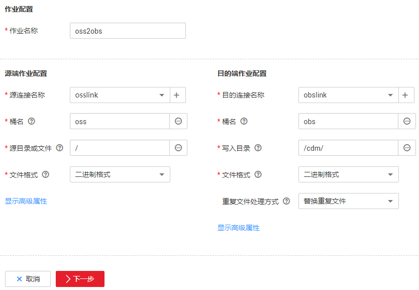

# OSS文件迁移到OBS服务

## 操作场景

CDM支持将第三方云上对象存储的数据直接迁移到OBS，无需中转和写代码，实现数据直传。

这里以迁移阿里云OSS的文件到OBS为例，介绍CDM的使用方法，流程如下：

1.  [创建CDM集群并绑定EIP](#zh-cn_topic_0123613017_section1795613425919)
2.  [创建OBS连接](#zh-cn_topic_0123613017_section11628132615915)
3.  [创建OSS连接](#zh-cn_topic_0123613017_section2722812105913)
4.  [创建迁移作业](#zh-cn_topic_0123613017_section1508747294234)

## 准备数据

-   阿里云OSS的外网访问域名，例如：oss-cn-hangzhou.aliyuncs.com。
-   阿里云OSS的访问密钥，或者临时访问密钥、安全令牌。
-   OBS的访问域名、端口和AK、SK。

## 创建CDM集群并绑定EIP

1.  创建CDM集群，具体操作请参见[创建集群](创建集群.md)，关键配置如下：
    -   实例类型一般选择“cdm.medium“即可，适用大部分迁移场景。
    -   如果该集群只是用于迁移华为云以外的数据到OBS，则对CDM集群的VPC、子网、安全组没有要求，选择任一个即可。

2.  集群创建完成后，在集群管理界面，单击集群操作列的“绑定弹性IP“。CDM集群通过公网访问阿里云OSS。

    由于是导入数据到华为云，弹性IP的带宽无需太大，5Mbit即可。

    > **说明：**   
    >如果用户对本地数据源的访问通道做了SSL加密，则CDM无法通过弹性IP连接数据源。  

## 创建OBS连接

1.  单击CDM集群后的“作业管理“，进入作业管理界面，再选择“连接管理  \>  新建连接“，进入选择连接器类型的界面，如[图1](#zh-cn_topic_0108275445_zh-cn_topic_0108275298_fig13640155194015)所示。

    **图 1**  选择连接器类型  
    

2.  选择“对象存储服务（OBS）“后，单击“下一步“配置OBS连接参数。

    -   名称：用户自定义连接名称，例如“obslink“。
    -   OBS服务器、端口：配置为OBS实际的地址信息。
    -   访问标识（AK）、密钥（SK）：登录OBS的AK、SK。

    **图 2**  创建OBS连接  
    

3.  单击“保存“回到连接管理界面。

## 创建OSS连接

1.  在连接管理界面选择“新建连接“，连接器类型选择“阿里云对象存储（OSS）“后单击“下一步“，配置连接参数，如[图3](#zh-cn_topic_0123613017_fig489481465918)所示。

    -   名称：用户自定义连接名称。
    -   OSS访问域名：配置待迁移数据的外网访问域名，根据桶所在的区域选择。
    -   身份认证方式：根据实际情况选择认证方式，这里选择“访问密钥“。
    -   访问标识（AK）、密钥（SK）：访问OSS的AK、SK。

    **图 3**  创建OSS连接  
    

2.  单击“保存“回到连接管理界面。

## 创建迁移作业

1.  选择“表/文件迁移  \>  新建作业“，开始创建从OSS迁移数据到OBS的任务，如[图4](#zh-cn_topic_0123613017_fig134515616469)所示。

    **图 4**  创建OSS到OBS的迁移任务  
    

    -   作业名称：用户自定义作业名称。
    -   源端作业配置
        -   源连接名称：选择[创建OSS连接](#zh-cn_topic_0123613017_section2722812105913)中的“osslink“。
        -   桶名：待迁移数据所属的桶。
        -   源目录或文件：待迁移数据的具体路径，也可以迁移整个桶的所有文件。
        -   文件格式：这里选择“二进制格式“，二进制格式适用于文件的原样复制。如果需要把文件写入到数据库，则选择CSV格式或JSON格式。
        -   高级属性里的可选参数保持默认，详细说明请参见[配置对象存储源端参数](配置对象存储源端参数.md)。

    -   目的端作业配置
        -   目的连接名称：选择[创建OBS连接](#zh-cn_topic_0123613017_section11628132615915)中的“obslink“。
        -   桶名：写入数据的桶。
        -   写入目录：存储数据的路径。
        -   文件格式：与源端一样，这里选择“二进制格式“。
        -   其他可选参数保持默认，详细说明请参见[配置OBS目的端参数](配置OBS目的端参数.md)。

2.  单击“下一步“配置任务参数，一般情况下全部保持默认即可。

    该步骤用户可以配置如下可选功能：

    -   作业失败重试：如果作业执行失败，可选择是否自动重试，这里保持默认值“不重试“。
    -   作业分组：选择作业所属的分组，默认分组为“DEFAULT“。在CDM“作业管理“界面，支持作业分组显示、按组批量启动作业、按分组导出作业等操作。
    -   是否定时执行：如果需要配置作业定时自动执行，请参见[配置定时任务](配置定时任务.md)。这里保持默认值“否“。
    -   抽取并发数：设置同时执行的抽取任务数。这里保持默认值“1“。
    -   是否写入脏数据：如果需要将作业执行过程中处理失败的数据、或者被清洗过滤掉的数据写入OBS中，以便后面查看，可通过该参数配置，写入脏数据前需要先配置好OBS连接。这里保持默认值“否“即可，不记录脏数据。
    -   作业运行完是否删除：这里保持默认值“不删除“。

3.  单击“保存并运行“，回到作业管理界面，在作业管理界面可查看作业执行进度和结果。
4.  作业执行成功后，单击作业操作列的“历史记录“，可查看该作业的历史执行记录、读取和写入的统计数据。

    在历史记录界面单击“日志“，可查看作业的日志信息。

