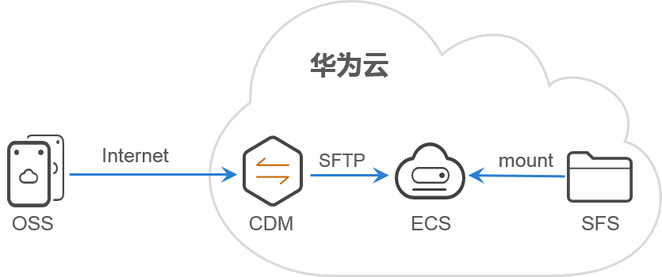
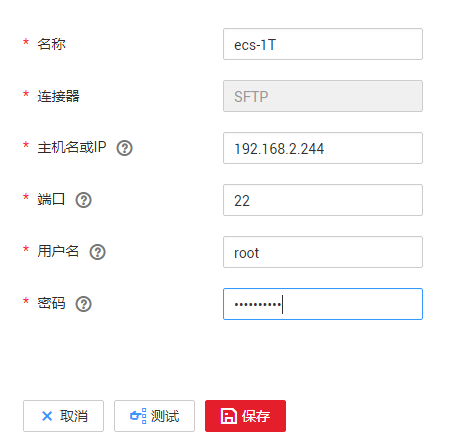
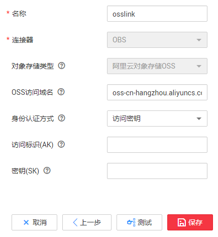
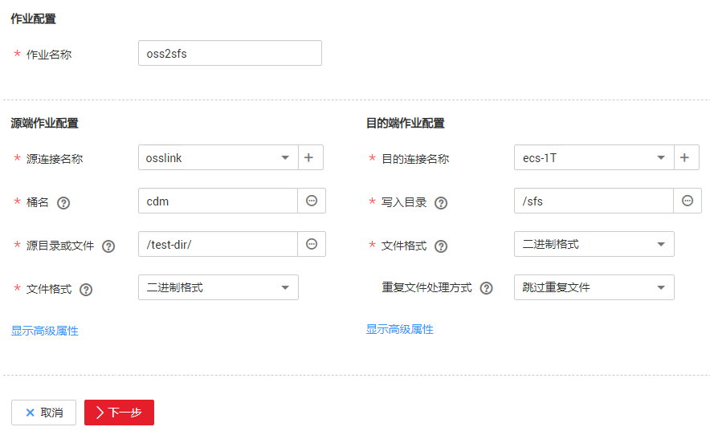
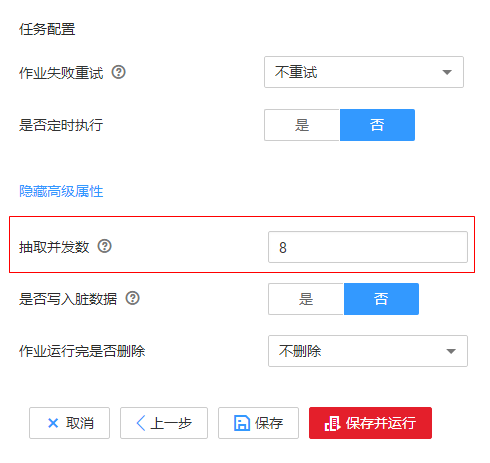

# OSS文件迁移到SFS服务<a name="dayu_01_0095"></a>

## 操作场景<a name="zh-cn_topic_0141699610_section21020958143223"></a>

[弹性文件服务](https://www.huaweicloud.com/product/sfs.html)（Scalable File Service，简称SFS）可以为您的弹性云服务器（ECS）提供一个完全托管的共享文件存储，符合标准文件协议（NFS），能够弹性伸缩至PB规模，具备可扩展的性能，为海量数据、高带宽型应用提供有力支持。

CDM支持将第三方云上对象存储的数据直接迁移到华为云SFS，无需中转和写代码，实现数据直传。

这里以迁移阿里云OSS的文件到华为云SFS为例介绍迁移方法。

**图 1**  迁移原理<a name="zh-cn_topic_0141699610_fig1866313611212"></a>  


首先我们将SFS文件系统挂载到ECS（这里的ECS也可以是您的HPC集群）的某个目录，然后CDM通过SFTP端口来访问ECS的该目录，具体操作流程如下：

1.  [将SFS文件系统挂载到ECS](#zh-cn_topic_0141699610_section8259338203812)
2.  [创建CDM集群并绑定EIP](#zh-cn_topic_0141699610_section1795613425919)
3.  [创建SFTP连接](#zh-cn_topic_0141699610_section11628132615915)
4.  [创建OSS连接](#zh-cn_topic_0141699610_section2722812105913)
5.  [创建迁移作业](#zh-cn_topic_0141699610_section1508747294234)

    > **说明：**   
    >-   要求CDM集群、SFS文件系统，还有SFS文件系统挂载的ECS，都要在同一个VPC下。  
    >-   由于SFS文件系统目前仅支持NFSv3协议挂载到Linux云服务器，所以要求ECS为Linux系统。  


## 准备数据<a name="zh-cn_topic_0141699610_section5787168294234"></a>

-   阿里云OSS的外网访问域名，例如：oss-cn-hangzhou.aliyuncs.com。
-   阿里云OSS的访问密钥，或者临时访问密钥、安全令牌。
-   ECS的内网访问IP、SFTP端口，以及登录用户名、密码。

## 将SFS文件系统挂载到ECS<a name="zh-cn_topic_0141699610_section8259338203812"></a>

在ECS上执行如下命令，将SFS文件系统挂载到ECS，具体操作请参见SFS入门的[挂载文件系统到云服务器（Linux）](https://support.huaweicloud.com/qs-sfs/zh-cn_topic_0034428728.html)章节。

```
cd /
mkdir sfs
mount -t nfs -o vers=3,timeo=600,nolock 共享路径 本地路径
```

如果mount的时候出现“wrong fs type“的错误信息，说明缺少nfs-utils的包，执行**yum install –y nfs-utils**命令安装即可。

## 创建CDM集群并绑定EIP<a name="zh-cn_topic_0141699610_section1795613425919"></a>

1.  创建CDM集群，具体操作请参见[创建集群](创建集群.md)，关键配置如下：
    -   实例类型根据待迁移的数据量大小选择，对于数据量较大的场景建议选择大规格的集群，例如“cdm.large“。
    -   CDM集群的VPC必须与ECS、SFS文件系统所在的VPC一致，子网、安全组规则保证他们之间能正常通信。

2.  集群创建完成后，在集群管理界面，单击集群操作列的“绑定弹性IP“。CDM集群通过公网访问阿里云OSS。

    由于是数据上云，上行流量不计费，弹性IP的带宽为10Mbit/s即可。

    > **说明：**   
    >如果用户对本地数据源的访问通道做了SSL加密，则CDM无法通过弹性IP连接数据源。  


## 创建SFTP连接<a name="zh-cn_topic_0141699610_section11628132615915"></a>

1.  单击CDM集群后的“作业管理“，进入作业管理界面，再选择“连接管理  \>  新建连接“，进入选择连接器类型的界面，如[图2](#zh-cn_topic_0108275298_fig13640155194015)所示。

    **图 2**  选择连接器类型<a name="zh-cn_topic_0108275298_fig13640155194015"></a>  
    

2.  选择“SFTP“后，单击“下一步“配置SFTP连接参数，如[图3](#zh-cn_topic_0141699610_zh-cn_topic_0108275445_fig1624805216359)所示。

    -   名称：您自定义连接名称。
    -   主机名或IP、端口：配置为ECS的内网访问IP、端口。
    -   用户名、密码：登录ECS的用户、密码。

    **图 3**  创建SFTP连接<a name="zh-cn_topic_0141699610_zh-cn_topic_0108275445_fig1624805216359"></a>  
    

3.  单击“保存“回到连接管理界面。

## 创建OSS连接<a name="zh-cn_topic_0141699610_section2722812105913"></a>

1.  在连接管理界面选择“新建连接“，连接器类型选择“阿里云对象存储（OSS）“后单击“下一步“，配置连接参数，如[图4](#zh-cn_topic_0123613017_fig489481465918)所示。

    -   名称：用户自定义连接名称。
    -   OSS访问域名：配置待迁移数据的外网访问域名，根据桶所在的区域选择。
    -   身份认证方式：根据实际情况选择认证方式，这里选择“访问密钥“。
    -   访问标识（AK）、密钥（SK）：访问OSS的AK、SK。

    **图 4**  创建OSS连接<a name="zh-cn_topic_0123613017_fig489481465918"></a>  
    

2.  单击“保存“回到连接管理界面。

## 创建迁移作业<a name="zh-cn_topic_0141699610_section1508747294234"></a>

1.  选择“表/文件迁移  \>  新建作业“，开始创建从OSS迁移数据到SFS的任务，如[图5](#zh-cn_topic_0141699610_fig134515616469)所示。

    **图 5**  创建OSS到SFS的迁移任务<a name="zh-cn_topic_0141699610_fig134515616469"></a>  
    

    -   作业名称：用户自定义作业名称。
    -   源端作业配置
        -   源连接名称：选择[创建OSS连接](#zh-cn_topic_0141699610_section2722812105913)中的连接。
        -   桶名：OSS的桶名。
        -   源目录或文件：OSS对象的对象名，或对象前缀，如果输入一个对象前缀，会把该前缀下的对象全部迁移。
        -   文件格式：这里选择“二进制格式“，二进制格式适用于文件的原样复制。如果需要把文件写入到数据库，则选择CSV格式或JSON格式。
        -   高级属性里的可选参数保持默认，详细说明请参见[配置对象存储源端参数](配置对象存储源端参数.md)。

    -   目的端作业配置
        -   目的连接名称：选择[创建SFTP连接](#zh-cn_topic_0141699610_section11628132615915)中的连接。
        -   写入目录：ECS的目录，这里要输入SFS挂载的目录。
        -   文件格式：与源端一样，这里选择“二进制格式“。
        -   重复文件处理：选择“跳过重复文件“。CDM在迁移文件前会进行文件对比，如果源文件在目的端已经存在，且文件大小一致，则会判定为重复文件，迁移时就会跳过。
        -   其他可选参数保持默认，详细说明请参见[配置FTP/SFTP/NAS/SFS目的端参数](配置FTP-SFTP-NAS-SFS目的端参数.md)。

2.  单击“下一步“配置任务参数，OSS迁移到SFS的场景下“抽取并发数“建议配置为“8“，表示作业的并发数，对于多个文件的迁移，适当调整并发数可以提升性能。其他参数保持默认即可。

    如果要调高“抽取并发数“，需要在ECS中调高SSH的最大连接数：

    1.  修改“/etc/ssh/sshd\_config“中**\#MaxStartups 10:30:100**，将其改为**MaxStartups 1000**。
    2.  修改“/etc/ssh/sshd\_config“中**\#MaxSessions 10**，将其改为**MaxSessions 1000**。
    3.  重启sshd：**service sshd restart**

    **图 6**  抽取并发数<a name="zh-cn_topic_0141699610_fig2085817204272"></a>  
    

3.  单击“保存并运行“，回到作业管理界面，在作业管理界面可查看作业执行进度和结果。
4.  作业执行成功后，单击作业操作列的“历史记录“，可查看该作业的历史执行记录、读取和写入的统计数据。

    在历史记录界面单击“日志“，可查看作业的日志信息。


