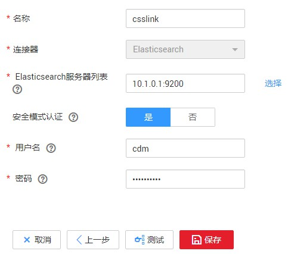
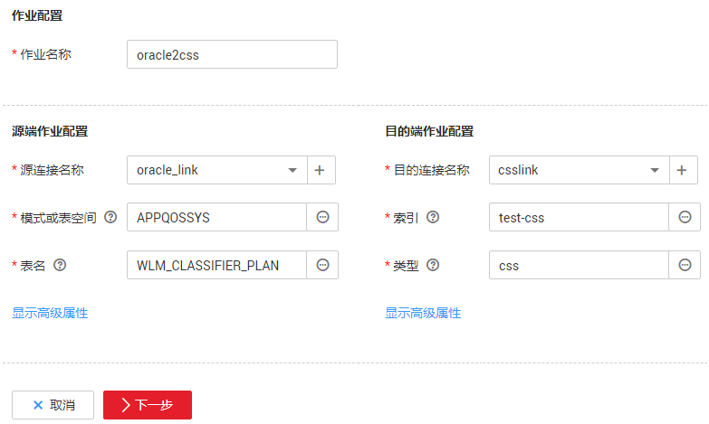
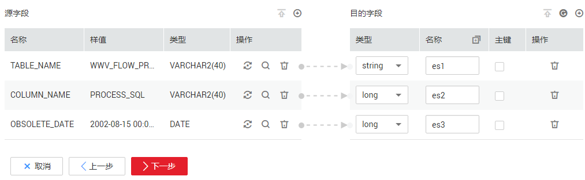

# Oracle数据迁移到云搜索服务

## 操作场景

云搜索服务（Cloud Search Service）为用户提供结构化、非结构化文本的多条件检索、统计、报表，本章节介绍如何通过CDM将数据从Oracle迁移到云搜索服务中，流程如下：

1.  [创建CDM集群并绑定EIP](#zh-cn_topic_0108275437_section2178135115010)
2.  [创建云搜索服务连接](#zh-cn_topic_0108275437_section13928112795019)
3.  [创建Oracle连接](#zh-cn_topic_0108275437_section1667801135017)
4.  [创建迁移作业](#zh-cn_topic_0108275437_section5711134141215)

## 前提条件

-   已经开通了云搜索服务，且获取云搜索服务集群的IP地址和端口。
-   已获取Oracle数据库的IP、数据库名、用户名和密码。
-   如果Oracle数据库是在本地数据中心或第三方云上，需要确保Oracle可通过公网IP访问，或者已经建立好了企业内部数据中心到华为云的VPN通道或专线。
-   用户已参考[管理驱动](管理驱动.md#dgc_01_0132)，上传了Oracle数据库驱动。

## 创建CDM集群并绑定EIP

1.  如果是独立CDM服务，参考[创建集群](https://support.huaweicloud.com/usermanual-cdm/cdm_01_0018.html)创建CDM集群；如果是作为DGC服务CDM组件使用，参考[创建集群](https://support.huaweicloud.com/usermanual-dgc/dgc_01_0576.html)创建CDM集群。

    关键配置如下：

    -   CDM集群的规格，按待迁移的数据量选择，一般选择cdm.medium即可，满足大部分迁移场景。
    -   CDM集群的VPC必须和云搜索服务集群所在VPC一致，且推荐子网、安全组也与云搜索服务一致。
    -   如果安全控制原因不能使用相同子网和安全组，那么需要确保安全组规则能允许CDM访问云搜索服务集群。

2.  CDM集群创建完成后，在集群管理界面选择“绑定弹性IP“，CDM通过EIP访问Oracle数据源。

    > **说明：** 
    >如果用户对本地数据源的访问通道做了SSL加密，则CDM无法通过弹性IP连接数据源。

## 创建云搜索服务连接

1.  单击CDM集群后的“作业管理“，进入作业管理界面，再选择“连接管理  \>  新建连接“，进入选择连接器类型的界面，如[图1](#zh-cn_topic_0108275437_zh-cn_topic_0108275298_fig13640155194015)所示。

    **图 1**  选择连接器类型  
    

2.  连接器类型选择“云搜索服务“后单击“下一步“，配置云搜索服务连接参数。

    -   名称：用户自定义连接名称，例如“csslink“。
    -   Elasticsearch服务器列表：配置为云搜索服务集群（支持5.X以上版本）的连接地址、端口，格式为“ip:port“，多个地址之间使用分号（；）分隔，例如192.168.0.1:9200;192.168.0.2:9200。
    -   用户名、密码：配置为访问云搜索服务集群的用户，需要拥有数据库的读写权限。

    **图 2**  创建云搜索服务连接  
    

3.  单击“保存“回到连接管理界面。

## 创建Oracle连接

1.  在连接管理界面单击“新建连接“，连接器类型选择“Oracle“后单击“下一步“，配置Oracle连接参数：
    -   名称：用户自定义连接名称，例如“oracle\_link“。
    -   数据库服务器地址、端口：配置为Oracle服务器的地址、端口。
    -   数据库名称：选择要导出数据的Oracle数据库名称。
    -   用户名、密码：Oracle数据库的登录用户名和密码，该用户需要拥有Oracle元数据的读取权限。

2.  单击“保存“回到连接管理界面。

## 创建迁移作业

1.  选择“表/文件迁移  \>  新建作业“，开始创建从Oracle导出数据到云搜索服务的任务。

    **图 3**  创建Oracle到云搜索服务的迁移任务  
    

    -   作业名称：用户自定义便于记忆、区分的任务名称。
    -   源端作业配置
        -   源连接名称：选择[创建Oracle连接](#zh-cn_topic_0108275437_section1667801135017)中的“oracle\_link“。
        -   模式或表空间：待迁移数据的数据库名称。
        -   表名：待迁移数据的表名。
        -   高级属性里的可选参数一般情况下保持默认既可，详细说明请参见[配置关系数据库源端参数](配置关系数据库源端参数.md#dgc_01_0054)。

    -   目的端作业配置
        -   目的连接名称：选择[创建云搜索服务连接](#zh-cn_topic_0108275437_section13928112795019)中的“csslink“。
        -   索引：待写入数据的Elasticsearch索引，也可以输入一个新的索引，CDM会自动在云搜索服务中创建。
        -   类型：待写入数据的Elasticsearch类型，可输入新的类型，CDM支持在目的端自动创建类型。
        -   高级属性里的可选参数一般情况下保持默认既可，详细说明请参见[配置云搜索服务目的端参数](配置云搜索服务目的端参数.md#dgc_01_0071)。

2.  单击“下一步“进入字段映射界面，CDM会自动匹配源和目的字段，如[图4](#zh-cn_topic_0108275437_fig68696231445)所示。

    -   如果字段映射顺序不匹配，可通过拖拽字段调整。
    -   如果选择在目的端自动创建类型，这里还需要配置每个类型的字段类型、字段名称。
    -   CDM支持迁移过程中转换字段内容，详细请参见[字段转换](https://support.huaweicloud.com/bestpractice-dgc/dgc_05_0012.html)。

    **图 4**  云搜索服务的字段映射  
    

3.  单击“下一步“配置任务参数，一般情况下全部保持默认即可。

    该步骤用户可以配置如下可选功能：

    -   作业失败重试：如果作业执行失败，可选择是否自动重试，这里保持默认值“不重试“。
    -   作业分组：选择作业所属的分组，默认分组为“DEFAULT“。在CDM“作业管理“界面，支持作业分组显示、按组批量启动作业、按分组导出作业等操作。
    -   是否定时执行：如果需要配置作业定时自动执行，请参见[配置定时任务](配置定时任务.md#dgc_01_0082)。这里保持默认值“否“。
    -   抽取并发数：设置同时执行的抽取任务数。这里保持默认值“1“。
    -   是否写入脏数据：如果需要将作业执行过程中处理失败的数据、或者被清洗过滤掉的数据写入OBS中，以便后面查看，可通过该参数配置，写入脏数据前需要先配置好OBS连接。这里保持默认值“否“即可，不记录脏数据。
    -   作业运行完是否删除：这里保持默认值“不删除“。

4.  单击“保存并运行“，回到作业管理界面，在作业管理界面可查看作业执行进度和结果。
5.  作业执行成功后，单击作业操作列的“历史记录“，可查看该作业的历史执行记录、读取和写入的统计数据。

    在历史记录界面单击“日志“，可查看作业的日志信息。

