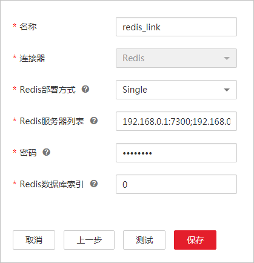
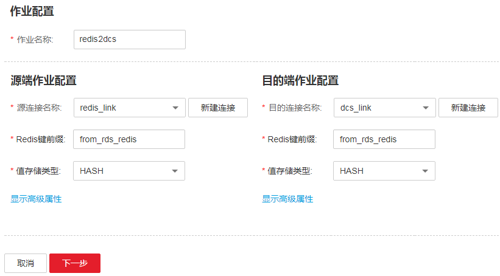
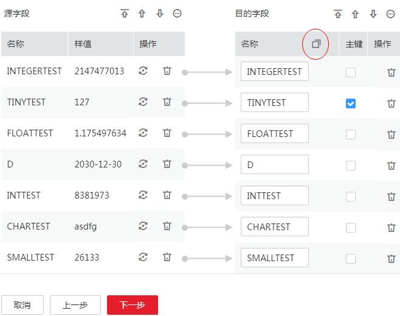

# Redis数据库迁移到云上DCS服务

## 操作场景

CDM支持将本地自建的Redis数据库或者第三方的Redis服务数据迁移到分布式缓存服务（Distributed Cache Service，简称DCS），无需编程即可快速实现迁移。使用流程如下：

1.  [创建CDM集群并绑定EIP](#zh-cn_topic_0108275380_section792614962717)
2.  [创建Redis连接和DCS连接](#zh-cn_topic_0108275380_section0395105614269)
3.  [创建迁移作业](#zh-cn_topic_0108275380_section4611975315648)

## 前提条件

-   拥有EIP配额。
-   已开通DCS，且已获取DCS数据库的IP地址、端口和连接密码。
-   本地Redis数据库允许通过公网访问。
-   已获取本地Redis服务器地址和连接密码。

## 创建CDM集群并绑定EIP

1.  创建CDM集群，具体操作请参见[创建集群](创建集群.md)。关键配置如下：
    -   CDM集群的规格，按待迁移的数据量选择，一般选择cdm.medium即可，满足大部分迁移场景。
    -   CDM集群和DCS集群必须在同一个VPC，且推荐子网和安全组也与DCS集群一致。
    -   如果子网和安全组不一致，需要配置安全组规则允许CDM集群访问DCS集群。

2.  CDM集群创建完成后，在集群管理界面选择“绑定弹性IP“。CDM集群通过EIP访问本地Redis数据源。

    > **说明：**   
    >如果用户对本地数据源的访问通道做了SSL加密，则CDM无法通过弹性IP连接数据源。  

## 创建Redis连接和DCS连接

1.  单击CDM集群后的“作业管理“，进入作业管理界面，再选择“连接管理  \>  新建连接“，进入选择连接器类型的界面，如[图1](#zh-cn_topic_0108275298_fig13640155194015)所示。

    **图 1**  选择连接器类型  
    

2.  创建Redis连接时，选择“Redis“后单击“下一步“，配置Redis连接参数，如[图2](#zh-cn_topic_0108275380_fig16141259152619)所示。

    **图 2**  创建Redis连接  
    

    -   名称：用户自定义连接名称，例如“redis\_link“。
    -   Redis部署方式：请根据本地Redis数据库的实际部署方式选择。
        -   如果是单机部署选择“Single“。
        -   如果是集群部署选择“Cluster“。

    -   Redis服务器列表：配置为本地Redis数据库的服务器地址，多个服务器列表间以“;“分隔。
    -   密码、Redis数据库索引：登录本地Redis数据库的密码，以及待连接的Redis分库的索引标识。

3.  单击“保存“回到连接管理界面。
4.  连接管理界面选择“新建连接“，创建DCS连接。DCS连接的创建步骤、连接参数与Redis连接一样。
5.  连接器类型选择“分布式缓存服务（DCS）“后单击“下一步“，配置DCS连接参数。
    -   名称：用户自定义连接名称，例如“dcs\_link“。
    -   Redis部署方式：请根据DCS集群的部署方式选择。
    -   Redis服务器列表：配置为DCS数据库的服务器地址，多个服务器列表间以“;“分隔。
    -   密码、Redis数据库索引：登录DCS数据库的密码，以及待写入数据的分库的索引标识。

6.  单击“保存“回到连接管理界面。

## 创建迁移作业

1.  选择“表/文件迁移  \>  新建作业“，创建数据迁移任务，如[图3](#zh-cn_topic_0108275380_fig19161604165546)所示。

    **图 3**  创建Redis到DCS的迁移任务  
    

    -   作业名称：用户自定义便于记忆、区分的任务名称，例如“redis2dcs“。
    -   源端作业配置
        -   源连接名称：选择[创建Redis连接和DCS连接](#zh-cn_topic_0108275380_section0395105614269)中的Redis连接。
        -   Redis键前缀：选择从哪个键前缀导出数据。
        -   值存储类型：用户可根据实际情况选择，这里以源端和目的端都配置为“Hash“为例。
        -   高级属性里的可选参数保持默认即可，详细请参见[配置Redis源端参数](配置Redis源端参数.md)。

    -   目的端作业配置
        -   目的连接名称：选择[创建Redis连接和DCS连接](#zh-cn_topic_0108275380_section0395105614269)中的DCS连接。
        -   Redis键前缀：选择导入数据到哪个键前缀。
        -   值存储类型：这里配置为“Hash“，与源端保持一致。
        -   高级属性里的可选参数保持默认即可，详细请参见[配置DCS目的端参数](配置DCS目的端参数.md)。

2.  作业基本参数配置完成后，单击“下一步“进入到字段映射的配置界面。

    对于Hash类型，用户可以通过单击目的字段名称旁边的按钮来复制源端的字段，并勾选字段来确定主键，如[图4](#zh-cn_topic_0108275380_fig2459338993051)所示。

    **图 4**  配置字段映射  
    

3.  单击“下一步“进入到任务配置界面，可以配置定时任务，如[图5](#zh-cn_topic_0108275380_fig2574810794234)所示。

    如果开启定时任务，周期性同步数据，存在主键重复的数据时，CDM会自动覆盖已经存在的主键。

    **图 5**  配置定时任务  
    

4.  单击“保存并运行“，回到作业管理界面，在作业管理界面可查看作业执行进度和结果。
5.  作业执行成功后，单击作业操作列的“历史记录“，可查看该作业的历史执行记录、读取和写入的统计数据。

    在历史记录界面单击“日志“，可查看作业的日志信息。

