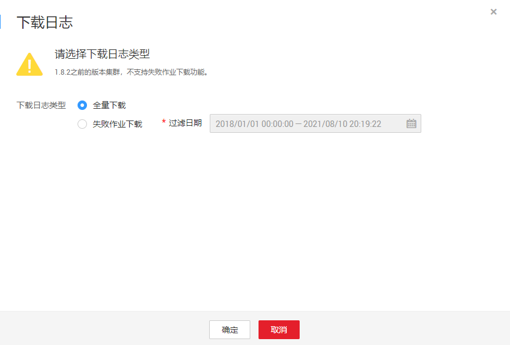

# 下载集群日志

## 操作场景

本章节指导用户获取集群的日志。

## 前提条件

已创建CDM集群。

## 操作步骤

1.  进入CDM主界面，单击左侧导航上的“集群管理“，进入集群管理界面。

    **图 1**  集群列表  
    

1.  选择集群操作列中的“更多  \>  下载日志“，选择下载日志类型。

    **图 2**  下载日志类型  
    

2.  确认后，即可下载日志到本地。

