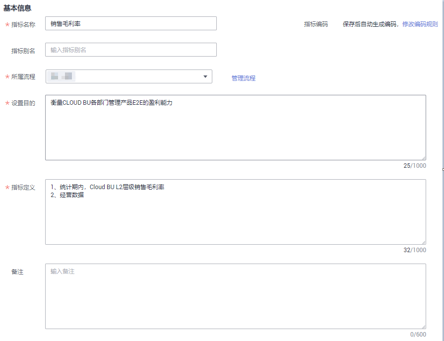
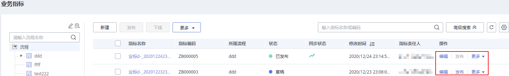
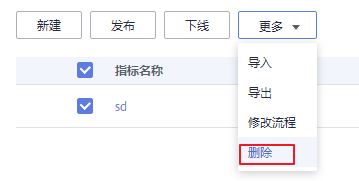

# 业务指标

经过数据调研和需求分析之后，您需要根据需求落地指标。指标是衡量目标总体特征的统计数值，是能表征企业某一业务活动中业务状况的数值指示器。指标一般由指标名称和指标数值两部分组成，指标名称及其涵义体现了指标质的规定性和量的规定性两个方面的特点，指标数值反映了指标在具体时间、地点、条件下的数量表现。业务指标用于指导技术指标，而技术指标是对业务指标的具体实现。

## 前提条件

在新建业务指标之前，您需要先完成流程设计，具体操作请参见[流程设计](流程设计.md)。

## 新建业务指标并发布

1.  在DGC控制台首页，选择对应工作空间的“规范设计“模块，进入规范设计页面。

    **图 1**  选择规范设计  
    

2.  在规范设计控制台，单击左侧导航树中的“业务指标“，进入业务指标页面。
3.  在左侧的流程树中，选中一个流程，单击“新建“开始新建业务指标。
4.  在“新建业务指标“页面，请根据以下步骤配置参数，配置完成后，单击“发布“。
    1.  填写“基本信息”参数。

        **图 2**  新建业务指标  
        

        **表 1**  指标基本信息参数

        
        <table><thead align="left"><tr id="row132273114328"><th class="cellrowborder" valign="top" width="17.64%" id="mcps1.2.3.1.1">
参数说明

        </th>
        <th class="cellrowborder" valign="top" width="82.36%" id="mcps1.2.3.1.2">
说明

        </th>
        </tr>
        </thead>
        <tbody><tr id="row1822131103217"><td class="cellrowborder" valign="top" width="17.64%" headers="mcps1.2.3.1.1 ">
指标名称

        </td>
        <td class="cellrowborder" valign="top" width="82.36%" headers="mcps1.2.3.1.2 ">
业务指标的名称。

        </td>
        </tr>
        <tr id="row02243118327"><td class="cellrowborder" valign="top" width="17.64%" headers="mcps1.2.3.1.1 ">
指标编码

        </td>
        <td class="cellrowborder" valign="top" width="82.36%" headers="mcps1.2.3.1.2 ">
指标编码是自动生成的，生成规则可以在DGC规范设计的“配置中心”页面进行配置，详情请参见<a href="配置中心.md#section66767193176">指标编码规则</a>。

        </td>
        </tr>
        <tr id="row1322831173217"><td class="cellrowborder" valign="top" width="17.64%" headers="mcps1.2.3.1.1 ">
指标别名

        </td>
        <td class="cellrowborder" valign="top" width="82.36%" headers="mcps1.2.3.1.2 ">
可选参数。

        </td>
        </tr>
        <tr id="row1022193143218"><td class="cellrowborder" valign="top" width="17.64%" headers="mcps1.2.3.1.1 ">
所属流程

        </td>
        <td class="cellrowborder" valign="top" width="82.36%" headers="mcps1.2.3.1.2 ">
选择指标所属的业务流程。如果您还未创建业务流程，请参见<a href="流程设计.md">流程设计</a>进行创建。

        </td>
        </tr>
        <tr id="row1922231183211"><td class="cellrowborder" valign="top" width="17.64%" headers="mcps1.2.3.1.1 ">
设置目的

        </td>
        <td class="cellrowborder" valign="top" width="82.36%" headers="mcps1.2.3.1.2 ">
描述设置该指标的目的。

        </td>
        </tr>
        <tr id="row132243114328"><td class="cellrowborder" valign="top" width="17.64%" headers="mcps1.2.3.1.1 ">
指标定义

        </td>
        <td class="cellrowborder" valign="top" width="82.36%" headers="mcps1.2.3.1.2 ">
需准确描述指标的定义。

        </td>
        </tr>
        <tr id="row152283116321"><td class="cellrowborder" valign="top" width="17.64%" headers="mcps1.2.3.1.1 ">
备注

        </td>
        <td class="cellrowborder" valign="top" width="82.36%" headers="mcps1.2.3.1.2 ">
备注信息。

        </td>
        </tr>
        </tbody>
        </table>

    2.  配置指标数据信息。

        **图 3**  指标数据信息  
        

        **表 2**  指标数据信息参数

        
        <table><thead align="left"><tr id="row62283117329"><th class="cellrowborder" valign="top" width="17.64%" id="mcps1.2.3.1.1">
参数说明

        </th>
        <th class="cellrowborder" valign="top" width="82.36%" id="mcps1.2.3.1.2">
说明

        </th>
        </tr>
        </thead>
        <tbody><tr id="row16221831133212"><td class="cellrowborder" valign="top" width="17.64%" headers="mcps1.2.3.1.1 ">
计算公式

        </td>
        <td class="cellrowborder" valign="top" width="82.36%" headers="mcps1.2.3.1.2 ">
定义业务指标的计算逻辑，以便指导开发者根据计算公式设计原子指标、衍生指标。业务指标是为了指导技术指标的落地，实际并不做运算。

        </td>
        </tr>
        <tr id="row112219311321"><td class="cellrowborder" valign="top" width="17.64%" headers="mcps1.2.3.1.1 ">
统计周期

        </td>
        <td class="cellrowborder" valign="top" width="82.36%" headers="mcps1.2.3.1.2 ">
指定指标的统计周期，以便指导开发者根据统计周期设计时间限定。

        </td>
        </tr>
        <tr id="row162213112327"><td class="cellrowborder" valign="top" width="17.64%" headers="mcps1.2.3.1.1 ">
统计维度

        </td>
        <td class="cellrowborder" valign="top" width="82.36%" headers="mcps1.2.3.1.2 ">
可以在下拉列表中选择已经创建的维度。维度的创建请参见<a href="新建维度.md">新建维度</a>。

        </td>
        </tr>
        <tr id="row1022133193219"><td class="cellrowborder" valign="top" width="17.64%" headers="mcps1.2.3.1.1 ">
统计口径和修饰词

        </td>
        <td class="cellrowborder" valign="top" width="82.36%" headers="mcps1.2.3.1.2 ">
限定是对业务场景限定抽象，用于度量范围的圈定。

        </td>
        </tr>
        <tr id="row19226315321"><td class="cellrowborder" valign="top" width="17.64%" headers="mcps1.2.3.1.1 ">
刷新频率

        </td>
        <td class="cellrowborder" valign="top" width="82.36%" headers="mcps1.2.3.1.2 ">
指标数据的刷新频率。开发者或运维者可以依据指标的刷新频率，合理设置衍生指标的调度频率。

        </td>
        </tr>
        <tr id="row12221231183218"><td class="cellrowborder" valign="top" width="17.64%" headers="mcps1.2.3.1.1 ">
指标应用场景

        </td>
        <td class="cellrowborder" valign="top" width="82.36%" headers="mcps1.2.3.1.2 ">
描述指标的应用场景。

        </td>
        </tr>
        <tr id="row153411524217"><td class="cellrowborder" valign="top" width="17.64%" headers="mcps1.2.3.1.1 ">
关联技术指标

        </td>
        <td class="cellrowborder" valign="top" width="82.36%" headers="mcps1.2.3.1.2 ">
下拉选择与业务指标关联的技术指标（包含衍生指标和复合指标）。

        </td>
        </tr>
        <tr id="row222931193218"><td class="cellrowborder" valign="top" width="17.64%" headers="mcps1.2.3.1.1 ">
度量对象

        </td>
        <td class="cellrowborder" valign="top" width="82.36%" headers="mcps1.2.3.1.2 ">
衡量该指标的度量字段。

        </td>
        </tr>
        <tr id="row92203173213"><td class="cellrowborder" valign="top" width="17.64%" headers="mcps1.2.3.1.1 ">
计量单位

        </td>
        <td class="cellrowborder" valign="top" width="82.36%" headers="mcps1.2.3.1.2 ">
指标的计量单位。

        </td>
        </tr>
        </tbody>
        </table>

    3.  配置管理信息。

        **图 4**  管理信息  
        

        **表 3**  管理信息参数说明

        
        <table><thead align="left"><tr id="row1323123112324"><th class="cellrowborder" valign="top" width="17.7%" id="mcps1.2.3.1.1">
参数说明

        </th>
        <th class="cellrowborder" valign="top" width="82.3%" id="mcps1.2.3.1.2">
说明

        </th>
        </tr>
        </thead>
        <tbody><tr id="row182363118320"><td class="cellrowborder" valign="top" width="17.7%" headers="mcps1.2.3.1.1 ">
数据来源

        </td>
        <td class="cellrowborder" valign="top" width="82.3%" headers="mcps1.2.3.1.2 ">
描述数据来源，也就是数据的产生者。

        </td>
        </tr>
        <tr id="row02393173212"><td class="cellrowborder" valign="top" width="17.7%" headers="mcps1.2.3.1.1 ">
指标管理部门

        </td>
        <td class="cellrowborder" valign="top" width="82.3%" headers="mcps1.2.3.1.2 ">
指标的管理部门。

        </td>
        </tr>
        <tr id="row8237317320"><td class="cellrowborder" valign="top" width="17.7%" headers="mcps1.2.3.1.1 ">
指标责任人

        </td>
        <td class="cellrowborder" valign="top" width="82.3%" headers="mcps1.2.3.1.2 ">
指标的责任人。只有工作空间管理员或开发者、运维者角色的用户才可以设置为责任人。

        </td>
        </tr>
        </tbody>
        </table>

5.  在弹出对话框中，选择审核人，单击“确认提交“，完成发布。
6.  可以参照步骤[3](#li02113119322)\~步骤[5](#li11231131183219)，完成其他业务指标的创建和发布。
7.  完成所有业务指标的新建和发布之后，需要等待审核人员审核。

    审核通过后，业务指标创建完成。

## 编辑业务指标

1.  在规范设计控制台，单击左侧导航树中的“业务指标“，进入业务指标页面。

    **图 5**  管理业务指标  
    

2.  在业务指标列表中找到需要编辑的指标，单击“编辑“，进入编辑业务指标页面。
3.  根据实际需要编辑业务指标的相关信息。
4.  单击“保存“，保存所做的修改。或者，单击“发布“，发布修改后的业务指标。

## 发布业务指标

如果新建了业务指标但并未发布，可以执行以下步骤发布业务指标：

1.  在规范设计控制台，单击左侧导航树中的“业务指标“，进入业务指标页面。
2.  在业务指标列表中找到需要发布的指标，单击“发布“。
3.  在弹出对话框中，选择审核人，单击“确认提交“，完成发布。

    **图 6**  提交发布  
    

## 下线业务指标

对于已发布的业务指标，可以执行以下步骤下线业务指标：

1.  在规范设计控制台，单击左侧导航树中的“业务指标“，进入业务指标页面。
2.  在业务指标列表中找到需要下线的业务指标，单击“下线“。
3.  在弹出对话框中，选择审核人，然后单击“确认提交“，审核通过后，完成业务指标的下线。

    **图 7**  提交下线  
    

## 删除业务指标

如果您已不再需要某个业务指标，可以删除该业务指标。如果待删除的业务指标已发布，则无法执行删除操作，您必须先将该业务指标下线后，才能执行删除操作。

1.  在规范设计控制台，单击左侧导航树中的“业务指标“，进入业务指标页面。
2.  在维度列表中找到需要删除的业务指标度，勾选该业务指标，然后单击业务指标列表上方“更多“中的“删除“。

    **图 8**  删除业务指标  
    

3.  在系统弹出的“删除“对话框中，确认无误后，单击“是“将业务指标删除。

