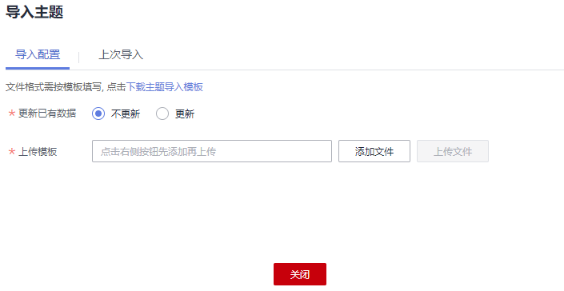
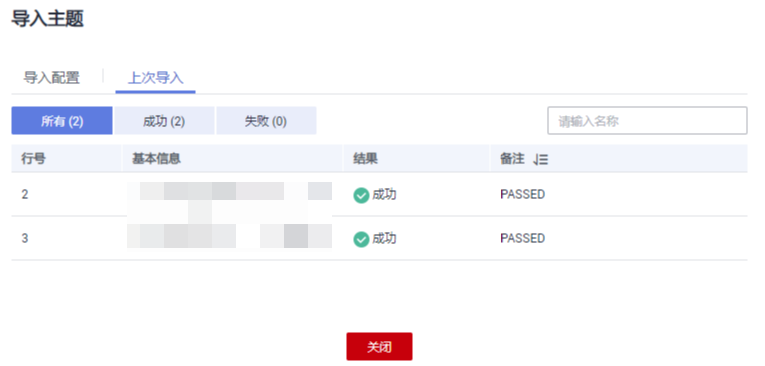
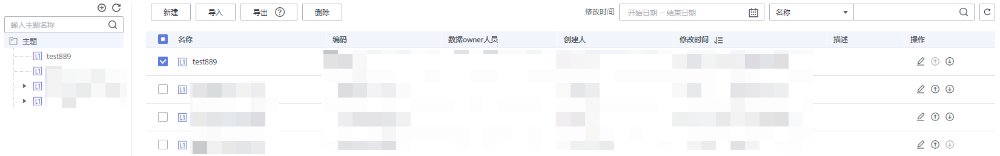
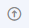

# 主题设计

主题设计是通过分层架构表达对数据的分类和定义，帮助厘清数据资产，明确业务领域和业务对象的关联关系。

您可以通过以下两种方式进行主题设计：

-   [新建主题](#zh-cn_topic_0169427296_section325565610163)

    手动新建主题。

-   [导入主题设计信息](#zh-cn_topic_0169427296_section785421345411)

    如果主题信息比较复杂，建议采用导入方式批量导入主题信息。

    -   您可以下载系统提供的主题设计模板，在模板文件中填写主题的相关参数后，使用模板批量导入主题信息。
    -   您可以预先将某个DGC实例的规范设计中已建立的主题设计信息导出到Excel文件中。导出后的文件可用于导入。导出主题设计信息的操作，请参见[导出主题设计信息](#section17983151820549)。

建立好主题设计信息后，可以对主题信息进行查找、编辑或删除操作，详情请参见[管理主题设计](#zh-cn_topic_0169427296_section7856181172118)。

## 主题设计概述

默认情况下，系统预设了“L1-主题域分组”、“L2-主题域”和“L3-业务对象”三层主题层级。

-   **主题域分组**：主题域分组是基于业务场景对主题域进行分组。
-   **主题域**：主题域是根据数据的性质对数据进行划分，性质相同的数据划分为一类，其划分后得出的各数据集合叫做主题域，主题域是信息需求范围的上层级数据集合。
-   **业务对象：**业务对象是指企业运作和管理中不可缺少的重要人、事、物等信息。

您也可以根据您的实际情况，参考[主题层级](配置中心.md#section28291944122319)对主题层级进行自定义配置。

## 新建主题

1.  在DGC控制台首页，选择对应工作空间的“规范设计“模块，进入规范设计页面。

    **图 1**  选择规范设计  
    

2.  单击左侧导航栏中“主题设计“，进入主题设计页面，单击左上角的“新建“。

    **图 2**  主题设计  
    

3.  在“新建主题域分组“对话框中，配置如下参数，然后单击“确定”完成主题域分组的创建。

    **表 1**  主题域分组参数说明

    
    <table><thead align="left"><tr id="row35972841413"><th class="cellrowborder" valign="top" width="25.82%" id="mcps1.2.3.1.1">
参数名

    </th>
    <th class="cellrowborder" valign="top" width="74.18%" id="mcps1.2.3.1.2">
说明

    </th>
    </tr>
    </thead>
    <tbody><tr id="row135988891420"><td class="cellrowborder" valign="top" width="25.82%" headers="mcps1.2.3.1.1 ">
名称

    </td>
    <td class="cellrowborder" valign="top" width="74.18%" headers="mcps1.2.3.1.2 ">
只允许除/、\、&lt;、&gt;以外的字符。

    </td>
    </tr>
    <tr id="row175988813143"><td class="cellrowborder" valign="top" width="25.82%" headers="mcps1.2.3.1.1 ">
编码

    </td>
    <td class="cellrowborder" valign="top" width="74.18%" headers="mcps1.2.3.1.2 ">
英文名称。只允许字母、数字、空格、下划线、中划线、左右括号以及&amp;符号。

    </td>
    </tr>
    <tr id="row45985881416"><td class="cellrowborder" valign="top" width="25.82%" headers="mcps1.2.3.1.1 ">
别名

    </td>
    <td class="cellrowborder" valign="top" width="74.18%" headers="mcps1.2.3.1.2 ">
只允许除\、&lt;、&gt;以外的字符。

    
 说明： 

您需提前在配置中心的“模型配置”页签中启用主题设计别名，这里才可配置别名。

    

    </td>
    </tr>
    <tr id="row55981811144"><td class="cellrowborder" valign="top" width="25.82%" headers="mcps1.2.3.1.1 ">
上级主题

    </td>
    <td class="cellrowborder" valign="top" width="74.18%" headers="mcps1.2.3.1.2 ">
选择新建主题的上一层主题。

    </td>
    </tr>
    <tr id="row1659810821412"><td class="cellrowborder" valign="top" width="25.82%" headers="mcps1.2.3.1.1 ">
数据owner部门

    </td>
    <td class="cellrowborder" valign="top" width="74.18%" headers="mcps1.2.3.1.2 ">
数据的拥有者所在部门。

    </td>
    </tr>
    <tr id="row359848191418"><td class="cellrowborder" valign="top" width="25.82%" headers="mcps1.2.3.1.1 ">
数据owner人员

    </td>
    <td class="cellrowborder" valign="top" width="74.18%" headers="mcps1.2.3.1.2 ">
在下拉框中选择需要的数据owner人员，支持多选和自定义输入。

    </td>
    </tr>
    <tr id="row9598884148"><td class="cellrowborder" valign="top" width="25.82%" headers="mcps1.2.3.1.1 ">
描述

    </td>
    <td class="cellrowborder" valign="top" width="74.18%" headers="mcps1.2.3.1.2 ">
主题域分组的描述信息。

    </td>
    </tr>
    </tbody>
    </table>

    **图 3**  新建主题域分组  
    

4.  在一个主题下，还可以新建多个主题。

    主题层级数目由用户在配置中心的[主题层级](配置中心.md#section28291944122319)中自定义，系统默认有三个层级，从上到下分别命名为主题域分组（L1）、主题域（L2）、业务对象（L3）。

## 导入主题设计信息

1.  在规范设计控制台，单击左侧导航树中的“主题设计“，进入主题设计页面。
2.  单击左上方的“导入“按钮，弹出导入主题对话框。

    **图 4**  导入主题设计  
    

3.  在“导入主题“对话框中，根据页面提示配置如下参数，然后先单击“添加文件”后，再单击“上传文件”。

    **图 5**  导入配置  
    

    **表 2**  导入配置参数说明

    
    <table><thead align="left"><tr id="row161161611676"><th class="cellrowborder" valign="top" width="20.05%" id="mcps1.2.3.1.1">
参数名

    </th>
    <th class="cellrowborder" valign="top" width="79.95%" id="mcps1.2.3.1.2">
说明

    </th>
    </tr>
    </thead>
    <tbody><tr id="row31161014712"><td class="cellrowborder" valign="top" width="20.05%" headers="mcps1.2.3.1.1 ">
更新已有数据

    </td>
    <td class="cellrowborder" valign="top" width="79.95%" headers="mcps1.2.3.1.2 ">
在导入时是否更新已有的主题信息（主题域分组、主题域或业务对象）。在导入时，系统将按编码判断将要导入的主题信息在系统中是否已存在。

    <ul id="ul8540103920159"><li><strong id="b5300141195316">不更新</strong>：当主题信息已存在时，将直接跳过，不更新。</li><li><strong id="b18586164411538">更新</strong>：当主题信息已存在时，更新已有的主题信息。</li></ul>
    
在导入主题信息时，只有创建或更新操作，不会删除已有的主题信息。

    </td>
    </tr>
    <tr id="row171161411474"><td class="cellrowborder" valign="top" width="20.05%" headers="mcps1.2.3.1.1 ">
上传模板

    </td>
    <td class="cellrowborder" valign="top" width="79.95%" headers="mcps1.2.3.1.2 ">
选择所需导入的主题设计文件。

    
所需导入的主题设计文件，可以通过以下两种方式获得。

    <ul id="ul235912201591"><li><strong id="b234121231317">下载主题导入模板并填写模板</strong>
在“导入配置”页签内，单击“下载主题导入模板”下载模板，然后根据业务需求填写好模板中的相关参数并保存。模板参数的详细描述请参见<a href="#table1125753216561">表3</a>。

    </li><li><strong id="b441514123234">导出的主题设计信息</strong>
您可以将某个DGC实例的规范设计中已建立的主题设计信息导出到Excel文件中。导出后的文件可用于导入。关于导出主题设计的更多信息，请参见<a href="#section17983151820549">导出主题设计信息</a>。

    </li></ul>
    </td>
    </tr>
    </tbody>
    </table>

    下载的主题导入模板参数如[表3](#table1125753216561)所示，其中名称前带“\*”的参数为必填参数，名称前未带“\*”的参数为可选参数。一个主题对象需要填写一行信息。

    **表 3**  模板参数说明

    
    <table><thead align="left"><tr id="row162577320567"><th class="cellrowborder" valign="top" width="27.860000000000003%" id="mcps1.2.3.1.1">
参数名

    </th>
    <th class="cellrowborder" valign="top" width="72.14%" id="mcps1.2.3.1.2">
说明

    </th>
    </tr>
    </thead>
    <tbody><tr id="row9788314163914"><td class="cellrowborder" valign="top" width="27.860000000000003%" headers="mcps1.2.3.1.1 ">
上级主题

    </td>
    <td class="cellrowborder" valign="top" width="72.14%" headers="mcps1.2.3.1.2 ">
上层主题的编码路径，以/分隔。

    </td>
    </tr>
    <tr id="row028715205396"><td class="cellrowborder" valign="top" width="27.860000000000003%" headers="mcps1.2.3.1.1 ">
*名称

    </td>
    <td class="cellrowborder" valign="top" width="72.14%" headers="mcps1.2.3.1.2 ">
中文名称。只允许除/、\、&lt;、&gt;以外的字符。

    </td>
    </tr>
    <tr id="row68431824133919"><td class="cellrowborder" valign="top" width="27.860000000000003%" headers="mcps1.2.3.1.1 ">
*编码

    </td>
    <td class="cellrowborder" valign="top" width="72.14%" headers="mcps1.2.3.1.2 ">
英文名称。只允许英文字母、数字、空格、下划线、中划线、左右括号以及&amp;符号。

    </td>
    </tr>
    <tr id="row198851132103914"><td class="cellrowborder" valign="top" width="27.860000000000003%" headers="mcps1.2.3.1.1 ">
别名

    </td>
    <td class="cellrowborder" valign="top" width="72.14%" headers="mcps1.2.3.1.2 ">
主题对象的别名。

    </td>
    </tr>
    <tr id="row1028417534112"><td class="cellrowborder" valign="top" width="27.860000000000003%" headers="mcps1.2.3.1.1 ">
描述

    </td>
    <td class="cellrowborder" valign="top" width="72.14%" headers="mcps1.2.3.1.2 ">
主题对象的描述信息。

    </td>
    </tr>
    <tr id="row19223796417"><td class="cellrowborder" valign="top" width="27.860000000000003%" headers="mcps1.2.3.1.1 ">
数据owner部门

    </td>
    <td class="cellrowborder" valign="top" width="72.14%" headers="mcps1.2.3.1.2 ">
数据的拥有者所在部门。

    </td>
    </tr>
    <tr id="row646114184116"><td class="cellrowborder" valign="top" width="27.860000000000003%" headers="mcps1.2.3.1.1 ">
*数据owner人员

    </td>
    <td class="cellrowborder" valign="top" width="72.14%" headers="mcps1.2.3.1.2 ">
数据的拥有者，支持填写多个，中间以逗号分隔。

    </td>
    </tr>
    </tbody>
    </table>

4.  导入结果会在“上次导入“页面中显示。如果导入成功，单击“关闭“完成导入。如果导入失败，您可以查看失败原因，将模板文件修改正确后，再重新上传。

    **图 6**  上次导入页面  
    

## 导出主题设计信息

1.  在DGC规范设计控制台，单击左侧导航树中的“主题设计“，进入主题设计页面。
2.  单击左上方的“导出“将当前已有的主题设计导出到Excel文件中。导出后的文件可用于导入。

    > **说明：** 
    >“主题“或“流程“作为层级联动性质, 导出均默认为全量导出, 不支持筛选。

## 管理主题设计

**图 7**  主题设计区域  

-   查找

    您可以在主题的搜索框中，输入所需查找的关键字进行查找。

-   编辑

    您可以在主题列表中，选中一个对象，然后单击其名称右侧的按钮进行编辑。

-   删除

    您可以在主题列表中，选中对象，单击上方“删除“。

-   上移/下移

    您可以在主题列表中，选中一个对象，然后单击其名称右侧的按钮进行下移，或单击其名称右侧的按钮进行上移。

