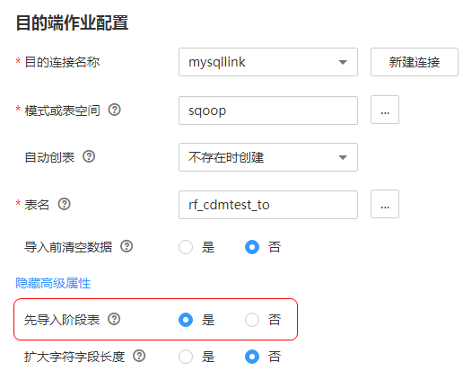

# 事务模式迁移

CDM的事务模式迁移，是指当CDM作业执行失败时，将数据回滚到作业开始之前的状态，自动清理目的表中的数据。

-   参数位置：创建表/文件迁移的作业时，如果目的端为关系型数据库，在目的端作业配置的高级属性中，可以通过“先导入阶段表“参数选择是否启用事务模式。
-   参数原理：如果启用，在作业执行时CDM会自动创建临时表，先将数据导入到该临时表，导入成功后再通过数据库的事务模式将数据迁移到目标表中；导入失败则将目的表回滚到作业开始之前的状态。

    **图 1**  事务模式迁移  
    

> **说明：**   
>如果“导入前清空数据“选择“是“，CDM的事务模式不会回滚已经删除的数据。  

