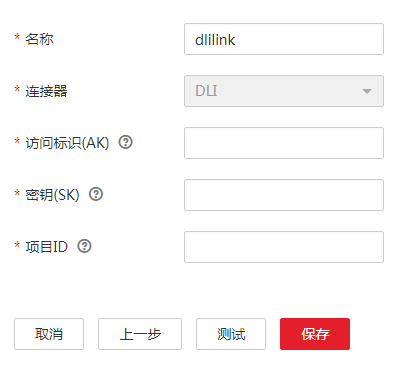
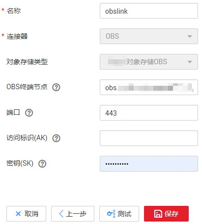
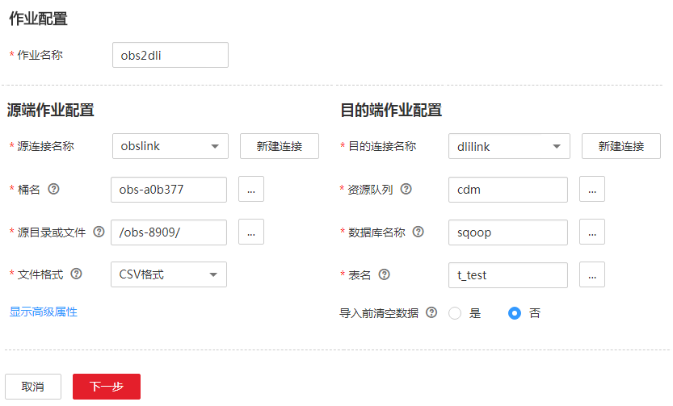

# 云上从OBS数据迁移到DLI服务

## 操作场景

数据湖探索（DLI）提供大数据查询服务，本章节介绍使用CDM将OBS的数据迁移到DLI，使用流程如下：

1.  [创建CDM集群](#zh-cn_topic_0108275364_section817245122914)
2.  [创建DLI连接](#zh-cn_topic_0108275364_section42195618294)
3.  [创建OBS连接](#zh-cn_topic_0108275364_section12969166122916)
4.  [创建迁移作业](#zh-cn_topic_0108275364_section1508747294234)

## 前提条件

-   已经开通了OBS和DLI。
-   已经在DLI服务中创建好资源队列、数据库和表。

## 创建CDM集群

根据实际情况选择操作：

-   如果您已拥有CDM集群，则直接单击集群后的“作业管理“，继续创建连接即可。
-   如果没有，则单击“购买云数据迁移服务“开始创建集群，具体操作请参见[创建集群](创建集群.md)。

    该场景下，如果CDM集群只是用于迁移OBS数据到DLI，不需要迁移其他数据源，则CDM集群所在的VPC、子网、安全组选择任一个即可，没有要求，CDM通过内网访问DLI和OBS。主要是选择CDM集群的规格，按待迁移的数据量选择，一般选择cdm.medium即可，满足大部分迁移场景。

## 创建DLI连接

1.  单击CDM集群后的“作业管理“，进入作业管理界面，再选择“连接管理  \>  新建连接“，进入选择连接器类型的界面，如[图1](#zh-cn_topic_0108275298_fig13640155194015)所示。

    **图 1**  选择连接器类型  
    

2.  连接器类型选择“数据湖探索（DLI）“后单击“下一步“，配置DLI连接参数，如[图2](#zh-cn_topic_0108275364_fig193421755164718)所示。

    -   名称：用户自定义连接名称，例如“dlilink“。
    -   访问标识（AK）、密钥（SK）：访问DLI数据库的AK、SK。可在管理控制台鼠标移动到用户名上，下拉框中选择“我的凭证  \>  管理访问密钥“后获取。
    -   项目ID：DLI所属区域的项目ID，在“我的凭证“中获取。

    **图 2**  创建DLI连接  
    

3.  单击“保存“回到连接管理界面。

## 创建OBS连接

1.  在连接管理界面单击“新建连接“，连接器类型选择“对象存储服务（OBS）“后，单击“下一步“配置OBS连接参数，如[图3](#zh-cn_topic_0123434187_zh-cn_topic_0108275445_fig1624805216359)所示。

    -   名称：用户自定义连接名称，例如“obslink“。
    -   OBS服务器、端口：配置为OBS实际的地址信息。
    -   访问标识（AK）、密钥（SK）：登录OBS的AK、SK。

    **图 3**  创建OBS连接  
    

2.  单击“保存“回到连接管理界面。

## 创建迁移作业

1.  选择“表/文件迁移  \>  新建作业“，开始创建从OBS迁移数据到DLI的任务，如[图4](#zh-cn_topic_0108275364_fig134515616469)所示。

    **图 4**  创建OBS到DLI的迁移任务  
    

    -   作业名称：用户自定义作业名称。
    -   源连接名称：选择[创建OBS连接](#zh-cn_topic_0108275364_section12969166122916)中的“obslink“。
        -   桶名：待迁移数据所属的桶。
        -   源目录或文件：待迁移数据的具体路径。
        -   文件格式：传输文件到数据表时，这里选择“CSV格式“或“JSON格式“。
        -   高级属性里的可选参数保持默认，详细说明请参见[配置对象存储源端参数](配置对象存储源端参数.md)。

    -   目的连接名称：选择[创建DLI连接](#zh-cn_topic_0108275364_section42195618294)中的“dlilink“。
        -   资源队列：选择目的表所属的资源队列。
        -   数据库名称：写入数据的数据库名称。
        -   表名：写入数据的目的表。CDM暂不支持在DLI中自动创表，这里的表需要先在DLI中创建好，且该表的字段类型和格式，建议与待迁移数据的字段类型、格式保持一致。
        -   导入前清空数据：导入数据前，选择是否清空目的表中的数据，这里保持默认“否“。

2.  单击“下一步“进入字段映射界面，CDM会自动匹配源和目的字段。
    -   如果字段映射顺序不匹配，可通过拖拽字段调整。
    -   CDM支持迁移过程中转换字段内容，详细参见[字段转换](字段转换.md)。

3.  单击“下一步“配置任务参数，一般情况下全部保持默认即可。

    该步骤用户可以配置如下可选功能：

    -   作业失败重试：如果作业执行失败，可选择是否自动重试，这里保持默认值“不重试“。
    -   作业分组：选择作业所属的分组，默认分组为“DEFAULT“。在CDM“作业管理“界面，支持作业分组显示、按组批量启动作业、按分组导出作业等操作。
    -   是否定时执行：如果需要配置作业定时自动执行，请参见[配置定时任务](配置定时任务.md)。这里保持默认值“否“。
    -   抽取并发数：设置同时执行的抽取任务数。这里保持默认值“1“。
    -   是否写入脏数据：如果需要将作业执行过程中处理失败的数据、或者被清洗过滤掉的数据写入OBS中，以便后面查看，可通过该参数配置，写入脏数据前需要先配置好OBS连接。这里保持默认值“否“即可，不记录脏数据。
    -   作业运行完是否删除：这里保持默认值“不删除“。

4.  单击“保存并运行“，回到作业管理界面，在作业管理界面可查看作业执行进度和结果。
5.  作业执行成功后，单击作业操作列的“历史记录“，可查看该作业的历史执行记录、读取和写入的统计数据。

    在历史记录界面单击“日志“，可查看作业的日志信息。

