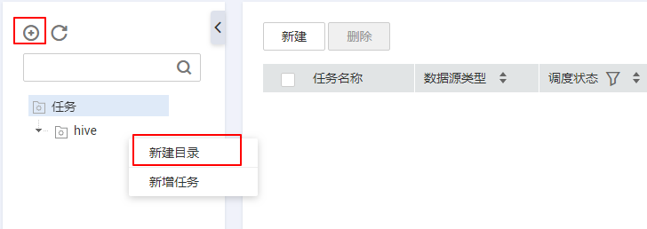

# 任务管理

本章主要介绍如何通过配置元数据采集策略新建采集任务，不同类型的数据源对应的采集策略不尽相同。元数据管理依据采集任务的配置策略，采集对应的技术元数据信息。

## 前提条件

需要在管理中心创建数据连接：元数据采集支持丰富的数据源类型，对于DWS、DLI、MRS HBase、MRS Hive、RDS（MySQL）、RDS（postgres）和ORACLE类型的数据源，首先需要在管理中心创建数据连接。

## 新增采集任务

1.  在DGC控制台首页，选择对应工作空间的“数据资产“模块，进入数据资产页面。

    **图 1**  选择数据资产  
    

1.  选择“元数据采集  \>  任务管理“。
2.  选择采集任务所归属的目录。如果未新建目录请参见[图2](#fig28981041106)创建进行。

    **图 2**  新建采集任务的归属目录  
    

3.  单击页面上方“新建“或者右键单击任务菜单，单击“新增任务“，在弹出的对话框中，配置相关参数，新建采集任务。

    新建任务有如[图3](#fig19474451115)所示的两个入口。

    **图 3**  新建采集任务入口  
    

    1.  配置基本参数，参考[表1](#table994734213271)。

        **表 1**  基本配置说明

        
        <table><thead align="left"><tr id="row209472421274"><th class="cellrowborder" valign="top" width="17.080000000000002%" id="mcps1.2.3.1.1">
参数名

        </th>
        <th class="cellrowborder" valign="top" width="82.92%" id="mcps1.2.3.1.2">
说明

        </th>
        </tr>
        </thead>
        <tbody><tr id="row594794262714"><td class="cellrowborder" valign="top" width="17.080000000000002%" headers="mcps1.2.3.1.1 ">
任务名称

        </td>
        <td class="cellrowborder" valign="top" width="82.92%" headers="mcps1.2.3.1.2 ">
采集任务的名称，只能包含中文、英文字母、数字和下划线，且长度不能超过62个字符。

        </td>
        </tr>
        <tr id="row10948142142718"><td class="cellrowborder" valign="top" width="17.080000000000002%" headers="mcps1.2.3.1.1 ">
描述

        </td>
        <td class="cellrowborder" valign="top" width="82.92%" headers="mcps1.2.3.1.2 ">
为更好的识别采集任务，此处加以描述信息。描述信息长度不能超过255个字符。

        </td>
        </tr>
        <tr id="row119481142102713"><td class="cellrowborder" valign="top" width="17.080000000000002%" headers="mcps1.2.3.1.1 ">
选择目录

        </td>
        <td class="cellrowborder" valign="top" width="82.92%" headers="mcps1.2.3.1.2 ">
采集任务的存储目录，可选择已创建的目录。目录创建请参见<a href="#fig28981041106">图2</a>。

        </td>
        </tr>
        </tbody>
        </table>

    2.  配置数据源信息，参考[表2](#table673214448313)。

        **表 2**  数据源信息参数说明

        
        <table><thead align="left"><tr id="row12196102673318"><th class="cellrowborder" valign="top" width="20.65%" id="mcps1.2.3.1.1">
参数名

        </th>
        <th class="cellrowborder" valign="top" width="79.35%" id="mcps1.2.3.1.2">
说明

        </th>
        </tr>
        </thead>
        <tbody><tr id="row13733944173120"><td class="cellrowborder" valign="top" width="20.65%" headers="mcps1.2.3.1.1 ">
数据源类型

        </td>
        <td class="cellrowborder" valign="top" width="79.35%" headers="mcps1.2.3.1.2 ">
从下拉列表中选择数据源类型。

        
 说明： 

采集任务支持丰富的数据源类型，对于DWS、DLI、MRS HBase、MRS Hive、RDS（MySQL）、ORACLE类型的数据源，首先需要在管理中心创建数据连接，参考<a href="创建数据连接.md">创建数据连接</a>。

        

        </td>
        </tr>
        <tr id="row573384413316"><td class="cellrowborder" valign="top" width="20.65%" headers="mcps1.2.3.1.1 ">
OBS桶

        </td>
        <td class="cellrowborder" valign="top" width="79.35%" headers="mcps1.2.3.1.2 ">
选择待采集数据归属的OBS桶，仅数据源类型为OBS时，呈现此参数。

        </td>
        </tr>
        <tr id="row3733184413112"><td class="cellrowborder" valign="top" width="20.65%" headers="mcps1.2.3.1.1 ">
数据连接

        </td>
        <td class="cellrowborder" valign="top" width="79.35%" headers="mcps1.2.3.1.2 "><ul id="ul11733184419318"><li>所选数据连接类型中已创建数据连接，支持从下拉列表中选择。</li><li>所选数据连接类型中未创建数据连接，请单击“新建”，创建新的数据连接。</li></ul>
        </td>
        </tr>
        <tr id="row15733134412316"><td class="cellrowborder" valign="top" width="20.65%" headers="mcps1.2.3.1.1 ">
OBS路径

        </td>
        <td class="cellrowborder" valign="top" width="79.35%" headers="mcps1.2.3.1.2 ">
选择待采集数据在OBS桶中的存储路径，仅数据源类型为OBS时，呈现此参数。

        </td>
        </tr>
        <tr id="row15734114453112"><td class="cellrowborder" valign="top" width="20.65%" headers="mcps1.2.3.1.1 ">
采集范围

        </td>
        <td class="cellrowborder" valign="top" width="79.35%" headers="mcps1.2.3.1.2 ">
选择待采集数据的采集范围，仅数据源类型为OBS时，呈现此参数，原因是obs桶中是分目录层级的。

        <ul id="ul17967122614816"><li>选择“当前文件夹”，采集任务仅采集obs路径中设置的文件夹下的对象。</li><li>选择“当前文件夹和所有字文件夹”，采集任务会采集obs路径中设置的文件夹下所有的对象，包括其子文件夹下的对象</li></ul>
        </td>
        </tr>
        <tr id="row1773444412313"><td class="cellrowborder" valign="top" width="20.65%" headers="mcps1.2.3.1.1 ">
采集内容

        </td>
        <td class="cellrowborder" valign="top" width="79.35%" headers="mcps1.2.3.1.2 ">
选择待采集数据的采集内容，仅数据源类型为OBS时，呈现此参数，原因是obs桶中是分目录层级的。

        <ul id="ul178095261492"><li>选择“文件夹和对象”，采集任务采集文件夹和对象。</li><li>选择“ 文件夹”，采集任务仅采集文件夹。</li></ul>
        </td>
        </tr>
        <tr id="row1973494453113"><td class="cellrowborder" valign="top" width="20.65%" headers="mcps1.2.3.1.1 ">
数据库和schema

        </td>
        <td class="cellrowborder" valign="top" width="79.35%" headers="mcps1.2.3.1.2 ">
仅数据源类型为DWS时，呈现此参数。

        
单击数据库和schema后的“设置”，设置采集任务扫描的数据库和schema范围。当不进行设置时，默认选择该数据连接下的所有数据库和schema 。

        
单击“清除”，可对已选择的数据库和schema进行修改。

        </td>
        </tr>
        <tr id="row5735044193112"><td class="cellrowborder" valign="top" width="20.65%" headers="mcps1.2.3.1.1 ">
命名空间

        </td>
        <td class="cellrowborder" valign="top" width="79.35%" headers="mcps1.2.3.1.2 ">
仅数据源类型为MRS HBase时，呈现此参数。

        
单击命名空间后的“设置”，设置采集任务扫描的命名空间范围。当不进行设置时，默认选择该数据连接下的所有命名空间 。

        
单击“清除”，可对已选择的命名空间进行修改。

        </td>
        </tr>
        <tr id="row6735844113112"><td class="cellrowborder" valign="top" width="20.65%" headers="mcps1.2.3.1.1 ">
数据库

        </td>
        <td class="cellrowborder" rowspan="2" valign="top" width="79.35%" headers="mcps1.2.3.1.2 ">
呈现待采集的数据库和数据表。

        <ul id="ul6735124411316"><li>单击数据库后的“设置”，设置采集任务扫描的数据库范围。当不进行设置时，默认选择该数据连接下的所有数据库 。</li><li>单击数据表后的“设置”，设置采集任务扫描的数据表范围。当不进行设置时，默认选择数据库下的所有数据表。针对数据连接类型为Mysql、Oracle和DLI的数据表，支持按照正则表达式过滤需要采集的表。</li><li>当数据库和数据表均不设置时，则采集任务扫描的数据范围为该数据连接下的所有数据表。</li><li>单击“清除”，可对已选择的数据库和数据表进行修改。</li></ul>
        </td>
        </tr>
        <tr id="row67361044173110"><td class="cellrowborder" valign="top" headers="mcps1.2.3.1.1 ">
数据表

        </td>
        </tr>
        <tr id="row473644414314"><td class="cellrowborder" valign="top" width="20.65%" headers="mcps1.2.3.1.1 ">
是否采集转储任务

        </td>
        <td class="cellrowborder" valign="top" width="79.35%" headers="mcps1.2.3.1.2 ">
仅数据源类型为DIS时，呈现此参数。

        
勾选“采集”表示采集转储任务。

        </td>
        </tr>
        <tr id="row1673617442317"><td class="cellrowborder" valign="top" width="20.65%" headers="mcps1.2.3.1.1 ">
采集通道

        </td>
        <td class="cellrowborder" valign="top" width="79.35%" headers="mcps1.2.3.1.2 ">
仅数据源类型为DIS时，呈现此参数。

        
DIS服务的实例就是通道。所以此参数表示选择通道，进行采集。

        </td>
        </tr>
        <tr id="row19618582448"><td class="cellrowborder" valign="top" width="20.65%" headers="mcps1.2.3.1.1 ">
选择图

        </td>
        <td class="cellrowborder" valign="top" width="79.35%" headers="mcps1.2.3.1.2 ">
仅数据源类型为GES时，呈现此参数。

        
选择存储了以“关系”为基础的结构数据的图。

        </td>
        </tr>
        <tr id="row795632114519"><td class="cellrowborder" valign="top" width="20.65%" headers="mcps1.2.3.1.1 ">
选择集群

        </td>
        <td class="cellrowborder" valign="top" width="79.35%" headers="mcps1.2.3.1.2 ">
仅数据源类型为CSS时，呈现此参数。

        
选择待采集数据存储的CSS集群。

        
您也可以单击“新建”，创建CSS集群，创建完成后单击“刷新”，选择新建的CSS集群即可。

        </td>
        </tr>
        <tr id="row11807146184515"><td class="cellrowborder" valign="top" width="20.65%" headers="mcps1.2.3.1.1 ">
绑定Agent

        </td>
        <td class="cellrowborder" valign="top" width="79.35%" headers="mcps1.2.3.1.2 ">
管理CloudTable/GES/CSS类型的数据连接，请选择CDM集群提供的Agent。

        
用户也可以单击“新建”，创建新的Agent，创建完成后单击“刷新”，选择新的Agent即可。

        </td>
        </tr>
        <tr id="row579141124510"><td class="cellrowborder" valign="top" width="20.65%" headers="mcps1.2.3.1.1 ">
索引

        </td>
        <td class="cellrowborder" valign="top" width="79.35%" headers="mcps1.2.3.1.2 ">
仅数据源类型为CSS时，呈现此参数。

        
用于存储Elasticsearch的数据，类似关系型数据库的Database。是一个或多个分片分组在一起的逻辑空间。

        </td>
        </tr>
        </tbody>
        </table>

    3.  元数据采集参数配置，参考[表3](#table199065010379)。

        **表 3**  元数据采集参数说明

        
        <table><thead align="left"><tr id="row136818383819"><th class="cellrowborder" valign="top" width="24.07%" id="mcps1.2.3.1.1">
参数名

        </th>
        <th class="cellrowborder" valign="top" width="75.92999999999999%" id="mcps1.2.3.1.2">
说明

        </th>
        </tr>
        </thead>
        <tbody><tr id="row4912050193715"><td class="cellrowborder" valign="top" width="24.07%" headers="mcps1.2.3.1.1 ">
数据源元数据已更新

        </td>
        <td class="cellrowborder" valign="top" width="75.92999999999999%" headers="mcps1.2.3.1.2 ">
当数据连接中元数据发生变化时，通过配置更新策略，设置数据目录中元数据的更新方式。

        
需要注意的是配置的更新、删除策略是作用在用户配置的数据库、数据表的范围内的。

        <ul id="ul56258474515"><li>勾选“仅更新数据目录中的元数据”：采集任务仅更新数据目录已经采集到的元数据</li><li>勾选“仅添加新元数据”：采集任务仅采集数据源中存在，但是数据目录中不存在的元数据</li><li>勾选“更新数据目录中的元数据、添加新元数据”：采集任务全量同步数据源中的元数据</li><li>勾选“忽略更新、添加操作”：不采集数据源中的元数据</li></ul>
        </td>
        </tr>
        <tr id="row1793185018375"><td class="cellrowborder" valign="top" width="24.07%" headers="mcps1.2.3.1.1 ">
数据源元数据已删除

        </td>
        <td class="cellrowborder" valign="top" width="75.92999999999999%" headers="mcps1.2.3.1.2 ">
当数据连接中元数据发生变化时，通过配置删除策略，设置数据目录中元数据的更新方式。

        <ul id="ul179195824813"><li>勾选“从数据目录中删除元数据”：当数据源中的某些元数据已经被删除，数据目录中也将同步删除对应的元数据</li><li>勾选“忽略删除”：当数据源中的某些元数据已经被删除，数据目录中不同步删除对应元数据。</li></ul>
        </td>
        </tr>
        </tbody>
        </table>

    4.  勾选数据概要时的参数配置，参考[表4](#table373593012409)。

        **表 4**  数据概要参数说明

        
        <table><thead align="left"><tr id="row985621016415"><th class="cellrowborder" valign="top" width="16.93%" id="mcps1.2.3.1.1">
参数名

        </th>
        <th class="cellrowborder" valign="top" width="83.07%" id="mcps1.2.3.1.2">
说明

        </th>
        </tr>
        </thead>
        <tbody><tr id="row12736103017403"><td class="cellrowborder" valign="top" width="16.93%" headers="mcps1.2.3.1.1 ">
基于全量数据

        </td>
        <td class="cellrowborder" valign="top" width="83.07%" headers="mcps1.2.3.1.2 ">
基于已采集的全量数据在数据目录中生成数据概要。

        
适用于数据量较少（100W以下）的情况。

        </td>
        </tr>
        <tr id="row107360309402"><td class="cellrowborder" valign="top" width="16.93%" headers="mcps1.2.3.1.1 ">
基于采样数据，采样数量为<em id="i397474810464">x</em>条

        </td>
        <td class="cellrowborder" valign="top" width="83.07%" headers="mcps1.2.3.1.2 ">
基于已采集的全量数据在数据目录中生成数据概要。

        
适用于数据量较多的情况。

        </td>
        </tr>
        <tr id="row11736193012409"><td class="cellrowborder" valign="top" width="16.93%" headers="mcps1.2.3.1.1 ">
基于全量数据，随机取<em id="i193315125472">x</em>%的数据

        </td>
        <td class="cellrowborder" valign="top" width="83.07%" headers="mcps1.2.3.1.2 ">
基于已采集的全量数据在数据目录中生成数据概要。

        
适用于数据量较多的情况。

        </td>
        </tr>
        <tr id="row9736173044015"><td class="cellrowborder" valign="top" width="16.93%" headers="mcps1.2.3.1.1 ">
DLI队列

        </td>
        <td class="cellrowborder" valign="top" width="83.07%" headers="mcps1.2.3.1.2 ">
选择获取profile数据，执行DLI  SQL用的队列。

        
勾选“采集唯一值”表示只统计已采集的表中的唯一值的个数，并在数据目录中的概要页签呈现。

        </td>
        </tr>
        <tr id="row147371730104017"><td class="cellrowborder" valign="top" width="16.93%" headers="mcps1.2.3.1.1 ">
数据格式

        </td>
        <td class="cellrowborder" valign="top" width="83.07%" headers="mcps1.2.3.1.2 ">
当存储在OBS桶中的数据为CSV格式，请依据数据的实际属性进行勾选是否有表头，是否自定义分隔符，是否自定义引用字符，是否自定义转义字符。

        </td>
        </tr>
        <tr id="row373711307408"><td class="cellrowborder" valign="top" width="16.93%" headers="mcps1.2.3.1.1 ">
日期格式

        </td>
        <td class="cellrowborder" valign="top" width="83.07%" headers="mcps1.2.3.1.2 ">
当存储在OBS桶中的数据为CSV格式，请依据实际属性配置日期格式，以免影响数据被错误解析。

        </td>
        </tr>
        <tr id="row273711306406"><td class="cellrowborder" valign="top" width="16.93%" headers="mcps1.2.3.1.1 ">
时间戳格式

        </td>
        <td class="cellrowborder" valign="top" width="83.07%" headers="mcps1.2.3.1.2 ">
当存储在OBS桶中的数据为CSV格式，请依据实际属性配置时间戳格式，以免影响数据被错误解析。

        </td>
        </tr>
        </tbody>
        </table>

    5.  数据分类配置说明

        -   数据分类：新建分类规则组或者选中已有分类规则组，实现自动识别数据并添加分类。
        -   数据分级：勾选“根据数据分类结果更新数据表密级“，表示可根据匹配的分类规则中，将密级最高的设置为表的密级。

        -   数据同步：勾选“手动同步分类结果“，表示“数据资产 \> 数据目录 \> 列属性”中呈现的数据列，在采集任务执行完毕后，不会自动添加分类和密级属性。需要用户前往“元数据采集 \> 任务监控 ”页面，找到任务实例，选择“操作 \> 更多 \> 扫描结果”，查看采集任务的执行结果，确认分类结果是否匹配。勾选分类匹配字段前的复选框，单击“同步“，即可将分类和密级属性手动同步到资产。

        > **说明：** 
        >仅DWS、DLI和MRS Hive这三类数据源支持创建采集任务时添加数据分类，实现自动识别。另外，只可给数据表的列和OBS对象添加分类。

4.  单击“下一步“，选择调度方式，支持单次调度和周期调度两种方式。

    单次调度：超时时间表示如果任务运行的时长超过了设置的超时时间，任务会被认定运行失败。

    周期调度的相关参数配置请参见[表5](#table7217145245713)。

    > **说明：** 
    >1.  单次调度会产生手动任务的实例，手动任务的特点是没有调度依赖，只需要手动触发即可。
    >2.  周期调度会产生周期实例，周期实例是周期任务达到启用调度所配置的周期性运行时间时，被自动调度起来的实例快照。
    >3.  周期任务每调度一次，便生成一个实例工作流。用户可以对已调度起的实例任务进行日常的运维管理，如查看运行状态，对任务进行终止、重跑等操作。

    **表 5**  配置周期调度参数

    
    <table><thead align="left"><tr id="row92150526576"><th class="cellrowborder" valign="top" width="27.58%" id="mcps1.2.3.1.1">
参数名

    </th>
    <th class="cellrowborder" valign="top" width="72.42%" id="mcps1.2.3.1.2">
说明

    </th>
    </tr>
    </thead>
    <tbody><tr id="row1821516529572"><td class="cellrowborder" valign="top" width="27.58%" headers="mcps1.2.3.1.1 ">
生效日期

    </td>
    <td class="cellrowborder" valign="top" width="72.42%" headers="mcps1.2.3.1.2 ">
调度任务的生效时间段。

    </td>
    </tr>
    <tr id="row321617528578"><td class="cellrowborder" valign="top" width="27.58%" headers="mcps1.2.3.1.1 ">
调度周期

    </td>
    <td class="cellrowborder" valign="top" width="72.42%" headers="mcps1.2.3.1.2 ">
选择调度任务的执行周期，并配置相关参数。

    <ul id="ul62161552105718"><li>分钟</li><li>小时</li><li>天</li><li>周</li></ul>
    </td>
    </tr>
    <tr id="row1421618521571"><td class="cellrowborder" valign="top" width="27.58%" headers="mcps1.2.3.1.1 ">
开始时间

    </td>
    <td class="cellrowborder" valign="top" width="72.42%" headers="mcps1.2.3.1.2 ">
周期调度开始的时间。

    </td>
    </tr>
    <tr id="row19216165212570"><td class="cellrowborder" valign="top" width="27.58%" headers="mcps1.2.3.1.1 ">
间隔时间

    </td>
    <td class="cellrowborder" valign="top" width="72.42%" headers="mcps1.2.3.1.2 ">
周期调度上一次结束到下一次开始中间间隔的时间。

    </td>
    </tr>
    <tr id="row1216165219574"><td class="cellrowborder" valign="top" width="27.58%" headers="mcps1.2.3.1.1 ">
结束时间

    </td>
    <td class="cellrowborder" valign="top" width="72.42%" headers="mcps1.2.3.1.2 ">
周期调度结束的时间。

    </td>
    </tr>
    <tr id="row1521775255710"><td class="cellrowborder" valign="top" width="27.58%" headers="mcps1.2.3.1.1 ">
超时时间

    </td>
    <td class="cellrowborder" valign="top" width="72.42%" headers="mcps1.2.3.1.2 ">
任务运行的时长超过了此处设置的超时时间，任务会被认定运行失败。

    </td>
    </tr>
    <tr id="row4217152185719"><td class="cellrowborder" valign="top" width="27.58%" headers="mcps1.2.3.1.1 ">
启动调度

    </td>
    <td class="cellrowborder" valign="top" width="72.42%" headers="mcps1.2.3.1.2 ">
勾选复选框，则表示立即启动此调度任务。

    </td>
    </tr>
    </tbody>
    </table>

5.  单击“提交“，采集任务创建成功。

## 管理采集任务

1.  在DGC控制台首页，选择对应工作空间的“数据资产“模块，进入数据资产页面。

    **图 4**  选择数据资产  
    

1.  选择“元数据采集  \>   任务管理“。

在采集任务页面，可查看所有已创建的采集任务。

**表 6**  管理采集任务

<table><thead align="left"><tr id="zh-cn_topic_0141836083_row1922973120286"><th class="cellrowborder" valign="top" width="17.150000000000002%" id="mcps1.2.3.1.1">
参数名

</th>
<th class="cellrowborder" valign="top" width="82.85%" id="mcps1.2.3.1.2">
说明

</th>
</tr>
</thead>
<tbody><tr id="zh-cn_topic_0141836083_row8234143119282"><td class="cellrowborder" valign="top" width="17.150000000000002%" headers="mcps1.2.3.1.1 ">
任务名称

</td>
<td class="cellrowborder" valign="top" width="82.85%" headers="mcps1.2.3.1.2 ">
采集任务的名称。

单击采集任务名称，可查看该采集任务的采集策略和调度属性。

</td>
</tr>
<tr id="zh-cn_topic_0141836083_row1723483112816"><td class="cellrowborder" valign="top" width="17.150000000000002%" headers="mcps1.2.3.1.1 ">
数据源类型

</td>
<td class="cellrowborder" valign="top" width="82.85%" headers="mcps1.2.3.1.2 ">
数据连接的名称。

</td>
</tr>
<tr id="zh-cn_topic_0141836083_row52341331152817"><td class="cellrowborder" valign="top" width="17.150000000000002%" headers="mcps1.2.3.1.1 ">
调度状态

</td>
<td class="cellrowborder" valign="top" width="82.85%" headers="mcps1.2.3.1.2 ">
显示采集任务的调度方式，单击，可进行筛选。

</td>
</tr>
<tr id="zh-cn_topic_0141836083_row152348319286"><td class="cellrowborder" valign="top" width="17.150000000000002%" headers="mcps1.2.3.1.1 ">
调度周期

</td>
<td class="cellrowborder" valign="top" width="82.85%" headers="mcps1.2.3.1.2 ">
显示采集任务的调度频率，单击，可进行筛选。

</td>
</tr>
<tr id="zh-cn_topic_0141836083_row172341831172815"><td class="cellrowborder" valign="top" width="17.150000000000002%" headers="mcps1.2.3.1.1 ">
描述

</td>
<td class="cellrowborder" valign="top" width="82.85%" headers="mcps1.2.3.1.2 ">
展示采集任务的描述信息。

</td>
</tr>
<tr id="zh-cn_topic_0141836083_row6891102614294"><td class="cellrowborder" valign="top" width="17.150000000000002%" headers="mcps1.2.3.1.1 ">
创建人

</td>
<td class="cellrowborder" valign="top" width="82.85%" headers="mcps1.2.3.1.2 ">
展示采集任务的创建人。

</td>
</tr>
<tr id="zh-cn_topic_0141836083_row10580183752912"><td class="cellrowborder" valign="top" width="17.150000000000002%" headers="mcps1.2.3.1.1 ">
最近运行时间

</td>
<td class="cellrowborder" valign="top" width="82.85%" headers="mcps1.2.3.1.2 ">
展示采集任务的最近运行时间。

</td>
</tr>
<tr id="zh-cn_topic_0141836083_row109871947102915"><td class="cellrowborder" valign="top" width="17.150000000000002%" headers="mcps1.2.3.1.1 ">
操作

</td>
<td class="cellrowborder" valign="top" width="82.85%" headers="mcps1.2.3.1.2 ">
对已创建的采集任务可进行如下操作：

<ul id="zh-cn_topic_0141836083_ul290595718720"><li>编辑：支持对采集任务（状态为已启动、未启动、运行失败）的采集策略强相关参数进行修改，不支持修改数据源类型。</li><li>运行：单击“运行”，可运行此采集任务，并可在“任务监控”页面查看其状态和相关日志信息。</li><li>启动调度：当其状态为“已停止”，则可重新启动调度。</li><li>停止调度：当调度状态为“调度中”，则可停止调度。</li></ul>
</td>
</tr>
</tbody>
</table>

