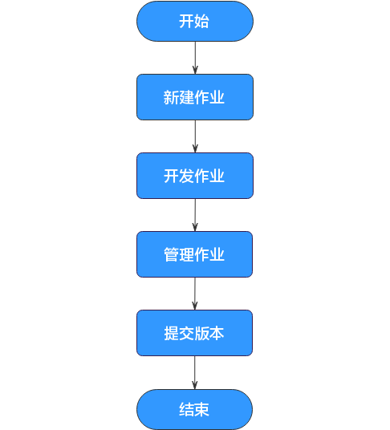

# 作业开发流程

作业开发功能提供如下能力：

-   提供图形化设计器，支持拖拉拽方式快速构建数据处理工作流。
-   预设数据集成、计算&分析、资源管理、数据监控、其他等多种任务类型，通过任务间依赖完成复杂数据分析处理。
-   支持多种作业调度方式。
-   支持导入和导出作业。
-   支持作业状态运维监控和作业结果通知。
-   支持作业的版本管理能力。

开发作业前，您可以通过[图1](#fig751515296455)了解数据开发模块作业开发的基本流程。

**图 1**  作业开发流程  

1.  新建作业。当前提供两种作业类型：批处理和实时处理，分别应用于批量数据处理和实时连接性数据处理。具体请参见[新建作业](新建作业.md)。
2.  基于新建的作业，进行作业开发。您可以进行编排、配置节点，并配置调度任务。具体请参见[开发作业](开发作业.md)。

    -   如果您的作业是批处理作业，您可以配置作业级别的调度任务，即以作业为一整体进行调度，支持单次调度、周期调度、事件驱动调度三种调度方式。具体请参见[配置作业调度任务（批处理作业）](调度作业.md#zh-cn_topic_0099797007_section1590152794714)。
    -   如果您的作业是实时处理作业，您可以配置节点级别的调度任务，即每一个节点可以独立调度，支持单次调度、周期调度、事件驱动调度三种调度方式。具体请参见[配置节点调度任务（实时作业）](调度作业.md#zh-cn_topic_0099797007_section644754422910)。

    作业编排和配置完成后，进行作业调测并及时保存作业，防止作业配置信息丢失。具体请参见[调测并保存作业](开发作业.md#zh-cn_topic_0099797007_section1267113200395)。

3.  作业开发完成后，您可以根据需要，进行作业管理。具体请参见[管理作业](管理作业.md)。
4.  作业开发、管理完成后，您需要提交作业版本，作业提交版本后才能用于正式地调度运行。具体请参见[管理作业版本](管理作业版本.md)。

