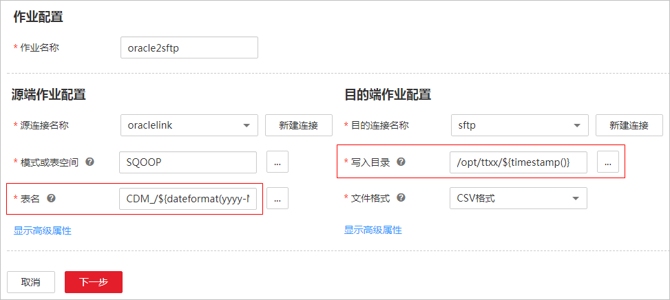
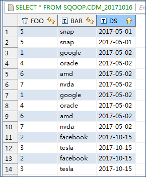

# 使用时间宏变量完成增量同步

在[新建表/文件迁移作业](新建表-文件迁移作业.md)时，CDM支持在源端和目的端的以下参数中配置时间宏变量：

-   源目录
-   源端的表名
-   目的端的写入目录
-   目的端的表名
-   Where子句

支持通过宏定义变量表示符“$\{\}“来完成时间类型的宏定义，当前支持两种类型：dateformat和timestamp。

通过时间宏变量+[定时执行作业](配置定时任务.md)，可以实现数据库增量同步和文件增量同步。

## dateformat

dateformat支持两种形式的参数：

-   dateformat\(format\)

    format表示返回日期的格式，格式定义参考“java.text.SimpleDateFormat.java“中的定义。

    例如当前日期为“2017-10-16 09:00:00“，则“yyyy-MM-dd HH:mm:ss“表示“2017-10-16 09:00:00“。

-   dateformat\(format, dateOffset, dateType\)

    -   format表示返回日期的格式。
    -   dateOffset表示日期的偏移量。
    -   dateType表示日期的偏移量的类型。

        目前dateType支持以下几种类型：SECOND（秒），MINUTE（分钟），HOUR（小时），DAY（天）。

    例如当前日期为“2017-10-16 09:00:00“，则“dateformat\(yyyy-MM-dd HH:mm:ss, -1, DAY\)“表示当前时间的前一天，也就是“2017-10-15 09:00:00“。

## timestamp

timestamp支持两种形式的参数：

-   timestamp\(\)

    返回当前时间的时间戳，即从1970年到现在的毫秒数，如1508078516286。

-   timestamp\(dateOffset, dateType\)

    返回经过时间偏移后的时间戳，“dateOffset“和“dateType“表示日期的偏移量以及偏移量的类型。

    例如当前日期为“2017-10-16 09:00:00“，则“timestamp\(-10, MINUTE\)“返回当前时间点10分钟前的时间戳，即“1508115000000“。

## 时间变量宏定义具体展示

假设当前时间为“2017-10-16 09:00:00“，时间变量宏定义具体如[表1](#zh-cn_topic_0108275294_table45534079114353)所示。

**表 1**  时间变量宏定义具体展示

<table><thead align="left"><tr id="zh-cn_topic_0108275294_row25675957114353"><th class="cellrowborder" valign="top" width="36.86368636863686%" id="mcps1.2.4.1.1">
宏变量

</th>
<th class="cellrowborder" valign="top" width="38.083808380838086%" id="mcps1.2.4.1.2">
含义

</th>
<th class="cellrowborder" valign="top" width="25.052505250525055%" id="mcps1.2.4.1.3">
实际显示效果

</th>
</tr>
</thead>
<tbody><tr id="zh-cn_topic_0108275294_row35906764114353"><td class="cellrowborder" valign="top" width="36.86368636863686%" headers="mcps1.2.4.1.1 ">
${dateformat(yyyy-MM-dd)}

</td>
<td class="cellrowborder" valign="top" width="38.083808380838086%" headers="mcps1.2.4.1.2 ">
以yyyy-MM-dd格式返回当前时间。

</td>
<td class="cellrowborder" valign="top" width="25.052505250525055%" headers="mcps1.2.4.1.3 ">
2017-10-16

</td>
</tr>
<tr id="zh-cn_topic_0108275294_row28825634114353"><td class="cellrowborder" valign="top" width="36.86368636863686%" headers="mcps1.2.4.1.1 ">
${dateformat(yyyy/MM/dd)}

</td>
<td class="cellrowborder" valign="top" width="38.083808380838086%" headers="mcps1.2.4.1.2 ">
以yyyy/MM/dd格式返回当前时间。

</td>
<td class="cellrowborder" valign="top" width="25.052505250525055%" headers="mcps1.2.4.1.3 ">
2017/10/16

</td>
</tr>
<tr id="zh-cn_topic_0108275294_row42297384114353"><td class="cellrowborder" valign="top" width="36.86368636863686%" headers="mcps1.2.4.1.1 ">
${dateformat(yyyy_MM_dd HH:mm:ss)}

</td>
<td class="cellrowborder" valign="top" width="38.083808380838086%" headers="mcps1.2.4.1.2 ">
以yyyy_MM_dd HH:mm:ss格式返回当前时间。

</td>
<td class="cellrowborder" valign="top" width="25.052505250525055%" headers="mcps1.2.4.1.3 ">
2017_10_16 09:00:00

</td>
</tr>
<tr id="zh-cn_topic_0108275294_row24034131114353"><td class="cellrowborder" valign="top" width="36.86368636863686%" headers="mcps1.2.4.1.1 ">
${dateformat(yyyy-MM-dd HH:mm:ss, -1, DAY)}

</td>
<td class="cellrowborder" valign="top" width="38.083808380838086%" headers="mcps1.2.4.1.2 ">
以yyyy-MM-dd HH:mm:ss格式返回时间，时间为当前时间的前一天。

</td>
<td class="cellrowborder" valign="top" width="25.052505250525055%" headers="mcps1.2.4.1.3 ">
2017-10-15 09:00:00

</td>
</tr>
<tr id="zh-cn_topic_0108275294_row42380516114353"><td class="cellrowborder" valign="top" width="36.86368636863686%" headers="mcps1.2.4.1.1 ">
${timestamp()}

</td>
<td class="cellrowborder" valign="top" width="38.083808380838086%" headers="mcps1.2.4.1.2 ">
返回当前时间的时间戳，即1970年1月1日（00:00:00 GMT）到当前时间的毫秒数。

</td>
<td class="cellrowborder" valign="top" width="25.052505250525055%" headers="mcps1.2.4.1.3 ">
1508115600000

</td>
</tr>
<tr id="zh-cn_topic_0108275294_row23437985114353"><td class="cellrowborder" valign="top" width="36.86368636863686%" headers="mcps1.2.4.1.1 ">
${timestamp(-10, MINUTE)}

</td>
<td class="cellrowborder" valign="top" width="38.083808380838086%" headers="mcps1.2.4.1.2 ">
返回当前时间点10分钟前的时间戳。

</td>
<td class="cellrowborder" valign="top" width="25.052505250525055%" headers="mcps1.2.4.1.3 ">
1508115000000

</td>
</tr>
<tr id="zh-cn_topic_0108275294_row04676276214"><td class="cellrowborder" valign="top" width="36.86368636863686%" headers="mcps1.2.4.1.1 ">
${timestamp(dateformat(yyyyMMdd))}

</td>
<td class="cellrowborder" valign="top" width="38.083808380838086%" headers="mcps1.2.4.1.2 ">
返回今天0点的时间戳。

</td>
<td class="cellrowborder" valign="top" width="25.052505250525055%" headers="mcps1.2.4.1.3 ">
1508083200000

</td>
</tr>
<tr id="zh-cn_topic_0108275294_row13469861734"><td class="cellrowborder" valign="top" width="36.86368636863686%" headers="mcps1.2.4.1.1 ">
${timestamp(dateformat(yyyyMMdd,-1,DAY))}

</td>
<td class="cellrowborder" valign="top" width="38.083808380838086%" headers="mcps1.2.4.1.2 ">
返回昨天0点的时间戳。

</td>
<td class="cellrowborder" valign="top" width="25.052505250525055%" headers="mcps1.2.4.1.3 ">
1507996800000

</td>
</tr>
<tr id="zh-cn_topic_0108275294_row9908557931"><td class="cellrowborder" valign="top" width="36.86368636863686%" headers="mcps1.2.4.1.1 ">
${timestamp(dateformat(yyyyMMddHH))}

</td>
<td class="cellrowborder" valign="top" width="38.083808380838086%" headers="mcps1.2.4.1.2 ">
返回当前整小时的时间戳。

</td>
<td class="cellrowborder" valign="top" width="25.052505250525055%" headers="mcps1.2.4.1.3 ">
1508115600000

</td>
</tr>
</tbody>
</table>

## 路径和表名的时间宏变量

如[图1](#zh-cn_topic_0108275294_fig37004875105035)所示，如果将：

-   源端的“表名“配置为“CDM\_/$\{dateformat\(yyyy-MM-dd\)\}“。
-   目的端的“写入目录“配置为“/opt/ttxx/$\{timestamp\(\)\}“。

经过宏定义转换，这个作业表示：将Oracle数据库的“SQOOP.CDM\_20171016“表中数据，迁移到SFTP的“/opt/ttxx/1508115701746“目录中。

**图 1**  源表名和写入目录配置为时间宏变量  

目前也支持一个表名或路径名中有多个宏定义变量，例如“/opt/ttxx/$\{dateformat\(yyyy-MM-dd\)\}/$\{timestamp\(\)\}“，经过转换后为“/opt/ttxx/2017-10-16/1508115701746“。

## Where子句中的时间宏变量

以SQOOP.CDM\_20171016表为例，该表中存在表示时间的列DS，如[图2](#zh-cn_topic_0108275294_fig14550053112127)所示。

**图 2**  表数据  

假设当前时间为“2017-10-16“，要导出前一天的数据（即DS=‘2017-10-15’），则可以在创建作业时配置“Where子句“为**DS='$\{dateformat\(yyyy-MM-dd,-1,DAY\)\}'**，即可将符合DS=‘2017-10-15’条件的数据导出。

## 时间宏变量和定时任务配合完成增量同步

这里列举两个简单的使用场景：

-   数据库表中存在表示时间的列DS，类型为“varchar\(30\)“，插入的时间格式类似于“2017-xx-xx“。

    定时任务中，重复周期为1天，每天的凌晨0点执行定时任务。配置“Where子句“为**DS='$\{dateformat\(yyyy-MM-dd,-1,DAY\)\}'**，这样就可以在每天的凌晨0点导出前一天产生的所有数据。

-   数据库表中存在表示时间的列time，类型为“Number“，插入的时间格式为时间戳。

    定时任务中，重复周期为1天，每天的凌晨0点执行定时任务。配置“Where子句“为**time between '$\{timestamp\(-1,DAY\)\} and $\{timestamp\(\)\}'**，这样就可以在每天的凌晨0点导出前一天产生的所有数据。

其它的配置方式原理相同。

