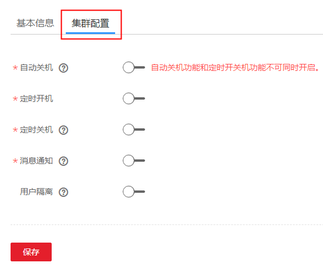
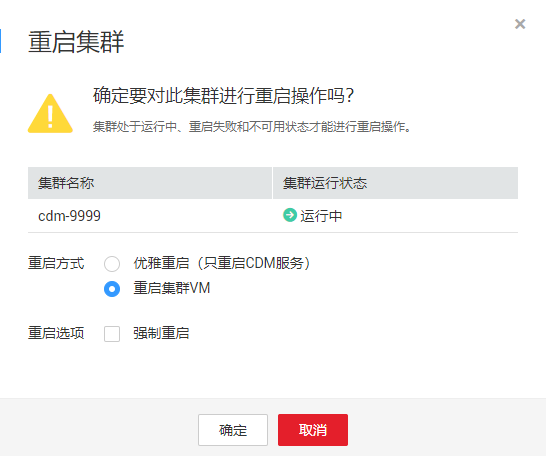

# 修改集群配置

## 配置说明

在CDM集群已经创建成功后，支持修改集群的以下配置：

-   **自动关机**

    当集群中没有作业在运行，且没有定时作业时，CDM集群会在待机15分钟后自动关机，以帮您节约成本。

-   **定时开/关机**

    定时开/关机功能和自动关机功能不可同时开启。支持配置每天的开/关机时间，其中定时关机功能不会等待未完成的作业执行完成。

-   **消息通知**

    CDM的迁移作业（目前仅支持表/文件迁移的作业）失败时，或者EIP异常时，会发送短信或邮件通知用户。最多支持配置5个手机号码、5个邮箱地址。

-   **用户隔离**
    -   开启该功能时，该集群中的迁移作业、连接会被隔离，云账号下的其他IAM用户无法查看到该集群下的作业、连接。
    -   关闭该功能时，该集群中的迁移作业、连接信息可以用户共享，云账号下的所有拥有CDM Administrator权限的IAM用户可以查看、操作。用户隔离关闭后需要重启集群VM才能生效。

## 操作步骤

1.  [登录DAYU控制台](https://console.huaweicloud.com/dayu/)，找到所需要的DAYU实例，单击实例卡片上的“进入控制台”，进入概览页面。

    选择“空间管理”页签，完成工作空间的创建。

    在工作空间列表中，找到所需要的工作空间。

1.  单击相应工作空间的“数据集成“。

    系统跳转至数据集成页面。

1.  选择批量数据迁移集群管理，进入集群管理界面。
2.  单击集群名称后，选择“集群配置“页签，可修改自动关机、定时开/关机、消息通知、用户是否隔离的配置。

    **图 1**  修改集群配置  
    

3.  修改完成后单击“保存“，返回集群管理界面。
4.  如果是关闭用户隔离，需要重启集群VM才能生效，选择集群操作列中的“更多  \>  重启“。

    **图 2**  重启集群  
    

    1.  优雅重启：只重启CDM服务的进程，不会重启集群虚拟机。
    2.  重启集群VM：业务进程会中断，并重启集群的虚拟机。

5.  选择“重启集群VM“后单击“确定“。

