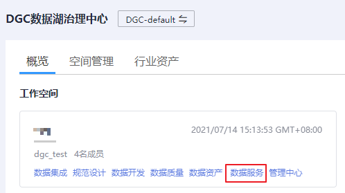

# 停用\\恢复API

## 操作场景

已发布的API因为其他原因（如需要编辑API等）需要暂停对外提供服务，可以暂时将API从相关环境中停用。停用后您可以通过恢复API，使该API继续对外提供服务。

> **说明：** 
>-   停用API会保留原有的授权信息，在停用期间您可以对API进行编辑、调试等操作。
>-   停用API将导致此API在指定的时间无法被访问，请确保已经告知使用此API的用户。

## 前提条件

-   已创建API。
-   API已发布到该环境。
-   该API需要暂停对外提供服务。

## 停用API

1.  在DGC控制台首页，选择对应工作空间的“数据服务“模块，进入数据服务页面。

    **图 1**  选择数据服务  
    

1.  在左侧导航栏选择服务版本（例如：专享版），进入总览页。
2.  单击“开发API \> API管理”，进入到API管理信息页面。
3.  在待停用的API所在行，单击“更多 \> 停用”，弹出“停用”对话框。
4.  选择API需要停用的时间，单击“确定”，完成API定时停用。

## 恢复API

1.  在DGC控制台首页，选择对应工作空间的“数据服务“模块，进入数据服务页面。

    **图 2**  选择数据服务  
    

1.  在左侧导航栏选择服务版本（例如：专享版），进入总览页。
2.  在待恢复的API所在行，单击“更多 \> 恢复”，完成API恢复。

