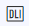
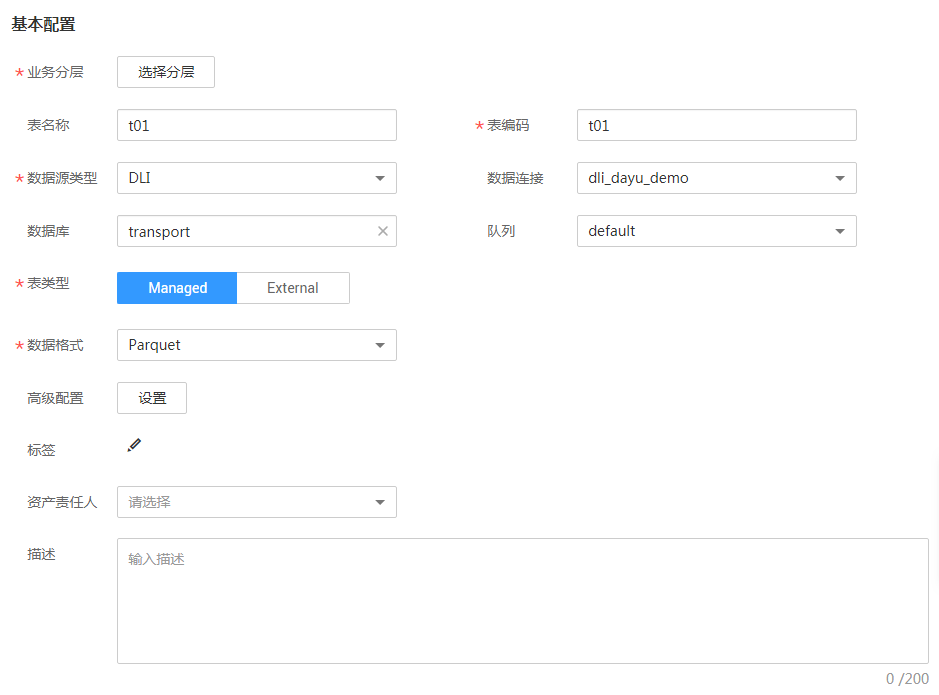
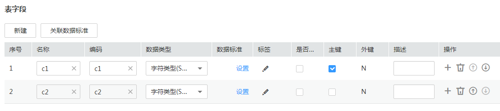
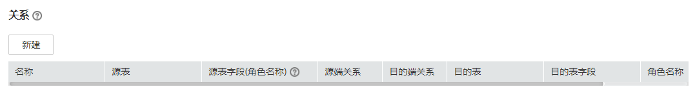
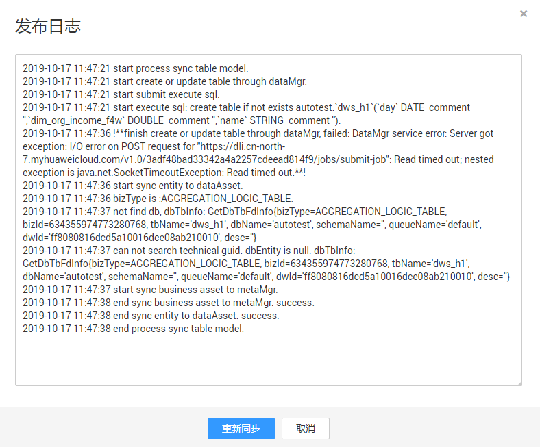
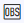
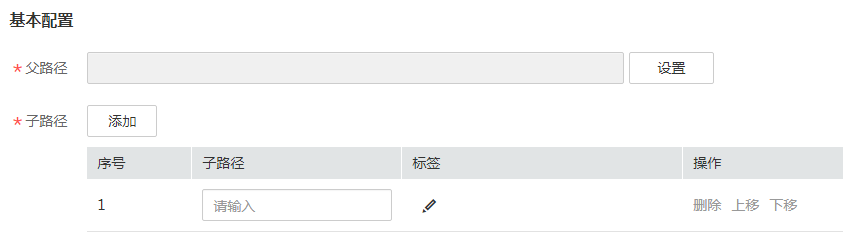
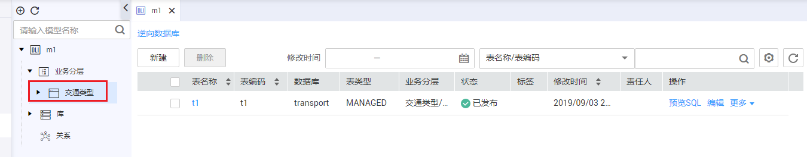
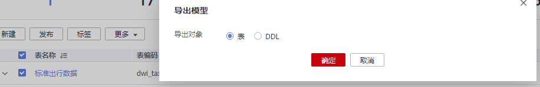

# 关系建模

根据实际业务进行关系建模。关系建模首先要新建一个模型，然后在模型中建表。关系建模的流程如下：

1.  [新建模型](#zh-cn_topic_0189641497_section310320118255)
2.  建表

    可以通过以下3种方式建表：

    -   [在DLI模型中新建表并发布](#zh-cn_topic_0189641497_section5731194174714)、[在OBS模型中新建OBS文件夹](#zh-cn_topic_0189641497_section541673617553)
    -   [使用模板导入表](#zh-cn_topic_0189641497_section1767817386912)
    -   [从数据库逆向导入表到DLI模型中](#zh-cn_topic_0189641497_section82274524116)

3.  后续操作：
    -   [导出模型或DDL](#zh-cn_topic_0189641497_section26841651132411)
    -   数据集成和数据开发

        可以使用批量数据集成、实时数据接入等方式将源数据导入关系模型的表中，在数据开发中，可以开发作业进行数据分析。

## 新建模型

1.  [登录DAYU控制台](https://console.huaweicloud.com/dayu/)，找到所需要的DAYU实例，单击实例卡片上的“进入控制台”，进入概览页面。

    选择“空间管理”页签，完成工作空间的创建。

    在工作空间列表中，找到所需要的工作空间。

1.  单击相应工作空间的“规范设计“。

    系统跳转至规范设计页面。

2.  在规范设计页面，单击左侧导航树中的“关系建模“。
3.  在“关系建模“页面，单击模型树上方的按钮新建模型，如下图所示。

    **图 1**  关系建模页面  
    

4.  在弹出窗口中配置如下参数，然后单击“确定“。

    **图 2**  新建模型  
    

    **表 1**  参数描述

    
    <table><thead align="left"><tr id="zh-cn_topic_0189641497_row1667010516314"><th class="cellrowborder" valign="top" width="19.96%" id="mcps1.2.3.1.1">
参数名称

    </th>
    <th class="cellrowborder" valign="top" width="80.04%" id="mcps1.2.3.1.2">
说明

    </th>
    </tr>
    </thead>
    <tbody><tr id="zh-cn_topic_0189641497_row76702511632"><td class="cellrowborder" valign="top" width="19.96%" headers="mcps1.2.3.1.1 ">
模型名称

    </td>
    <td class="cellrowborder" valign="top" width="80.04%" headers="mcps1.2.3.1.2 ">
只能包含中文、英文字母、数字和下划线。

    </td>
    </tr>
    <tr id="zh-cn_topic_0189641497_row773411477438"><td class="cellrowborder" valign="top" width="19.96%" headers="mcps1.2.3.1.1 ">
模型类型

    </td>
    <td class="cellrowborder" valign="top" width="80.04%" headers="mcps1.2.3.1.2 ">
当前支持“物理模型”。

    </td>
    </tr>
    <tr id="zh-cn_topic_0189641497_row189791893448"><td class="cellrowborder" valign="top" width="19.96%" headers="mcps1.2.3.1.1 ">
数据源类型

    </td>
    <td class="cellrowborder" valign="top" width="80.04%" headers="mcps1.2.3.1.2 ">
当前支持DLI和OBS两种类型。

    </td>
    </tr>
    <tr id="zh-cn_topic_0189641497_row1650614714416"><td class="cellrowborder" valign="top" width="19.96%" headers="mcps1.2.3.1.1 ">
业务分层

    </td>
    <td class="cellrowborder" valign="top" width="80.04%" headers="mcps1.2.3.1.2 ">
选择所属的业务分层。

    </td>
    </tr>
    <tr id="zh-cn_topic_0189641497_row7670195110319"><td class="cellrowborder" valign="top" width="19.96%" headers="mcps1.2.3.1.1 ">
描述

    </td>
    <td class="cellrowborder" valign="top" width="80.04%" headers="mcps1.2.3.1.2 ">
描述信息。支持的长度0~600字符。

    </td>
    </tr>
    </tbody>
    </table>

## 在DLI模型中新建表并发布

1.  在关系模型树中单击所需要的DLI类型的模型，在名称前显示图标的模型即为DLI类型的模型，然后单击“新建“按钮新建一个DLI类型的表。
2.  在“新建表“页面，做如下配置：

    填写基本配置参数：

    **图 3**  基本配置0  
    

    **表 2**  基本配置

    
    <table><thead align="left"><tr id="zh-cn_topic_0189641497_row197762036123115"><th class="cellrowborder" valign="top" width="19.96%" id="mcps1.2.3.1.1">
参数名称

    </th>
    <th class="cellrowborder" valign="top" width="80.04%" id="mcps1.2.3.1.2">
说明

    </th>
    </tr>
    </thead>
    <tbody><tr id="zh-cn_topic_0189641497_row145391351185512"><td class="cellrowborder" valign="top" width="19.96%" headers="mcps1.2.3.1.1 ">
业务分层

    </td>
    <td class="cellrowborder" valign="top" width="80.04%" headers="mcps1.2.3.1.2 ">
单击“选择分层”选择所属的业务分层。

    </td>
    </tr>
    <tr id="row204336210584"><td class="cellrowborder" valign="top" width="19.96%" headers="mcps1.2.3.1.1 ">
表名称

    </td>
    <td class="cellrowborder" valign="top" width="80.04%" headers="mcps1.2.3.1.2 ">
表的中文名称。只能包含中文、英文字母、数字和下划线，且不能以数字开头。

    </td>
    </tr>
    <tr id="zh-cn_topic_0189641497_row1930014104575"><td class="cellrowborder" valign="top" width="19.96%" headers="mcps1.2.3.1.1 ">
表编码

    </td>
    <td class="cellrowborder" valign="top" width="80.04%" headers="mcps1.2.3.1.2 ">
表的英文名称。只能包含英文字母、数字、下划线、$、{、}，且不能以数字开头。

    </td>
    </tr>
    <tr id="zh-cn_topic_0189641497_row677633619314"><td class="cellrowborder" valign="top" width="19.96%" headers="mcps1.2.3.1.1 ">
数据源类型

    </td>
    <td class="cellrowborder" valign="top" width="80.04%" headers="mcps1.2.3.1.2 ">
-

    </td>
    </tr>
    <tr id="zh-cn_topic_0189641497_row16670834143220"><td class="cellrowborder" valign="top" width="19.96%" headers="mcps1.2.3.1.1 ">
数据连接

    </td>
    <td class="cellrowborder" valign="top" width="80.04%" headers="mcps1.2.3.1.2 ">
选择所需要的数据连接。

    </td>
    </tr>
    <tr id="zh-cn_topic_0189641497_row1136828135512"><td class="cellrowborder" valign="top" width="19.96%" headers="mcps1.2.3.1.1 ">
数据库

    </td>
    <td class="cellrowborder" valign="top" width="80.04%" headers="mcps1.2.3.1.2 ">
选择数据库。

    </td>
    </tr>
    <tr id="zh-cn_topic_0189641497_row3973174235516"><td class="cellrowborder" valign="top" width="19.96%" headers="mcps1.2.3.1.1 ">
队列

    </td>
    <td class="cellrowborder" valign="top" width="80.04%" headers="mcps1.2.3.1.2 ">
选择队列。

    </td>
    </tr>
    <tr id="zh-cn_topic_0189641497_row32031939155512"><td class="cellrowborder" valign="top" width="19.96%" headers="mcps1.2.3.1.1 ">
表类型

    </td>
    <td class="cellrowborder" valign="top" width="80.04%" headers="mcps1.2.3.1.2 ">
DLI连接类型支持Managed和External。

    </td>
    </tr>
    <tr id="zh-cn_topic_0189641497_row5122214175918"><td class="cellrowborder" valign="top" width="19.96%" headers="mcps1.2.3.1.1 ">
数据格式

    </td>
    <td class="cellrowborder" valign="top" width="80.04%" headers="mcps1.2.3.1.2 ">
DLI连接类型支持Parquet和Carbon两种数据格式。

    </td>
    </tr>
    <tr id="zh-cn_topic_0189641497_row57638353551"><td class="cellrowborder" valign="top" width="19.96%" headers="mcps1.2.3.1.1 ">
高级配置

    </td>
    <td class="cellrowborder" valign="top" width="80.04%" headers="mcps1.2.3.1.2 ">
可设置自定义项。

    </td>
    </tr>
    <tr id="zh-cn_topic_0189641497_row1933134645915"><td class="cellrowborder" valign="top" width="19.96%" headers="mcps1.2.3.1.1 ">
标签

    </td>
    <td class="cellrowborder" valign="top" width="80.04%" headers="mcps1.2.3.1.2 ">
单击按钮可以为表添加标签，在弹出框中可以选择一个或多个已有的标签，或者输入一个新的标签名称后按回车键。您也可以前往DAYU数据资产模块的“标签管理”页面添加新的标签，然后再回到此处为该表设置标签。

    </td>
    </tr>
    <tr id="zh-cn_topic_0189641497_row13813437599"><td class="cellrowborder" valign="top" width="19.96%" headers="mcps1.2.3.1.1 ">
资产责任人

    </td>
    <td class="cellrowborder" valign="top" width="80.04%" headers="mcps1.2.3.1.2 ">
在下拉列表中选择用户。

    </td>
    </tr>
    <tr id="zh-cn_topic_0189641497_row1578653953215"><td class="cellrowborder" valign="top" width="19.96%" headers="mcps1.2.3.1.1 ">
描述

    </td>
    <td class="cellrowborder" valign="top" width="80.04%" headers="mcps1.2.3.1.2 ">
描述信息。支持的长度0~200字符。

    </td>
    </tr>
    </tbody>
    </table>

    在表字段中添加所需要的字段，对于表中的字段，单击其所在行的“设置”可以选择一个数据标准与之相关联：

    **图 4**  表字段  
    

    在“关系”区域，单击“新建“新建关系。

    **图 5**  关系  
    

    在“新建关系“对话框中，配置以下参数：

    **图 6**  新建关系  
    

3.  单击“发布“，选择审核人，再单击“确认提交”提交审核。

    等待审核人员审核，审核通过后，表在数据库中就建好了。返回模型页面，在列表中可以查看建好的表。

4.  返回“关系建模“页面中指定的关系模型页面，在列表中找到刚发布的表，单击“更多 \> 发布日志“查看发布日志。

    表发布并通过审核后，系统会依据“配置中心 \> 功能配置”页面中的“关系建模业务流程步骤”进行创建表、同步数据资产操作，通过“发布日志“可以查看流程处理的日志详情，同时可以查看操作是否成功以及处理失败的原因。

    -   如果“发布日志“显示成功，无错误日志，说明表在数据库中创建成功。
    -   如果“发布日志”中出现错误日志，说明表创建失败。

        请根据错误日志定位错误原因，问题解决后再单击“发布日志”对话框中的“重新同步“再次下发同步命令。在处理过程中，如果您有任何问题，请联系技术支持人员。

    **图 7**  发布日志  
    

## 在OBS模型中新建OBS文件夹

1.  在关系模型树中单击所需要的OBS类型的模型，在名称前显示图标的模型即为OBS类型的模型，然后单击“新建“按钮。
2.  在“新建OBS文件夹“页面，做如下配置：

    **图 8**  基本配置1  
    

    **表 3**  基本配置

    
    <table><thead align="left"><tr id="zh-cn_topic_0189641497_row610914045520"><th class="cellrowborder" valign="top" width="19.96%" id="mcps1.2.3.1.1">
参数名称

    </th>
    <th class="cellrowborder" valign="top" width="80.04%" id="mcps1.2.3.1.2">
说明

    </th>
    </tr>
    </thead>
    <tbody><tr id="zh-cn_topic_0189641497_row8109940155511"><td class="cellrowborder" valign="top" width="19.96%" headers="mcps1.2.3.1.1 ">
父路径

    </td>
    <td class="cellrowborder" valign="top" width="80.04%" headers="mcps1.2.3.1.2 ">
单击“设置”，在弹出的列表中选择一个OBS桶。

    </td>
    </tr>
    <tr id="zh-cn_topic_0189641497_row17109184015554"><td class="cellrowborder" valign="top" width="19.96%" headers="mcps1.2.3.1.1 ">
子路径

    </td>
    <td class="cellrowborder" valign="top" width="80.04%" headers="mcps1.2.3.1.2 ">
在“子路径”中输入OBS文件夹名称，保存后系统会在OBS桶中自动创建该文件夹。单击“添加”，可添加多个OBS子路径。

    
单击“标签”列中的按钮可以为子路径添加标签，在弹出框中可以选择一个或多个已有的标签，或者输入一个新的标签名称后按回车键。您也可以前往DAYU数据资产模块的“标签管理”页面添加标签，然后再回到此处为子路径设置标签。

    </td>
    </tr>
    </tbody>
    </table>

3.  单击“保存“。

    返回模型页面，在列表中可以查看建好的OBS路径。

## 使用模板导入表

1.  在关系模型树中单击所需要的模型，然后单击“导入“。
2.  在弹出对话框中，单击“下载关系建模导入模板”。

    **图 9**  导入表  
    

3.  打开下载的模板，请根据业务需求填写好模板中的相关参数并保存，模板中的“填写说明”Sheet页供参考。

    模板中的参数如下，其中名称前带“\*”的参数为必填参数，名称前未带“\*”的参数为可选参数。

    **表 4**  关系建模导入模板

    
    <table><thead align="left"><tr id="row34512466149"><th class="cellrowborder" valign="top" width="3.8010425716768013%" id="mcps1.2.28.1.1">
主题域分组

    </th>
    <th class="cellrowborder" valign="top" width="3.8010425716768013%" id="mcps1.2.28.1.2">
主题域

    </th>
    <th class="cellrowborder" valign="top" width="3.8010425716768013%" id="mcps1.2.28.1.3">
业务对象

    </th>
    <th class="cellrowborder" valign="top" width="3.8010425716768013%" id="mcps1.2.28.1.4">
*逻辑实体名称

    </th>
    <th class="cellrowborder" valign="top" width="3.8010425716768013%" id="mcps1.2.28.1.5">
*表名称

    </th>
    <th class="cellrowborder" valign="top" width="3.8010425716768013%" id="mcps1.2.28.1.6">
表级分类

    </th>
    <th class="cellrowborder" valign="top" width="3.8010425716768013%" id="mcps1.2.28.1.7">
描述

    </th>
    <th class="cellrowborder" valign="top" width="3.8010425716768013%" id="mcps1.2.28.1.8">
资产责任人

    </th>
    <th class="cellrowborder" valign="top" width="3.8010425716768013%" id="mcps1.2.28.1.9">
密级

    </th>
    <th class="cellrowborder" valign="top" width="3.8010425716768013%" id="mcps1.2.28.1.10">
数据连接类型

    </th>
    <th class="cellrowborder" valign="top" width="3.8010425716768013%" id="mcps1.2.28.1.11">
*表类型

    </th>
    <th class="cellrowborder" valign="top" width="3.8010425716768013%" id="mcps1.2.28.1.12">
OBS路径

    </th>
    <th class="cellrowborder" valign="top" width="3.8010425716768013%" id="mcps1.2.28.1.13">
数据格式

    </th>
    <th class="cellrowborder" valign="top" width="3.8010425716768013%" id="mcps1.2.28.1.14">
表所属的数据连接

    </th>
    <th class="cellrowborder" valign="top" width="2.834491746307557%" id="mcps1.2.28.1.15">
表所属的数据库

    </th>
    <th class="cellrowborder" valign="top" width="3.8010425716768013%" id="mcps1.2.28.1.16">
表所属的DLI队列

    </th>
    <th class="cellrowborder" valign="top" width="3.8010425716768013%" id="mcps1.2.28.1.17">
*属性名称(CHN)

    </th>
    <th class="cellrowborder" valign="top" width="3.8010425716768013%" id="mcps1.2.28.1.18">
*属性名称(ENG)

    </th>
    <th class="cellrowborder" valign="top" width="3.8010425716768013%" id="mcps1.2.28.1.19">
顺序

    </th>
    <th class="cellrowborder" valign="top" width="3.8010425716768013%" id="mcps1.2.28.1.20">
属性描述

    </th>
    <th class="cellrowborder" valign="top" width="3.8010425716768013%" id="mcps1.2.28.1.21">
*数据类型

    </th>
    <th class="cellrowborder" valign="top" width="3.8010425716768013%" id="mcps1.2.28.1.22">
是否分区

    </th>
    <th class="cellrowborder" valign="top" width="3.8010425716768013%" id="mcps1.2.28.1.23">
是否主键

    </th>
    <th class="cellrowborder" valign="top" width="2.9702432667245855%" id="mcps1.2.28.1.24">
引用的数据标准编码

    </th>
    <th class="cellrowborder" valign="top" width="2.9702432667245855%" id="mcps1.2.28.1.25">
属性分类

    </th>
    <th class="cellrowborder" valign="top" width="3.8010425716768013%" id="mcps1.2.28.1.26">
其它配置

    </th>
    <th class="cellrowborder" valign="top" width="3.8010425716768013%" id="mcps1.2.28.1.27">
版本号

    </th>
    </tr>
    </thead>
    <tbody><tr id="row1451674121514"><td class="cellrowborder" valign="top" width="3.8010425716768013%" headers="mcps1.2.28.1.1 ">&nbsp;&nbsp;</td>
    <td class="cellrowborder" valign="top" width="3.8010425716768013%" headers="mcps1.2.28.1.2 ">&nbsp;&nbsp;</td>
    <td class="cellrowborder" valign="top" width="3.8010425716768013%" headers="mcps1.2.28.1.3 ">&nbsp;&nbsp;</td>
    <td class="cellrowborder" valign="top" width="3.8010425716768013%" headers="mcps1.2.28.1.4 ">&nbsp;&nbsp;</td>
    <td class="cellrowborder" valign="top" width="3.8010425716768013%" headers="mcps1.2.28.1.5 ">&nbsp;&nbsp;</td>
    <td class="cellrowborder" valign="top" width="3.8010425716768013%" headers="mcps1.2.28.1.6 ">&nbsp;&nbsp;</td>
    <td class="cellrowborder" valign="top" width="3.8010425716768013%" headers="mcps1.2.28.1.7 ">&nbsp;&nbsp;</td>
    <td class="cellrowborder" valign="top" width="3.8010425716768013%" headers="mcps1.2.28.1.8 ">&nbsp;&nbsp;</td>
    <td class="cellrowborder" valign="top" width="3.8010425716768013%" headers="mcps1.2.28.1.9 ">&nbsp;&nbsp;</td>
    <td class="cellrowborder" valign="top" width="3.8010425716768013%" headers="mcps1.2.28.1.10 ">&nbsp;&nbsp;</td>
    <td class="cellrowborder" valign="top" width="3.8010425716768013%" headers="mcps1.2.28.1.11 ">&nbsp;&nbsp;</td>
    <td class="cellrowborder" valign="top" width="3.8010425716768013%" headers="mcps1.2.28.1.12 ">&nbsp;&nbsp;</td>
    <td class="cellrowborder" valign="top" width="3.8010425716768013%" headers="mcps1.2.28.1.13 ">&nbsp;&nbsp;</td>
    <td class="cellrowborder" valign="top" width="3.8010425716768013%" headers="mcps1.2.28.1.14 ">&nbsp;&nbsp;</td>
    <td class="cellrowborder" valign="top" width="2.834491746307557%" headers="mcps1.2.28.1.15 ">&nbsp;&nbsp;</td>
    <td class="cellrowborder" valign="top" width="3.8010425716768013%" headers="mcps1.2.28.1.16 ">&nbsp;&nbsp;</td>
    <td class="cellrowborder" valign="top" width="3.8010425716768013%" headers="mcps1.2.28.1.17 ">&nbsp;&nbsp;</td>
    <td class="cellrowborder" valign="top" width="3.8010425716768013%" headers="mcps1.2.28.1.18 ">&nbsp;&nbsp;</td>
    <td class="cellrowborder" valign="top" width="3.8010425716768013%" headers="mcps1.2.28.1.19 ">&nbsp;&nbsp;</td>
    <td class="cellrowborder" valign="top" width="3.8010425716768013%" headers="mcps1.2.28.1.20 ">&nbsp;&nbsp;</td>
    <td class="cellrowborder" valign="top" width="3.8010425716768013%" headers="mcps1.2.28.1.21 ">&nbsp;&nbsp;</td>
    <td class="cellrowborder" valign="top" width="3.8010425716768013%" headers="mcps1.2.28.1.22 ">&nbsp;&nbsp;</td>
    <td class="cellrowborder" valign="top" width="3.8010425716768013%" headers="mcps1.2.28.1.23 ">&nbsp;&nbsp;</td>
    <td class="cellrowborder" valign="top" width="2.9702432667245855%" headers="mcps1.2.28.1.24 ">&nbsp;&nbsp;</td>
    <td class="cellrowborder" valign="top" width="2.9702432667245855%" headers="mcps1.2.28.1.25 ">&nbsp;&nbsp;</td>
    <td class="cellrowborder" valign="top" width="3.8010425716768013%" headers="mcps1.2.28.1.26 ">&nbsp;&nbsp;</td>
    <td class="cellrowborder" valign="top" width="3.8010425716768013%" headers="mcps1.2.28.1.27 ">&nbsp;&nbsp;</td>
    </tr>
    </tbody>
    </table>

    **表 5**  关系建模模板参数说明

    
    <table><thead align="left"><tr id="zh-cn_topic_0189641497_row5359244131414"><th class="cellrowborder" valign="top" width="23.57%" id="mcps1.2.4.1.1">
参数名

    </th>
    <th class="cellrowborder" valign="top" width="37.769999999999996%" id="mcps1.2.4.1.2">
参数说明（导入DLI类型的表）

    </th>
    <th class="cellrowborder" valign="top" width="38.66%" id="mcps1.2.4.1.3">
参数说明（导入OBS类型的表）

    </th>
    </tr>
    </thead>
    <tbody><tr id="zh-cn_topic_0189641497_row235964421412"><td class="cellrowborder" valign="top" width="23.57%" headers="mcps1.2.4.1.1 ">
主题域分组

    </td>
    <td class="cellrowborder" valign="top" width="37.769999999999996%" headers="mcps1.2.4.1.2 ">
需填写已有的主题域分组的名称。

    </td>
    <td class="cellrowborder" valign="top" width="38.66%" headers="mcps1.2.4.1.3 ">
不需要填写。

    </td>
    </tr>
    <tr id="zh-cn_topic_0189641497_row6359114415148"><td class="cellrowborder" valign="top" width="23.57%" headers="mcps1.2.4.1.1 ">
主题域

    </td>
    <td class="cellrowborder" valign="top" width="37.769999999999996%" headers="mcps1.2.4.1.2 ">
需填写已有的主题域名称。

    </td>
    <td class="cellrowborder" valign="top" width="38.66%" headers="mcps1.2.4.1.3 ">
不需要填写。

    </td>
    </tr>
    <tr id="zh-cn_topic_0189641497_row1236044413144"><td class="cellrowborder" valign="top" width="23.57%" headers="mcps1.2.4.1.1 ">
业务对象

    </td>
    <td class="cellrowborder" valign="top" width="37.769999999999996%" headers="mcps1.2.4.1.2 ">
需填写已有的业务对象名称。

    </td>
    <td class="cellrowborder" valign="top" width="38.66%" headers="mcps1.2.4.1.3 ">
不需要填写。

    </td>
    </tr>
    <tr id="zh-cn_topic_0189641497_row197774551394"><td class="cellrowborder" valign="top" width="23.57%" headers="mcps1.2.4.1.1 ">
逻辑实体名称

    </td>
    <td class="cellrowborder" valign="top" width="37.769999999999996%" headers="mcps1.2.4.1.2 ">
表名称，只能包含中文、英文字母、数字和下划线，且不能以数字开头。

    </td>
    <td class="cellrowborder" valign="top" width="38.66%" headers="mcps1.2.4.1.3 ">
OBS类型的表，需填写为OBS父路径，其格式为：s3a://bucket_name/，bucket_name请填写为实际已创建的OBS桶名。

    </td>
    </tr>
    <tr id="zh-cn_topic_0189641497_row22319913409"><td class="cellrowborder" valign="top" width="23.57%" headers="mcps1.2.4.1.1 ">
表名称

    </td>
    <td class="cellrowborder" valign="top" width="37.769999999999996%" headers="mcps1.2.4.1.2 ">
表编码，只能包含英文字母、数字、下划线、$、{、}，且不能以数字开头。

    
表名称和属性名称(Eng)对应您的表和字段名，如果表已存在则自动关联逻辑实体和表，如果表不存在，则创建表并自动关联逻辑实体和表。

    </td>
    <td class="cellrowborder" valign="top" width="38.66%" headers="mcps1.2.4.1.3 ">
OBS类型的表，需填写为OBS父路径，其格式为：s3a://bucket_name/，bucket_name请填写为实际已创建的OBS桶名。

    </td>
    </tr>
    <tr id="zh-cn_topic_0189641497_row171377201403"><td class="cellrowborder" valign="top" width="23.57%" headers="mcps1.2.4.1.1 ">
表级分类

    </td>
    <td class="cellrowborder" valign="top" width="37.769999999999996%" headers="mcps1.2.4.1.2 ">
给表添加的标签，请输入已有的标签或新的标签名称。您也可以先前往DAYU数据资产模块的“标签管理”页面添加标签，然后再回到此处设置相应的标签。

    </td>
    <td class="cellrowborder" valign="top" width="38.66%" headers="mcps1.2.4.1.3 ">
不需要填写。

    </td>
    </tr>
    <tr id="zh-cn_topic_0189641497_row20355164134020"><td class="cellrowborder" valign="top" width="23.57%" headers="mcps1.2.4.1.1 ">
描述

    </td>
    <td class="cellrowborder" valign="top" width="37.769999999999996%" headers="mcps1.2.4.1.2 ">
表的描述信息。

    </td>
    <td class="cellrowborder" valign="top" width="38.66%" headers="mcps1.2.4.1.3 ">
不需要填写。

    </td>
    </tr>
    <tr id="zh-cn_topic_0189641497_row4217103774014"><td class="cellrowborder" valign="top" width="23.57%" headers="mcps1.2.4.1.1 ">
资产责任人

    </td>
    <td class="cellrowborder" valign="top" width="37.769999999999996%" headers="mcps1.2.4.1.2 ">
需输入华为云账号或IAM用户名。

    </td>
    <td class="cellrowborder" valign="top" width="38.66%" headers="mcps1.2.4.1.3 ">
不需要填写。

    </td>
    </tr>
    <tr id="zh-cn_topic_0189641497_row196021733134010"><td class="cellrowborder" valign="top" width="23.57%" headers="mcps1.2.4.1.1 ">
密级

    </td>
    <td class="cellrowborder" valign="top" width="37.769999999999996%" headers="mcps1.2.4.1.2 ">
支持的取值有：公开、秘密、机密、绝密。

    </td>
    <td class="cellrowborder" valign="top" width="38.66%" headers="mcps1.2.4.1.3 ">
填写为“公开”。

    </td>
    </tr>
    <tr id="zh-cn_topic_0189641497_row239063034013"><td class="cellrowborder" valign="top" width="23.57%" headers="mcps1.2.4.1.1 ">
数据连接类型

    </td>
    <td class="cellrowborder" valign="top" width="37.769999999999996%" headers="mcps1.2.4.1.2 ">
选择DLI。

    </td>
    <td class="cellrowborder" valign="top" width="38.66%" headers="mcps1.2.4.1.3 ">
选择OBS。

    </td>
    </tr>
    <tr id="zh-cn_topic_0189641497_row18716165274114"><td class="cellrowborder" valign="top" width="23.57%" headers="mcps1.2.4.1.1 ">
表类型

    </td>
    <td class="cellrowborder" valign="top" width="37.769999999999996%" headers="mcps1.2.4.1.2 ">
DLI类型的表，支持DLI_MANAGED、DLI_EXTERNAL和DLI_VIEW三种表类型。其中DLI_VIEW类型只支持导入，不支持在控制台页面创建。

    </td>
    <td class="cellrowborder" valign="top" width="38.66%" headers="mcps1.2.4.1.3 ">
OBS类型的表，仅支持“OBS”这一种表类型。

    </td>
    </tr>
    <tr id="zh-cn_topic_0189641497_row11420384211"><td class="cellrowborder" valign="top" width="23.57%" headers="mcps1.2.4.1.1 ">
OBS路径

    </td>
    <td class="cellrowborder" valign="top" width="37.769999999999996%" headers="mcps1.2.4.1.2 ">
表类型为DLI_EXTERNAL时，需填写与表相关联的存放源数据的OBS路径。格式为：s3a://bucket_name/filepath。

    </td>
    <td class="cellrowborder" valign="top" width="38.66%" headers="mcps1.2.4.1.3 ">
不需要填写。

    </td>
    </tr>
    <tr id="zh-cn_topic_0189641497_row17533125912418"><td class="cellrowborder" valign="top" width="23.57%" headers="mcps1.2.4.1.1 ">
数据格式

    </td>
    <td class="cellrowborder" valign="top" width="37.769999999999996%" headers="mcps1.2.4.1.2 ">
表类型为DLI_MANAGED的表支持的数据格式有：Parquet、Carbon。

    
表类型为DLI_EXTERNAL的表支持的数据格式有：Parquet、Carbon、CSV、ORC、JSON、Avro。

    </td>
    <td class="cellrowborder" valign="top" width="38.66%" headers="mcps1.2.4.1.3 ">
不需要填写。

    </td>
    </tr>
    <tr id="row1474014201164"><td class="cellrowborder" valign="top" width="23.57%" headers="mcps1.2.4.1.1 ">
表所属的数据连接

    </td>
    <td class="cellrowborder" valign="top" width="37.769999999999996%" headers="mcps1.2.4.1.2 ">
输入DLI类型的数据连接名称。

    </td>
    <td class="cellrowborder" valign="top" width="38.66%" headers="mcps1.2.4.1.3 ">
不需要填写。

    </td>
    </tr>
    <tr id="zh-cn_topic_0189641497_row534311565414"><td class="cellrowborder" valign="top" width="23.57%" headers="mcps1.2.4.1.1 ">
表所属的数据库

    </td>
    <td class="cellrowborder" valign="top" width="37.769999999999996%" headers="mcps1.2.4.1.2 ">
输入已创建的数据库名称。

    </td>
    <td class="cellrowborder" valign="top" width="38.66%" headers="mcps1.2.4.1.3 ">
不需要填写。

    </td>
    </tr>
    <tr id="row112361734172215"><td class="cellrowborder" valign="top" width="23.57%" headers="mcps1.2.4.1.1 ">
表所属的DLI队列

    </td>
    <td class="cellrowborder" valign="top" width="37.769999999999996%" headers="mcps1.2.4.1.2 ">
输入DLI队列名称。

    </td>
    <td class="cellrowborder" valign="top" width="38.66%" headers="mcps1.2.4.1.3 ">
不需要填写。

    </td>
    </tr>
    <tr id="zh-cn_topic_0189641497_row33624114215"><td class="cellrowborder" valign="top" width="23.57%" headers="mcps1.2.4.1.1 ">
属性名称（CHN）

    </td>
    <td class="cellrowborder" valign="top" width="37.769999999999996%" headers="mcps1.2.4.1.2 ">
表中的属性字段的中文名称。只能包含中文、英文字母、数字、左右括号、空格、中划线和下划线，且以中文或英文字母开头。

    </td>
    <td class="cellrowborder" valign="top" width="38.66%" headers="mcps1.2.4.1.3 ">
OBS文件夹名称。

    </td>
    </tr>
    <tr id="zh-cn_topic_0189641497_row11327123834215"><td class="cellrowborder" valign="top" width="23.57%" headers="mcps1.2.4.1.1 ">
属性名称（ENG）

    </td>
    <td class="cellrowborder" valign="top" width="37.769999999999996%" headers="mcps1.2.4.1.2 ">
表中的属性字段的英文名称。必须以字母开头，可以输入字母、数字和下划线，且以字母或数字结尾。

    </td>
    <td class="cellrowborder" valign="top" width="38.66%" headers="mcps1.2.4.1.3 ">
填写为和参数“属性名称（CHN）”一样的值。

    </td>
    </tr>
    <tr id="zh-cn_topic_0189641497_row621835184216"><td class="cellrowborder" valign="top" width="23.57%" headers="mcps1.2.4.1.1 ">
顺序

    </td>
    <td class="cellrowborder" valign="top" width="37.769999999999996%" headers="mcps1.2.4.1.2 ">
属性字段在表中的顺序，从1开始。可以不填，不填时属性字段默认按模板中的顺序在表中排列。

    </td>
    <td class="cellrowborder" valign="top" width="38.66%" headers="mcps1.2.4.1.3 ">
属性字段在表中的顺序，从0开始。可以不填，不填时属性字段默认按模板中的顺序在表中排列。

    </td>
    </tr>
    <tr id="zh-cn_topic_0189641497_row20932194016431"><td class="cellrowborder" valign="top" width="23.57%" headers="mcps1.2.4.1.1 ">
属性描述

    </td>
    <td class="cellrowborder" valign="top" width="37.769999999999996%" headers="mcps1.2.4.1.2 ">
属性字段的描述信息。

    </td>
    <td class="cellrowborder" valign="top" width="38.66%" headers="mcps1.2.4.1.3 ">
不需要填写。

    </td>
    </tr>
    <tr id="zh-cn_topic_0189641497_row1837653744319"><td class="cellrowborder" valign="top" width="23.57%" headers="mcps1.2.4.1.1 ">
数据类型

    </td>
    <td class="cellrowborder" valign="top" width="37.769999999999996%" headers="mcps1.2.4.1.2 ">
支持的数据类型有：STRING、BOOLEAN、BIGINT、TINYINT、SMALLINT、INT、DECIMAL、FLOAT、DOUBLE、TIMESTAMP、DATE。

    </td>
    <td class="cellrowborder" valign="top" width="38.66%" headers="mcps1.2.4.1.3 ">
填写为STRING。

    </td>
    </tr>
    <tr id="zh-cn_topic_0189641497_row1140425517434"><td class="cellrowborder" valign="top" width="23.57%" headers="mcps1.2.4.1.1 ">
是否分区

    </td>
    <td class="cellrowborder" valign="top" width="37.769999999999996%" headers="mcps1.2.4.1.2 ">
填写“是”或“否”。

    </td>
    <td class="cellrowborder" valign="top" width="38.66%" headers="mcps1.2.4.1.3 ">
填写为“否”。

    </td>
    </tr>
    <tr id="row69903471237"><td class="cellrowborder" valign="top" width="23.57%" headers="mcps1.2.4.1.1 ">
是否主键

    </td>
    <td class="cellrowborder" valign="top" width="37.769999999999996%" headers="mcps1.2.4.1.2 ">
填写“是”或“否”。

    </td>
    <td class="cellrowborder" valign="top" width="38.66%" headers="mcps1.2.4.1.3 ">
填写为“否”。

    </td>
    </tr>
    <tr id="zh-cn_topic_0189641497_row8103165194314"><td class="cellrowborder" valign="top" width="23.57%" headers="mcps1.2.4.1.1 ">
引用的数据标准编码

    </td>
    <td class="cellrowborder" valign="top" width="37.769999999999996%" headers="mcps1.2.4.1.2 ">
填写需要引用的数据标准的编码，也可以不填。

    </td>
    <td class="cellrowborder" valign="top" width="38.66%" headers="mcps1.2.4.1.3 ">
不需要填写。

    </td>
    </tr>
    <tr id="zh-cn_topic_0189641497_row6765162194418"><td class="cellrowborder" valign="top" width="23.57%" headers="mcps1.2.4.1.1 ">
属性分类

    </td>
    <td class="cellrowborder" valign="top" width="37.769999999999996%" headers="mcps1.2.4.1.2 ">
为属性字段添加的标签，请输入已有的标签或新的标签名称。您也可以先前往DAYU数据资产模块的“标签管理”页面添加标签，然后再回到此处设置相应的标签。

    </td>
    <td class="cellrowborder" valign="top" width="38.66%" headers="mcps1.2.4.1.3 ">
为OBS子路径添加的标签，请输入已有的标签或新的标签名称。您也可以先前往DAYU数据资产模块的“标签管理”页面添加标签，然后再回到此处设置相应的标签。

    </td>
    </tr>
    <tr id="zh-cn_topic_0189641497_row1064141712449"><td class="cellrowborder" valign="top" width="23.57%" headers="mcps1.2.4.1.1 ">
其他配置

    </td>
    <td class="cellrowborder" valign="top" width="37.769999999999996%" headers="mcps1.2.4.1.2 ">
为JSON格式，用于存放表额外配置信息。格式如下：

    
{

    
"option_name1": "value",

    
"option_name2": "value"

    
……

    
}

    
例如：

    
{

    
"a1": "100",

    
"a2": "30"

    
}

    </td>
    <td class="cellrowborder" valign="top" width="38.66%" headers="mcps1.2.4.1.3 ">
不需要填写。

    </td>
    </tr>
    <tr id="row217342519244"><td class="cellrowborder" valign="top" width="23.57%" headers="mcps1.2.4.1.1 ">
版本号

    </td>
    <td class="cellrowborder" valign="top" width="37.769999999999996%" headers="mcps1.2.4.1.2 ">
可以不填。

    </td>
    <td class="cellrowborder" valign="top" width="38.66%" headers="mcps1.2.4.1.3 ">
可以不填。

    </td>
    </tr>
    </tbody>
    </table>

4.  返回“导入表”的页面，选择上一步配置好的关系建模模板文件，然后单击“上传并校验“。

    如果上传的模板文件校验不通过，请修改正确后，再重新上传。

5.  单击“确定“完成表的导入。

## 从数据库逆向导入表到DLI模型中

用户可以将现有数据库中的表导入到指定的DLI类型的关系模型中。

1.  在关系模型树中找到所需要的DLI类型的模型，展开该模型树，然后单击“业务分层“下的主题域分组的名称。

    

2.  单击列表上方的“逆向数据库“，在弹出对话框中配置如下参数，然后单击“确定“。

    **图 10**  逆向数据库  
    

    **表 6**  逆向数据库

    
    <table><thead align="left"><tr id="zh-cn_topic_0189641497_row1480573818596"><th class="cellrowborder" valign="top" width="19.96%" id="mcps1.2.3.1.1">
参数名称

    </th>
    <th class="cellrowborder" valign="top" width="80.04%" id="mcps1.2.3.1.2">
说明

    </th>
    </tr>
    </thead>
    <tbody><tr id="zh-cn_topic_0189641497_row3806338165915"><td class="cellrowborder" valign="top" width="19.96%" headers="mcps1.2.3.1.1 ">
数据连接

    </td>
    <td class="cellrowborder" valign="top" width="80.04%" headers="mcps1.2.3.1.2 ">
选择所需要的数据连接。

    </td>
    </tr>
    <tr id="zh-cn_topic_0189641497_row17806133845919"><td class="cellrowborder" valign="top" width="19.96%" headers="mcps1.2.3.1.1 ">
数据库

    </td>
    <td class="cellrowborder" valign="top" width="80.04%" headers="mcps1.2.3.1.2 ">
选择数据库。

    </td>
    </tr>
    <tr id="zh-cn_topic_0189641497_row7806138105918"><td class="cellrowborder" valign="top" width="19.96%" headers="mcps1.2.3.1.1 ">
队列

    </td>
    <td class="cellrowborder" valign="top" width="80.04%" headers="mcps1.2.3.1.2 ">
DLI连接类型，需选择队列。

    </td>
    </tr>
    <tr id="row1718213134156"><td class="cellrowborder" valign="top" width="19.96%" headers="mcps1.2.3.1.1 ">
更新已有表

    </td>
    <td class="cellrowborder" valign="top" width="80.04%" headers="mcps1.2.3.1.2 ">
如果所要逆向导入的源DLI数据库表，在当前的关系模型中已经存在，是否更新关系模型中的表。支持以下选项：

    <ul id="ul8540103920159"><li>不更新</li><li>更新</li></ul>
    </td>
    </tr>
    <tr id="zh-cn_topic_0189641497_row188066381596"><td class="cellrowborder" valign="top" width="19.96%" headers="mcps1.2.3.1.1 ">
数据表

    </td>
    <td class="cellrowborder" valign="top" width="80.04%" headers="mcps1.2.3.1.2 ">
选择“全部”时，将数据库中的所有的表都导入关系模型中。

    
选择“部分”时，请选择需要导入关系模型的表。

    </td>
    </tr>
    </tbody>
    </table>

## 导出模型或DDL

1.  在关系模型树中单击所需要的模型，然后单击“导出“。
2.  在弹出对话框中，选择导出的对象。

    导出模型时，会将模型中的所有表信息导出成Excel表。导出的Excel表也可以用于导入操作。

    **图 11**  导出模型  
    

    导出DDL时，会将所选表的DDL语句导出成txt文件文件。

    **图 12**  导出DDL  
    

3.  单击“确定“。

