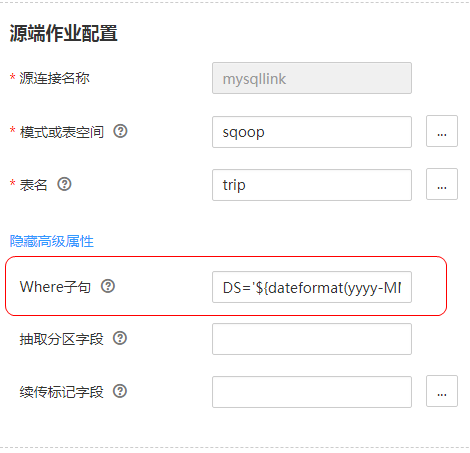

# 关系数据库增量迁移

CDM支持对关系型数据库进行增量迁移，全量迁移完成之后，可以增量迁移指定字段值以上的数据（例如每次启动作业时只导出“date“值大于“2017-10-16 19:00:00“的数据），或者增量迁移指定时间段内的数据（例如每天晚上0点导出前一天新增的数据）。

-   **增量迁移大于指定字段值的数据**
    -   适用场景：源端和目的端都为关系型数据库。
    -   关键配置：[续传标记字段](#zh-cn_topic_0108275332_section59281825145313)+[定时执行作业](配置定时任务.md)。
    -   前提条件：数据表中存在唯一并自动增长的数值型字段或者时间戳字段。

-   **增量迁移指定时间段内的数据**
    -   适用场景：[源端为关系型数据库](配置关系数据库源端参数.md)，目的端没有要求。
    -   关键配置：[Where子句](#zh-cn_topic_0108275332_section7506134317385)+[定时执行作业](配置定时任务.md)。
    -   前提条件：数据表中有时间日期字段或时间戳字段。

这2种增量迁移方式，只对数据表追加写入，不会更新或删除已存在的记录。

## 续传标记字段

-   参数位置：在[新建表/文件迁移作业](新建表-文件迁移作业.md)时，如果源端和目的端都为关系型数据库，那么在源端作业参数的高级属性下面可以看到“续传标记字段“参数。
-   参数原理：通过“续传标记字段“参数指定一个字段（要求该字段的值唯一且自动增长，例如auto\_increment int、timestamp、date类型的字段），CDM每次启动作业时，会去查询目的端数据库中已导入的表：

    -   如果表中不存在续传标记字段（作业第一次执行时），则CDM执行全量迁移。
    -   如果目的表存在续传标记字段且该字段有值，则CDM执行增量迁移，只迁移大于该字段值的数据。

    该参数结合CDM的[定时自动执行作业](配置定时任务.md)，可以任意调度作业，实现关系型数据库的增量同步。

-   配置样例：

    假设字段date记录每条数据生成的日期时间，参数配置如下：

    1.  续传标记字段：配置为“date“。

        **图 1**  续传标记字段  
        

    2.  [配置定时任务](配置定时任务.md)：重复周期可以配置为任意时间，则作业第一次执行全量迁移，以后再次启动时做增量同步。

## Where子句

-   参数位置：在[新建表/文件迁移作业](新建表-文件迁移作业.md)时，如果源端为关系型数据库，那么在源端作业参数的高级属性下面可以看到“Where子句“参数。
-   参数原理：通过“Where子句“参数可以配置一个SQL语句（例如：age \> 18 and age <= 60），CDM只导出该SQL语句指定的数据；不配置时导出整表。

    Where子句支持配置为[时间宏变量](使用时间宏变量完成增量同步.md)，当数据表中有时间日期字段或时间戳字段时，配合[定时自动执行作业](配置定时任务.md)，能够实现抽取指定日期的数据。

-   配置样例：

    假设数据库表中存在表示时间的列DS，类型为“varchar\(30\)“，插入的时间格式类似于“2017-xx-xx“，如[图2](#zh-cn_topic_0108275332_fig14550053112127)所示，参数配置如下：

    **图 2**  表数据1  
    

    1.  Where子句：配置为**DS='$\{dateformat\(yyyy-MM-dd,-1,DAY\)\}'**。

        **图 3**  Where子句  
        

    2.  [配置定时任务](配置定时任务.md)：重复周期为1天，每天的凌晨0点自动执行作业。

    这样就可以每天0点导出前一天产生的所有数据。Where子句支持配置多种[时间宏变量](使用时间宏变量完成增量同步.md)，结合CDM定时任务的重复周期：分钟、小时、天、周、月，可以实现自动导出任意指定日期内的数据。

